# 🗄️ RESEARCH — Modelo de Base de Datos (referencia para desarrollo)
## Esquema propuesto para las features y pantallas del MVP + capa SaaS

> [!info] Qué es este documento
> Modelo de datos **de referencia** para arrancar el desarrollo. Complementa a [[_RESEARCH_pantallas-mvp]]: cada módulo de tablas mapea a las pantallas de ese documento, para que API, Web y App tengan contexto completo. **No reemplaza** a [[01-api/API_DATABASE]] (fuente de verdad una vez implementado); es el punto de partida que se irá refinando.
> Cubre: capa **SaaS/multi-tenant**, **RBAC**, y las features **5–16** + clientes especializados. Reusa las tablas ya existentes (Auth, Propiedades, Directorio) sin rediseñarlas.

> [!warning] Convenciones (heredadas de [[DB_SCHEMA_OVERVIEW]])
> - Motor **PostgreSQL 16**. Toda PK es `id` **UUID v7**.
> - FK con nombre `{tabla_singular}_id`. Timestamps `created_at` / `updated_at` automáticos. Soft delete `deleted_at`.
> - Dinero: **`NUMERIC(15,2)`** en COP. Coeficiente: `NUMERIC(7,6)`.
> - **Catálogos configurables** como tabla propia (patrón `*_types` / `*_statuses`), no enums, cuando el usuario deba poder editarlos.
> - Por brevedad, las tablas **omiten** mostrar `id`, `created_at`, `updated_at`, `deleted_at`: se asumen en todas salvo que se indique.

---

## 1. Regla de multi-tenancy (clave de todo el modelo)

> El SaaS tiene dos niveles de aislamiento. **Entenderlos antes de leer los módulos.**

- **`organizations`** = el *tenant* (la cuenta que paga). Puede ser un **edificio único** o una **empresa administradora** con muchos conjuntos.
- **`condominiums`** = cada conjunto/edificio físico. Pertenece a una organización.
- **Regla práctica:** casi toda tabla operativa lleva **`condominium_id`** (aislamiento por conjunto, ideal para Row-Level Security). Las tablas de gobierno del tenant (planes, suscripción, staff) llevan **`organization_id`**.
- Un cliente de "un solo edificio" = una `organization` con un único `condominium` (no ve la capa de portafolio).

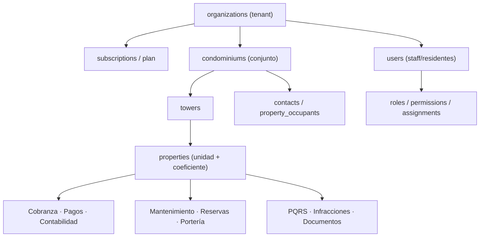

---

## 2. Plataforma / Multi-tenancy (Fase 0.2 — NUEVO)

> Capa de fundación del SaaS. Hoy no existe; habilita el modelo "un edificio vs. administradora con muchos conjuntos".

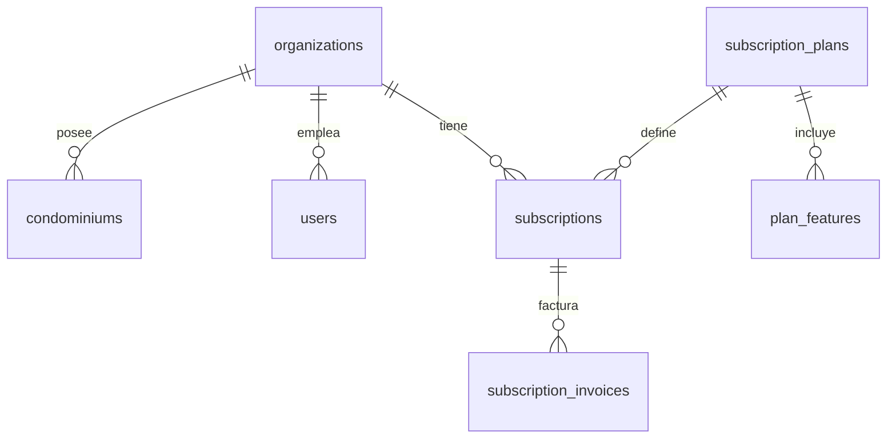

| Tabla | N/E | Campos clave | Notas |
|---|---|---|---|
| `organizations` | Nueva | `nombre`, `tipo` (enum: edificio_unico\|administradora), `nit`, `email`, `pais` (def CO), `moneda` (def COP), `estado` (trial\|activo\|suspendido), `logo_url` | El **tenant**. Raíz del aislamiento |
| `subscription_plans` | Nueva | `nombre`, `precio_mensual NUMERIC(15,2)`, `max_condominios`, `max_unidades`, `periodicidad` | Catálogo de planes del operador |
| `plan_features` | Nueva | `plan_id FK`, `feature_key`, `enabled BOOLEAN` | Feature flags por plan |
| `subscriptions` | Nueva | `organization_id FK`, `plan_id FK`, `estado`, `inicia_el`, `termina_el`, `precio NUMERIC(15,2)` | Suscripción vigente (precio = snapshot) |
| `subscription_invoices` | Nueva | `subscription_id FK`, `periodo`, `valor NUMERIC(15,2)`, `estado` (pendiente\|pagada\|vencida) | Cobro del SaaS al tenant (≠ cuentas de cobro del conjunto) |

> **Retrofit:** agregar `organization_id FK` a `users` y a `condominiums` (hoy son raíz; pasan a colgar de `organizations`).

---

## 3. Identidad, Inventario y Directorio (EXISTENTES — referencia)

> Ya diseñadas/implementadas. Se listan para que los módulos nuevos referencien las FK correctas. **No se rediseñan.**

| Módulo | Tablas | Entidad central que referencian los demás |
|---|---|---|
| Auth | `users`, `refresh_tokens`, `password_history`, `login_attempts`, `security_events`, `password_reset_tokens` | `users.id` (actor del sistema) |
| Propiedades | `condominiums`, `towers`, `property_types`, `property_statuses`, `properties`, `property_status_log`, `property_documents`, `property_document_types` | **`properties.id`** (unidad) y `properties.coefficient` |
| Directorio | `contacts`, `occupant_types`, `property_occupants` | **`contacts.id`** (persona) y `property_occupants` (persona↔unidad↔rol) |

> Convención de referencia en los módulos siguientes: **`unit_id → properties.id`**, **`contact_id → contacts.id`**, **`condominium_id → condominiums.id`**, **`user_id → users.id`**.

---

## 4. RBAC — Roles y Permisos (feature 5 — NUEVO)

> Mapea a §5 de [[_RESEARCH_pantallas-mvp]]. Permiso = `recurso × acción`; rol = conjunto de permisos; asignación = `usuario × rol × alcance`.

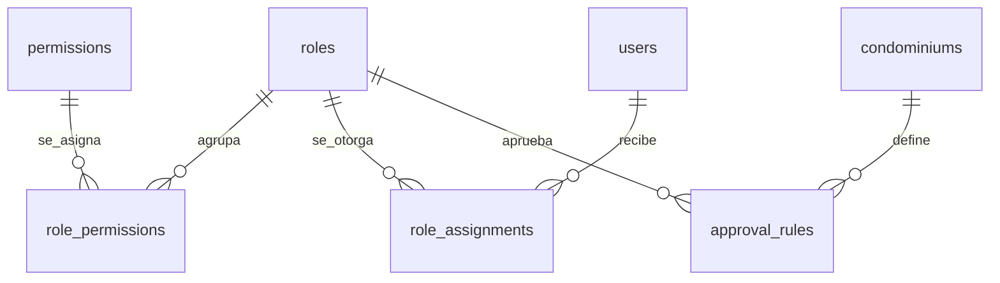

| Tabla | N/E | Campos clave | Notas |
|---|---|---|---|
| `roles` | Nueva | `organization_id FK` (null=rol de sistema), `nombre`, `descripcion`, `es_sistema BOOLEAN`, `nivel_alcance` (organizacion\|conjunto\|torre\|unidad) | 14 roles de fábrica + personalizados |
| `permissions` | Nueva | `recurso`, `accion` (ver\|crear\|editar\|eliminar\|aprobar\|exportar\|configurar), `clave` UNIQUE (ej. `pagos.aprobar`) | Catálogo sembrado por el operador SaaS |
| `role_permissions` | Nueva | `role_id FK`, `permission_id FK` | M:N rol↔permiso |
| `role_assignments` | Nueva | `user_id FK`, `role_id FK`, `scope_type` (organizacion\|conjunto\|torre\|unidad), `scope_id` (uuid polimórfico), `vigencia_inicio`, `vigencia_fin` | `vigencia_*` = **delegación temporal**. Un usuario puede tener varias |
| `approval_rules` | Nueva | `condominium_id FK`, `recurso` (ej. pagos, ordenes_compra), `monto_umbral NUMERIC(15,2)`, `rol_aprobador_id FK→roles` | **Segregación de funciones**: quién aprueba qué y sobre qué monto |
| `permission_audit_log` | Nueva | `actor_user_id FK`, `accion`, `target_tipo`, `target_id`, `detalle JSONB` | Trazabilidad de cambios de permisos **[Ley 675]** |

> **Reglas:** herencia restrictiva (deny arriba no se habilita abajo); acciones sensibles siempre auditadas; `scope_id` polimórfico apunta a `organizations`/`condominiums`/`towers`/`properties` según `scope_type`.

---

## 5. Cobranza / Gastos Comunes (feature 7 — NUEVO)

> Núcleo normativo. El **prorrateo por coeficiente** y el **fondo de imprevistos** son obligatorios (Ley 675). Mapea a §4·7 de [[_RESEARCH_pantallas-mvp]].

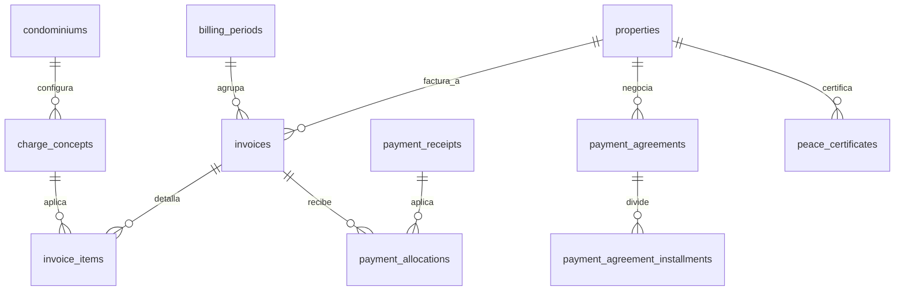

| Tabla | N/E | Campos clave | Notas |
|---|---|---|---|
| `charge_concepts` | Nueva | `condominium_id FK`, `nombre`, `tipo` (administracion\|fondo_imprevistos\|multa\|interes\|extraordinaria), `metodo_calculo` (coeficiente\|fijo\|por_area\|manual), `valor_base NUMERIC(15,2)`, `activo` | Conceptos facturables. `fondo_imprevistos` ≥1% **[Ley 675]** |
| `billing_periods` | Nueva | `condominium_id FK`, `anio`, `mes`, `estado` (abierto\|facturado\|cerrado) | Periodo de facturación |
| `billing_runs` | Nueva | `billing_period_id FK`, `ejecutado_por FK→users`, `fecha`, `estado` | Corrida que genera cuentas de cobro masivas |
| `invoices` | Nueva | `condominium_id FK`, `unit_id FK→properties`, `billing_period_id FK`, `numero`, `fecha_emision`, `fecha_vencimiento`, `valor_total NUMERIC(15,2)`, `saldo NUMERIC(15,2)`, `estado` (pendiente\|parcial\|pagada\|vencida) | **Cuenta de cobro** por unidad/periodo |
| `invoice_items` | Nueva | `invoice_id FK`, `charge_concept_id FK`, `descripcion`, `valor NUMERIC(15,2)`, `base_calculo` (coeficiente aplicado) | Renglón de la cuenta de cobro |
| `payment_receipts` | Nueva | `condominium_id FK`, `unit_id FK`, `contact_id FK`, `valor NUMERIC(15,2)`, `fecha`, `medio` (efectivo\|banco\|pse\|tarjeta), `referencia`, `soporte_url`, `transaction_id FK?` | Pago/abono registrado (manual u online) |
| `payment_allocations` | Nueva | `payment_receipt_id FK`, `invoice_id FK`, `valor_aplicado NUMERIC(15,2)` | Aplica un pago a una o varias cuentas |
| `late_interest_config` | Nueva | `condominium_id FK`, `tasa_mensual NUMERIC(7,4)`, `dias_gracia` | Interés de mora a tasa legal máxima |
| `payment_agreements` | Nueva | `condominium_id FK`, `unit_id FK`, `valor_total NUMERIC(15,2)`, `num_cuotas`, `estado` | Acuerdo de pago de morosos |
| `payment_agreement_installments` | Nueva | `agreement_id FK`, `numero`, `valor NUMERIC(15,2)`, `vence_el`, `estado` | Cuota del acuerdo |
| `peace_certificates` | Nueva | `condominium_id FK`, `unit_id FK`, `emitido_por FK→users`, `numero`, `fecha`, `vigente_hasta`, `pdf_url` | **Paz y salvo** — requisito notarial **[Ley 675]** |

---

## 6. Pagos Online — PSE + tarjeta (feature 8 — NUEVO)

> PSE obligatorio en Colombia. La transacción aprobada genera un `payment_receipt` (§5) y debe **conciliar**.

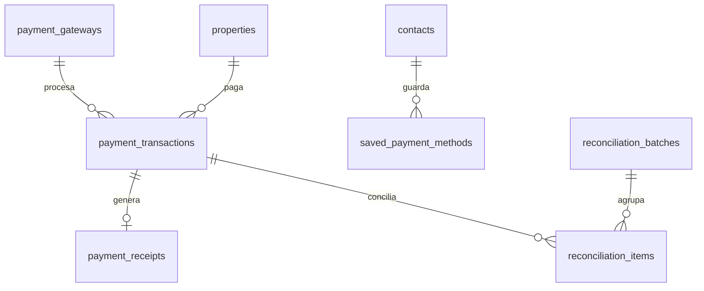

| Tabla | N/E | Campos clave | Notas |
|---|---|---|---|
| `payment_gateways` | Nueva | `condominium_id FK`, `proveedor` (wompi\|payu\|mercadopago), `config JSONB`, `activo` | Credenciales de pasarela / cuentas de recaudo |
| `payment_transactions` | Nueva | `condominium_id FK`, `unit_id FK`, `gateway_id FK`, `valor NUMERIC(15,2)`, `metodo` (pse\|tarjeta), `banco_pse`, `estado` (pendiente\|aprobado\|rechazado\|reversado), `referencia_externa`, `payload JSONB` | Intento/resultado de pago online |
| `saved_payment_methods` | Nueva | `contact_id FK`, `token`, `tipo`, `ultimos4` | Tarjetas tokenizadas (nunca PAN en claro) |
| `reconciliation_batches` | Nueva | `condominium_id FK`, `fecha`, `estado` | Lote de conciliación pasarela↔contabilidad |
| `reconciliation_items` | Nueva | `batch_id FK`, `payment_transaction_id FK`, `invoice_id FK?`, `estado` | Match de cada transacción |

---

## 7. Contabilidad y Presupuesto (feature 17 / cliente §6.4 — NUEVO)

> NIIF para PYMES (Sección 35), Orientación Técnica 15 del CTCP. El **fondo de imprevistos** vive en cuenta bancaria separada **[Ley 675]**.

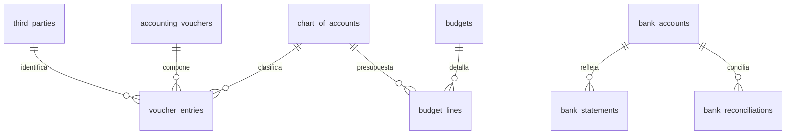

| Tabla | N/E | Campos clave | Notas |
|---|---|---|---|
| `chart_of_accounts` | Nueva | `condominium_id FK`, `codigo`, `nombre`, `tipo` (activo\|pasivo\|patrimonio\|ingreso\|gasto), `parent_id FK self`, `naturaleza` (debito\|credito) | Plan único de cuentas (PUC) |
| `third_parties` | Nueva | `condominium_id FK`, `tipo_doc`, `numero_doc`, `nombre`, `contact_id FK?`, `vendor_id FK?` | Terceros (puede enlazar a contacto/proveedor) |
| `accounting_vouchers` | Nueva | `condominium_id FK`, `tipo` (ingreso\|egreso\|nota), `numero`, `fecha`, `descripcion`, `estado`, `creado_por FK` | Comprobante contable |
| `voucher_entries` | Nueva | `voucher_id FK`, `account_id FK`, `third_party_id FK?`, `debito NUMERIC(15,2)`, `credito NUMERIC(15,2)` | Partida. Σ débitos = Σ créditos |
| `bank_accounts` | Nueva | `condominium_id FK`, `banco`, `numero`, `tipo`, `es_fondo_imprevistos BOOLEAN`, `saldo NUMERIC(15,2)` | `es_fondo_imprevistos` = cuenta separada **[Ley 675]** |
| `bank_statements` | Nueva | `bank_account_id FK`, `periodo`, `linea`, `fecha`, `valor NUMERIC(15,2)`, `conciliado BOOLEAN` | Extracto importado (líneas) |
| `bank_reconciliations` | Nueva | `bank_account_id FK`, `periodo`, `estado` | Conciliación bancaria del periodo |
| `fiscal_periods` | Nueva | `condominium_id FK`, `anio`, `mes`, `estado` (abierto\|cerrado) | Cierre contable |
| `budgets` | Nueva | `condominium_id FK`, `anio`, `estado` (borrador\|aprobado) | Presupuesto anual (lo aprueba la asamblea) |
| `budget_lines` | Nueva | `budget_id FK`, `account_id FK`, `valor_presupuestado NUMERIC(15,2)` | Renglón presupuestal (ejecución vs real) |

---

## 8. Mantenimiento, Aseo y Activos (feature 9 + clientes §6.2/§6.3 — NUEVO)

> `maintenance_requests` = lo que reporta el residente; `work_orders` = lo que ejecuta el técnico/proveedor. Aseo comparte el patrón de checklist con evidencia.

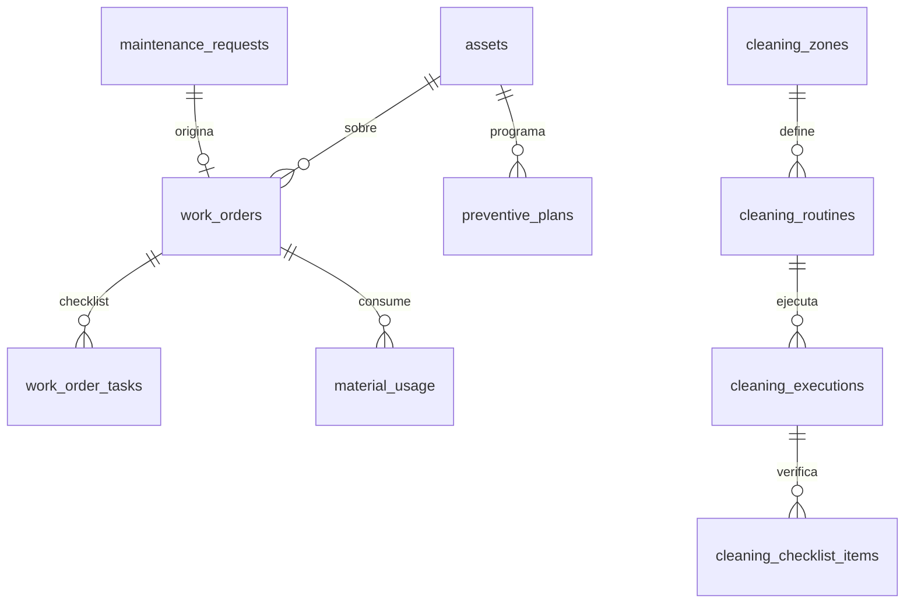

| Tabla | N/E | Campos clave | Notas |
|---|---|---|---|
| `assets` | Nueva | `condominium_id FK`, `nombre`, `categoria`, `ubicacion`, `serial`, `estado` | Equipos comunes (ascensor, bomba…) |
| `maintenance_categories` | Nueva | `condominium_id FK`, `nombre`, `sla_horas` | Catálogo + SLA |
| `maintenance_requests` | Nueva | `condominium_id FK`, `unit_id FK?`, `reportado_por contact_id FK`, `category_id FK`, `descripcion`, `fotos JSONB`, `prioridad`, `estado` | Solicitud del residente |
| `work_orders` | Nueva | `condominium_id FK`, `request_id FK?`, `asset_id FK?`, `asignado_user_id FK?`, `vendor_id FK?`, `tipo` (correctivo\|preventivo), `estado` (nueva\|asignada\|en_progreso\|pausada\|completada), `programada_para`, `costo NUMERIC(15,2)`, `firma_url` | Orden de trabajo (app de mantenimiento) |
| `work_order_tasks` | Nueva | `work_order_id FK`, `descripcion`, `resultado` (ok\|falla\|na), `foto_url`, `orden` | Checklist con foto obligatoria |
| `work_order_logs` | Nueva | `work_order_id FK`, `actor_user_id FK`, `de_estado`, `a_estado`, `comentario` | Historial/auditoría |
| `preventive_plans` | Nueva | `asset_id FK`, `frecuencia`, `proxima_fecha`, `checklist_template JSONB` | Mantenimiento preventivo recurrente |
| `material_usage` | Nueva | `work_order_id FK`, `material`, `cantidad`, `costo NUMERIC(15,2)` | Insumos/repuestos usados |
| `cleaning_zones` | Nueva | `condominium_id FK`, `nombre` | Zona de aseo |
| `cleaning_routines` | Nueva | `cleaning_zone_id FK`, `frecuencia`, `horario` | Rutina programada |
| `cleaning_executions` | Nueva | `routine_id FK`, `realizado_por user_id FK`, `fecha`, `estado` | Ejecución de la rutina |
| `cleaning_checklist_items` | Nueva | `execution_id FK`, `item`, `resultado` (ok\|falla), `foto_url` | Checklist de zona con evidencia |

---

## 9. Zonas Comunes y Reservas (feature 10 — NUEVO)

> Vocabulario del [[GLOSSARY]]: **`common_zones`** (zona común) y **`reservations`** (reserva).

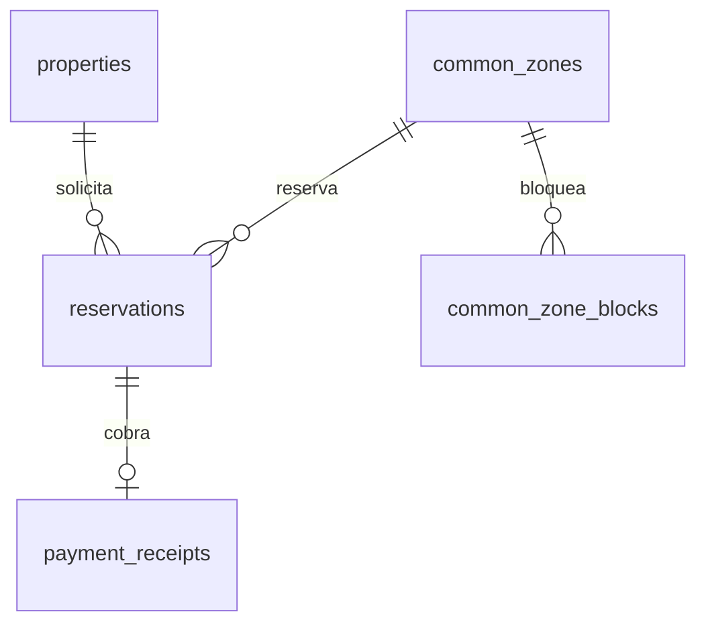

| Tabla | N/E | Campos clave | Notas |
|---|---|---|---|
| `common_zones` | Nueva | `condominium_id FK`, `nombre`, `aforo`, `requiere_aprobacion BOOLEAN`, `costo NUMERIC(15,2)`, `deposito NUMERIC(15,2)`, `horario_config JSONB`, `anticipacion_dias`, `activo` | Amenidad reservable |
| `reservations` | Nueva | `common_zone_id FK`, `unit_id FK`, `contact_id FK`, `fecha`, `hora_inicio`, `hora_fin`, `estado` (solicitada\|aprobada\|rechazada\|cancelada\|cumplida), `invitados`, `payment_receipt_id FK?`, `qr_acceso` | Reserva con QR de acceso |
| `common_zone_blocks` | Nueva | `common_zone_id FK`, `desde`, `hasta`, `motivo` | Bloqueo por mantenimiento/evento |

---

## 10. Proveedores y Contratos (feature 11 — NUEVO)

> Vendor compliance: pólizas/ARL con vencimiento **[SG-SST]**. `purchase_orders` enlaza con feature 20 (extended).

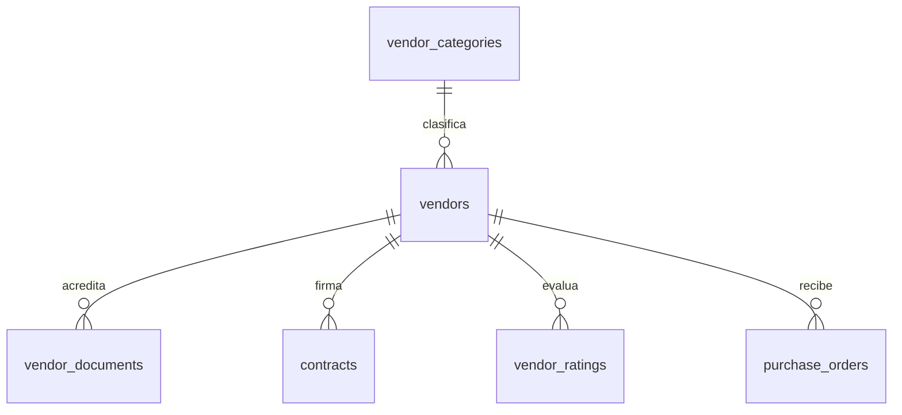

| Tabla | N/E | Campos clave | Notas |
|---|---|---|---|
| `vendor_categories` | Nueva | `condominium_id FK?` (o org), `nombre` | Catálogo de categorías |
| `vendors` | Nueva | `organization_id FK`, `nombre`, `nit`, `category_id FK`, `contacto`, `telefono`, `email`, `cuenta_bancaria`, `calificacion`, `estado` | Proveedor (reutilizable entre conjuntos del tenant) |
| `vendor_documents` | Nueva | `vendor_id FK`, `tipo` (rut\|camara\|arl\|poliza), `archivo_url`, `vence_el`, `estado` | Alertas de vencimiento **[SG-SST]** |
| `contracts` | Nueva | `condominium_id FK`, `vendor_id FK`, `objeto`, `valor NUMERIC(15,2)`, `inicia_el`, `termina_el`, `estado` | Contrato vigente |
| `vendor_ratings` | Nueva | `vendor_id FK`, `work_order_id FK?`, `puntaje`, `comentario` | Calificación tras servicio |
| `purchase_orders` | Nueva | `condominium_id FK`, `vendor_id FK`, `valor NUMERIC(15,2)`, `estado`, `aprobado_por FK?` | Orden de compra (puente a feature 20) |

---

## 11. Portería, Accesos y Rondas (feature 12 + cliente §6.1 — NUEVO)

> Dolor #1 en Colombia. La **minuta** se vuelve `shift_log_entries`; las rondas usan checkpoints QR/NFC. Datos de visitantes bajo **Habeas Data**.

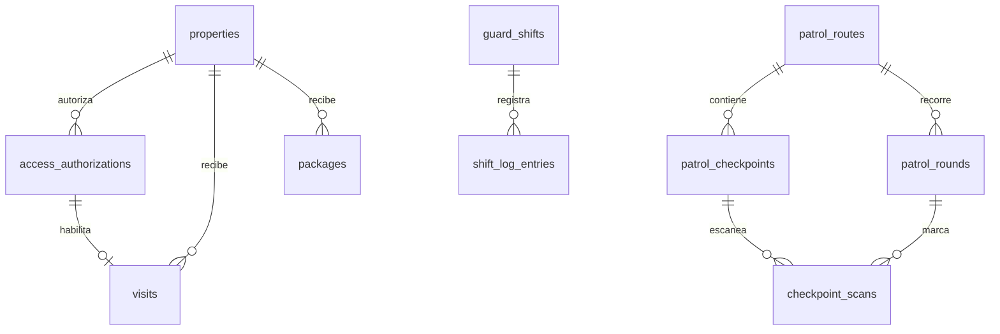

| Tabla | N/E | Campos clave | Notas |
|---|---|---|---|
| `access_authorizations` | Nueva | `condominium_id FK`, `unit_id FK`, `autorizado_por contact_id FK`, `visitor_nombre`, `documento`, `qr_code`/`pin`, `valido_desde`, `valido_hasta`, `estado` (activa\|usada\|revocada\|vencida) | Preautorización del residente (QR/PIN) |
| `visits` | Nueva | `condominium_id FK`, `unit_id FK`, `authorization_id FK?`, `visitor_nombre`, `documento`, `ingreso_at`, `salida_at`, `registrado_por user_id FK`, `vehiculo_placa` | Registro real de visita (la minuta de accesos) |
| `packages` | Nueva | `condominium_id FK`, `unit_id FK`, `transportadora`, `descripcion`, `foto_url`, `recibido_at`, `recibido_por user_id FK`, `entregado_at`, `entregado_a contact_id FK`, `estado` | Correspondencia/paquetería |
| `visitor_parking` | Nueva | `condominium_id FK`, `visit_id FK`, `cupo`, `ingreso`, `salida` | Control de cupos de visitantes |
| `access_blocklist` | Nueva | `condominium_id FK`, `documento`, `nombre`, `tipo` (autorizado\|vetado), `motivo` | Listas recurrentes |
| `guard_shifts` | Nueva | `condominium_id FK`, `guard_user_id FK`, `inicio`, `fin`, `estado`, `entregado_a user_id FK?` | Turno de vigilancia |
| `shift_log_entries` | Nueva | `shift_id FK`, `hora`, `tipo` (novedad\|incidente\|visita\|paquete), `descripcion`, `foto_url` | **Minuta digital / DAR** |
| `patrol_routes` | Nueva | `condominium_id FK`, `nombre`, `activa` | Ruta de ronda |
| `patrol_checkpoints` | Nueva | `route_id FK`, `nombre`, `qr_nfc_code`, `orden` | Punto de control |
| `patrol_rounds` | Nueva | `route_id FK`, `guard_user_id FK`, `inicio`, `fin`, `estado` | Ronda ejecutada |
| `checkpoint_scans` | Nueva | `round_id FK`, `checkpoint_id FK`, `scanned_at`, `lat`, `lng`, `foto_url`, `observacion` | Escaneo de checkpoint (geo + foto) |
| `panic_alerts` | Nueva | `condominium_id FK`, `origen_tipo` (residente\|vigilante), `origen_id`, `lat`, `lng`, `estado` | Botón de pánico / SOS |

---

## 12. Comunicaciones (feature 6 — NUEVO)

> WhatsApp como canal de primera clase. Comunicados segmentados + encuestas/votaciones.

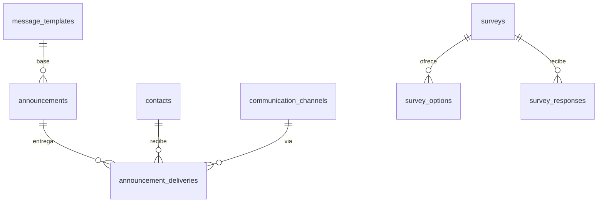

| Tabla | N/E | Campos clave | Notas |
|---|---|---|---|
| `announcements` | Nueva | `condominium_id FK`, `autor_user_id FK`, `titulo`, `cuerpo`, `segmento` (todos\|torre\|morosos\|unidad), `target_id?`, `estado` (borrador\|programado\|enviado), `programado_para`, `fijado BOOLEAN` | Comunicado / cartelera (`fijado`) |
| `announcement_deliveries` | Nueva | `announcement_id FK`, `contact_id FK`, `canal` (whatsapp\|email\|push), `estado` (enviado\|entregado\|leido\|fallido) | Entrega por canal y métrica de lectura |
| `communication_channels` | Nueva | `condominium_id FK`, `canal`, `config JSONB`, `activo` | Conexión WhatsApp (Meta/WATI), email, push |
| `message_templates` | Nueva | `condominium_id FK`, `nombre`, `tipo`, `cuerpo` | Plantillas (convocatoria, recordatorio…) |
| `surveys` | Nueva | `condominium_id FK`, `pregunta`, `tipo`, `cierra_el` | Encuesta/sondeo |
| `survey_options` | Nueva | `survey_id FK`, `texto` | Opción de respuesta |
| `survey_responses` | Nueva | `survey_id FK`, `contact_id FK`, `option_id FK` | Voto/respuesta (1 por contacto) |

---

## 13. Incidencias, PQRS y Cumplimiento (feature 14 — NUEVO)

> PQRS con SLA legal + régimen sancionatorio con **debido proceso** (descargos antes de la multa) **[Ley 675]**.

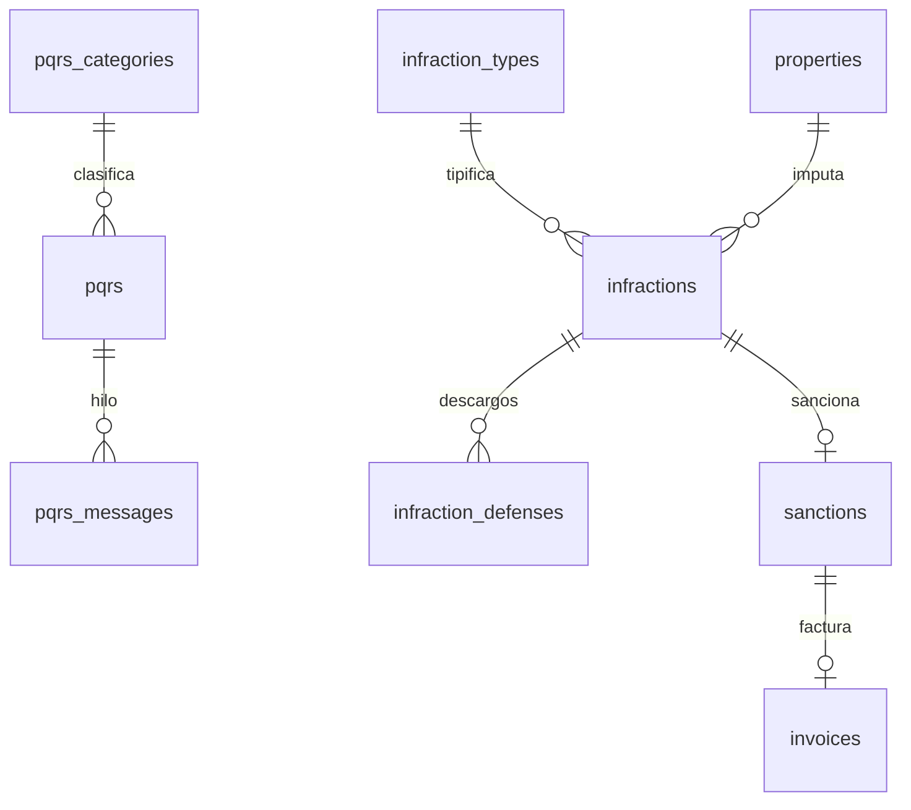

| Tabla | N/E | Campos clave | Notas |
|---|---|---|---|
| `pqrs` | Nueva | `condominium_id FK`, `radicado_por contact_id FK`, `unit_id FK?`, `tipo` (peticion\|queja\|reclamo\|sugerencia), `category_id FK`, `asunto`, `descripcion`, `estado`, `sla_vence_at`, `asignado_user_id FK?` | Radicado con SLA legal |
| `pqrs_messages` | Nueva | `pqrs_id FK`, `autor_tipo` (admin\|residente), `autor_id`, `cuerpo`, `adjunto_url` | Hilo de la PQRS |
| `pqrs_categories` | Nueva | `condominium_id FK`, `nombre` | Catálogo |
| `infraction_types` | Nueva | `condominium_id FK`, `nombre`, `valor_multa NUMERIC(15,2)` | Faltas y multas según reglamento |
| `infractions` | Nueva | `condominium_id FK`, `unit_id FK`, `infraction_type_id FK`, `reportado_por user_id FK`, `descripcion`, `evidencia_url`, `estado` (reportada\|en_descargos\|sancionada\|cerrada) | Caso de convivencia |
| `infraction_defenses` | Nueva | `infraction_id FK`, `presentado_por contact_id FK`, `texto`, `adjunto_url` | **Descargos [debido proceso]** |
| `sanctions` | Nueva | `infraction_id FK`, `tipo` (multa\|llamado\|otro), `valor NUMERIC(15,2)`, `invoice_id FK?`, `decidido_por user_id FK` | Sanción (la multa liga a Cobranza) |
| `committee_cases` | Nueva | `condominium_id FK`, `infraction_id FK?`, `estado`, `acta_url` | Comité de convivencia |

---

## 14. Archivo Documental (feature 15 — NUEVO)

> Documentos del **conjunto** (actas, reglamento, financieros). Los documentos de **unidad** ya viven en `property_documents` (no se duplica).

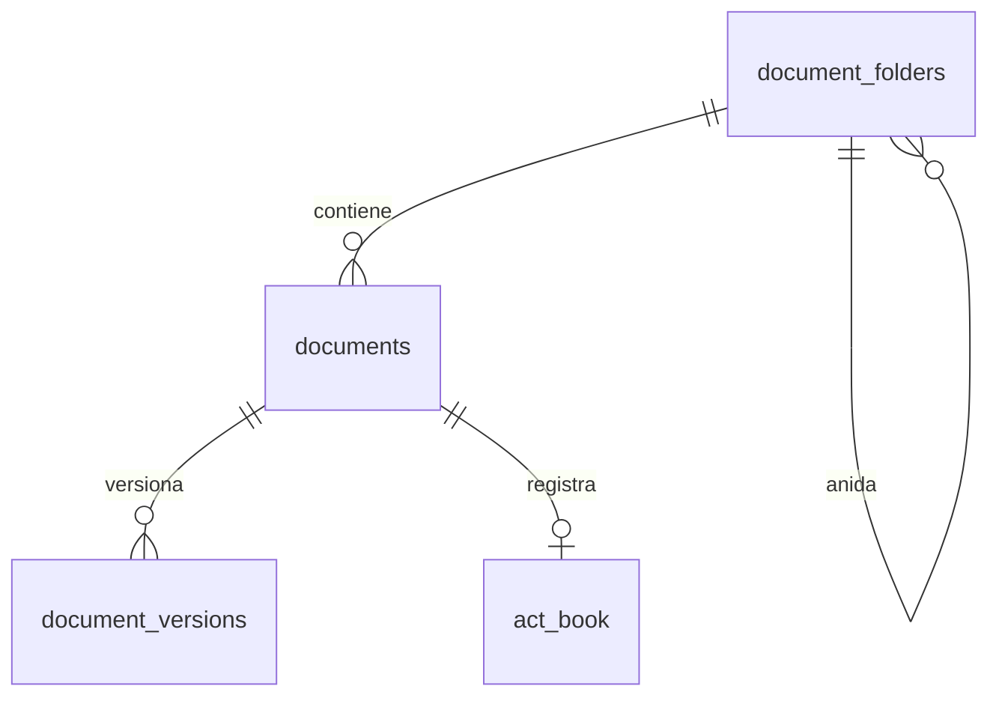

| Tabla | N/E | Campos clave | Notas |
|---|---|---|---|
| `document_folders` | Nueva | `condominium_id FK`, `nombre`, `parent_id FK self?`, `visibilidad` (residentes\|consejo\|admin) | Árbol de carpetas con permiso de visibilidad |
| `documents` | Nueva | `condominium_id FK`, `folder_id FK`, `nombre`, `tipo`, `archivo_url`, `subido_por user_id FK`, `visibilidad` | Documento del conjunto |
| `document_versions` | Nueva | `document_id FK`, `version`, `archivo_url`, `subido_por user_id FK` | Historial de versiones |
| `act_book` | Nueva | `condominium_id FK`, `tipo` (asamblea\|consejo), `numero`, `fecha`, `document_id FK` | **Libro de actas** numerado **[Ley 675]** |

---

## 15. Transversales (notificaciones, auditoría, adjuntos — NUEVO)

> Tablas que sirven a todos los módulos. **Feature 13 (Portal Residente)** y **16 (Reportes)** no crean tablas: son agregadores/vistas sobre lo anterior.

| Tabla | N/E | Campos clave | Notas |
|---|---|---|---|
| `notifications` | Nueva | `destinatario_tipo` (user\|contact), `destinatario_id`, `tipo`, `titulo`, `cuerpo`, `data JSONB`, `leido_at` | Centro de notificaciones (push/app) |
| `attachments` | Nueva | `owner_tipo`, `owner_id`, `url`, `mime`, `subido_por user_id FK` | Adjuntos polimórficos (opcional; varios módulos usan `*_url` directo) |
| `audit_log` | Nueva | `condominium_id FK?`, `actor_user_id FK`, `entidad`, `entidad_id`, `accion`, `cambios JSONB` | Auditoría global **[Ley 675 — trazabilidad]** |

---

## 16. Reglas transversales y próximos pasos

**Reglas que aplican a todo el modelo**

- **Aislamiento multi-tenant**: `organization_id` (gobierno del tenant) y `condominium_id` (operación). Considerar **Row-Level Security** en PostgreSQL por `condominium_id`.
- **Convenciones obligatorias**: `id` UUID v7, `created_at`/`updated_at`/`deleted_at`, dinero `NUMERIC(15,2)`, FK `{tabla_singular}_id` (heredadas de [[DB_SCHEMA_OVERVIEW]]).
- **Catálogos configurables** como tabla (`*_types`, `*_categories`, `*_concepts`) cuando el usuario deba editarlos; enums solo para conjuntos fijos y normativos.
- **Trazabilidad**: toda acción sensible (aprobaciones, pagos, permisos, sanciones) escribe en `audit_log` / `permission_audit_log`.
- **Normativa como datos**: `peace_certificates`, `act_book`, `bank_accounts.es_fondo_imprevistos`, `infraction_defenses` existen para cumplir Ley 675 — no son opcionales.

**Resumen de tablas nuevas por módulo**

| Módulo | Tablas nuevas (aprox.) |
|---|---|
| Plataforma/SaaS (§2) | 5 |
| RBAC (§4) | 6 |
| Cobranza (§5) | 11 |
| Pagos online (§6) | 5 |
| Contabilidad (§7) | 10 |
| Mantenimiento/Aseo (§8) | 12 |
| Zonas comunes (§9) | 3 |
| Proveedores (§10) | 6 |
| Portería/Rondas (§11) | 12 |
| Comunicaciones (§12) | 7 |
| PQRS/Cumplimiento (§13) | 8 |
| Archivo (§14) | 4 |
| Transversales (§15) | 3 |
| **Total nuevas** | **~92** (sobre las 17 existentes de Auth+Propiedades+Directorio) |

**Próximos pasos sugeridos**

1. Validar el orden de construcción con §7 de [[_RESEARCH_pantallas-mvp]] (`Tenancy → RBAC → Cobranza → …`).
2. Al implementar cada módulo, **trasladar sus tablas a [[01-api/API_DATABASE]]** (fuente de verdad) y reflejarlas en [[DB_SCHEMA_OVERVIEW]] y en la §6 del panorama de la feature ([[FEATURE_PLANNING_TEMPLATE]]).
3. Resolver las **preguntas abiertas**: ¿`vendors` y `third_parties` se unifican con `contacts`? ¿`organization_id` se retrofitea ya en `users`/`condominiums`? ¿RLS por `condominium_id` desde el día 1?

> Fuente de verdad del esquema implementado: [[01-api/API_DATABASE]]. Este documento es la **referencia de arranque**, no el esquema final.
