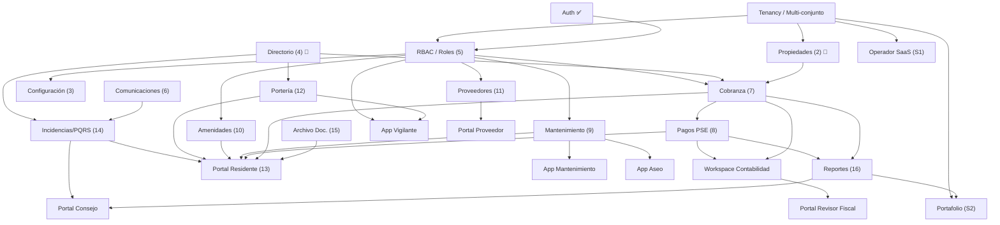

# 🔎 RESEARCH — Inventario de Pantallas (MVP core 5–16 + Capa SaaS)
## Benchmarking de software líderes + pantallas por feature

> [!info] Qué es este documento
> Documento de **investigación**, no de implementación. No modifica ningún archivo existente del vault. Su objetivo es alimentar la **§5 "Inventario de pantallas"** de cada feature cuando se vaya a diseñar (ver [[FEATURE_PLANNING_TEMPLATE]]).
> Alcance acordado: **features 5–16** (las `core` aún sin diseñar) + **capa SaaS / multi-tenant** + **administración de roles y permisos (RBAC)** + **clientes especializados por rol** (vigilante, mantenimiento, aseo, contabilidad, consejo, revisor fiscal, proveedor) + un **orden de desarrollo por dependencias**. Varias de estas piezas hoy NO están en el [[FEATURES_INDEX]] y se proponen como features formales.
> Cada feature trae: **(1)** tabla de pantallas Web y App en el formato del template, **(2)** *Benchmarking* (qué líder la inspira) y **(3)** *Ley 675 / Colombia* (qué pantallas obliga la norma).

> [!warning] Convención de tipos (del template)
> **Web:** `Página · Modal · Drawer · Sheet · Inline`  ·  **App:** `Screen · BottomSheet · Dialog`.
> Las pantallas marcadas *(post-MVP)* se difieren a una segunda iteración. Las marcadas **[Ley 675]** son requisito normativo, no opcional.

---

## 1. Software líderes analizados (benchmarking)

> El objetivo de Urbania es competir al nivel de estas plataformas. La columna "Qué tomar" indica el aprendizaje que se traslada al diseño de pantallas.

### Globales

| Plataforma | Enfoque | Qué tomar para Urbania |
|---|---|---|
| **BuildingLink** | 65+ módulos; experiencia del residente en edificios | Granularidad de **portería** (visitas, paquetería, parqueo de visitantes) y **reservas de amenidades** |
| **Condo Control** | 40+ módulos; condominios y HOA | Módulo de **infracciones/violations**, **e-voting** y solicitudes arquitectónicas |
| **Vantaca** | Empresas que administran 5–500 comunidades; IA (HOAi) | **Capa multi-conjunto** (portafolio, switch) y **dashboards** de inteligencia (IQ) |
| **Yardi Breeze Premier** | HOA/condos mid-market | **Contabilidad** integrada con cobranza y violations |
| **Buildium / AppFolio** | Property management general + HOA | Flujos de **pago online** y **portal** unificado de residente/propietario |

### LATAM / Colombia

| Plataforma | Enfoque | Qué tomar para Urbania |
|---|---|---|
| **ComunidadFeliz** | 10 países, +7.000 comunidades | **Ciclo de cobranza automático**, conciliación y **control de accesos por QR** desde el móvil del vigilante |
| **Vecindapp** | Colombia/LATAM, +800 conjuntos | **PSE**, **citofonía/portería virtual**, comunicados por **WhatsApp + IA**, asambleas |
| **PropLógica** | 100% adaptado a Ley 675 | **Cumplimiento normativo**: PQRS, SG-SST, paz y salvo, fondo de imprevistos |
| **Jelpit (Davivienda)** | Conjuntos en Colombia | **Integración bancaria** y pagos |
| **Portea** | Contable régimen colombiano | **Contabilidad NIIF**, cartera, conciliación, presupuesto anual |
| **Ex-Saph** | SaaS de PH | **Onboarding sin fricción** (alta en minutos, sin contrato) |

---

## 2. Requisitos de la Ley 675 de 2001 que obligan pantallas

> Estos puntos no son "valor agregado": son **obligatorios** en Colombia. Cada uno fuerza una o más pantallas. Diferenciador clave frente a competidores que no nacen normativos.

| Requisito legal | Pantalla(s) que obliga | Feature |
|---|---|---|
| **Prorrateo por coeficiente de copropiedad** (el voto y las expensas equivalen al coeficiente del bien privado) | Generar facturación; coeficiente visible en la unidad | 2, 7, 19 |
| **Fondo de imprevistos** (≥1% del presupuesto anual, en **cuenta separada**; se puede suspender al llegar al 50% del presupuesto ordinario) | Saldo y movimientos del fondo; configuración del % | 7, 16, 17 |
| **Paz y salvo** (exigible ante notaría al transferir la unidad) | Generar/descargar certificado de paz y salvo | 7, 13 |
| **Libro de actas** (asamblea y consejo) | Libro de actas numerado | 15, 19 |
| **Asamblea**: quórum y voto por coeficiente; 2ª convocatoria al **3er día hábil, 8:00 p.m.** | Convocatoria, registro de asistencia/poderes, votación | 6, 19 *(extended)* |
| **PQRS / derecho de petición** (respuesta en términos de ley) | Radicar y responder PQRS con SLA | 14 |
| **Régimen sancionatorio con debido proceso** (descargos antes de la multa) | Caso de infracción → descargos → sanción | 14, 7 |
| **Estados financieros e informe de gestión** a la asamblea | Reportes financieros e informe de gestión | 16, 17 |
| **Habeas Data (Ley 1581)** | Consentimiento en registro de visitantes y datos personales | 12, transversal |
| **SG-SST (Decreto 1072)** del personal y contratistas | Documentos y vencimientos de proveedores | 11, 21 *(extended)* |

---

## 3. Capa SaaS / multi-tenant (NO está en el FEATURES_INDEX — propuesta)

> El modelo de negocio (un cliente puede ser **un solo edificio** o una **empresa que administra muchas copropiedades**) exige dos superficies que hoy no figuran como feature. Se proponen como features formales **S1 — Operador SaaS** y **S2 — Portafolio multi-conjunto**; su lugar en el orden de construcción está en §7.

### 3.A — Super-Admin del SaaS (operador / dueño de Urbania)

> Back-office del proveedor. Multi-país desde el diseño (moneda, impuestos, pasarela y normativa por país).

| Pantalla | Tipo | Descripción |
|---|---|---|
| Dashboard del operador | Página | MRR, tenants activos, churn, uso por plan |
| Tenants / organizaciones | Página | Clientes: empresas administradoras y conjuntos directos |
| Detalle de tenant | Drawer | Plan, estado, conjuntos, usuarios, facturación, soporte |
| Planes y precios | Página | Definir planes y límites (n.º de conjuntos/unidades) |
| Módulos por plan (feature flags) | Página | Activar/desactivar features por plan o tenant |
| Suscripciones y facturación SaaS | Página | Cobro recurrente a tenants, facturas, mora del cliente |
| Provisionar tenant (onboarding) | Asistente | Alta de nuevo cliente y su primer conjunto |
| Soporte / tickets | Página | Bandeja de soporte a tenants |
| Configuración multi-país | Página | Moneda, impuestos, pasarela y normativa por país |
| Auditoría global / impersonar | Página | Log de acciones y acceso de soporte con consentimiento |

### 3.B — Empresa administradora (tenant con varios conjuntos)

> Capa de portafolio. Un tenant de **un solo edificio** simplemente opera con un único conjunto activo y no ve estas pantallas.

| Pantalla | Tipo | Descripción |
|---|---|---|
| Portafolio de copropiedades | Página | Conjuntos administrados con KPIs (recaudo, morosidad, alertas) |
| Selector / switch de conjunto | Inline | Cambia el conjunto activo; fija el contexto de todo el panel |
| Dashboard consolidado | Página | Métricas agregadas de todos los conjuntos |
| Cartera consolidada | Página | Morosidad agregada y comparada por conjunto |
| Equipo y asignaciones | Página | Staff y a qué conjuntos está asignado cada uno |
| Reportes multi-conjunto | Página | Comparativos entre copropiedades |
| Configuración de la empresa | Página | Datos, branding y facturación de la administradora |

**App:** para la empresa administradora basta con replicar el **Selector de conjunto** (Screen) en la app si el administrador opera desde el móvil; el resto del portafolio es Web.

---

## 4. Inventario de pantallas por feature (MVP core 5–16)

### 5 · Roles y Permisos — `core`

> **Benchmarking:** BuildingLink separa portales de residente / staff / management; Vecindapp maneja roles admin / vigilante / residente. **Ley 675:** los roles `administrador`, `consejo de administración` y `revisor fiscal` son figuras legales con atribuciones distintas — los permisos deben reflejarlas. Multi-tenant: cada rol necesita **alcance** (a qué conjunto/torre aplica). **→ Diseño detallado del RBAC en §5; los clientes que habilita cada rol están en §6.**

**Web**

| Pantalla | Tipo | Descripción |
|---|---|---|
| Lista de roles | Página | Roles predefinidos (admin, consejo, revisor fiscal, vigilante, contador, residente) + personalizados, con n.º de usuarios |
| Crear / editar rol | Modal | Nombre + matriz de permisos por módulo |
| Matriz de permisos | Página | Grid módulo × acción (ver / crear / editar / eliminar / aprobar) |
| Usuarios del panel | Página | Staff/admin con su rol, alcance y estado |
| Invitar usuario administrativo | Modal | Email + rol + alcance (conjunto/torre); envía invitación |
| Asignar / cambiar rol | Modal | Reasignar rol y alcance a un usuario |
| Bitácora de permisos | Drawer | Auditoría de quién cambió qué rol/permiso **[Ley 675 — trazabilidad]** |

**App**

> Gestión de roles es exclusiva de Web. En la app el residente solo *consume* sus permisos; no hay pantallas de administración. **N/A**.

---

### 6 · Comunicaciones — `core`

> **Benchmarking:** Condo Control (comunicados y newsletters por texto/email); Vecindapp (comunicados masivos con **IA** + recordatorios + encuestas + llamados de atención); ComunidadFeliz (muro de la comunidad). En Colombia **WhatsApp es el canal prioritario**. **Ley 675:** la convocatoria a asamblea exige citación formal con antelación.

**Web**

| Pantalla | Tipo | Descripción |
|---|---|---|
| Bandeja de comunicados | Página | Enviados y programados, con métricas de entrega/lectura |
| Redactar comunicado | Página | Editor + asistente IA; destinatarios segmentados (conjunto, torre, morosos…), canal (WhatsApp/email/push) |
| Detalle de comunicado | Drawer | Contenido + estadísticas por canal |
| Cartelera / muro digital | Página | Avisos fijados, visibles a residentes |
| Plantillas de comunicado | Página | Reutilizables (convocatoria, recordatorio de pago, corte de agua…) |
| Encuestas | Página | Crear y gestionar encuestas/sondeos no vinculantes |
| Resultados de encuesta | Drawer | Resultados en tiempo real |
| Configurar canales | Página | Conexión WhatsApp (Meta API/WATI), email y push |

**App**

| Pantalla | Tipo | Descripción |
|---|---|---|
| Muro / Avisos | Screen | Feed de comunicados y cartelera |
| Detalle de aviso | Screen | Comunicado completo con adjuntos |
| Encuestas | Screen | Responder encuestas activas |
| Preferencias de notificación | Screen | Canales y tipos de aviso que desea recibir |

---

### 7 · Cobranza (Gastos Comunes) — `core`

> **Benchmarking:** Vecindapp y ComunidadFeliz (cuentas de cobro digitales + ciclo de cobranza automático + conciliación); Buildium/Condo Control (dues & delinquency tracking). **Ley 675:** prorrateo por **coeficiente** obligatorio; **intereses de mora** a la tasa máxima legal; **paz y salvo** para transferir la unidad; **fondo de imprevistos** (≥1%, cuenta separada).

**Web**

| Pantalla | Tipo | Descripción |
|---|---|---|
| Panel de cartera | Página | Recaudo del mes, % morosidad, top deudores, saldo del fondo de imprevistos |
| Generar facturación del periodo | Asistente | Corre el prorrateo por coeficiente y emite cuentas de cobro masivas **[Ley 675]** |
| Lista de cuentas de cobro | Página | Por unidad: periodo, valor, estado (pagada/pendiente/vencida) |
| Detalle de cuenta de cobro | Drawer | Conceptos, intereses de mora, abonos, historial |
| Configurar conceptos y tarifas | Página | Cuota de administración, fondo de imprevistos, multas, intereses |
| Registrar pago / abono manual | Modal | Pagos en banco/efectivo con soporte adjunto |
| Generar paz y salvo | Modal | Certificado para unidad al día **[Ley 675 — requisito notarial]** |
| Acuerdos de pago | Modal | Plan de pago para unidad morosa |
| Reporte de cartera por edades | Página | Mora 30/60/90+, recaudo vs presupuesto |

**App**

| Pantalla | Tipo | Descripción |
|---|---|---|
| Mi estado de cuenta | Screen | Saldo, cuentas pendientes, próximo vencimiento |
| Detalle de cuenta de cobro | BottomSheet | Conceptos e intereses de la cuenta |
| Mi paz y salvo | Screen | Descarga del certificado si está al día **[Ley 675]** |

---

### 8 · Pagos Online (PSE + tarjeta) — `core`

> **Benchmarking:** Vecindapp (PSE), ComunidadFeliz (Kushki: tarjeta + efectivo en tienda), Vantaca Pay, Buildium. **Colombia:** **PSE (ACH) es obligatorio desde el día 1**; integración con Bancolombia/Davivienda crítica. El recaudo debe **conciliar** con los estados financieros.

**Web (administración)**

| Pantalla | Tipo | Descripción |
|---|---|---|
| Configurar pasarela | Página | Credenciales PSE/tarjeta (Wompi/PayU/Mercado Pago) y cuentas de recaudo |
| Transacciones / recaudo online | Página | Pagos con estado (aprobado/rechazado/pendiente) |
| Detalle de transacción | Drawer | Datos del pago, comprobante, unidad y conceptos cubiertos |
| Conciliación de pagos | Página | Match de transacciones de pasarela con cuentas de cobro |
| Reembolsos / reversiones | Modal | Gestionar devoluciones |

**App (residente)**

| Pantalla | Tipo | Descripción |
|---|---|---|
| Checkout / pagar | Screen | Selección de cuentas a pagar + medio (PSE/tarjeta) |
| Selección de banco PSE | Screen | Lista de bancos; redirección al flujo ACH/PSE |
| Resultado del pago | Screen | Éxito/fallo + comprobante descargable |
| Métodos guardados | Screen | Tarjetas tokenizadas |
| Historial de pagos | Screen | Pagos realizados con comprobante |

---

### 9 · Solicitudes de Mantenimiento — `core`

> **Benchmarking:** BuildingLink y Condo Control (service/maintenance requests + work orders); Vecindapp (control de activos y **mantenimiento preventivo**); ComunidadFeliz (operaciones con alertas). **Ley 675:** el administrador responde por la conservación de los **bienes comunes**.

**Web (administración)**

| Pantalla | Tipo | Descripción |
|---|---|---|
| Tablero de solicitudes | Página | Kanban/lista por estado (nueva/asignada/en progreso/resuelta) |
| Detalle de solicitud / orden de trabajo | Drawer | Descripción, fotos, ubicación, asignado, costos, historial |
| Crear orden de trabajo | Modal | Desde una solicitud o un preventivo; asigna proveedor/personal |
| Asignar técnico / proveedor | Modal | Selector + fecha programada |
| Plan de mantenimiento preventivo | Página | Calendario de tareas recurrentes por activo |
| Activos / equipos | Página | Inventario de equipos comunes (ascensores, bombas) con historial |
| Configurar categorías y SLA | Página | Categorías de solicitud y tiempos objetivo |

**App (residente)**

| Pantalla | Tipo | Descripción |
|---|---|---|
| Reportar daño / solicitud | Screen | Formulario con fotos, ubicación y categoría |
| Mis solicitudes | Screen | Lista con estado |
| Detalle de solicitud | Screen | Seguimiento, comentarios y calificación al cierre |

> *Variante de staff (opcional):* una app de personal de mantenimiento con "Mis órdenes asignadas" (Screen) y "Actualizar orden" (BottomSheet) — evaluar si se prioriza tras el MVP.

---

### 10 · Reserva de Amenidades — `core`

> **Benchmarking:** BuildingLink (salón social, BBQ, ascensor de servicio), Condo Control (amenity bookings), Vecindapp (reservas con reportes de uso), ComunidadFeliz (horarios + cobros, evita duplicidad). **Ley 675:** el uso de **bienes comunes** se rige por el reglamento; se puede cobrar y exigir depósito.

**Web (administración)**

| Pantalla | Tipo | Descripción |
|---|---|---|
| Calendario de reservas | Página | Vista calendario de todas las zonas comunes |
| Gestionar zonas comunes | Página | CRUD de amenidades (aforo, horarios, costo, depósito, reglas) |
| Detalle / edición de zona | Drawer | Reglas de uso, anticipación, aprobación requerida |
| Solicitudes por aprobar | Página | Cola de reservas que requieren visto bueno |
| Detalle de reserva | Drawer | Datos, estado, pago asociado, sanción por no-show |
| Bloqueos y excepciones | Modal | Bloquear fechas por mantenimiento o evento |

**App (residente)**

| Pantalla | Tipo | Descripción |
|---|---|---|
| Explorar amenidades | Screen | Zonas reservables con disponibilidad |
| Disponibilidad / calendario | Screen | Horarios libres de una zona |
| Nueva reserva | Screen | Fecha/hora, invitados, aceptar reglas, pago si aplica |
| Mis reservas | Screen | Próximas e históricas; cancelar |
| Detalle de reserva | BottomSheet | Confirmación y QR de acceso si aplica |

### 11 · Proveedores y Contratistas — `core`

> **Benchmarking:** BuildingLink (vendor management con **compliance monitoring**), Vantaca Vendor, Vecindapp (directorio de proveedores), ComunidadFeliz (contratos y certificaciones con alertas). **Colombia:** los contratistas deben acreditar **ARL/seguridad social y pólizas** (relación con SG-SST); controlar **vencimientos**.

**Web (administración)**

| Pantalla | Tipo | Descripción |
|---|---|---|
| Directorio de proveedores | Página | Lista por categoría, calificación y estado documental |
| Ficha de proveedor | Drawer | Datos, servicios, documentos (RUT, cámara, ARL, pólizas), historial |
| Crear / editar proveedor | Modal | Datos + categorías + cuenta bancaria |
| Documentos y vencimientos | Drawer | Carga de pólizas/certificados con **alertas de vencimiento** **[SG-SST]** |
| Contratos | Página | Contratos vigentes, fechas y valores |
| Detalle de contrato | Drawer | Cláusulas clave, renovación, documentos |
| Evaluar / calificar proveedor | Modal | Calificación tras un servicio |

**App**

> Mayormente Web. Para el residente, una vista de **"Proveedores recomendados"** (Screen, solo lectura) es opcional y empalma con Marketplace (feature 28). En el MVP: **N/A**.

---

### 12 · Control de Acceso / Portería — `core`

> **Benchmarking:** ComunidadFeliz (muro de accesos: **QR de invitación** + gestión de visitas/paquetería desde el móvil del guardia), Vecindapp (**Seguridad 360**: QR preautorizado, **botón de pánico** por WhatsApp, correspondencia, **citofonía digital**), BuildingLink (visitor/package/parking). Es **uno de los mayores dolores** en conjuntos colombianos. **Ley 675 / Habeas Data:** registro de visitantes y minuta; consentimiento de datos personales.

**Web (consola de portería / administración)**

| Pantalla | Tipo | Descripción |
|---|---|---|
| Tablero de portería | Página | En vivo: visitantes dentro, paquetes pendientes, alertas |
| Registro de visitantes (minuta) | Página | Bitácora digital de ingresos/salidas **[reemplaza la minuta de papel]** |
| Registrar ingreso / salida | Modal | Documento del visitante, unidad destino, autorización |
| Validar QR de visita | Inline | Escanear el QR/PIN preautorizado por el residente |
| Correspondencia / paquetería | Página | Recepción y entrega con notificación al residente |
| Registrar paquete | Modal | Unidad, transportadora, foto; notifica al residente |
| Minuta de turno (novedades) | Página | Libro de novedades del turno de vigilancia |
| Parqueo de visitantes | Página | Control de cupos de parqueadero de visitantes |
| Listas de acceso | Página | Autorizados recurrentes y personas vetadas |

**App (residente)**

| Pantalla | Tipo | Descripción |
|---|---|---|
| Autorizar visita | Screen | Pre-registrar visitante y generar **QR/PIN** |
| Mis visitas autorizadas | Screen | Próximas y activas; revocar |
| Minuta de mi unidad | Screen | Ingresos/salidas a mi unidad (visitantes, domicilios) |
| Mi correspondencia | Screen | Paquetes en portería pendientes de reclamar |
| Citofonía virtual | Screen | Recibe la llamada de portería en el móvil (autorizar/rechazar) |
| Botón de pánico / SOS | Inline | Alerta de emergencia a portería |

> *Variante de vigilante (recomendada):* la consola de portería en **tablet/app de guardia** es de alto valor; muchas pantallas Web de arriba tienen sentido como app nativa del vigilante. Evaluar como cliente adicional.

---

### 13 · Portal Residente (web + app) — `core`

> **Benchmarking:** BuildingLink (resident experience) y Condo Control (resident portal): es el **agregador** que reúne saldo, avisos, reservas y documentos en un solo lugar. **Ley 675:** el residente tiene derecho a consultar estados de cuenta, actas y presupuesto.

**Web (portal del residente)**

| Pantalla | Tipo | Descripción |
|---|---|---|
| Inicio del residente | Página | Resumen: saldo, avisos, próximas reservas, accesos rápidos |
| Mi unidad | Página | Datos de la unidad, ocupantes y **coeficiente** |
| Mi cuenta | Página | Cuentas de cobro, pagos y paz y salvo (enlaza a 7 y 8) |
| Documentos del conjunto | Página | Actas, reglamento, presupuesto (enlaza a 15) |
| Mi perfil | Página | Datos de contacto y preferencias |

**App (residente — shell de la app)**

| Pantalla | Tipo | Descripción |
|---|---|---|
| Home / dashboard | Screen | Tarjetas: saldo, avisos, reservas, accesos directos |
| Menú principal | Screen | Punto de entrada a todos los módulos |
| Centro de notificaciones | Screen | Notificaciones push agrupadas |
| Mi perfil | Screen | Editar datos, preferencias, cerrar sesión |

---

### 14 · Incidencias / Cumplimiento — `core`

> **Benchmarking:** Condo Control (violations + architectural requests), Vantaca (rule enforcement), Vecindapp (**PQR con IA** + llamados de atención digitales), PropLógica (PQRS). **Ley 675:** **PQRS** con términos de respuesta; **régimen sancionatorio con debido proceso** (notificación → descargos → sanción); **comité de convivencia**.

**Web (administración)**

| Pantalla | Tipo | Descripción |
|---|---|---|
| Tablero de PQRS | Página | Peticiones/quejas/reclamos/sugerencias por estado y **SLA legal** |
| Detalle de PQRS | Drawer | Hilo, respuesta (sugerida por IA), adjuntos, trazabilidad |
| Tablero de infracciones | Página | Casos: reportada → descargos → sanción → cerrada |
| Detalle de caso (debido proceso) | Drawer | Notificación, plazo de descargos, decisión, multa **[Ley 675]** (enlaza a 7) |
| Registrar incidencia / infracción | Modal | Tipo de falta, unidad, evidencia |
| Catálogo de faltas y sanciones | Página | Faltas y multas según el reglamento |
| Comité de convivencia | Página | Casos en conciliación y actas del comité |

**App (residente)**

| Pantalla | Tipo | Descripción |
|---|---|---|
| Crear PQRS | Screen | Radicar petición/queja con adjuntos |
| Mis PQRS | Screen | Seguimiento y respuestas |
| Mis llamados de atención | Screen | Notificaciones de infracción |
| Presentar descargos | BottomSheet | Responder a una infracción **[debido proceso]** |

---

### 15 · Archivo Documental — `core`

> **Benchmarking:** BuildingLink (document library / record keeping), Condo Control (document storage). **Ley 675:** **libro de actas**, **reglamento de PH**, **estados financieros** y **presupuesto** deben estar disponibles y conservarse.

**Web (administración)**

| Pantalla | Tipo | Descripción |
|---|---|---|
| Biblioteca de documentos | Página | Carpetas: actas, reglamento, financieros, contratos, pólizas, manuales |
| Subir documento | Modal | Archivo + categoría + visibilidad (residentes / solo consejo) |
| Visor / detalle de documento | Drawer | Previsualización, versiones, permisos, descargas |
| Gestionar carpetas y permisos | Página | Estructura y quién ve qué |
| Libro de actas | Página | Actas de asamblea y consejo, numeradas **[Ley 675]** |
| Repositorio legal | Página | Certificado de existencia, RUT, escrituras del área común |

**App (residente)**

| Pantalla | Tipo | Descripción |
|---|---|---|
| Documentos | Screen | Carpetas visibles al residente |
| Visor de documento | Screen | Ver / descargar PDF |
| Buscar documento | Inline | Búsqueda por nombre o categoría |

---

### 16 · Reportes Básicos (dashboard) — `core`

> **Benchmarking:** Vantaca IQ (dashboards y benchmarking), Condo Control (reporting), Vecindapp y ComunidadFeliz (reportes automáticos en tiempo real). **Ley 675:** **estados financieros** e **informe de gestión** del administrador a la asamblea.

**Web (administración)**

| Pantalla | Tipo | Descripción |
|---|---|---|
| Dashboard general | Página | KPIs: recaudo, morosidad, solicitudes abiertas, reservas, ocupación |
| Reporte de cartera | Página | Edades de mora, top deudores, recaudo vs presupuesto |
| Reporte financiero | Página | Ingresos/egresos, resultado, fondo de imprevistos (enlaza a 17) **[Ley 675]** |
| Reporte de operaciones | Página | Mantenimientos, PQRS e infracciones por periodo |
| Informe de gestión | Página | Compilado para la asamblea **[Ley 675]** |
| Exportar / programar reportes | Modal | PDF/Excel y envío programado |
| Constructor de reportes | Página | Métricas y filtros configurables *(post-MVP)* |

**App (residente)**

| Pantalla | Tipo | Descripción |
|---|---|---|
| Mi resumen | Screen | Indicadores personales (saldo, mis solicitudes). El grueso de reportes es Web |

---

## 5. Administración de Roles y Permisos (RBAC) — diseño detallado

> Deep-dive de la feature 5. El objetivo que pediste: que el **administrador tenga control total** sobre qué puede hacer cada quién. Dado el alto número de roles (operativos, financieros, de gobierno, externos), el permiso no puede ser un enum fijo: debe ser una **matriz configurable** `recurso × acción`, con **alcance** multi-conjunto y **flujos de aprobación**.

### 5.1 Modelo conceptual

| Concepto | Definición |
|---|---|
| **Recurso / Módulo** | Cada entidad gestionable (unidades, cuentas de cobro, pagos, visitantes, órdenes, documentos, comunicados…) |
| **Acción** | `ver · crear · editar · eliminar · aprobar · exportar · configurar` |
| **Permiso** | Par `recurso × acción` (ej. `pagos.aprobar`) |
| **Rol** | Conjunto de permisos. Predefinido (plantilla) o personalizado |
| **Alcance (scope)** | Nivel donde aplica: `organización` (administradora) › `conjunto` › `torre/área`. Multi-tenant |
| **Asignación** | Vínculo `usuario × rol × alcance` (un usuario puede tener varios) |
| **Umbral / aprobación** | Regla que exige el visto bueno de otro rol sobre cierto monto o acción (segregación de funciones) |

### 5.2 Roles predefinidos (plantillas de fábrica)

> Se entregan listos y editables. Aceleran el alta y reflejan las figuras de la Ley 675.

| Rol | Capa | Alcance típico | Núcleo de permisos |
|---|---|---|---|
| Operador SaaS (super-admin) | SaaS | Global | Back-office completo del proveedor |
| Admin de empresa administradora | Tenant | Organización | Todos sus conjuntos y su staff |
| Administrador del conjunto | Conjunto | Conjunto | Operación completa de un conjunto |
| Consejo de administración | Gobierno | Conjunto | Aprobaciones, reportes, decisiones (no operación diaria) |
| Revisor fiscal | Gobierno | Conjunto | **Solo lectura** financiera + libros [Ley 675] |
| Contador | Financiero | Conjunto / Org | Contabilidad, conciliación, estados financieros |
| Vigilante / portería | Operativo | Conjunto / Portería | Accesos, paquetería, minuta, rondas |
| Supervisor de seguridad | Operativo | Conjunto / Org | Configura rondas y turnos, monitorea |
| Personal de mantenimiento | Operativo | Conjunto | Órdenes de trabajo asignadas |
| Personal de aseo / servicios | Operativo | Conjunto | Rutinas y checklists de aseo |
| Recepción / concierge | Operativo | Conjunto | Correspondencia y visitas (sin minuta de seguridad) |
| Propietario | Residente | Unidad(es) | Su cuenta, sus documentos, paz y salvo |
| Residente / arrendatario | Residente | Unidad | Servicios al residente |
| Proveedor / contratista | Externo | Sus órdenes | Portal restringido a lo asignado |

### 5.3 Pantallas (Web)

| Pantalla | Tipo | Descripción |
|---|---|---|
| Lista de roles | Página | Predefinidos + personalizados, con n.º de usuarios y alcance |
| Crear / editar rol | Modal | Nombre, descripción, plantilla base, alcance permitido |
| **Matriz de permisos** | Página | Grid `recurso × acción`; el corazón del control total |
| Reglas de aprobación / umbrales | Página | Quién aprueba qué y sobre qué monto (segregación de funciones) |
| Usuarios del panel | Página | Staff con su rol, alcance y estado |
| Invitar / dar de alta usuario | Modal | Email + rol + alcance; envía invitación |
| Detalle de usuario | Drawer | Roles, alcance, sesiones activas, historial |
| Delegación temporal | Modal | Asignar suplente con vigencia (ej. vacaciones del admin) |
| Alertas de conflicto (segregación) | Inline | Avisa combinaciones de permisos en conflicto |
| Catálogo de recursos y acciones | Página | Define qué es permisable (lo mantiene el operador SaaS) |
| Bitácora de auditoría de permisos | Página | Quién cambió qué rol/permiso y cuándo **[Ley 675 — trazabilidad]** |

> **App:** la administración de permisos es exclusiva de Web. Excepción opcional: el **Consejo** podría *aprobar* desde la app (pantalla "Aprobaciones", ver §6.5). El resto: N/A.

### 5.4 Reglas de negocio clave
- Un permiso denegado en un nivel superior **no** puede habilitarse en uno inferior (herencia restrictiva).
- Acciones sensibles (`aprobar`, `eliminar`, `configurar`, `exportar` financiero) **siempre** quedan en auditoría.
- **Segregación de funciones**: quien *registra* un pago no puede ser quien lo *aprueba* (control Ley 675).
- Todo recurso está **scopeado al tenant/conjunto**: ningún rol ve datos fuera de su alcance (aislamiento multi-tenant).

---

## 6. Clientes y pantallas especializadas por rol

> Hallazgo de la investigación: varios roles operativos **no caben** ni en el panel del administrador ni en la app del residente — necesitan su **propia superficie**, optimizada para su tarea y su dispositivo. Cada cliente expone únicamente lo que su rol permite (depende de §5 RBAC).

### 6.1 Consola / App de Vigilante (portería + rondas)
> **Benchmarking:** QR-Patrol, Patrol Points, THERMS (guard tour con checkpoints QR/NFC, DAR, SOS, GPS); ComunidadFeliz y Vecindapp (accesos por QR y citofonía desde el móvil del guardia). Extiende la feature 12. Dispositivo: **tablet en portería + móvil en ronda**. Requiere **modo offline**.

**App del vigilante**

| Pantalla | Tipo | Descripción |
|---|---|---|
| Inicio / cierre de turno | Screen | Check-in, novedades pendientes, entrega al turno siguiente |
| Registrar visitante / validar QR | Screen | Ingreso/salida; escaneo del QR preautorizado |
| Correspondencia | Screen | Recibir/entregar paquete con foto y firma |
| Minuta del turno (DAR) | Screen | Novedades cronológicas del turno |
| Control de rondas | Screen | Ruta con puntos a escanear (QR/NFC) |
| Escanear punto de ronda | Dialog | Confirma checkpoint con foto/observación; sella hora y geo |
| Reportar incidente | Screen | Categoría, foto, ubicación, hora |
| Botón de pánico / SOS | Inline | Alerta inmediata a supervisor y administración |
| Directorio de emergencia | Screen | Contactos rápidos (policía, bomberos, admin) |

**Supervisor de seguridad (Web)**

| Pantalla | Tipo | Descripción |
|---|---|---|
| Configurar rondas y puntos | Página | Rutas, checkpoints y frecuencia |
| Monitoreo en vivo | Página | GPS de guardas, rondas cumplidas/omitidas |
| Programación de turnos | Página | Cuadro de turnos del personal de seguridad |
| Reportes DAR / incidentes | Página | Consolidado diario exportable |

### 6.2 App de Personal de Mantenimiento
> **Benchmarking:** UpKeep, Snapfix, Maintenance Care, OxMaint (CMMS móvil: órdenes en campo, checklists con foto obligatoria, pass/fail, firma). Extiende la feature 9. Requiere **modo offline**.

| Pantalla | Tipo | Descripción |
|---|---|---|
| Mis órdenes asignadas | Screen | Cola de trabajo por prioridad |
| Detalle de orden + checklist | Screen | Pasos, materiales, fotos antes/después |
| Actualizar estado / evidencia | BottomSheet | En progreso / pausa / completada con firma |
| Preventivos del día | Screen | Tareas programadas por activo |
| Reportar hallazgo | Screen | Nueva incidencia detectada en campo |
| Consumo de materiales | Screen | Registrar repuestos/insumos usados |

### 6.3 App de Aseo / Servicios Generales
> **Benchmarking:** checklists visuales de housekeeping (Snapfix) con evidencia fotográfica y sello de tiempo. Cliente operativo hermano del de mantenimiento.

| Pantalla | Tipo | Descripción |
|---|---|---|
| Rutinas del día | Screen | Checklist por zona y horario |
| Checklist de zona | Screen | Ítems con foto y pass/fail, sello de tiempo |
| Confirmar finalización | Dialog | Firma/foto de evidencia |
| Reportar faltante / daño | Screen | Alimenta mantenimiento e insumos |
| Inventario de insumos | Screen | Solicitar reposición |

### 6.4 Workspace de Contabilidad (Web)
> **Benchmarking:** Portea y la Orientación Técnica 15 del CTCP (NIIF para PYMES, Sección 35). Persona: **contador**. Alimenta las features 7, 8 y 16; es la base de la feature 17 (extended). **Ley 675 arts. 38/51:** auxiliares conciliables con el presupuesto.

| Pantalla | Tipo | Descripción |
|---|---|---|
| Plan de cuentas (PUC) | Página | Catálogo de cuentas contables |
| Terceros | Página | Catálogo de terceros (NIT/cédula) |
| Comprobantes contables | Página | Ingreso, egreso, nota; lista y estados |
| Registrar comprobante | Modal | Asiento débito/crédito con tercero y soporte |
| Libro auxiliar | Página | Movimientos por cuenta/tercero, exportable |
| Conciliación bancaria | Página | Match extracto vs auxiliar de bancos |
| Estados financieros | Página | Balance general y estado de resultados (NIIF) **[Ley 675]** |
| Ejecución presupuestal | Página | Presupuesto vs ejecutado |
| Fondo de imprevistos | Página | Saldo en cuenta separada y movimientos **[Ley 675]** |
| Cierre de periodo | Modal | Cierre mensual/anual |
| Exportar para revisor fiscal / asamblea | Modal | Auxiliares de 12 meses en Excel/PDF |

### 6.5 Portal del Consejo de Administración / Comité (Web)
> Persona de **gobierno**, no de operación. Aprueba y supervisa; no ejecuta el día a día.

| Pantalla | Tipo | Descripción |
|---|---|---|
| Tablero del consejo | Página | Aprobaciones pendientes, indicadores, alertas |
| Aprobaciones | Página | Gastos, órdenes y acuerdos de pago a aprobar **[segregación]** |
| Documentos de sesión | Página | Actas, informes y presupuesto |
| Decisiones / actas del consejo | Página | Registrar decisiones **[Ley 675]** |
| Reportes ejecutivos | Página | Solo lectura |

> **App (opcional):** "Aprobaciones" (Screen) para que el consejo apruebe desde el móvil.

### 6.6 Portal del Revisor Fiscal (Web, solo lectura)
> Figura legal de control. Acceso **read-only** a lo financiero y los libros.

| Pantalla | Tipo | Descripción |
|---|---|---|
| Acceso de auditoría | Página | Solo lectura, sin edición |
| Libros y auxiliares | Página | Descarga de auxiliares (≥12 meses) **[Ley 675]** |
| Estados financieros | Página | Balance, resultados, ejecución presupuestal |
| Observaciones / dictamen | Página | Registrar hallazgos y dictamen |

### 6.7 Portal del Proveedor / Contratista (Web externo)
> **Benchmarking:** BuildingLink/Vantaca (vendor portal con compliance). Acceso restringido a lo suyo. Relaciona las features 11 y 20.

| Pantalla | Tipo | Descripción |
|---|---|---|
| Mis órdenes / solicitudes | Página | Trabajos asignados |
| Actualizar avance | Modal | Estado + evidencia |
| Mis documentos | Página | Cargar/renovar pólizas, ARL, RUT **[SG-SST]** |
| Mis facturas / pagos | Página | Radicar factura y ver estado de pago |

> **Recepción / concierge:** en edificios pequeños suele fundirse con el rol de vigilante; usa un subconjunto de §6.1 (visitas + correspondencia) sin rondas ni minuta de seguridad. No requiere cliente propio en el MVP.

---

## 7. Orden de desarrollo por prioridad y dependencias

> Regla: **construir primero los habilitadores**. Una feature solo entra cuando sus dependencias están listas, para que ninguna se bloquee. Leyenda: ✅ hecho · 🔵 en progreso · ⬜ pendiente.

### 7.1 Grafo de dependencias

### 7.2 Roadmap por fases

**Fase 0 — Fundación de plataforma** (habilitadores; bloquean casi todo)

| Orden | Feature | Estado | Por qué primero / no se bloquea |
|---|---|---|---|
| 0.1 | Auth | ✅ | Base de identidad |
| 0.2 | **Tenancy / Organización + scoping multi-conjunto** | ⬜ | Fundacional del SaaS: todo recurso se asocia a un tenant/conjunto. Retrofittear **ahora**, antes de crecer |
| 0.3 | Propiedades y unidades (2) | 🔵 | Provee unidad y **coeficiente** (base de cobranza) |
| 0.4 | Directorio (4) | 🔵 | Provee personas (base de cobranza, portería, PQRS) |
| 0.5 | **Roles y Permisos / RBAC (5)** | ⬜ | **Bloquea todos los clientes por rol**: sin RBAC no hay cómo restringir vigilante, contador, etc. |
| 0.6 | Configuración (3) | ⬜ | Parámetros del conjunto |
| 0.7 | Archivo Documental (15) | ⬜ | Habilitador transversal (otros features adjuntan documentos) |

**Fase 1 — Núcleo financiero** (el corazón normativo)

| Orden | Feature | Depende de | Por qué aquí |
|---|---|---|---|
| 1.1 | Cobranza / Gastos comunes (7) | 0.3, 0.4, 0.5 | Necesita coeficiente + personas + permisos |
| 1.2 | Comunicaciones (6) | 0.5 | Independiente; habilita avisos de cobro (paralelo a 1.1) |
| 1.3 | Pagos Online PSE (8) | 1.1 | Cobra lo que factura Cobranza |
| 1.4 | Reportes Básicos (16) | 1.1, 1.3 | Necesita datos de cartera/recaudo |

**Fase 2 — Operación y residente**

| Orden | Feature | Depende de | Por qué aquí |
|---|---|---|---|
| 2.1 | Solicitudes de Mantenimiento (9) | 0.5 | Base de las apps de mantenimiento/aseo |
| 2.2 | Reserva de Amenidades (10) | 0.5 | Independiente |
| 2.3 | Control de Acceso / Portería (12) | 0.4 | Necesita el directorio para autorizar visitas |
| 2.4 | Incidencias / PQRS (14) | 0.4, 1.2 | Usa directorio y canales de comunicación |
| 2.5 | Proveedores (11) | 0.5 | Habilita órdenes y el portal de proveedor |
| 2.6 | Portal Residente (13) | 1.x, 2.1–2.4, 0.7 | **Agregador**: va al final; consume casi todo lo anterior |

**Fase 3 — Clientes especializados por rol** (cada uno tras su feature padre + RBAC)

| Orden | Cliente (§6) | Depende de |
|---|---|---|
| 3.1 | App / Consola de Vigilante | 2.3 Portería + 0.5 RBAC |
| 3.2 | App de Mantenimiento | 2.1 + 0.5 |
| 3.3 | App de Aseo / Servicios | 2.1 + 0.5 |
| 3.4 | Workspace de Contabilidad | 1.1 + 1.3 (+ 17) |
| 3.5 | Portal del Consejo | 1.4 + 2.4 + 0.7 |
| 3.6 | Portal del Proveedor | 2.5 |

**Fase 4 — Capa SaaS comercial y extended**

| Orden | Feature | Depende de | Nota |
|---|---|---|---|
| 4.1 | Operador SaaS / super-admin (S1) | 0.2 Tenancy | El **modelo** de tenancy es fase 0; la **UI** de planes/facturación puede esperar (los primeros tenants se onboardean a mano) |
| 4.2 | Portafolio multi-conjunto (S2) | 0.2 + 1.4 | Requiere ≥2 conjuntos y dashboards |
| 4.3 | Portal del Revisor Fiscal | 3.4 Contabilidad | Solo lectura sobre lo contable |
| 4.4 | Extended (17 Contabilidad, 18 Presupuestos, 19 Asambleas…) | varía | Según [[FEATURES_INDEX]] |

### 7.3 Caminos críticos (no romper)
- **Tenancy → RBAC → todo**: si se difiere el RBAC, los clientes por rol quedan bloqueados.
- **Propiedades (coeficiente) + Directorio → Cobranza → Pagos → Reportes**: la columna financiera es secuencial.
- **Portal Residente y Portafolio SaaS van al final** de su fase: son agregadores y consumen datos de varios features.

---

## 8. Resumen y próximos pasos

| Bloque | Pantallas Web | Pantallas App |
|---|---|---|
| Capa SaaS (§3: super-admin S1 + portafolio S2) | 17 | 1 |
| Features core 5–16 (§4) | ~95 | ~45 |
| Administración RBAC (§5) | 11 | — |
| Clientes especializados por rol (§6) | ~25 | ~25 |

> Cifras aproximadas (algunas pantallas son compartidas o post-MVP).

**Recomendaciones derivadas de la investigación:**

1. **Registrar en [[FEATURES_INDEX]] las piezas nuevas** que aquí se diseñaron: la **capa SaaS** (S1 Operador, S2 Portafolio — §3), el **RBAC** como feature de fundación (§5) y los **6 clientes especializados por rol** (§6). Sin ellas el modelo multi-tenant y el control por rol quedan incompletos.
2. **Construir en el orden de §7** — `Tenancy → RBAC → Cobranza → …`. El RBAC (0.5) es prerrequisito de todos los clientes por rol; si se difiere, bloquea vigilante, contabilidad, mantenimiento, etc.
3. **Los clientes operativos son apps/dispositivos propios**, no vistas del panel: el vigilante (tablet + ronda), mantenimiento y aseo (móvil con offline) y el contador (workspace web) tienen flujos que no caben en el panel del admin.
4. **Lo normativo es pantalla, no nota al pie** — paz y salvo, fondo de imprevistos, libro de actas, debido proceso sancionatorio y PQRS deben tener UI propia desde el MVP; es el diferenciador frente a competidores que no nacen bajo Ley 675.
5. **WhatsApp como canal de primera clase** en Comunicaciones, Cobranza y Portería (no como añadido).
6. Al diseñar cada feature, **trasladar su tabla a la §5** del panorama correspondiente y registrarla en el catálogo de pantallas del índice (checklist del [[FEATURE_PLANNING_TEMPLATE]]).

---

## 9. Fuentes

- Condo Control — *Best HOA Management Software 2026*: https://www.condocontrol.com/blog/best-hoa-management-software/
- Vantaca — *Best HOA Software Compared*: https://www.vantaca.com/blog/blog/what-is-the-best-hoa-software-top-platforms-compared
- BuildingLink — plataforma y módulos: https://www.buildinglink.io/
- ComunidadFeliz — módulos del ecosistema: https://ayuda.comunidadfeliz.com/m%C3%B3dulos-del-ecosistema-de-comunidad-feliz
- Vecindapp — software para propiedad horizontal: https://vecindapp.com.co/software-para-propiedad-horizontal/
- PropLógica — gestión PH Colombia (Ley 675, PQRS, SG-SST): https://proplogica.co/
- Portea — software contable PH (NIIF): https://www.portea.com.co/blog/software-contable-propiedad-horizontal/
- Ley 675 de 2001 — texto oficial (SUIN-Juriscol): https://www.suin-juriscol.gov.co/viewDocument.asp?id=1665811
- Fondo de imprevistos en PH (1% / 50%): https://copropiedades.com.co/preguntas-frecuentes-fondo-de-imprevistos-en-la-propiedad-horizontal/
- QR-Patrol — guard tour (rondas QR/NFC, DAR, SOS): https://www.qrpatrol.com/
- Snapfix — property maintenance & housekeeping checklists: https://snapfix.com/property-management
- UpKeep — mobile CMMS para técnicos de mantenimiento: https://upkeep.com/mobile-cmms-maintenance-app/
- CTCP — Orientación Técnica 15: copropiedades bajo NIIF para PYMES (Sección 35): https://www.ctcp.gov.co/publicaciones-ctcp/orientaciones-tecnicas/1472852138-4188
