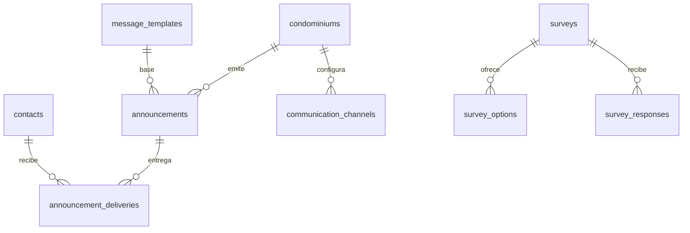
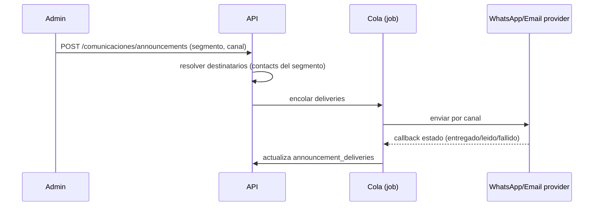
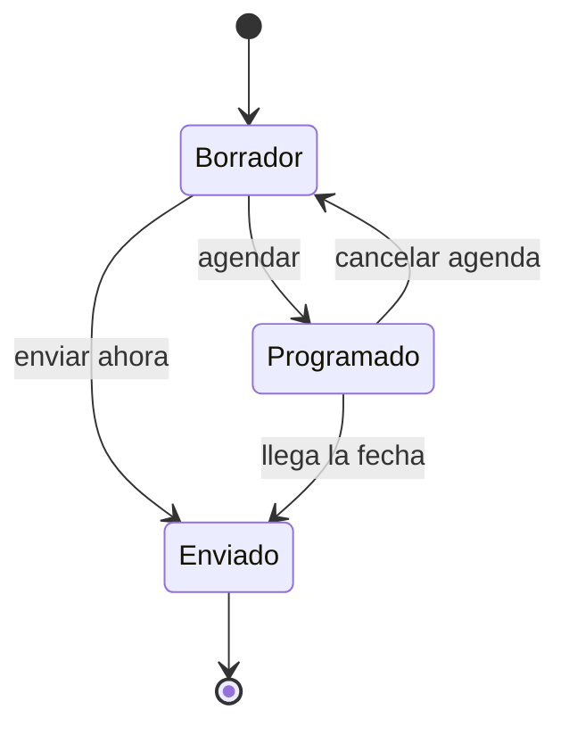

# Feature: Comunicaciones

> **WIP**. Pantallas en [[_RESEARCH_pantallas-mvp]] §4·6; modelo en [[_RESEARCH_modelo-datos]] §12. WhatsApp como canal de primera clase (mercado colombiano).

## 1. Resumen y motivación
Canal oficial admin→residentes: comunicados masivos segmentados (WhatsApp/email/push), cartelera digital, plantillas y encuestas/votaciones no vinculantes. Reduce conflictos y centraliza la información del conjunto.

## 2. Capas afectadas
- [x] API — módulo `src/Comunicaciones`
- [x] Web
- [ ] App (consumo: muro y encuestas — fuera del alcance API+Web de esta tanda)

## 3. Características principales
- Comunicados con segmentación (todos / torre / morosos / unidad) y multicanal.
- Métricas de entrega y lectura por canal.
- Cartelera (comunicados fijados) y plantillas reutilizables.
- Encuestas con resultados en tiempo real.
- Integración WhatsApp (Meta API/WATI), email y push configurable por conjunto.

## 4. Relaciones con otras features
- Depende de: **Directorio** (destinatarios = `contacts`), **RBAC** (`comunicaciones.*`).
- Es consumido por: **Cobranza** (recordatorios de pago), **Incidencias/PQRS** (#14), **Asambleas** (#19, convocatorias).

## 5. Inventario de pantallas

### Web
| Pantalla | Tipo | Descripción |
|---|---|---|
| Bandeja de comunicados | Página | Enviados/programados con métricas |
| Redactar comunicado | Página | Editor + IA, segmentación, canal |
| Detalle de comunicado | Drawer | Contenido + estadísticas por canal |
| Cartelera / muro | Página | Avisos fijados |
| Plantillas | Página | Reutilizables (convocatoria, recordatorio…) |
| Encuestas | Página | Crear/gestionar encuestas |
| Resultados de encuesta | Drawer | Resultados en tiempo real |
| Configurar canales | Página | WhatsApp (Meta/WATI), email, push |

## 6. Modelo de datos

### 6.1 Entidades
| Entidad | Nueva/Existente | Descripción |
|---|---|---|
| `announcements` | Nueva | Comunicado / cartelera |
| `announcement_deliveries` | Nueva | Entrega por canal y métrica de lectura |
| `communication_channels` | Nueva | Config de WhatsApp/email/push del conjunto |
| `message_templates` | Nueva | Plantillas |
| `surveys` | Nueva | Encuesta |
| `survey_options` | Nueva | Opción |
| `survey_responses` | Nueva | Respuesta (1 por contacto) |

### 6.2 Diccionario (campos clave · Valor/Referencia)
**`announcements`** — `condominium_id` (Ref), `autor_user_id` (Ref→users, actor ADR-001), `titulo`/`cuerpo` (Valor), `segmento` (Valor enum: todos|torre|morosos|unidad), `target_id` (Ref polimórfica, NULL si todos), `estado` (Valor enum: borrador|programado|enviado), `programado_para` (Valor), `fijado` (Valor bool).
**`announcement_deliveries`** — `announcement_id` (Ref), `contact_id` (Ref→contacts, party), `canal` (Valor enum: whatsapp|email|push), `estado` (Valor enum: enviado|entregado|leido|fallido).
**`communication_channels`** — `condominium_id` (Ref), `canal` (Valor), `config` (Valor JSONB: credenciales), `activo` (Valor).
**`message_templates`** — `condominium_id` (Ref), `nombre`/`tipo`/`cuerpo` (Valor).
**`surveys`** — `condominium_id` (Ref), `pregunta` (Valor), `tipo` (Valor), `cierra_el` (Valor).
**`survey_options`** — `survey_id` (Ref), `texto` (Valor).
**`survey_responses`** — `survey_id` (Ref), `contact_id` (Ref), `option_id` (Ref). UNIQUE(survey,contact).

### 6.3 Diagrama ER

### 6.4 Envío de comunicado (secuencia)

## 7. Mapeo de acciones a endpoints
| Acción | Pantalla | Verbo | Endpoint |
|---|---|---|---|
| Listar comunicados | Bandeja | GET | `/comunicaciones/announcements` |
| Crear/programar | Redactar | POST | `/comunicaciones/announcements` |
| Ver métricas | Detalle | GET | `/comunicaciones/announcements/:id` |
| CRUD plantillas | Plantillas | * | `/comunicaciones/templates` |
| Crear encuesta | Encuestas | POST | `/comunicaciones/surveys` |
| Resultados | Resultados | GET | `/comunicaciones/surveys/:id/results` |
| Configurar canal | Canales | PUT | `/comunicaciones/channels` |

## 8. Reglas de negocio globales
- Segmentación se resuelve a `contacts` en el momento del envío (snapshot de destinatarios).
- "Morosos" se calcula con Cobranza (cuentas vencidas) — dependencia opcional; si Cobranza no está, el segmento se deshabilita.
- Envío respeta `communication_channels.activo`; si WhatsApp no está configurado, cae a email.
- Encuestas: 1 respuesta por `contact` (UNIQUE); no vinculantes (distintas de votaciones de asamblea #19).

## 9. Estados de un comunicado

## 10. Endpoints
| Endpoint | Detalle |
|---|---|
| `/comunicaciones/*` | [[01-api/endpoints/COMUNICACIONES]] |

## 11. Orden de implementación
API (tablas + jobs de envío + webhook de estado) → Web. Requiere Directorio y RBAC.

## 12. Especificaciones técnicas
| Proyecto | Spec | UI | Estado |
|---|---|---|---|
| API | [[01-api/endpoints/COMUNICACIONES]] | — | Implementado (migraciones + DDD + 13 rutas + 17 tests) |
| Web | [[02-web/features/comunicaciones/COMUNICACIONES_SPEC]] | `COMUNICACIONES_UI_*` | Implementado (4 páginas, 5 componentes, 4 hooks, 32 tests, build OK) |
| App | — | — | Pendiente (fuera del alcance de esta tanda) |

## 13. Estado de sincronización

Ver [[CHANGES_LOG]] — entrada CAMBIO-009 (implementación de Comunicaciones).

## 14. Checklist de coherencia

- [x] Nombres de campos consistentes con [[GLOSSARY]] — "Comunicaciones" ya resuelto; `announcement`/`delivery`/`survey` no colisionan con términos existentes
- [x] Inventario de pantallas (§5) agregado en [[FEATURES_INDEX]] catálogo de pantallas
- [x] Modelo de datos (§6): cada campo declara **Valor o Referencia**; las nuevas tablas respetan las convenciones de [[01-api/API_DATABASE]] (PK UUID v7, FK `{tabla_singular}_id`, timestamps, soft delete)
- [x] Mapeo de acciones a endpoints (§7) coherente con [[01-api/API_CONTRACT]]
- [x] Códigos de error nuevos agregados a [[01-api/API_CONTRACT]] §"Códigos de Error Completos" — `NO_ACTIVE_CHANNEL`, `ALREADY_ANSWERED`, `SURVEY_CLOSED`, `MOROSOS_REQUIRES_COBRANZA`
- [x] Web: SPEC y UI creados en `02-web/features/comunicaciones/`
- [x] App: SPEC y UI pendientes de crear en `03-app/features/comunicaciones/` (diferido hasta iniciar App)
- [x] Dependencias satisfechas: Directorio (`contacts`) y RBAC (`comunicaciones.*`) implementados
- [x] API: endpoint `GET /surveys` agregado (listar encuestas)

## 15. Checklist de creación

- [x] Fila presente en [[FEATURES_INDEX]] tabla de estado (feature #6, estado "En progreso")
- [x] Entrada abierta en [[CHANGES_LOG]] — CAMBIO-009
- [x] API: endpoint doc creado en `01-api/endpoints/COMUNICACIONES.md`
- [x] Web: `COMUNICACIONES_SPEC.md` y 8 `COMUNICACIONES_UI_*.md` creados en `02-web/features/comunicaciones/`
- [ ] App: `COMUNICACIONES_SPEC.md` y `COMUNICACIONES_UI_*.md` por crear en `03-app/features/comunicaciones/` (diferido)
- [x] API: implementada (7 migraciones, módulo DDD, 14 rutas, 22 tests pasando)
- [x] Web: implementada (4 páginas, 5 componentes, 4 hooks, 32 tests; build+lint+type-check OK)
