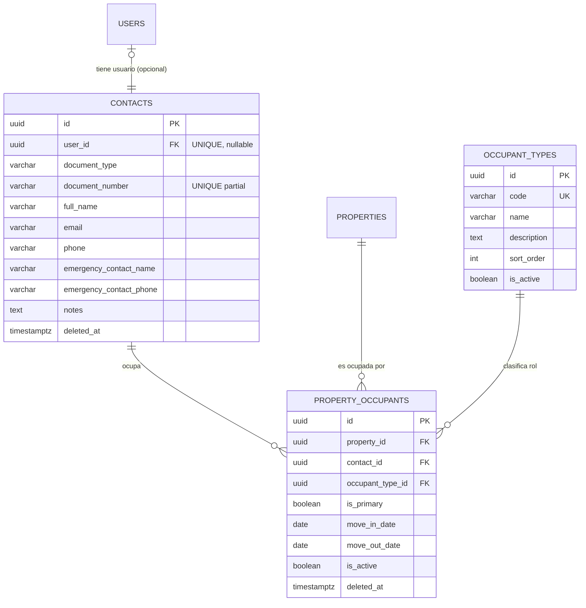
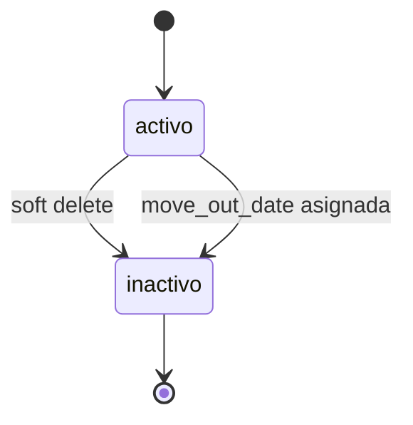

# Feature: Directorio (Residentes y Propietarios)

> [!warning] Diseño listo para implementar
> Este panorama contiene el diseño definitivo del feature. El agente `@api-build` debe leerlo completo antes de generar migraciones, modelos y endpoints.

## 1. Resumen y motivación

Gestiona el censo completo de personas vinculadas a cada unidad del conjunto: propietarios, residentes, inquilinos, familiares y contactos de emergencia. Es un **requisito legal** (Ley 675 de 2001 — libro de propietarios) y la base de todos los features que requieren identificar personas por unidad (cobranza, control de acceso, comunicaciones, asambleas).

**Objetivo de diseño:** separar la **persona física** (`contacts`) de su **relación con la unidad** (`property_occupants`), permitiendo que una misma persona tenga múltiples roles en múltiples unidades, y que existan personas registradas sin usuario del sistema (propietarios que no usan la plataforma). La columna actual `users.unit` se deprecia en favor de esta tabla de relación.

## 2. Capas afectadas

- [x] API (origen del contrato)
- [x] Web
- [x] App

## 3. Características principales

- **Personas como entidad independiente**: `contacts` almacena datos personales (documento de identidad, nombre, teléfono, email) desacoplada de `users` y de `properties`
- **Vinculación opcional con usuario**: `contacts.user_id` nullable — una persona puede estar en el directorio sin tener acceso al sistema
- **Tipos de ocupante configurables** desde catálogo (`occupant_types`): propietario, residente, inquilino, familiar, contacto de emergencia, empleado — el admin puede agregar más
- **Multi-unidad**: una persona puede ocupar múltiples unidades con diferentes roles
- **Multi-rol por unidad**: una persona puede tener varios roles en la misma unidad (ej: propietario + residente)
- **Relación temporal**: fechas de ingreso y salida (`move_in_date`, `move_out_date`) para historial de ocupación
- **Contacto principal**: flag `is_primary` para designar el contacto principal por rol dentro de una unidad
- **Historial de ocupación**: soft delete en `property_occupants` + fechas permite reconstruir quién ha vivido en cada unidad
- **Deprecación de `users.unit`**: la columna actual se mantiene por compatibilidad pero deja de ser fuente de verdad; se migra via `POST /migrations/deprecate-unit` (post-MVP)

## 4. Relaciones con otras features

- **Depende de:** [[00-shared/features/PROPIEDADES]] (Feature #2) → `properties.id` debe existir antes de poder asignar ocupantes
- **Depende de:** [[00-shared/features/AUTH]] → `users.id` existe como FK opcional; solo admins gestionan el directorio; los endpoints requieren autenticación JWT
- **Es consumido por (features futuros):**
  - Cobranza (#7) → propietario responsable de pago vinculado a unidad
  - Control de Acceso / Portería (#12) → residente destino de visitas
  - Comunicaciones (#6) → destinatarios por unidad
  - Asambleas y Votaciones (#19) → propietarios con derecho a voto
  - Portal Residente (#13) → perfil del residente y su unidad
  - Reportes (#16) → censo, ocupación, morosidad por propietario

> Nota: estos enlaces se activarán cuando se creen los panoramas respectivos.

## 5. Inventario de pantallas

### Web

| Pantalla | Tipo | Descripción |
|---|---|---|
| Directorio general | Página | Tabla con todos los ocupantes, filtros por unidad, tipo, nombre, documento, búsqueda texto libre |
| Detalle de contacto | Drawer | Info del contacto + lista de unidades donde está registrado con roles y fechas |
| Crear / editar contacto | Modal | Formulario con datos personales: documento, nombre, email, teléfono, contactos de emergencia, notas |
| Vincular contacto a unidad | Modal | Selector de unidad + tipo de ocupante + flag primary + fechas de ingreso/salida |
| Vista por unidad | Página | Tarjeta de unidad con todos sus ocupantes listados por tipo (propietario, residentes, inquilinos, etc.) |
| Historial de ocupantes por unidad | Drawer | Timeline de quién ha vivido/ocupado la unidad (con fechas de ingreso y salida) |
| Gestionar tipos de ocupante | Página | Catálogo de tipos (admin): crear, editar, desactivar |
| Importar directorio | Página | Carga masiva desde Excel/CSV *(post-MVP)* |
| Migrar desde users.unit | Página | Herramienta de migración de datos antiguos *(post-MVP)* |

### App

| Pantalla | Tipo | Descripción |
|---|---|---|
| Mi unidad — Ocupantes | Screen | Quiénes viven en mi unidad (solo residentes activos, agrupados por tipo) |
| Mi perfil de contacto | Screen | Editar mi info de contacto personal (nombre, email, teléfono, contacto de emergencia) |
| Contacto de emergencia de mi unidad | Screen | Número de contacto de emergencia configurado para la unidad (solo lectura) |

---

## 6. Modelo de datos / diccionario de campos

> Puente entre el diseño y el esquema de BD. Define las **3 tablas** que el feature introduce y, para cada campo, si es **valor** (columna inline) o **referencia** (FK a otra entidad).

### 6.1 Entidades del feature

| Entidad (tabla) | Nueva / Existente | Descripción |
|---|---|---|
| `contacts` | **Nueva** | Personas en el directorio. Separada de `users` para contemplar personas sin acceso al sistema |
| `occupant_types` | **Nueva** | **Catálogo configurable** de tipos de ocupante (propietario, residente, inquilino, familiar, contacto_emergencia, empleado, …) |
| `property_occupants` | **Nueva** | **Tabla central**. Vincula un contacto a una unidad con un rol específico y fechas |
| `users` | **Existente** | Se agrega FK opcional `contacts.user_id → users.id` (UNIQUE). `users.unit` se deprecia |

### 6.2 Diccionario de campos

**`contacts`**

| Campo | Tipo | Req | Valor o Referencia | Catálogo / FK | Reglas / Notas |
|---|---|---|---|---|---|
| `id` | UUID v7 | sí | Valor | — | PK |
| `user_id` | UUID v7 | no | **Referencia** | `→ users.id` | **UNIQUE** cuando no es NULL. Una persona puede tener o no usuario del sistema |
| `document_type` | VARCHAR(20) | sí | Valor | — | CC, NIT, CE, Pasaporte, Otro. Validación por enum en la app |
| `document_number` | VARCHAR(30) | sí | Valor | — | Número de identificación. UNIQUE partial (WHERE `deleted_at` IS NULL) |
| `full_name` | VARCHAR(255) | sí | Valor | — | Nombre completo de la persona |
| `email` | VARCHAR(255) | no | Valor | — | Email personal (no necesariamente el del usuario del sistema) |
| `phone` | VARCHAR(20) | no | Valor | — | Teléfono móvil o fijo |
| `emergency_contact_name` | VARCHAR(255) | no | Valor | — | Nombre del contacto de emergencia |
| `emergency_contact_phone` | VARCHAR(20) | no | Valor | — | Teléfono del contacto de emergencia |
| `notes` | TEXT | no | Valor | — | Notas internas de administración sobre la persona |
| `created_at`, `updated_at` | timestamptz | sí | Valor | — | automáticos |
| `deleted_at` | timestamptz | no | Valor | — | soft delete |

> **Decisión:** `document_type` es **Valor** (VARCHAR con validación en app) porque los tipos de documento colombianos son estables (CC, NIT, CE, Pasaporte) y los catálogos se limitan a dominios que el admin necesita configurar. Si en el futuro se require que el admin agregue tipos de documento, se promueve a catálogo.

> **Restricción:** `user_id` es UNIQUE cuando no es NULL para garantizar que un usuario del sistema corresponde a exactamente una persona en el directorio. Una persona sin usuario tiene `user_id = NULL`.

> **Restricción:** `document_number` tiene un unique index parcial `WHERE deleted_at IS NULL` para evitar duplicados de personas activas, permitiendo reutilizar un número de documento de una persona eliminada (soft delete).

---

**`occupant_types`** (catálogo configurable)

| Campo | Tipo | Req | Valor o Referencia | Catálogo / FK | Reglas / Notas |
|---|---|---|---|---|---|
| `id` | UUID v7 | sí | Valor | — | PK |
| `code` | VARCHAR(20) | sí | Valor | — | Código interno. UNIQUE. Ej: "propietario", "residente" |
| `name` | VARCHAR(100) | sí | Valor | — | Nombre visible. Ej: "Propietario", "Residente" |
| `description` | TEXT | no | Valor | — | Descripción opcional del tipo |
| `sort_order` | INTEGER | sí | Valor | — | DEFAULT 0. Orden de visualización |
| `is_active` | BOOLEAN | sí | Valor | — | DEFAULT TRUE. Para desactivar tipos sin eliminar |
| `created_at`, `updated_at` | timestamptz | sí | Valor | — | automáticos |

**Seed data:**

| code | name | sort_order |
|---|---|---|
| `propietario` | Propietario | 1 |
| `residente` | Residente | 2 |
| `inquilino` | Inquilino | 3 |
| `familiar` | Familiar | 4 |
| `contacto_emergencia` | Contacto de Emergencia | 5 |
| `empleado` | Empleado(a) Doméstico(a) | 6 |

> El admin puede crear nuevos tipos (ej: "inversionista", "heredero") sin tocar código. Un tipo desactivado no puede asignarse a nuevas relaciones pero las existentes lo conservan.

---

**`property_occupants`** (tabla central)

| Campo | Tipo | Req | Valor o Referencia | Catálogo / FK | Reglas / Notas |
|---|---|---|---|---|---|
| `id` | UUID v7 | sí | Valor | — | PK |
| `property_id` | UUID v7 | sí | **Referencia** | `→ properties.id` | Unidad a la que pertenece la relación |
| `contact_id` | UUID v7 | sí | **Referencia** | `→ contacts.id` | Persona vinculada |
| `occupant_type_id` | UUID v7 | sí | **Referencia** | `→ occupant_types.id` | Rol que desempeña en esa unidad |
| `is_primary` | BOOLEAN | sí | Valor | — | DEFAULT FALSE. ¿Es el contacto principal para este rol en la unidad? |
| `move_in_date` | DATE | no | Valor | — | Fecha de mudanza o ingreso |
| `move_out_date` | DATE | no | Valor | — | Fecha de mudanza o salida. NULL si sigue activo |
| `is_active` | BOOLEAN | sí | Valor | — | DEFAULT TRUE. Si la relación está actualmente vigente |
| `created_at`, `updated_at` | timestamptz | sí | Valor | — | automáticos |
| `deleted_at` | timestamptz | no | Valor | — | soft delete |

**Restricciones:**
- UNIQUE(`property_id`, `contact_id`, `occupant_type_id`) WHERE `deleted_at` IS NULL — una persona no puede tener el mismo rol dos veces en la misma unidad
- FK a `properties.id`, `contacts.id`, `occupant_types.id`
- `is_primary`: se permite máximo un primary por combinación `property_id` + `occupant_type_id`. Se valida en la capa de aplicación, no con constraint de BD (para evitar complejidad con soft deletes concurrentes)

> **Implementar en PostgreSQL como partial unique index:**
> ```sql
> CREATE UNIQUE INDEX idx_property_occupants_unique
> ON property_occupants(property_id, contact_id, occupant_type_id)
> WHERE deleted_at IS NULL;
> ```

> **Regla de negocio:** Una unidad debe tener al menos un propietario activo en todo momento (Ley 675 de 2001). El API debe validar que no se elimine el último propietario de una unidad sin asignar uno nuevo.

**Índices recomendados:**
- UNIQUE(`property_id`, `contact_id`, `occupant_type_id`) WHERE `deleted_at` IS NULL — partial unique index
- INDEX(`property_id`, `is_active`) — consultas de ocupantes activos por unidad
- INDEX(`contact_id`, `is_active`) — consultas de unidades de una persona
- INDEX(`property_id`, `occupant_type_id`) — filtrar por tipo dentro de unidad
- INDEX(`deleted_at`) — soft delete

### 6.3 Diagrama ER (Mermaid)



### 6.4 Decisiones de modelado (valor vs entidad) — el punto clave

| Decisión | Opción tomada | Alternativa descartada | Fundamento |
|---|---|---|---|
| `contacts` separada de `users` | ✅ Tabla propia | Extender `users` con más columnas | Personas sin usuario del sistema deben existir (Ley 675). `users` tiene semántica de login; `contacts` tiene semántica de censo. La separación permite que el equipo de Auth evolucione independientemente |
| `user_id` nullable + UNIQUE | ✅ FK opcional con UNIQUE constraint | FK obligatoria + tabla pivot `contact_user` | Una persona tiene 0 o 1 usuario. La UNIQUE garantiza integridad. Una tabla pivot añadiría complejidad innecesaria para una relación 1:1 |
| `occupant_types` como catálogo | ✅ Tabla catálogo configurable | ENUM PostgreSQL | El admin debe poder agregar nuevos tipos de ocupante sin deploy. Seed de 6 tipos estándar |
| `document_type` como valor | ✅ VARCHAR(20) con validación en app | Catálogo `document_types` | Los tipos de documento colombianos son estables (CC, NIT, CE, Pasaporte) y no requieren configuración del admin. Si en el futuro se necesitara que el admin agregue tipos, se promueve a catálogo |
| `document_number` UNIQUE parcial | ✅ Partial unique index (`deleted_at IS NULL`) | UNIQUE simple | Permite soft-deletear un contacto y reutilizar su número de documento (ej: persona que se mudó y años después otra persona con el mismo documento ingresa al conjunto) |
| `is_primary` sin constraint de BD | ✅ Validación en capa de aplicación | CHECK constraint con triggers | El soft delete + concurrencia hace que un constraint de BD sea frágil. La app valida y garantiza máximo un primary por property + occupant_type |
| `move_in_date` / `move_out_date` como valor | ✅ DATE inline | Tabla separada `occupancy_history` | La mayoría de consultas necesitan solo las fechas actuales. El historial se reconstruye con soft deletes y cambios de `is_active`. Si el historial largo fuera un requisito primario, se promueve a tabla separada |
| `users.unit` deprecada | ✅ Se mantiene por compatibilidad, deja de ser fuente de verdad | Eliminación inmediata | Migración de datos requiere coordinación con features existentes. Se depreca primero (deja de escribirse) y se migra post-MVP via endpoint dedicado |

## 7. Mapeo de acciones a endpoints

### Contactos

| Acción del usuario | Pantalla | Verbo | Endpoint |
|---|---|---|---|
| Listar contactos con filtros | Directorio general | GET | `/contacts` |
| Crear contacto | Modal crear contacto | POST | `/contacts` |
| Ver detalle de contacto | Detalle de contacto | GET | `/contacts/{id}` |
| Editar contacto | Modal editar contacto | PATCH | `/contacts/{id}` |
| Eliminar contacto (soft) | — (confirmación) | DELETE | `/contacts/{id}` |
| Ver propiedades de un contacto | Detalle de contacto | GET | `/contacts/{id}/properties` |

### Tipos de ocupante (catálogo)

| Acción del usuario | Pantalla | Verbo | Endpoint |
|---|---|---|---|
| Listar tipos de ocupante | Gestionar tipos | GET | `/occupant-types` |
| Crear tipo de ocupante | Gestionar tipos | POST | `/occupant-types` |
| Editar tipo de ocupante | Gestionar tipos | PATCH | `/occupant-types/{id}` |
| Desactivar tipo de ocupante | Gestionar tipos | DELETE | `/occupant-types/{id}` |

### Vinculación de ocupantes

| Acción del usuario | Pantalla | Verbo | Endpoint |
|---|---|---|---|
| Vincular contacto a unidad | Modal vincular | POST | `/properties/{propertyId}/occupants` |
| Listar ocupantes de unidad | Vista por unidad | GET | `/properties/{propertyId}/occupants` |
| Actualizar vínculo ocupante | Modal editar vínculo | PATCH | `/property-occupants/{id}` |
| Eliminar vínculo ocupante (soft) | — (confirmación) | DELETE | `/property-occupants/{id}` |

### Migración

| Acción del usuario | Pantalla | Verbo | Endpoint |
|---|---|---|---|
| Migrar datos de `users.unit` | Migración | POST | `/migrations/deprecate-unit` |

## 8. Reglas de negocio globales

### Sobre el directorio de personas

1. **Propietario mínimo por unidad** (Ley 675 de 2001): toda unidad debe tener al menos un ocupante de tipo `propietario` activo en todo momento. El API debe validar que no se elimine o desactive el último propietario de una unidad.
2. **Documento único**: no pueden existir dos contactos activos con el mismo tipo y número de documento. El partial unique index `WHERE deleted_at IS NULL` protege esta regla.
3. **Vinculación usuario-persona**: un `user_id` solo puede asociarse a un `contact`. Si se intenta asociar un usuario que ya está vinculado a otro contacto, el API rechaza la operación con error `USER_ALREADY_LINKED`.
4. **Persona sin usuario**: permitida. El contacto existe en el directorio pero no puede iniciar sesión. Cuando se cree un usuario y esa persona ya exista como contacto, se actualiza `contacts.user_id` para vincularlos.
5. **Solo admins** pueden crear, editar o eliminar contactos y vínculos. Los residentes ven su propia unidad y pueden editar su propio perfil de contacto (ciertos campos).

### Sobre la ocupación de unidades

6. **Multi-rol permitido**: una persona puede tener varios roles en la misma unidad. Ej: propietario + residente + contacto_emergencia. Cada combinación property+contact+type es única.
7. **Multi-unidad permitida**: una persona puede ocupar varias unidades (ej: propietario de 3 apartamentos).
8. **Propietario no necesariamente residente**: un propietario puede no vivir en la unidad que posee (ej: inversionista que arrienda).
9. **Residente no necesariamente propietario**: un inquilino es residente sin ser propietario.
10. **Primary por rol**: solo puede haber un contacto principal (`is_primary = TRUE`) por combinación `property_id` + `occupant_type_id`. Al marcar uno como primary, los demás se establecen automáticamente como `FALSE` (manejado en la app, no en BD).

### Sobre fechas y vigencia

11. **`move_out_date` implica `is_active = FALSE`**: si se establece una fecha de salida, el sistema debe marcar automáticamente `is_active = FALSE`.
12. **`move_out_date` debe ser ≥ `move_in_date`**: validación en API.
13. **Historial preservado**: los soft deletes y las fechas permiten reconstruir la línea de tiempo de ocupación de cualquier unidad.

### Sobre la migración de `users.unit`

14. **`users.unit` deja de escribirse**: desde la implementación de este feature, ningún endpoint nuevo escribe en `users.unit`. Solo se lee para compatibilidad con código legacy.
15. **Endpoint de migración**: `POST /migrations/deprecate-unit` recorre `users` donde `unit IS NOT NULL`, crea los contactos y vínculos correspondientes, y marca la migración como completada. Se ejecuta post-MVP.

### Sobre catálogos configurables

16. **Protección de seed data**: los tipos del seed (`propietario`, `residente`, `inquilino`, `familiar`, `contacto_emergencia`, `empleado`) no deberían poder eliminarse (soft delete sí, hard delete no). El API debe validar que un tipo en uso no se desactive si hay ocupantes activos que lo referencian.
17. **Código único**: el `code` de `occupant_types` es UNIQUE y no debe cambiarse después de creado (o se cambia solo si no hay referencias).

## 9. Estados del recurso

### Estados de un contacto

```
contact: activo → eliminado (soft delete)
```

### Estados de un vínculo ocupante (`property_occupants`)

```
vinculo: activo → inactivo (soft delete o move_out_date)
```

El ciclo de vida de un vínculo:



Donde:
- **activo** (`is_active = TRUE`): la persona actualmente ocupa/está vinculada a la unidad con ese rol
- **inactivo** (`is_active = FALSE` o `deleted_at` no NULL): la relación terminó (mudanza, desvinculación, etc.)

El historial no se pierde: soft delete + `move_in_date`/`move_out_date` preservan la línea de tiempo completa.

### Estados de un tipo de ocupante

```
occupant_type: activo → inactivo (desactivación, no delete físico)
```

## 10. Endpoints

| Endpoint | Sección en API_CONTRACT | Documento de detalle |
|---|---|---|
| `GET /contacts` | §Contactos | `01-api/endpoints/CONTACTS.md` |
| `POST /contacts` | §Contactos | `01-api/endpoints/CONTACTS.md` |
| `GET /contacts/{id}` | §Contactos | `01-api/endpoints/CONTACTS.md` |
| `PATCH /contacts/{id}` | §Contactos | `01-api/endpoints/CONTACTS.md` |
| `DELETE /contacts/{id}` | §Contactos | `01-api/endpoints/CONTACTS.md` |
| `GET /contacts/{id}/properties` | §Contactos | `01-api/endpoints/CONTACTS.md` |
| `GET /occupant-types` | §Catálogos | `01-api/endpoints/OCCUPANT_CATALOGS.md` |
| `POST /occupant-types` | §Catálogos | `01-api/endpoints/OCCUPANT_CATALOGS.md` |
| `PATCH /occupant-types/{id}` | §Catálogos | `01-api/endpoints/OCCUPANT_CATALOGS.md` |
| `DELETE /occupant-types/{id}` | §Catálogos | `01-api/endpoints/OCCUPANT_CATALOGS.md` |
| `GET /properties/{propertyId}/occupants` | §Ocupantes | `01-api/endpoints/PROPERTY_OCCUPANTS.md` |
| `POST /properties/{propertyId}/occupants` | §Ocupantes | `01-api/endpoints/PROPERTY_OCCUPANTS.md` |
| `PATCH /property-occupants/{id}` | §Ocupantes | `01-api/endpoints/PROPERTY_OCCUPANTS.md` |
| `DELETE /property-occupants/{id}` | §Ocupantes | `01-api/endpoints/PROPERTY_OCCUPANTS.md` |
| `POST /migrations/deprecate-unit` | §Migración | `01-api/endpoints/MIGRATIONS.md` |

> El detalle request/response se documenta en los archivos indicados al implementar. Este panorama solo **cita**, nunca duplica.

## 11. Orden de implementación

1. **API — Migraciones y seed**: crear las 3 tablas con sus migraciones + seed de `occupant_types`
2. **API — Endpoints de catálogo** (`occupant-types`): CRUD primero porque son datos de referencia
3. **API — Endpoints de contactos** (`contacts`): CRUD con validación de documento único
4. **API — Endpoints de ocupantes** (`property-occupants`): CRUD con validación de propietario mínimo
5. **Web — Pantalla de gestión de tipos de ocupante**
6. **Web — Pantallas de contacto** (directorio general, crear/editar, detalle)
7. **Web — Pantallas de vinculación** (vincular a unidad, vista por unidad, historial)
8. **App — Pantalla de mi unidad** (solo lectura, ocupantes activos)
9. **App — Pantalla de mi perfil de contacto** (edición de datos personales)
10. **API + Web — Endpoint de migración de `users.unit`** (post-MVP)

## 12. Seed data plan

### Tipos de ocupante (6 registros)

| code | name | sort_order |
|---|---|---|
| `propietario` | Propietario | 1 |
| `residente` | Residente | 2 |
| `inquilino` | Inquilino | 3 |
| `familiar` | Familiar | 4 |
| `contacto_emergencia` | Contacto de Emergencia | 5 |
| `empleado` | Empleado(a) Doméstico(a) | 6 |

### Directorio de ejemplo (si aplica para desarrollo)

No se crean contactos ni ocupantes de ejemplo en seed porque:
- Los contactos son datos personales reales (nombres, documentos) que no deben poblarse automáticamente
- La relación con unidades requiere que existan propiedades, que se crean en el seed de Propiedades

Un script de `dev-seed` puede crear contactos y ocupantes de prueba si el entorno de desarrollo lo requiere, pero no forma parte de las migraciones.

## 13. Especificaciones técnicas por proyecto

| Proyecto | Spec técnico | Diseño visual | Estado |
|---|---|---|---|
| API | `01-api/endpoints/DIRECTORIO.md` | — | ✅ Implementado (11 endpoints, ver sesión api-build) |
| Web | `02-web/features/directorio/DIRECTORIO_SPEC.md` | `02-web/features/directorio/DIRECTORIO_UI_*.md` | ✅ Implementado (3 páginas, ver sesión web-build) |
| App | `03-app/features/directorio/DIRECTORIO_SPEC.md` | `03-app/features/directorio/DIRECTORIO_UI_*.md` | ⏸ Diseñado, pendiente de implementar |

## 14. Estado de sincronización

Ver [[CHANGES_LOG]] — entrada CAMBIO-005 (Diseño e implementación del Directorio).

## 15. Checklist de coherencia

- [x] Nombres de campos consistentes con [[GLOSSARY]]
- [ ] Inventario de pantallas (§5) agregado en [[FEATURES_INDEX]] catálogo de pantallas *(pendiente)*
- [x] Modelo de datos (§6): cada campo declara **Valor o Referencia**; las nuevas tablas respetan las convenciones de [[01-api/API_DATABASE]]
- [x] Mapeo de acciones a endpoints (§7) coherente con [[01-api/endpoints/DIRECTORIO]] *(verificado al implementar)*
- [ ] Códigos de error nuevos agregados a [[01-api/API_CONTRACT]] §"Códigos de Error Completos" *(pendiente)*
- [x] Decisión consciente sobre catálogo configurable y separación contacts/users documentada en §6.4
- [ ] Cada proyecto afectado tiene una sesión planeada en su `*_IMPLEMENTATION_PLAN.md` *(pendiente)*
- [x] Deprecación de `users.unit` documentada con plan de migración

## 16. Checklist de creación

- [x] Fila presente en [[FEATURES_INDEX]] tabla de estado (actualizado a "En progreso")
- [x] Entrada en [[CHANGES_LOG]] (CAMBIO-005)
- [x] Documento de panorama creado: `00-shared/features/DIRECTORIO.md`
- [x] API: creado `01-api/endpoints/DIRECTORIO.md` con 11 endpoints detallados (request/response)
- [ ] API: migraciones ejecutadas y seed de occupant_types completado
- [x] Web: creado `DIRECTORIO_SPEC.md` en `02-web/features/directorio/`
- [x] Web: implementadas 3 páginas (DirectorioPage, ContactoDetailPage, UnitOccupantsPage)
- [ ] App: crear `DIRECTORIO_SPEC.md` y `DIRECTORIO_UI_*.md` en `03-app/features/directorio/` *(pendiente)*
- [ ] Sesión planeada en cada `*_IMPLEMENTATION_PLAN.md` *(pendiente)*
