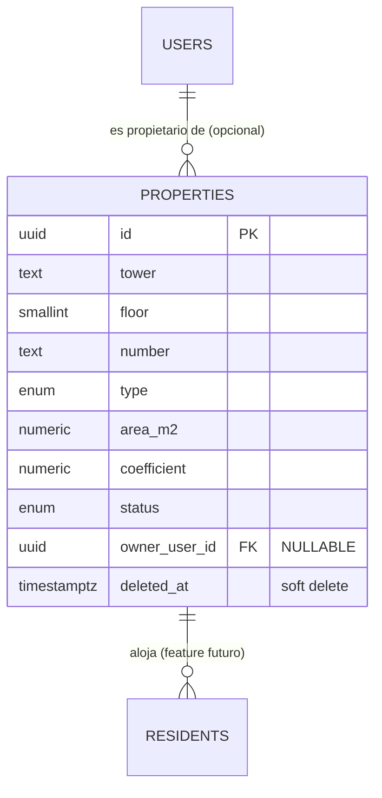
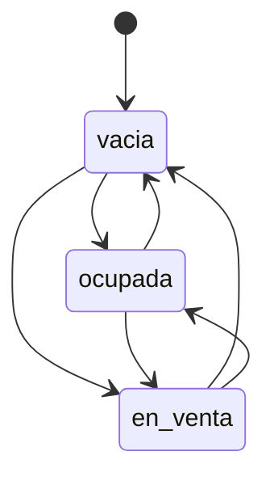

# Feature: Propiedades y unidades

> [!example] Documento de ejemplo del método
> Este panorama está escrito con la plantilla [[FEATURE_PLANNING_TEMPLATE]] **incluyendo la §6 Modelo de datos**.
> Sirve como referencia de cómo se documenta un feature antes de implementarlo, en especial cómo se
> decide explícitamente si un dato es **valor** o **referencia** (ver §6.4).

## 1. Resumen y motivación

Gestiona el inventario de torres, pisos y unidades del conjunto. Es el catálogo maestro del sistema — residentes, cuotas, pagos, mora y control de acceso dependen de que las unidades estén correctamente registradas. Sin este feature, ningún otro feature de negocio puede operar.

## 2. Capas afectadas

- [x] API (origen del contrato)
- [x] Web
- [x] App *(solo lectura para residentes)*

## 3. Características principales

- Registro de la estructura del conjunto: torres → pisos → unidades
- Atributos por unidad: área en m², coeficiente de copropiedad, tipo (apartamento, local, parqueadero, depósito), estado
- Historial de residentes asignados a cada unidad
- Gestión de estados de ocupación: ocupada, vacía, en venta

## 4. Relaciones con otras features

- **Depende de:** nada — es el feature base del sistema.
- **Es consumido por (features futuros, aún no documentados):** Residentes (asignación de unidades), Cuotas (cálculo por coeficiente), Pagos (referencia de unidad), Mora (unidades morosas), Visitantes (unidad destino), Vehículos (unidad propietaria), Reservas (reservas por unidad). Todos referenciarán `properties.id` vía FK `unit_id`.

> Nota: estos features se enlazarán con `[[ ]]` cuando se creen sus panoramas (uno a la vez). Hoy van como texto plano para no dejar enlaces colgantes.

## 5. Inventario de pantallas

### Web

| Pantalla | Tipo | Descripción breve |
|---|---|---|
| Lista de propiedades | Página | Tabla de unidades por torre con filtros y búsqueda |
| Detalle de unidad | Drawer | Info de la unidad: área, coeficiente, estado, residente actual |
| Crear / editar unidad | Modal | Formulario: torre, piso, número, área, coeficiente, tipo |
| Cambiar estado de unidad | Modal | Dropdown: ocupada / vacía / en venta + confirmación |
| Eliminar unidad | Modal | Confirmación destructiva con advertencia de dependencias |

### App

| Pantalla | Tipo | Descripción breve |
|---|---|---|
| Lista de unidades | Screen | Vista de la lista de unidades del conjunto |
| Detalle de unidad | BottomSheet | Info básica de la unidad |

---

## 6. Modelo de datos / diccionario de campos

> Puente entre el diseño y el esquema de BD. Define las tablas que el feature introduce y, para cada campo, si es **valor** (columna inline) o **referencia** (FK a otra entidad).

### 6.1 Entidades del feature

| Entidad (tabla) | Nueva / Existente | Descripción |
|---|---|---|
| `properties` | Nueva | Unidad del conjunto (apto, local, parqueadero, depósito). Tabla base del sistema. |

### 6.2 Diccionario de campos

**`properties`**

| Campo | Tipo | Req | Valor o Referencia | Catálogo / FK | Reglas / Notas |
|---|---|---|---|---|---|
| `id` | UUID v7 | sí | Valor | — | PK |
| `tower` | text (código corto) | sí | Valor | — | Torre/bloque. Ver decisión §6.4 |
| `floor` | smallint | sí | Valor | — | Piso de la unidad |
| `number` | text | sí | Valor | — | Identificador visible (ej. "302"). UNIQUE por (`tower`, `floor`, `number`) |
| `type` | enum `property_type` | sí | Valor (enum) | — | `apartamento` / `local` / `parqueadero` / `deposito` |
| `area_m2` | numeric(8,2) | sí | Valor | — | > 0 |
| `coefficient` | numeric(7,6) | sí | Valor | — | Coeficiente de copropiedad. La suma de todas las unidades debe dar el total configurado |
| `status` | enum `property_status` | sí | Valor (enum) | — | `ocupada` / `vacia` / `en_venta` |
| `owner_user_id` | UUID | no | **Referencia** | `→ users.id` (NULLABLE) | Propietario opcional vinculado a una cuenta |
| `created_at`, `updated_at` | timestamptz | sí | Valor | — | automáticos |
| `deleted_at` | timestamptz | no | Valor | — | soft delete |

### 6.3 Diagrama ER (Mermaid)

### 6.4 Decisiones de modelado (valor vs entidad) — el punto clave

- **`tower` / `floor` → atributos (Valor), no entidades, en el MVP.** Un conjunto tiene pocas torres y hoy una torre no carga datos propios más allá de su nombre. **Si** en el futuro una torre necesita atributos (nº de pisos, administrador, medidor) o se quiere un dropdown controlado, se promueve a tabla `towers` con FK `tower_id`. Queda registrado como decisión consciente, no como olvido.
- **`type` y `status` → enum (Valor).** Conjunto pequeño y fijo de valores; no justifican tabla catálogo ni CRUD propio.
- **Sin `ciudad` / `departamento` en `properties`.** El sistema administra **un solo conjunto**: la ubicación geográfica (si se requiere) son unos pocos campos en la configuración del conjunto (singleton), no un atributo por unidad ni un catálogo. **Si** el producto pasara a **multi-conjunto (SaaS)**, ciudad/departamento podrían justificar catálogos con FK — y esa decisión se tomaría aquí, explícitamente. *(Este es exactamente el tipo de decisión que, dejada implícita, hace que el agente la resuelva solo y de forma inconsistente entre capas.)*
- **`owner_user_id` → Referencia (FK a `users`, NULLABLE).** Un propietario es una entidad con identidad y ciclo de vida propio (login, contacto); se referencia, no se copia.

---

## 7. Mapeo de acciones a endpoints

| Acción del usuario | Pantalla | Verbo | Endpoint |
|---|---|---|---|
| Ver lista de unidades | Lista de propiedades | GET | `/properties` |
| Crear unidad | Modal crear/editar | POST | `/properties` |
| Ver detalle de unidad | Detalle de unidad (Drawer) | GET | `/properties/{id}` |
| Editar unidad | Modal crear/editar | PATCH | `/properties/{id}` |
| Eliminar unidad | Modal eliminar | DELETE | `/properties/{id}` |
| Cambiar estado | Modal cambiar estado | PATCH | `/properties/{id}/status` |

---

## 8. Reglas de negocio globales

- No se puede eliminar una unidad que tenga un residente activo asignado.
- Los coeficientes de todas las unidades de un conjunto deben sumar el total configurado (p. ej. 1.000). El sistema advierte si hay desajuste.
- Solo administradores pueden crear, editar o eliminar unidades.
- El estado "en venta" no impide que la unidad tenga un residente asignado — puede estar en venta y habitada simultáneamente.
- El coeficiente determina el valor de la cuota mensual de administración.

## 9. Estados del recurso

> Cualquier transición entre `ocupada`, `vacia` y `en_venta` es válida.

## 10. Endpoints

| Endpoint | Sección en API_CONTRACT | Documento de detalle |
|---|---|---|
| `GET /properties` | [[01-api/API_CONTRACT]] §Propiedades *(pendiente)* | `01-api/endpoints/PROPIEDADES.md` *(al implementar)* |
| `POST /properties` | idem | idem |
| `GET /properties/{id}` | idem | idem |
| `PATCH /properties/{id}` | idem | idem |
| `DELETE /properties/{id}` | idem | idem |
| `PATCH /properties/{id}/status` | idem | idem |

> El detalle request/response se documentará en `01-api/endpoints/PROPIEDADES.md` y se registrará en [[01-api/API_CONTRACT]] al implementar. Este panorama solo **cita**, nunca duplica.

## 11. Orden de implementación

API define y estabiliza el contrato → Web implementa primero (es panel de admin) → App implementa (solo lectura).

## 12. Especificaciones técnicas por proyecto

| Proyecto | Spec técnico | Diseño visual | Estado |
|---|---|---|---|
| Web | `02-web/features/propiedades/PROPIEDADES_SPEC.md` | `02-web/features/propiedades/PROPIEDADES_UI_*` | Por crear al implementar |
| App | `03-app/features/propiedades/PROPIEDADES_SPEC.md` | `03-app/features/propiedades/PROPIEDADES_UI_*` | Por crear al implementar |

## 13. Estado de sincronización

Ver [[CHANGES_LOG]] — entrada CAMBIO-002 (reinicio de diseños + introducción de §6 Modelo de datos).

## 14. Checklist de coherencia

- [x] Nombres de campos consistentes con [[GLOSSARY]]
- [ ] Inventario de pantallas (§5) agregado en [[FEATURES_INDEX]] catálogo de pantallas
- [x] Modelo de datos (§6): cada campo declara **Valor o Referencia**; `properties` respeta las convenciones de [[01-api/API_DATABASE]] y no duplica un concepto existente
- [ ] Mapeo de acciones a endpoints (§7) coherente con [[01-api/API_CONTRACT]] *(al implementar)*
- [ ] Códigos de error nuevos agregados a [[01-api/API_CONTRACT]] §"Códigos de Error Completos" *(al implementar)*
- [ ] Cada proyecto afectado tiene una sesión planeada en su `*_IMPLEMENTATION_PLAN.md`

## 15. Checklist de creación

- [x] Fila presente en [[FEATURES_INDEX]] tabla de estado
- [x] Entrada en [[CHANGES_LOG]] (CAMBIO-002)
- [ ] Web: crear `PROPIEDADES_SPEC.md` y `PROPIEDADES_UI_*.md` en `02-web/features/propiedades/` (al implementar)
- [ ] App: crear `PROPIEDADES_SPEC.md` y `PROPIEDADES_UI_*.md` en `03-app/features/propiedades/` (al implementar)
- [ ] Sesión planeada en cada `*_IMPLEMENTATION_PLAN.md`
