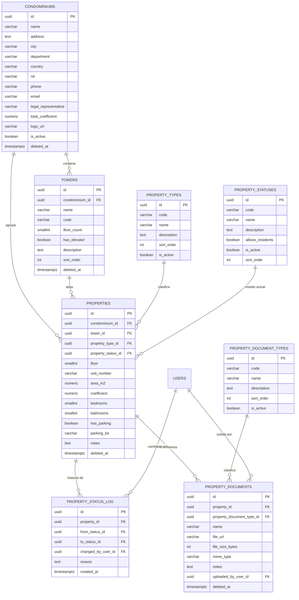
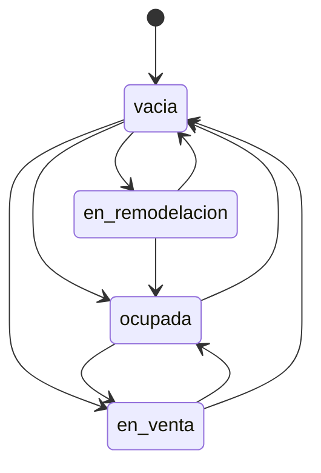

# Feature: Propiedades y Unidades

> [!warning] Diseño listo para implementar
> Este panorama contiene el diseño definitivo del feature. El agente `@api-build` debe leerlo completo antes de generar migraciones, modelos y endpoints.

## 1. Resumen y motivación

Gestiona el inventario físico del conjunto: las torres/edificios y las unidades que los componen. Es el **catálogo maestro** del sistema — todo feature de negocio (cobranza, pagos, residentes, visitantes, mantenimiento, reservas) referenciará `properties.id` vía FK `unit_id`. Sin este feature, ningún otro puede operar.

**Objetivo de diseño:** el esquema debe soportar **multi-conjunto desde el día 1** (aunque el MVP despliegue uno solo), tener **tipos y estados configurables** (no enums fijos), y llevar **auditoría histórica** de cada cambio.

## 2. Capas afectadas

- [x] API (origen del contrato)
- [x] Web
- [x] App *(solo lectura para residentes)*

## 3. Características principales

- Multi-conjunto: tabla `condominiums` como raíz de todo el inventario
- Estructura jerárquica: conjunto → torres → pisos → unidades
- **Tipos de unidad configurables** desde catálogo (`property_types`): apartamento, local comercial, parqueadero, depósito — el admin puede agregar más
- **Estados de unidad configurables** desde catálogo (`property_statuses`): ocupada, vacía, en venta, en remodelación — el admin puede definir nuevos estados e indicar si admiten residentes
- Coeficiente de copropiedad por unidad con validación de suma total
- Historial de cambios de estado (`property_status_log`)
- Documentos asociados por unidad: escrituras, planos, certificados (`property_documents`)
- Filtros de búsqueda: torre, piso, tipo, estado, rango de área, texto libre

## 4. Relaciones con otras features

- **Depende de:** [[00-shared/features/AUTH]] — solo admins crean/editan/eliminan; los endpoints requieren autenticación JWT
- **Es consumido por (features futuros):**
  - Directorio de Residentes (#4) → referencian `properties.id` como unidad de residencia
  - Cobranza (#7) → cálculo de cuotas por coeficiente por unidad
  - Pagos (#8) → referencia a la unidad que paga
  - Solicitudes de Mantenimiento (#9) → unidad que reporta
  - Reserva de Amenidades (#10) → unidad que reserva
  - Control de Acceso (#12) → unidad destino de la visita
  - Reportes (#16) → morosidad, ocupación, recaudo por unidad
  - Contabilidad (#17) → activos fijos, depreciación por unidad
  - ... y todos los features que requieran identificar una unidad

> Nota: estos enlaces se activarán cuando se creen los panoramas respectivos.

## 5. Inventario de pantallas

### Web

| Pantalla | Tipo | Descripción breve |
|---|---|---|
| Dashboard del conjunto | Página | Resumen: total unidades, ocupación, morosidad, recaudo del mes |
| Lista de propiedades | Página | Tabla con filtros por torre, piso, tipo, estado; búsqueda por unidad |
| Mapa del conjunto | Página | Vista visual de torres y pisos con colores por estado de ocupación *(post-MVP)* |
| Detalle de unidad | Drawer | Toda la info: datos físicos, estado actual, documentos, historial de estado |
| Crear / editar unidad | Modal | Formulario completo con selector de torre, tipo, estado |
| Cambiar estado de unidad | Modal | Selector de estado + motivo obligatorio |
| Eliminar unidad | Modal | Confirmación destructiva con validación de dependencias activas |
| Gestionar torres | Página | CRUD de torres del conjunto |
| Gestionar tipos de unidad | Página | Catálogo de tipos (admin): crear, editar, desactivar |
| Gestionar estados de unidad | Página | Catálogo de estados (admin): crear, editar, desactivar |
| Documentos de unidad | Drawer / Inline | Lista de documentos adjuntos con upload y descarga |

### App

| Pantalla | Tipo | Descripción breve |
|---|---|---|
| Lista de unidades | Screen | Vista de unidades del conjunto (solo lectura, filtros básicos) |
| Detalle de unidad | BottomSheet | Info básica: torre, piso, área, tipo, estado actual |

---

## 6. Modelo de datos / diccionario de campos

> Puente entre el diseño y el esquema de BD. Define las **8 tablas** que el feature introduce y, para cada campo, si es **valor** (columna inline) o **referencia** (FK a otra entidad).

### 6.1 Entidades del feature

| Entidad (tabla) | Nueva / Existente | Descripción |
|---|---|---|
| `condominiums` | **Nueva** | El conjunto residencial, edificio o propiedad horizontal. Raíz del inventario |
| `towers` | **Nueva** | Torre, bloque o sección dentro de un conjunto |
| `property_types` | **Nueva** | **Catálogo configurable** de tipos de unidad (apartamento, local, parqueadero, depósito, …) |
| `property_statuses` | **Nueva** | **Catálogo configurable** de estados de unidad (ocupada, vacía, en venta, …) |
| `properties` | **Nueva** | Cada unidad individual. Tabla central del sistema |
| `property_status_log` | **Nueva** | Auditoría de cambios de estado (quién, cuándo, desde/hacia qué estado) |
| `property_document_types` | **Nueva** | Catálogo configurable de tipos de documento (escritura, plano, certificado_libertad, recibo_pago, contrato, otros, …) |
| `property_documents` | **Nueva** | Documentos adjuntos a una unidad (escrituras, planos, certificados) |

### 6.2 Diccionario de campos

**`condominiums`**

| Campo | Tipo | Req | Valor o Referencia | Catálogo / FK | Reglas / Notas |
|---|---|---|---|---|---|
| `id` | UUID v7 | sí | Valor | — | PK |
| `name` | VARCHAR(255) | sí | Valor | — | Nombre del conjunto. Ej: "Conjunto Residencial San Rafael" |
| `address` | TEXT | no | Valor | — | Dirección completa |
| `city` | VARCHAR(100) | no | Valor | — | Ciudad |
| `department` | VARCHAR(100) | no | Valor | — | Departamento / Estado. Ej: "Cundinamarca" |
| `country` | VARCHAR(100) | no | Valor | — | DEFAULT 'Colombia' |
| `nit` | VARCHAR(20) | no | Valor | — | NIT colombiano del conjunto. UNIQUE |
| `phone` | VARCHAR(20) | no | Valor | — | Teléfono de la administración |
| `email` | VARCHAR(255) | no | Valor | — | Email de contacto |
| `legal_representative` | VARCHAR(255) | no | Valor | — | Nombre del representante legal |
| `total_coefficient` | NUMERIC(7,6) | sí | Valor | — | Suma total contra la que se validan coeficientes. DEFAULT 1.000000 |
| `logo_url` | VARCHAR(500) | no | Valor | — | Logo del conjunto |
| `is_active` | BOOLEAN | sí | Valor | — | DEFAULT TRUE. Para desactivar conjuntos sin eliminar datos |
| `created_at`, `updated_at` | timestamptz | sí | Valor | — | automáticos |
| `deleted_at` | timestamptz | no | Valor | — | soft delete |

> **Decisión:** `city` y `department` son **Valor** porque el MVP opera un solo conjunto y estos datos no justifican un catálogo geográfico. **Si** el producto escala a multi-conjunto en varias ciudades, se promueven a catálogos `cities` / `departments` con FK — esta decisión se toma aquí, explícitamente.

---

**`towers`**

| Campo | Tipo | Req | Valor o Referencia | Catálogo / FK | Reglas / Notas |
|---|---|---|---|---|---|
| `id` | UUID v7 | sí | Valor | — | PK |
| `condominium_id` | UUID v7 | sí | **Referencia** | `→ condominiums.id` | Conjunto al que pertenece la torre |
| `name` | VARCHAR(100) | sí | Valor | — | Ej: "Torre 1", "Bloque A", "Edificio Principal" |
| `code` | VARCHAR(20) | no | Valor | — | Código corto opcional. Ej: "T1", "A" |
| `floor_count` | SMALLINT | sí | Valor | — | Número de pisos. DEFAULT 1. Validación: > 0 |
| `has_elevator` | BOOLEAN | sí | Valor | — | DEFAULT FALSE |
| `description` | TEXT | no | Valor | — | Descripción opcional |
| `sort_order` | INTEGER | sí | Valor | — | Orden para visualización. DEFAULT 0 |
| `created_at`, `updated_at` | timestamptz | sí | Valor | — | automáticos |
| `deleted_at` | timestamptz | no | Valor | — | soft delete |

**Restricciones:** UNIQUE(`condominium_id`, `name`). No se puede eliminar una torre que tenga unidades registradas.

> **Decisión:** `towers` es **entidad** (no atributo) porque: tiene atributos propios (floor_count, elevator), se referencia desde properties y posiblemente desde mantenimiento/reservas, y necesita lista controlada. Es una decisión inversa a la del borrador original — ahora que el producto se define como SaaS multiconjunto, tener torres como tabla es necesario desde el día 1.

---

**`property_types`** (catálogo configurable)

| Campo | Tipo | Req | Valor o Referencia | Catálogo / FK | Reglas / Notas |
|---|---|---|---|---|---|
| `id` | UUID v7 | sí | Valor | — | PK |
| `code` | VARCHAR(20) | sí | Valor | — | Código interno. UNIQUE. Ej: "apartamento", "local" |
| `name` | VARCHAR(100) | sí | Valor | — | Nombre visible. Ej: "Apartamento", "Local Comercial" |
| `description` | TEXT | no | Valor | — | Descripción opcional |
| `sort_order` | INTEGER | sí | Valor | — | DEFAULT 0 |
| `is_active` | BOOLEAN | sí | Valor | — | DEFAULT TRUE. Para desactivar tipos sin eliminar |
| `created_at`, `updated_at` | timestamptz | sí | Valor | — | automáticos |

**Seed data:**

| code | name | sort_order |
|------|------|------------|
| `apartamento` | Apartamento | 1 |
| `local` | Local Comercial | 2 |
| `parqueadero` | Parqueadero | 3 |
| `deposito` | Depósito | 4 |

> El admin puede crear nuevos tipos (ej: "bodega", "oficina", "casa") sin tocar código. Un tipo desactivado no puede asignarse a nuevas unidades pero las existentes lo conservan.

---

**`property_statuses`** (catálogo configurable)

| Campo | Tipo | Req | Valor o Referencia | Catálogo / FK | Reglas / Notas |
|---|---|---|---|---|---|
| `id` | UUID v7 | sí | Valor | — | PK |
| `code` | VARCHAR(20) | sí | Valor | — | Código interno. UNIQUE. Ej: "ocupada", "vacia" |
| `name` | VARCHAR(100) | sí | Valor | — | Nombre visible. Ej: "Ocupada", "Vacía" |
| `description` | TEXT | no | Valor | — | Descripción opcional |
| `allows_residents` | BOOLEAN | sí | Valor | — | ¿Puede tener residentes asignados? DEFAULT TRUE |
| `is_active` | BOOLEAN | sí | Valor | — | DEFAULT TRUE |
| `sort_order` | INTEGER | sí | Valor | — | DEFAULT 0 |
| `created_at`, `updated_at` | timestamptz | sí | Valor | — | automáticos |

**Seed data:**

| code | name | allows_residents | sort_order |
|------|------|-----------------|------------|
| `ocupada` | Ocupada | TRUE | 1 |
| `vacia` | Vacía | FALSE | 2 |
| `en_venta` | En Venta | TRUE | 3 |
| `en_remodelacion` | En Remodelación | FALSE | 4 |

> El admin puede crear nuevos estados (ej: "embargada", "en litigio") sin tocar código. La flag `allows_residents` protege la consistencia: el sistema no permitirá asignar residentes a una unidad cuyo estado no lo permita.

---

**`properties`** (tabla central)

| Campo | Tipo | Req | Valor o Referencia | Catálogo / FK | Reglas / Notas |
|---|---|---|---|---|---|
| `id` | UUID v7 | sí | Valor | — | PK |
| `condominium_id` | UUID v7 | sí | **Referencia** | `→ condominiums.id` | Denormalizado para consultas sin JOIN a towers |
| `tower_id` | UUID v7 | sí | **Referencia** | `→ towers.id` | Torre a la que pertenece |
| `property_type_id` | UUID v7 | sí | **Referencia** | `→ property_types.id` | Tipo de unidad (catálogo configurable) |
| `property_status_id` | UUID v7 | sí | **Referencia** | `→ property_statuses.id` | Estado actual (catálogo configurable) |
| `floor` | SMALLINT | sí | Valor | — | Piso. Validación: >= 0 (0 es sótano). Debe ser ≤ tower.floor_count |
| `unit_number` | VARCHAR(20) | sí | Valor | — | Identificador visible. Ej: "302", "101A", "S-01" |
| `area_m2` | NUMERIC(8,2) | sí | Valor | — | Área en metros cuadrados. CHECK > 0 |
| `coefficient` | NUMERIC(7,6) | sí | Valor | — | Coeficiente de copropiedad. CHECK > 0 |
| `bedrooms` | SMALLINT | no | Valor | — | N° de habitaciones (opcional para parqueaderos/depósitos) |
| `bathrooms` | SMALLINT | no | Valor | — | N° de baños (opcional) |
| `has_parking` | BOOLEAN | sí | Valor | — | DEFAULT FALSE. ¿Tiene parqueadero propio incluido? |
| `parking_lot` | VARCHAR(20) | no | Valor | — | Identificador del parqueadero. Ej: "P-12" |
| `notes` | TEXT | no | Valor | — | Notas internas de administración |
| `created_at`, `updated_at` | timestamptz | sí | Valor | — | automáticos |
| `deleted_at` | timestamptz | no | Valor | — | soft delete |

**Restricciones:**
- UNIQUE(`tower_id`, `floor`, `unit_number`) WHERE `deleted_at IS NULL` — partial unique index; permite reutilizar números de unidad soft-deleteadas
- CHECK(`floor` >= 0) — pisos subterráneos se numeran como 0
- CHECK(`area_m2` > 0)
- CHECK(`coefficient` > 0)
- FK a `condominiums`, `towers`, `property_types`, `property_statuses`
- `condominium_id` está denormalizado (redundante con `tower_id → condominium_id`) para evitar JOINs en consultas frecuentes de cobranza y reportes. Se mantiene sincronizado vía lógica de aplicación.

> **Implementar en PostgreSQL como partial unique index:**
> ```sql
> CREATE UNIQUE INDEX idx_properties_unit_unique
> ON properties(tower_id, floor, unit_number)
> WHERE deleted_at IS NULL;
> ```

**Índices recomendados:**
- UNIQUE(`tower_id`, `floor`, `unit_number`) WHERE `deleted_at IS NULL` — partial unique index
- INDEX(`condominium_id`, `tower_id`) — filtros por torre
- INDEX(`condominium_id`, `property_type_id`) — filtros por tipo
- INDEX(`condominium_id`, `property_status_id`) — filtros por estado
- INDEX(`coefficient`) — validación de suma
- INDEX(`deleted_at`) — soft delete

---

**`property_status_log`** (auditoría)

| Campo | Tipo | Req | Valor o Referencia | Catálogo / FK | Reglas / Notas |
|---|---|---|---|---|---|
| `id` | UUID v7 | sí | Valor | — | PK |
| `property_id` | UUID v7 | sí | **Referencia** | `→ properties.id` | Unidad afectada |
| `from_status_id` | UUID v7 | no | **Referencia** | `→ property_statuses.id` | Estado anterior. NULL si es la primera asignación |
| `to_status_id` | UUID v7 | sí | **Referencia** | `→ property_statuses.id` | Nuevo estado |
| `changed_by_user_id` | UUID v7 | sí | **Referencia** | `→ users.id` | Admin que realizó el cambio |
| `reason` | TEXT | sí | Valor | — | Motivo del cambio (obligatorio para accountability) |
| `created_at` | timestamptz | sí | Valor | — | automático |

**Índices:** INDEX(`property_id`, `created_at` DESC)

> **Regla de negocio:** cada cambio de `property_status_id` en `properties` genera automáticamente un registro en esta tabla. No se puede cambiar el estado sin especificar motivo.

---

**`property_document_types`** (catálogo configurable)

| Campo | Tipo | Req | Valor o Referencia | Catálogo / FK | Reglas / Notas |
|---|---|---|---|---|---|---|
| `id` | UUID v7 | sí | Valor | — | PK |
| `code` | VARCHAR(20) | sí | Valor | — | Código interno. UNIQUE. Ej: "escritura", "plano" |
| `name` | VARCHAR(100) | sí | Valor | — | Nombre visible. Ej: "Escritura Pública", "Plano Arquitectónico" |
| `description` | TEXT | no | Valor | — | Descripción opcional |
| `sort_order` | INT | sí | Valor | — | DEFAULT 0 |
| `is_active` | BOOLEAN | sí | Valor | — | DEFAULT TRUE |
| `created_at`, `updated_at` | timestamptz | sí | Valor | — | automáticos |

**Seed data:**

| code | name | sort_order |
|------|------|------------|
| `escritura` | Escritura Pública | 1 |
| `plano` | Plano Arquitectónico | 2 |
| `certificado_libertad` | Certificado de Libertad y Tradición | 3 |
| `recibo_pago` | Recibo de Pago | 4 |
| `contrato` | Contrato | 5 |
| `otros` | Otros | 6 |

> El admin puede crear nuevos tipos de documento sin tocar código. Un tipo desactivado no puede asignarse a nuevos documentos pero los existentes lo conservan.

---

**`property_documents`**

| Campo | Tipo | Req | Valor o Referencia | Catálogo / FK | Reglas / Notas |
|---|---|---|---|---|---|
| `id` | UUID v7 | sí | Valor | — | PK |
| `property_id` | UUID v7 | sí | **Referencia** | `→ properties.id` | Unidad asociada |
| `property_document_type_id` | UUID v7 | sí | **Referencia** | `→ property_document_types.id` | Tipo de documento del catálogo configurable |
| `name` | VARCHAR(255) | sí | Valor | — | Nombre descriptivo del documento |
| `file_url` | VARCHAR(500) | sí | Valor | — | URL del archivo (almacenado en S3/DO Spaces) |
| `file_size_bytes` | INTEGER | no | Valor | — | Tamaño en bytes |
| `mime_type` | VARCHAR(100) | no | Valor | — | Ej: "application/pdf", "image/jpeg" |
| `notes` | TEXT | no | Valor | — | Notas opcionales |
| `uploaded_by_user_id` | UUID v7 | sí | **Referencia** | `→ users.id` | Quién subió el documento |
| `created_at` | timestamptz | sí | Valor | — | automático |
| `deleted_at` | timestamptz | no | Valor | — | soft delete |

### 6.3 Diagrama ER (Mermaid)



### 6.4 Decisiones de modelado (valor vs entidad) — el punto clave

| Decisión | Opción tomada | Alternativa descartada | Fundamento |
|---|---|---|---|
| `condominiums` como tabla | ✅ Entidad (tabla propia) | Sin tabla (configuración inline) | SaaS multi-conjunto desde el día 1. Cada conjunto requiere NIT, representante legal, coeficiente total, logo — carga atributos propios |
| `towers` como tabla | ✅ Entidad (tabla propia) | Atributo en `properties` (como en el borrador original) | Tiene atributos propios (floor_count, elevator), se referencia desde properties, mantenimiento, reservas. Un cambio menor de diseño que evita una migración costosa después |
| `property_types` como catálogo | ✅ Tabla catálogo configurable | ENUM PostgreSQL (como en el borrador original) | El admin debe poder agregar nuevos tipos sin deploy. Seed de 4 tipos estándar |
| `property_statuses` como catálogo | ✅ Tabla catálogo configurable | ENUM PostgreSQL (como en el borrador original) | El admin debe poder crear nuevos estados. La flag `allows_residents` protege consistencia. Seed de 4 estados estándar |
| `document_type` como catálogo | ✅ Tabla catálogo configurable (`property_document_types`) | VARCHAR libre en `property_documents` | Consistente con `property_types` y `property_statuses`. Seed de 6 tipos estándar. El admin puede crear nuevos tipos sin deploy |
| `condominium_id` denormalizado en `properties` | ✅ Columna redundante | JOIN vía `towers → condominiums` | Las consultas de cobranza y reportes filtran por condominio constantemente. La redundancia evita JOINs y el costo de sincronización es bajo (se actualiza al cambiar tower_id, que es poco frecuente) |
| `floor` como valor | ✅ Valor (columna SMALLINT) | Catálogo de pisos | Un piso solo tiene un número; no carga atributos. Se valida contra `towers.floor_count` |
| `city` / `department` como valor | ✅ Valor (columnas inline) | Catálogo `cities` + `departments` | MVP con un conjunto. Si el producto escala a multi-conjunto en varias geografías, se promueven a catálogo |

## 7. Mapeo de acciones a endpoints

### Condominiums

| Acción del usuario | Pantalla | Verbo | Endpoint |
|---|---|---|---|
| Ver info del conjunto | Dashboard | GET | `/condominiums` (lista, admin) |
| Ver detalle del conjunto | Dashboard | GET | `/condominiums/{id}` |
| Editar datos del conjunto | Configuración | PATCH | `/condominiums/{id}` |

> El MVP opera con 1 conjunto creado en seed. Los endpoints de creación se agregan cuando se habilite multi-conjunto.

### Torres

| Acción del usuario | Pantalla | Verbo | Endpoint |
|---|---|---|---|
| Listar torres | Gestionar torres | GET | `/condominiums/{id}/towers` |
| Crear torre | Gestionar torres | POST | `/towers` |
| Ver detalle de torre | Gestionar torres | GET | `/towers/{id}` |
| Editar torre | Gestionar torres | PATCH | `/towers/{id}` |
| Eliminar torre | Gestionar torres | DELETE | `/towers/{id}` |

### Catálogos (Property Types / Property Statuses)

| Acción del usuario | Pantalla | Verbo | Endpoint |
|---|---|---|---|
| Listar tipos de unidad | Gestionar tipos | GET | `/property-types` |
| Crear tipo de unidad | Gestionar tipos | POST | `/property-types` |
| Editar tipo de unidad | Gestionar tipos | PATCH | `/property-types/{id}` |
| Desactivar tipo de unidad | Gestionar tipos | DELETE | `/property-types/{id}` |
| Listar estados de unidad | Gestionar estados | GET | `/property-statuses` |
| Crear estado de unidad | Gestionar estados | POST | `/property-statuses` |
| Editar estado de unidad | Gestionar estados | PATCH | `/property-statuses/{id}` |
| Desactivar estado de unidad | Gestionar estados | DELETE | `/property-statuses/{id}` |

### Propiedades

| Acción del usuario | Pantalla | Verbo | Endpoint |
|---|---|---|---|
| Listar unidades (con filtros) | Lista de propiedades | GET | `/properties` |
| Crear unidad | Modal crear/editar | POST | `/properties` |
| Ver detalle de unidad | Detalle de unidad | GET | `/properties/{id}` |
| Editar unidad | Modal crear/editar | PATCH | `/properties/{id}` |
| Eliminar unidad | Modal eliminar | DELETE | `/properties/{id}` |
| Cambiar estado de unidad | Modal cambiar estado | PATCH | `/properties/{id}/status` |
| Ver historial de estados | Detalle de unidad | GET | `/properties/{id}/status-log` |
| Validar coeficientes | — | GET | `/condominiums/{id}/coefficient-validation` |

### Documentos

| Acción del usuario | Pantalla | Verbo | Endpoint |
|---|---|---|---|
| Listar documentos de unidad | Documentos | GET | `/properties/{id}/documents` |
| Subir documento a unidad | Documentos | POST | `/properties/{id}/documents` |
| Eliminar documento | Documentos | DELETE | `/properties/{id}/documents/{docId}` |

---

## 8. Reglas de negocio globales

### Sobre unidades

1. **Unique por torre-piso-número**: no puede haber dos unidades con el mismo número en el mismo piso de la misma torre. La restricción es un *partial unique index* que excluye unidades soft-deleteadas (`WHERE deleted_at IS NULL`), permitiendo reutilizar números de unidades eliminadas.
2. **Piso vs torre**: `floor` debe ser ≤ `towers.floor_count`. Un sótano se registra como piso 0.
3. **Coeficiente**: el coeficiente de cada unidad debe ser > 0. La suma de coeficientes de todas las unidades activas de un conjunto debe ser igual a `condominiums.total_coefficient` (por defecto 1.000000). El endpoint `GET /condominiums/{id}/coefficient-validation` retorna el desajuste si lo hay.
4. **Área**: debe ser > 0.
5. **Protección contra eliminación**: no se puede eliminar (soft delete) una unidad que tenga:
   - Residentes activos asignados (feature #4)
   - Unidades de parqueadero asociadas (si aplica)
   - Deuda pendiente registrada (feature #7)
   El API debe validar estas condiciones antes de permitir el DELETE.
6. **Solo admins** pueden crear, editar o eliminar unidades. Los residentes solo ven su propia unidad.

### Sobre cambios de estado

7. **Motivo obligatorio**: todo cambio de estado debe incluir un `reason` (texto libre). Sin motivo, el endpoint rechaza el cambio.
8. **Auditoría obligatoria**: cada cambio de estado genera un registro en `property_status_log`. Nunca se sobrescribe el historial.
9. **Consistencia residentes**: al cambiar a un estado con `allows_residents = FALSE`, el sistema debe verificar que la unidad no tenga residentes activos. Si los tiene, el cambio se rechaza con error `HAS_ACTIVE_RESIDENTS` hasta que se desocupen.
10. **Transiciones permitidas**: cualquier estado a cualquier otro estado es válida. La única restricción es la regla #9. No hay máquina de estados rígida — los catálogos son flexibles por diseño.

### Sobre catálogos configurables

11. **Protección de seed data**: los tipos y estados del seed (`apartamento`, `local`, `parqueadero`, `deposito`, `ocupada`, `vacia`, `en_venta`, `en_remodelacion`) no deberían poder eliminarse (soft delete sí, hard delete no). El API debe validar que un tipo/estado en uso no se desactive si hay unidades activas que lo referencian.
12. **Código único**: el `code` de cada catálogo es UNIQUE y no debe cambiarse después de creado (o se cambia solo si no hay referencias).

### Sobre multi-conjunto

13. **Aislamiento de datos**: todas las consultas de propiedades, torres y catálogos deben estar scoped por `condominium_id`. Un admin de un conjunto no debe ver datos de otro conjunto.
14. **Seed de conjunto**: la migración o seed debe crear un conjunto por defecto con data dummy para que el sistema funcione out-of-the-box en desarrollo.

## 9. Estados del recurso

### Estados de una unidad (configurables, no fijos)

Los estados se definen en la tabla `property_statuses` y son configurables por el admin. Los estados del seed son:



> Cualquier transición es válida mientras se cumpla la regla #9 (consistencia de residentes). El diagrama muestra las rutas típicas, pero el sistema no las impone — acepta cualquier transición y la registra en el log.

### Estados de un conjunto

```
condominium: activo → inactivo (soft delete)
tower: activo → inactivo (soft delete, con validación de dependencias)
property_type: activo → inactivo (desactivación, no delete físico)
property_status: activo → inactivo (desactivación, no delete físico)
```

## 10. Endpoints

| Endpoint | Sección en API_CONTRACT | Documento de detalle |
|---|---|---|
| `GET /condominiums` | §Condominiums | `01-api/endpoints/CONDOMINIUMS.md` |
| `GET /condominiums/{id}` | §Condominiums | `01-api/endpoints/CONDOMINIUMS.md` |
| `PATCH /condominiums/{id}` | §Condominiums | `01-api/endpoints/CONDOMINIUMS.md` |
| `GET /condominiums/{id}/towers` | §Towers | `01-api/endpoints/TOWERS.md` |
| `POST /towers` | §Towers | `01-api/endpoints/TOWERS.md` |
| `GET /towers/{id}` | §Towers | `01-api/endpoints/TOWERS.md` |
| `PATCH /towers/{id}` | §Towers | `01-api/endpoints/TOWERS.md` |
| `DELETE /towers/{id}` | §Towers | `01-api/endpoints/TOWERS.md` |
| `GET /property-types` | §Catálogos | `01-api/endpoints/PROPERTY_CATALOGS.md` |
| `POST /property-types` | §Catálogos | `01-api/endpoints/PROPERTY_CATALOGS.md` |
| `PATCH /property-types/{id}` | §Catálogos | `01-api/endpoints/PROPERTY_CATALOGS.md` |
| `DELETE /property-types/{id}` | §Catálogos | `01-api/endpoints/PROPERTY_CATALOGS.md` |
| `GET /property-statuses` | §Catálogos | `01-api/endpoints/PROPERTY_CATALOGS.md` |
| `POST /property-statuses` | §Catálogos | `01-api/endpoints/PROPERTY_CATALOGS.md` |
| `PATCH /property-statuses/{id}` | §Catálogos | `01-api/endpoints/PROPERTY_CATALOGS.md` |
| `DELETE /property-statuses/{id}` | §Catálogos | `01-api/endpoints/PROPERTY_CATALOGS.md` |
| `GET /properties` | §Propiedades | `01-api/endpoints/PROPIEDADES.md` |
| `POST /properties` | §Propiedades | `01-api/endpoints/PROPIEDADES.md` |
| `GET /properties/{id}` | §Propiedades | `01-api/endpoints/PROPIEDADES.md` |
| `PATCH /properties/{id}` | §Propiedades | `01-api/endpoints/PROPIEDADES.md` |
| `DELETE /properties/{id}` | §Propiedades | `01-api/endpoints/PROPIEDADES.md` |
| `PATCH /properties/{id}/status` | §Propiedades | `01-api/endpoints/PROPIEDADES.md` |
| `GET /properties/{id}/status-log` | §Propiedades | `01-api/endpoints/PROPIEDADES.md` |
| `GET /condominiums/{id}/coefficient-validation` | §Condominiums | `01-api/endpoints/CONDOMINIUMS.md` |
| `GET /properties/{id}/documents` | §Propiedades - Documentos | `01-api/endpoints/PROPIEDADES.md` |
| `POST /properties/{id}/documents` | §Propiedades - Documentos | `01-api/endpoints/PROPIEDADES.md` |
| `DELETE /properties/{id}/documents/{docId}` | §Propiedades - Documentos | `01-api/endpoints/PROPIEDADES.md` |

> El detalle request/response se documenta en los archivos indicados al implementar. Este panorama solo **cita**, nunca duplica.

## 11. Orden de implementación

1. **API — Migraciones y seed**: crear las 8 tablas con sus migraciones + seed de catálogos y conjunto por defecto
2. **API — Endpoints de catálogos** (property-types, property-statuses): CRUD primero porque son datos de referencia
3. **API — Endpoints de torres** (towers): CRUD dentro de un condominio
4. **API — Endpoints de propiedades** (properties): CRUD + status-change + coefficient-validation
5. **API — Endpoints de documentos** (documents): upload + list + delete
6. **Web — Pantallas de gestión de catálogos** (tipos y estados)
7. **Web — Pantallas de torres**
8. **Web — Pantallas de propiedades** (lista, detalle, crear, editar, eliminar, cambiar estado)
9. **Web — Documentos de unidad**
10. **App — Pantallas de solo lectura** (lista, detalle)

## 12. Seed data plan

### Conjunto por defecto (1 registro)

```json
{
  "name": "Conjunto Residencial Urbania",
  "address": "Calle 123 # 45-67",
  "city": "Bogotá",
  "department": "Cundinamarca",
  "country": "Colombia",
  "nit": "900.000.000-1",
  "total_coefficient": 1.000000
}
```

### Tipos de unidad (4 registros)

| code | name | sort_order |
|---|---|---|
| `apartamento` | Apartamento | 1 |
| `local` | Local Comercial | 2 |
| `parqueadero` | Parqueadero | 3 |
| `deposito` | Depósito | 4 |

### Estados de unidad (4 registros)

| code | name | allows_residents | sort_order |
|---|---|---|---|
| `ocupada` | Ocupada | TRUE | 1 |
| `vacia` | Vacía | FALSE | 2 |
| `en_venta` | En Venta | TRUE | 3 |
| `en_remodelacion` | En Remodelación | FALSE | 4 |

### Tipos de documento (6 registros)

| code | name | sort_order |
|---|---|---|
| `escritura` | Escritura Pública | 1 |
| `plano` | Plano Arquitectónico | 2 |
| `certificado_libertad` | Certificado de Libertad y Tradición | 3 |
| `recibo_pago` | Recibo de Pago | 4 |
| `contrato` | Contrato | 5 |
| `otros` | Otros | 6 |

## 13. Especificaciones técnicas por proyecto

| Proyecto | Spec técnico | Diseño visual | Estado |
|---|---|---|---|
| API | `01-api/endpoints/PROPIEDADES.md` | — | En progreso — Paso 2 (catálogos: property-types, property-statuses) completado |
| Web | `02-web/features/propiedades/PROPIEDADES_SPEC.md` | `02-web/features/propiedades/PROPIEDADES_UI_*.md` | Pendiente |
| App | `03-app/features/propiedades/PROPIEDADES_SPEC.md` | `03-app/features/propiedades/PROPIEDADES_UI_*.md` | Pendiente |

## 14. Estado de sincronización

Ver [[CHANGES_LOG]] — entrada CAMBIO-004 (rediseño completo de Propiedades).

## 15. Checklist de coherencia

- [x] Nombres de campos consistentes con [[GLOSSARY]]
- [ ] Inventario de pantallas (§5) agregado en [[FEATURES_INDEX]] catálogo de pantallas
- [x] Modelo de datos (§6): cada campo declara **Valor o Referencia**; las nuevas tablas respetan las convenciones de [[01-api/API_DATABASE]]
- [x] Mapeo de acciones a endpoints (§7) coherente con [[01-api/API_CONTRACT]]
- [x] Códigos de error nuevos agregados a [[01-api/API_CONTRACT]] §"Códigos de Error Completos"
- [x] Decisión consciente sobre multi-conjunto y catálogos configurables documentada en §6.4
- [ ] Cada proyecto afectado tiene una sesión planeada en su `*_IMPLEMENTATION_PLAN.md`

## 16. Checklist de creación

- [x] Fila presente en [[FEATURES_INDEX]] tabla de estado (actualizado a "En progreso")
- [x] Entrada en [[CHANGES_LOG]] (CAMBIO-004)
- [ ] API: crear `01-api/endpoints/CONDOMINIUMS.md` con detalle de request/response
- [ ] API: crear `01-api/endpoints/TOWERS.md` con detalle de request/response
- [x] API: crear `01-api/endpoints/PROPERTY_CATALOGS.md` con detalle de request/response
- [ ] API: crear `01-api/endpoints/PROPIEDADES.md` con detalle de request/response
- [ ] Web: crear `PROPIEDADES_SPEC.md` y `PROPIEDADES_UI_*.md` en `02-web/features/propiedades/`
- [ ] App: crear `PROPIEDADES_SPEC.md` y `PROPIEDADES_UI_*.md` en `03-app/features/propiedades/`
- [ ] Sesión planeada en cada `*_IMPLEMENTATION_PLAN.md`
