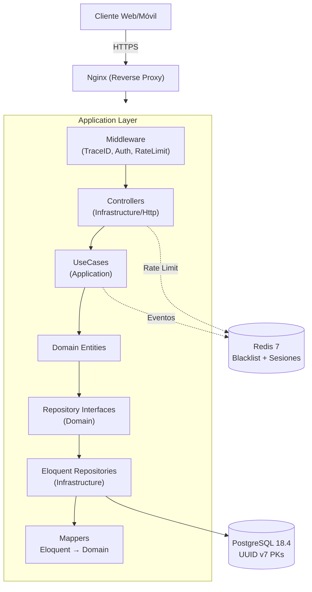

# 🏗️ ARCHITECTURE
## Arquitectura del Proyecto Urbania API

> [!info] Consultar
> Antes de implementar cualquier modulo nuevo o modificar la estructura.

---

## 1. Stack Tecnologico

| Componente            | Tecnología                           | Versión     | Compatibilidad Laravel 13 | Justificación                                                                           |
| --------------------- | ------------------------------------ | ----------- | ------------------------- | --------------------------------------------------------------------------------------- |
| Framework             | Laravel                              | **^13.0**   | —                         | LTS, lanzado marzo 2026, bug fixes hasta Q3 2027, security hasta Q1 2028                |
| Lenguaje              | PHP                                  | **^8.5**    | ✅ Requiere PHP 8.3+      | Lanzado noviembre 2025. Fallback a PHP 8.4 si 8.5 no tiene soporte completo de paquetes |
| Base de Datos         | PostgreSQL                           | **^18.4**   | ✅ Nativo                 | Lanzado septiembre 2025, última estable 18.4 (mayo 2026), soporte hasta nov 2030        |
| Contenedor            | Docker + Docker Compose              | Latest      | ✅ Nativo                 | Orquestación personalizada (NO Sail)                                                    |
| Web Server            | Nginx                                | Latest      | ✅ Nativo                 | Reverse proxy, SSL termination                                                          |
| Cache                 | Redis                                | Latest      | ✅ Nativo                 | Sesiones, cache, colas                                                                  |
| **Testing**           | **Pest**                             | **^3.0**    | ✅ v3.x compatible        | Framework principal de testing moderno para PHP, compatible con PHPUnit                 |
| ↳ Plugin              | Pest Plugin Laravel                  | **^3.0**    | ✅ v3.x compatible        | Integración nativa con el ecosistema Laravel                                            |
| ↳ Mocking             | Mockery                              | **^1.6**    | ✅ Bundled con Pest       | Mocking de dependencias (bundled con Pest)                                              |
| ↳ Fixtures            | Faker                                | **^1.23**   | ✅ Bundled con Laravel    | Generación de datos falsos para tests (bundled con Laravel)                             |
| ↳ Time Mock           | ClockMock                            | **^1.0**    | ✅ Independiente          | Mocking de tiempo para TOTP, expiraciones de tokens JWT                                 |
| **Análisis Estático** | **PHPStan**                          | **^2.2.x**  | ✅ v2.x compatible        | Nivel máximo (10) para tipado estricto                                                  |
| ↳ Extensiones         | Larastan                             | **^2.2.x**  | ⚠️ Verificar tag         | Extensiones PHPStan específicas para Laravel. Verificar que exista tag para Laravel 13  |
| **Formateo**          | **Laravel Pint**                     | **^1.29.1** | ✅ Nativo                 | Estilo de código Laravel estándar                                                       |
| Documentación         | Laravel Scribe                       | **^5.10**   | ⚠️ Verificar             | Generación automática de docs de API. Verificar compatibilidad con Laravel 13           |
| Autenticación         | JWT (php-open-source-saver/jwt-auth) | **^2.9**    | ✅ v2.9.0+ compatible     | Tokens stateless para API REST, fork activo del paquete original                        |
| UUID                  | ramsey/uuid                          | **^4.7**    | ✅ Independiente          | UUID v7 para claves primarias y trace_id. v7 optimizado para índices B-tree en PostgreSQL |


> [!tip] Regla de versiones
> Siempre ultima estable. Si hay conflicto, intentar instalar la version que no genere conflicto, priorizando las librerias mas principales e informar explicitamente pero no bloqueante sobre cambios el stack de tecnologias con justificacion tecnica.

> [!note] Fallback PHP
> PHP ^8.5 es el objetivo. Si no hay release estable, usar PHP 8.4 (LTS hasta dic 2028). Laravel 13 requiere PHP 8.3+ — funciona con 8.4 sin cambios. Verificar compatibilidad de larastan y jwt-auth con la version instalada.

---

## 2. Arquitectura: Clean Architecture + DDD (Domain Driven Design)

> ### Clean Architecture + DDD (Domain Driven Design). Separacion estricta entre Dominio, Aplicacion, Infraestructura y Presentacion.

```
/src
├── /Shared                    # Bounded context compartido
│   ├── /Domain
│   │   ├── /ValueObjects      # Uuid, Email, Money, etc.
│   │   ├── /Exceptions        # DomainException, ValidationException
│   │   ├── /Events            # DomainEvent, EventBus
│   │   └── /Contracts         # Interfaces compartidas
│   ├── /Application
│   │   ├── /DTOs              # DTOs compartidos
│   │   └── /Bus              # CommandBus, QueryBus
│   └── /Infrastructure
│       ├── /Exceptions        # ExceptionHandler, HttpException
│       ├── /Persistence       # BaseEloquentRepository
│       ├── /Bus              # LaravelEventBus, LaravelCommandBus
│       ├── /Logging          # JsonLogger, RequestLogger
│       └── /Middleware       # RequestLogging, TraceId
│
├── /Auth                      # Bounded context: Autenticacion
│   ├── /Domain
│   │   ├── /Entities          # User, RefreshToken
│   │   ├── /ValueObjects      # Password, JwtToken
│   │   ├── /Repositories      # UserRepository (interface)
│   │   ├── /Exceptions        # InvalidCredentials, TokenExpired
│   │   └── /Events            # UserLoggedIn, UserRegistered
│   ├── /Application
│   │   ├── /DTOs              # LoginRequestDto, LoginResponseDto
│   │   ├── /UseCases          # LoginUseCase, RegisterUseCase, LogoutUseCase
│   │   └── /Services          # JwtService (interface)
│   ├── /Infrastructure
│   │   ├── /Persistence       # EloquentUserRepository
│   │   ├── /Services          # PhpOpenSourceSaverJwtService
│   │   ├── /Mappers           # UserMapper (Eloquent a Domain)
│   │   └── /Http
│   │       ├── /Controllers   # AuthController
│   │       ├── /Requests      # LoginRequest, RegisterRequest
│   │       └── /Resources     # UserResource, TokenResource
│   └── /Presentation          # Routes, ServiceProvider, Middleware de auth
│       ├── /AuthServiceProvider.php
│       └── /routes.php        # Definicion de rutas del modulo
```

### Principios
- Cada directorio en `/src` (excepto `Shared`) = **bounded context de negocio completo**
- **Ningun bounded context importa de otro bounded context**. Comunicacion solo a traves de `Shared/` o eventos de dominio
- `Shared/` = todo lo transversal: value objects, excepciones base, contratos, buses
- `Domain/` = logica pura, sin dependencias externas
- `Application/` = orquestacion de casos de uso, DTOs
- `Infrastructure/` = implementaciones concretas (Eloquent, JWT, HTTP)
- `Presentation/` = rutas, service providers, middleware de rutas (dentro de cada bounded context)

> [!note] Nota sobre [[API_SESSION_MANIFEST]]
> Este archivo vive en la raiz del proyecto
> y se actualiza al final de cada sesion de desarrollo. Documenta el estado exacto
> del proyecto: archivos creados, metricas de calidad, deuda tecnica, y bloqueos.
> Es el "estado guardado" que se entrega al agente al inicio de la siguiente sesion.
> Ver [[API_IMPLEMENTATION_PLAN]] para la plantilla del Session Manifest.

### Diagrama de Flujo de Petición


---

## 3. Convenciones de Nomenclatura

| Elemento | Convencion | Ejemplo |
|----------|-----------|---------|
| Clases (Dominio) | PascalCase | `LoginUseCase`, `UserEntity` |
| Clases (Infraestructura) | PascalCase + sufijo | `EloquentUserRepository`, `JwtTokenService` |
| Archivos PHP (clases) | PascalCase | `LoginUseCase.php`, `UserEntity.php` |
| Archivos PHP (no clases) | snake_case | `helpers.php`, `constants.php` |
| Tablas BD | snake_case, plural | `users` |
| Columnas BD | snake_case | `first_name`, `created_at` |
| Endpoints | kebab-case | `/api/v1/user-profile` |
| Providers | PascalCase + ServiceProvider | `AuthServiceProvider` |
| Constantes | UPPER_SNAKE_CASE | `MAX_RETRY_ATTEMPTS` |
| Enums | PascalCase valores | `enum UserRole: string { case ADMIN = 'admin'; case USER = 'user'; }` |
| Directorios de feature | PascalCase (Dominio) / snake_case (Infra) | `src/Auth/Domain/`, `src/Auth/Infrastructure/` |
| Mappers | PascalCase + Mapper | `UserMapper` |

> [!warning] IMPORTANTE
> Los archivos de clases PHP usan PascalCase para cumplir con PSR-4.
> Los archivos que no contienen clases (helpers, configuraciones) usan snake_case.

---

## 4. Reglas de Dependencia (SOLID estricto)

```
Presentation -> Application -> Domain
     ^                            ^
   Controllers              Repositories (interfaces)
   Requests                 Entities
   Resources                Value Objects
   Routes                   Events
                            Exceptions
Infrastructure -> Domain
     ^
   Eloquent Repositories
   JWT Service
   Mail Service
   Event Bus (Laravel)
   Mappers (Eloquent a Domain)
```

- **Presentation** depende de **Application** (DTOs de request/response)
- **Application** depende de **Domain** (use cases orquestan entidades)
- **Infrastructure** depende de **Domain** (implementa interfaces de repositorio)
- **Domain** NO depende de framework ni infraestructura (ni Laravel, ni Eloquent, ni paquetes de infraestructura). **Permitido**: librerias de utilidad pura sin acoplamiento a framework (ej: `ramsey/uuid`, `egulias/email-validator`, `DateTimeImmutable`)
- **NUNCA** una capa superior importa de una inferior
- **NUNCA** un bounded context importa de otro bounded context
- **NUNCA** `Shared/` importa de ningun bounded context
- **NUNCA** `Domain/` importa de `Infrastructure/`

### Excepciones permitidas a la regla de dependencia

| Componente                         | Ubicación                    | Justificación                                                                                                                                                                                                    |
| ---------------------------------- | ---------------------------- | ---------------------------------------------------------------------------------------------------------------------------------------------------------------------------------------------------------------- |
| **Mappers**                        | `Infrastructure/Mappers/`    | Puente de conversión Eloquent ↔ Domain. Importan entidades de Domain para crear instancias y acceden a Eloquent models para persistencia. Son la frontera anti-corruption layer entre infraestructura y dominio. |
| **Excepciones de Infraestructura** | `Infrastructure/Exceptions/` | Pueden extender `DomainException` para unificar el manejo de errores HTTP. Ver [[API_JWT_IMPLEMENTATION]] §8.1 para lista de eventos de seguridad.                                                               |
| **Librerias de utilidad pura**     | `Domain/**`                  | Librerias sin acoplamiento a framework son aceptables en Domain: `ramsey/uuid` (UUID v7), `egulias/email-validator` (validacion RFC). Equivalente a usar `DateTimeImmutable` nativo de PHP. |

---

## 5. Manejo de Errores (Excepciones de Dominio)

**TODAS** las funciones que pueden fallar lanzan excepciones de dominio tipadas:
- Usar excepciones especificas de dominio, no genericas de PHP
- **NUNCA** lanzar excepciones crudas (`\Exception`, `\RuntimeException`)
- **NUNCA** usar `try/catch` sin mapear a una excepcion de dominio o respuesta HTTP

```php
<?php

declare(strict_types=1);

namespace Urbania\Shared\Domain\Exceptions;

abstract class DomainException extends \Exception
{
    public function __construct(
        string $message,
        private readonly string $errorCode,
        private readonly int $httpStatusCode = 400,
        ?\Throwable $previous = null
    ) {
        parent::__construct($message, 0, $previous);
    }

    public function errorCode(): string
    {
        return $this->errorCode;
    }

    public function httpStatusCode(): int
    {
        return $this->httpStatusCode;
    }
}
```

### Excepciones Especificas

```php
<?php

declare(strict_types=1);

namespace Urbania\Auth\Domain\Exceptions;

use Urbania\Shared\Domain\Exceptions\DomainException;

class InvalidCredentialsException extends DomainException
{
    public function __construct()
    {
        parent::__construct(
            message: 'Las credenciales proporcionadas son incorrectas',
            errorCode: 'INVALID_CREDENTIALS',
            httpStatusCode: 401
        );
    }
}

class TokenExpiredException extends DomainException
{
    public function __construct()
    {
        parent::__construct(
            message: 'El token de autenticacion ha expirado',
            errorCode: 'TOKEN_EXPIRED',
            httpStatusCode: 401
        );
    }
}

class UserNotFoundException extends DomainException
{
    public function __construct(string $userId)
    {
        parent::__construct(
            message: "El usuario con ID {$userId} no fue encontrado",
            errorCode: 'USER_NOT_FOUND',
            httpStatusCode: 404
        );
    }
}
```

### Excepciones de Infraestructura

```php
<?php

declare(strict_types=1);

namespace Urbania\Shared\Infrastructure\Exceptions;

use Urbania\Shared\Domain\Exceptions\DomainException;

class DatabaseException extends DomainException
{
    public function __construct(string $operation)
    {
        parent::__construct(
            message: "Error en la base de datos durante: {$operation}",
            errorCode: 'DATABASE_ERROR',
            httpStatusCode: 500
        );
    }
}
```

---

## 6. Mapeo Eloquent a Entidad de Dominio (CRITICO)

> [!warning] IMPORTANTE
> JWTAuth y Eloquent SIEMPRE devuelven modelos de Laravel (`App\Models\User`),
> pero los UseCases y Repositorios de Dominio esperan Entidades de Dominio (`Urbania\Auth\Domain\Entities\User`).
> **SIEMPRE** usar un Mapper para convertir entre ambos.

### Ubicación de Eloquent Models

**Ubicación oficial:** `App\Models\` — convención Laravel estándar, mapeo vía `Infrastructure/Mappers/`.

> [!danger] Regla estricta
> **NUNCA** usar Eloquent relationships entre models de diferentes bounded contexts. **NUNCA** acceder a `$request->user()` o helpers de Laravel desde la capa Domain.
> 
> Los models Eloquent son parte de la capa de Infrastructure y actúan como 
> Anti-Corruption Layer entre la base de datos y el Domain. El mapeo bidireccional 
> (Eloquent ↔ Domain) se realiza exclusivamente en `Infrastructure/Mappers/`.

---

## 7. Estado de UI con DTOs y Resources

> [!warning] IMPORTANTE
> La API no mantiene estado de UI. Cada request es stateless.

```php
<?php

declare(strict_types=1);

namespace Urbania\Auth\Application\DTOs;

final readonly class LoginRequestDto
{
    public function __construct(
        public string $email,
        public string $password
    ) {}
}

final readonly class LoginResponseDto
{
    public function __construct(
        public string $accessToken,
        public string $refreshToken,
        public string $tokenType,
        public int $expiresIn,
        public UserResponseDto $user
    ) {}
}
```

### Resource de Laravel (Presentacion)

```php
<?php

declare(strict_types=1);

namespace Urbania\Auth\Infrastructure\Http\Resources;

use Illuminate\Http\Resources\Json\JsonResource;

final class UserResource extends JsonResource
{
    public function toArray($request): array
    {
        return [
            'id' => $this->resource->id(),
            'name' => $this->resource->name(),
            'email' => $this->resource->email(),
            'phone' => $this->resource->phone(),
            'unit' => $this->resource->unit(),
            'role' => $this->resource->role()->value,  // 'admin' o 'user' (minúscula)
            'status' => $this->resource->status()->value,
            'avatar_url' => $this->resource->avatarUrl(),
            'created_at' => $this->resource->createdAt()->toIso8601String(),
        ];
    }
}
```

---

## 8. Configuracion de Base de Datos (PostgreSQL)

```php
<?php

// config/database.php - configuracion PostgreSQL

'pgsql' => [
    'driver' => 'pgsql',
    'url' => env('DB_URL'),
    'host' => env('DB_HOST', 'db'), // 'db' = nombre del servicio en docker-compose.yml (Seccion 11), NUNCA localhost/127.0.0.1
    'port' => env('DB_PORT', '5432'),
    'database' => env('DB_DATABASE', 'urbania'),
    'username' => env('DB_USERNAME', 'urbania'),
    'password' => env('DB_PASSWORD', ''),
    'charset' => env('DB_CHARSET', 'utf8'),
    'prefix' => '',
    'prefix_indexes' => true,
    'search_path' => 'public',
    'sslmode' => 'prefer',
],
```

> [!danger] Nota sobre el host de conexión
> PostgreSQL se ejecuta **exclusivamente como contenedor Docker** (servicio `db` en [[API_ARCHITECTURE#11. Docker Compose (Desarrollo)|docker-compose.yml]]), nunca como instancia instalada localmente en el host. El valor de `DB_HOST` siempre debe ser `db` (resoluble vía la red interna de Docker), no `localhost` ni `127.0.0.1` — esas direcciones solo funcionarían si Postgres corriera fuera de Docker, lo cual este proyecto no contempla.

---

## 9. Autoloading y Registro de Bounded Contexts

### Configuración PSR-4 (composer.json)

```json
{
    "name": "urbania/api",
    "type": "project",
    "autoload": {
        "psr-4": {
            "Urbania\\": "src/",
            "App\\": "app/"
        }
    },
    "autoload-dev": {
        "psr-4": {
            "Urbania\\Tests\\": "tests/"
        }
    }
}
```

### ServiceProvider por Bounded Context

Cada bounded context DEBE exponer su propio ServiceProvider en `Presentation/`:

```php
<?php

declare(strict_types=1);

namespace Urbania\Auth\Presentation;

use Illuminate\Support\ServiceProvider;
use Urbania\Auth\Application\Services\JwtService;
use Urbania\Auth\Domain\Repositories\UserRepository;
use Urbania\Auth\Infrastructure\Persistence\EloquentUserRepository;
use Urbania\Auth\Infrastructure\Services\PhpOpenSourceSaverJwtService;

final class UrbaniaAuthServiceProvider extends ServiceProvider
{
    public function register(): void
    {
        $this->app->bind(JwtService::class, PhpOpenSourceSaverJwtService::class);
        $this->app->bind(UserRepository::class, EloquentUserRepository::class);
    }

    public function boot(): void
    {
        $this->loadRoutesFrom(__DIR__ . '/routes.php');
    }
}
```

### Registro en config/app.php

```php
'providers' => [
    // Laravel Framework Service Providers...
    Illuminate\Auth\AuthServiceProvider::class,
    Illuminate\Broadcasting\BroadcastServiceProvider::class,
    // ...

    // Urbania Bounded Contexts
    Urbania\Auth\Presentation\UrbaniaAuthServiceProvider::class,
    // Urbania\Billing\Presentation\BillingServiceProvider::class,
    // Urbania\Maintenance\Presentation\MaintenanceServiceProvider::class,
],
```

### Rutas modulares (routes.php)

```php
<?php

declare(strict_types=1);

use Illuminate\Support\Facades\Route;
use Urbania\Auth\Infrastructure\Http\Controllers\AuthController;

Route::prefix('api/v1/auth')->group(function () {
    Route::post('/login', [AuthController::class, 'login']);
    Route::post('/register', [AuthController::class, 'register']);
    Route::post('/logout', [AuthController::class, 'logout'])->middleware('auth:api');
    Route::post('/refresh', [AuthController::class, 'refresh']);
});
```

---

## 10. Testing Obligatorio

Cada bounded context DEBE incluir:
- Unit tests para Domain (entities, value objects, exceptions)
- Unit tests para Application (use cases con mocks de repositorios)
- Integration tests para Infrastructure (repositories con BD real)
- Feature tests para Presentation (endpoints HTTP)

### Estructura de Tests (espejo de src/)

```
tests/
├── Architecture/                    # Tests de reglas de arquitectura (dependencias, nomenclatura)
├── Unit/
│   ├── Shared/
│   │   ├── Domain/
│   │   │   ├── ValueObjects/
│   │   │   └── Exceptions/
│   │   └── Infrastructure/
│   │       └── Persistence/
│   └── Auth/
│       ├── Domain/
│       │   ├── Entities/
│       │   ├── ValueObjects/
│       │   ├── Exceptions/
│       │   └── Events/
│       └── Application/
│           ├── DTOs/
│           └── UseCases/
├── Integration/
│   ├── Auth/
│   │   └── Infrastructure/
│   │       ├── Persistence/
│   │       ├── Services/
│   │       └── Mappers/
│   └── Shared/
│       └── Infrastructure/
├── Feature/
│   ├── Auth/
│   │   └── Http/
│   │       └── AuthControllerTest.php
│   └── Shared/
│       └── Http/
└── Security/
    ├── Jwt/
    ├── Mfa/
    └── BruteForce/
```

---

## 11. Docker Compose (Desarrollo)

```yaml
# docker-compose.yml

services:
  app:
    build:
      context: .
      dockerfile: Dockerfile
    container_name: urbania-api
    restart: unless-stopped
    working_dir: /var/www
    volumes:
      - ./:/var/www
    networks:
      - urbania-network
    depends_on:
      - db
      - redis
    environment:
      - APP_ENV=local
      - APP_DEBUG=true
      - DB_HOST=db
      - DB_PORT=5432
      - DB_DATABASE=urbania
      - DB_USERNAME=urbania
      - DB_PASSWORD=secret
      - REDIS_HOST=redis
      - REDIS_PORT=6379

  nginx:
    image: nginx:alpine
    container_name: urbania-nginx
    restart: unless-stopped
    ports:
      - "8080:80"
    volumes:
      - ./:/var/www
      - ./docker/nginx/default.conf:/etc/nginx/conf.d/default.conf
    networks:
      - urbania-network
    depends_on:
      - app

  db:
    image: postgres:18.4-alpine  # Verificar tag exacto en hub.docker.com/_/postgres
    container_name: urbania-db
    restart: unless-stopped
    ports:
      - "5433:5432"
    environment:
      POSTGRES_DB: urbania
      POSTGRES_USER: urbania
      POSTGRES_PASSWORD: secret
    volumes:
      - postgres-data:/var/lib/postgresql/data
    networks:
      - urbania-network
    healthcheck:
      test: ["CMD-SHELL", "pg_isready -U urbania"]
      interval: 5s
      timeout: 5s
      retries: 5

  redis:
    image: redis:7-alpine
    container_name: urbania-redis
    restart: unless-stopped
    ports:
      - "6380:6379"
    networks:
      - urbania-network

networks:
  urbania-network:
    driver: bridge

volumes:
  postgres-data:
```

> [!note] Nota
> Puerto alternativo 5433 para PostgreSQL y 6380 para Redis para evitar conflictos con instancias locales.

### Archivos Docker Requeridos

```
├── Dockerfile                    # PHP 8.5-fpm con extensiones
├── docker-compose.yml            # App + PostgreSQL + Redis
├── docker-entrypoint.sh          # Auto-migraciones, wait for postgres
├── .env.docker                   # Variables para Docker
└── .dockerignore                 # Exclusiones de build
```

---

## 12. Configuración de Herramientas de Calidad

### PHPStan (phpstan.neon)

```neon
includes:
    - vendor/larastan/larastan/extension.neon

parameters:
    level: 10
    paths:
        - src
        - app
    ignoreErrors:
        # Documentar cada ignore con justificación técnica
```

### Pint (pint.json)

```json
{
    "preset": "laravel",
    "rules": {
        "ordered_imports": true,
        "declare_strict_types": true
    }
}
```

> [!note] Nota sobre PHP 8.5
> Pint es compatible con PHP 8.5. Los features propuestos como property hooks y pipe operator aún no están implementados en PHP 8.5. Si se añaden en versiones futuras, verificar compatibilidad de Pint.

---

## 13. Variables de Entorno Requeridas

```env
# App
APP_NAME=Urbania
APP_ENV=local
APP_KEY=
APP_DEBUG=true
APP_URL=http://localhost:8080
APP_TIMEZONE=UTC

# Database
DB_CONNECTION=pgsql
DB_HOST=db
DB_PORT=5432
DB_DATABASE=urbania
DB_USERNAME=urbania
DB_PASSWORD=secret

# Redis (Cache, Sessions, Queue, JWT Blacklist)
REDIS_HOST=redis
REDIS_PORT=6379
REDIS_PASSWORD=null
REDIS_CLIENT=phpredis
CACHE_DRIVER=redis
SESSION_DRIVER=redis
QUEUE_CONNECTION=redis

# JWT (verificar configuración completa en JWT_IMPLEMENTATION.md)
JWT_SECRET=
JWT_ALGO=RS256
JWT_TTL=15
JWT_REFRESH_TTL=10080
# JWT_REFRESH_TTL en minutos: 10080 = 7 días (web). Móvil usa 43200 (30 días). Ver [[API_JWT_IMPLEMENTATION]] §3.3
JWT_PRIVATE_KEY_PATH=storage/jwt/private.pem
JWT_PUBLIC_KEY_PATH=storage/jwt/public.pem
JWT_PASSPHRASE=

# MFA (configuración completa en JWT_IMPLEMENTATION.md)
MFA_ISSUER=Urbania
MFA_DIGITS=6
MFA_PERIOD=30
MFA_BACKUP_CODES_COUNT=10

# Mail (requerido para forgot-password y notificaciones de seguridad)
MAIL_MAILER=smtp
MAIL_HOST=mailhog
MAIL_PORT=1025
MAIL_USERNAME=null
MAIL_PASSWORD=null
MAIL_ENCRYPTION=null
MAIL_FROM_ADDRESS="noreply@urbania.com"
MAIL_FROM_NAME="Urbania"

# Scribe
SCRIBE_AUTH_KEY=

# Filesystem (avatars, documentos adjuntos)
FILESYSTEM_DISK=local
AWS_ACCESS_KEY_ID=
AWS_SECRET_ACCESS_KEY=
AWS_DEFAULT_REGION=us-east-1
AWS_BUCKET=
AWS_USE_PATH_STYLE_ENDPOINT=false

# Logging
LOG_CHANNEL=stack
LOG_LEVEL=debug
```

---

## 14. Architecture Decision Records (ADR)

Las decisiones técnicas fundamentales se documentan en `docs/adr/`. Cada ADR sigue el formato: Contexto → Decisión → Consecuencias. Los ADRs propuestos iniciales:

| ADR | Tema | Prioridad |
|-----|------|-----------|
| ADR-001 | Clean Architecture + DDD sobre MVC Laravel estándar | Alta |
| ADR-002 | RS256 sobre HS256 para firma JWT | Alta |
| ADR-003 | UUID v7 sobre auto-increment para claves primarias | Alta |
| ADR-004 | Doble token (Access + Refresh) con rotación | Alta |
| ADR-005 | Pest sobre PHPUnit directo | Media |

> [!note] Secuencia de creacion
> Los ADRs se crean en la Sesion 8 del plan de
> implementacion ([[API_IMPLEMENTATION_PLAN]]). Cada ADR debe justificar una decision
> tecnica fundamental ya aplicada en el codigo, no una decision teorica.

> [!tip] Nota
> Crear cada ADR como `docs/adr/ADR-NNN.md` al iniciar el proyecto o cuando se cuestione la decisión por primera vez. Usar la plantilla `_templates/nuevo-adr.md` (QuickAdd → "Nuevo ADR"). El listado completo se consulta en [[_Home]].

---

## 15. Documentos del Proyecto

> **Mapa completo de documentacion tecnica del proyecto Urbania API**.
> Todos los documentos viven en la raiz del proyecto.

| Documento | Proposito | Audiencia | Consultar cuando |
|-----------|-----------|-----------|------------------|
| [[API_AGENTS]] | Mapa de navegacion, flujos de trabajo, reglas de oro | Agentes de desarrollo | Siempre primero |
| [[API_IMPLEMENTATION_PLAN]] | Plan de sesiones incremental, scope por sesion | Orchestrator, agentes | Antes de cualquier tarea |
| [[API_SESSION_MANIFEST]] | Estado actual del proyecto entre sesiones | Agentes que retoman trabajo | Al inicio de cada sesion |
| [[API_ARCHITECTURE]] | Stack tecnologico, DDD, reglas de dependencia, convenciones | Agentes de desarrollo | Antes de implementar modulo |
| [[API_DATABASE]] | Esquema PostgreSQL, convenciones de nomenclatura, migraciones | Agentes que tocan BD | Tareas de tablas/migraciones |
| [[API_CONTRACT]] | Endpoints, request/response, errores, rate limiting | Agentes que crean/modifican endpoints | Tareas de API |
| [[API_JWT_IMPLEMENTATION]] | Seguridad JWT, claims, rotacion, MFA, headers HTTP | Agentes de seguridad | Tareas de auth/seguridad |
| [[API_SETUP_GUIDE]] | Inicializacion paso a paso, Docker, dependencias | Agentes de setup, DevOps | Al iniciar proyecto |
| [[API_TESTING]] | Estructura de tests, reglas, cobertura, metricas | Agentes de desarrollo, QA | Al crear/modificar tests |
| [[API_DEVELOPMENT_GUIDE]] | Troubleshooting, decisiones tecnicas ad-hoc, comandos | Agentes en sesion activa | Al encontrar problemas |

### Relaciones entre documentos

```
IMPLEMENTATION_PLAN.md (plan maestro)
    |
    +---> SESSION_MANIFEST.md (estado actual)
    |         |
    |         +---> AGENTS.md (navegacion)
    |                   |
    |                   +---> ARCHITECTURE.md (fundamentos)
    |                   |         |
    |                   |         +---> DATABASE.md (datos)
    |                   |         +---> API_CONTRACT.md (interfaz)
    |                   |         +---> JWT_IMPLEMENTATION.md (seguridad)
    |                   |         +---> SETUP_GUIDE.md (inicializacion)
    |                   |         +---> TESTING.md (calidad)
    |                   |
    |                   +---> DEVELOPMENT_GUIDE.md (operativo)
```