# 🗄️ DATABASE_SCHEMA
## Esquema de Base de Datos de Urbania API

> [!info] Consultar
> Si la tarea involucra tablas, relaciones, migraciones, o modificaciones de esquema.
> **Migracion-Transparente**: El esquema de BD debe soportar evolucion sin perdida de datos. Migrations reversibles.

### Conexión al servidor de base de datos

> **PostgreSQL corre exclusivamente dentro de Docker** (servicio `db`, ver [[API_ARCHITECTURE#11. Docker Compose (Desarrollo)]]). No se instala ni se ejecuta una instancia local/nativa de PostgreSQL en ningún entorno (desarrollo, testing o producción) — siempre vía contenedor.

> [!danger] Seguridad
> Las credenciales NUNCA se documentan en texto plano en este archivo.
> Se configuran exclusivamente vía variables de entorno (`.env`, no versionado en git).
> Ver [[API_ARCHITECTURE#13. Variables de Entorno Requeridas]] para la lista completa
> (`DB_CONNECTION`, `DB_HOST`, `DB_PORT`, `DB_DATABASE`, `DB_USERNAME`, `DB_PASSWORD`).
> Copiar `.env.example` a `.env` y ajustar los valores — `DB_HOST` debe quedar como `db`.

---

## Convenciones de Nomenclatura

| Elemento | Convencion | Ejemplo |
|----------|-----------|---------|
| Tablas | snake_case, plural | `users`, `common_zones` |
| Columnas | snake_case | `first_name`, `created_at` |
| Claves primarias | `id` (UUID v7) | `550e8400-e29b-41d4-a716-446655440000` |
| Claves foraneas | `{tabla_singular}_id` | `user_id` |
| Timestamps | `created_at`, `updated_at` | Laravel automatico |
| Soft deletes | `deleted_at` | Laravel automatico |

> [!note] Nota sobre timezone
> PostgreSQL debe configurarse con `timezone = 'UTC'`
> y Laravel con `APP_TIMEZONE=UTC`. Todas las fechas se almacenan y retornan 
> en formato ISO 8601 UTC (`YYYY-MM-DDThh:mm:ssZ`). Ver [[API_CONTRACT]].

> [!note] Nota sobre soft delete
> Usuarios con `deleted_at` NOT NULL no pueden autenticarse.
> El endpoint `/auth/me` retorna 404 para usuarios soft-deleted. 
> Solo admins pueden ver/restaurar usuarios eliminados (módulo Admin, P1).

| Indices | `idx_{tabla}_{columnas}` | `idx_entidad_entidad` |
| Constraints | `fk_{tabla}_{columna}` | `fk_reservations_user_id` |

---

### 2.1 Tabla: `users`

Almacena la información de autenticación principal de cada usuario.

| Columna | Tipo | Restricciones | Descripción |
|---------|------|---------------|-------------|
| `id` | UUID v7 | PK | Identificador único del usuario |
| `email` | VARCHAR(255) | UNIQUE, NOT NULL | Correo electrónico (identificador de login) |
| `name` | VARCHAR(255) | NOT NULL | Nombre completo del usuario |
| `phone` | VARCHAR(20) | NULLABLE | Teléfono de contacto |
| `unit` | VARCHAR(50) | NULLABLE | Unidad/Apartamento asignado (ej: "Apto 101") |
| `avatar_url` | VARCHAR(500) | NULLABLE | URL del avatar del usuario |
| `password_hash` | VARCHAR(255) | NOT NULL | Hash de contraseña (Argon2id) |
| `email_verified_at` | TIMESTAMP | NULLABLE | Fecha de verificación de email |
| `mfa_secret` | VARCHAR(32) | NULLABLE | Secreto TOTP para MFA (encriptado con AES-256-GCM) |
| `mfa_enabled` | BOOLEAN | DEFAULT FALSE | Indica si MFA está activo |
| `mfa_backup_codes` | JSONB | NULLABLE | Array de 10 códigos de respaldo (hasheados con Argon2id) |
| `failed_login_attempts` | SMALLINT | DEFAULT 0 | Contador de intentos fallidos consecutivos |
| `locked_until` | TIMESTAMP | NULLABLE | Timestamp hasta el cual la cuenta está bloqueada |

> [!note] Nota sobre bloqueo
> El desbloqueo es automático cuando `locked_until < NOW()`.
> No requiere acción manual. El campo `failed_login_attempts` se resetea a 0 en cada login exitoso.

| `last_login_at` | TIMESTAMP | NULLABLE | Último inicio de sesión exitoso |
| `last_login_ip` | INET | NULLABLE | IP del último login exitoso |
| `password_changed_at` | TIMESTAMP | NOT NULL | Fecha del último cambio de contraseña |
| `must_change_password` | BOOLEAN | DEFAULT FALSE | Forzar cambio de contraseña en próximo login |

> [!note] Nota sobre cambio forzado
> Si `must_change_password = true`, el login retorna 403 con código `FORCE_PASSWORD_CHANGE`.
> El usuario debe llamar a `POST /auth/change-password` antes de obtener tokens válidos. 
> Ver [[API_CONTRACT]] para detalles del endpoint.

| `role` | ENUM | NOT NULL, DEFAULT 'user' | Valores: `admin`, `user`. Derivado en claims JWT como `role` |
| `status` | ENUM | DEFAULT 'active' | Valores: `active`, `suspended`, `inactive` |

> [!note] Nota sobre transiciones de estado
> - `active` → `suspended`: Solo admin. Notifica al usuario por email.
> - `suspended` → `active`: Solo admin o automático después de periodo de suspensión.
> - `active` → `inactive`: Usuario desactiva su cuenta (soft delete).
> - `inactive` → `active`: Usuario reactiva su cuenta (requiere re-verificación si > 30 días).
> - Cualquier estado → `deleted` (soft delete): Solo admin o usuario propietario.

| `created_at` | TIMESTAMP | DEFAULT NOW() | Fecha de creación |
| `updated_at` | TIMESTAMP | DEFAULT NOW() | Fecha de última actualización |
| `deleted_at` | TIMESTAMP | NULLABLE | Soft delete |

**Índices recomendados:**
- `UNIQUE` en `email`
- `INDEX` en `role`
- `INDEX` en `status`
- `INDEX` en `locked_until` (para limpieza de bloqueos)
- `INDEX` en `deleted_at`

> [!note] Nota sobre `password_hash`
> Laravel por defecto espera la columna `password`.
> Para usar `password_hash`, configurar en el modelo Eloquent:
> ```php
> protected string $authPasswordName = 'password_hash';
> ```
> O sobrescribir el método `getAuthPassword()` en el modelo User.

**Sintaxis ENUM PostgreSQL:**
```sql
CREATE TYPE user_role AS ENUM ('admin', 'user');
CREATE TYPE user_status AS ENUM ('active', 'suspended', 'inactive');
```

> [!note] Nota
> En Laravel migrations, usar `$table->enum('role', ['admin', 'user'])->default('user')` y `$table->enum('status', ['active', 'suspended', 'inactive'])`, o crear los TYPEs manualmente en PostgreSQL.

> [!note] Estructura de `mfa_backup_codes`
> La columna JSONB almacena un array de objetos:
> ```json
> [
>     {"hash": "$argon2id$v=19$...", "used_at": null},
>     {"hash": "$argon2id$v=19$...", "used_at": "2026-06-07T12:00:00Z"}
> ]
> ```
> Cada código es un string de 8 dígitos. Se almacena el hash Argon2id (no el código en claro).
> El campo `used_at` es NULL si no se ha usado, o contiene el timestamp ISO 8601 de uso.


### 2.2 Tabla: `refresh_tokens`

Almacena los refresh tokens activos con control de rotación y dispositivos.

| Columna | Tipo | Restricciones | Descripción |
|---------|------|---------------|-------------|
| `id` | UUID v7 | PK | Identificador del registro |
| `user_id` | UUID v7 | FK → users.id, ON DELETE CASCADE | Usuario propietario |
| `session_id` | UUID v7 | NOT NULL | ID de sesión (vincula con Redis session:{session_id}) |
| `token_hash` | CHAR(64) | UNIQUE, NOT NULL | SHA-256 del refresh token (nunca almacenar el token en claro) |
| `token_family` | UUID v7 | NOT NULL | Familia de rotación (todos los tokens de una sesión comparten familia) |
| `previous_token_hash` | CHAR(64) | NULLABLE | SHA-256 del token anterior en la cadena de rotación |
| `device_fingerprint` | VARCHAR(64) | NOT NULL | Hash de fingerprint del dispositivo (user-agent + IP subnet) |
| `device_name` | VARCHAR(255) | NULLABLE | Nombre descriptivo del dispositivo (ej: "iPhone de Juan") |
| `ip_address` | INET | NOT NULL | IP desde la que se creó el token |
| `user_agent` | TEXT | NULLABLE | User-Agent del cliente |
| `expires_at` | TIMESTAMP | NOT NULL | Fecha de expiración del token |
| `revoked_at` | TIMESTAMP | NULLABLE | Fecha de revocación (si aplica) |
| `revocation_reason` | VARCHAR(50) | NULLABLE | Razón: `logout`, `password_change`, `suspicious_activity`, `admin_action` |
| `last_used_at` | TIMESTAMP | DEFAULT NOW() | Último uso del token |
| `created_at` | TIMESTAMP | DEFAULT NOW() | Fecha de creación |

**Índices:**
- `UNIQUE` en `token_hash`
- `INDEX` en `user_id` + `revoked_at` (para listar sesiones activas)
- `INDEX` en `session_id` (para vinculación con sesiones Redis)
- `INDEX` en `token_family` (para detectar rotación ilegítima)
- `INDEX` en `expires_at` (para limpieza de tokens expirados)
- `INDEX` en `device_fingerprint` (para detectar dispositivos nuevos)

### 2.3 Tabla: `password_history`

Previene reutilización de contraseñas recientes.

| Columna | Tipo | Restricciones | Descripción |
|---------|------|---------------|-------------|
| `id` | UUID v7 | PK | Identificador |
| `user_id` | UUID v7 | FK → users.id, ON DELETE CASCADE | Usuario |
| `password_hash` | VARCHAR(255) | NOT NULL | Hash histórico de la contraseña |
| `created_at` | TIMESTAMP | DEFAULT NOW() | Fecha en que se usó esta contraseña |

**Restricción:** Mantener máximo los últimos 12 registros por usuario.

**Trigger PostgreSQL (máximo 12 registros por usuario):**

```sql
CREATE OR REPLACE FUNCTION limit_password_history()
RETURNS TRIGGER AS $$
BEGIN
    DELETE FROM password_history
    WHERE user_id = NEW.user_id
    AND id NOT IN (
        SELECT id FROM password_history
        WHERE user_id = NEW.user_id
        ORDER BY created_at DESC
        LIMIT 12
    );
    RETURN NEW;
END;
$$ LANGUAGE plpgsql;

CREATE TRIGGER trg_limit_password_history
BEFORE INSERT ON password_history
FOR EACH ROW
EXECUTE FUNCTION limit_password_history();
```

> [!note] Nota
> Implementar en migración de password_history. Ver [[API_SETUP_GUIDE]] Sección 7.2.


### 2.4 Tabla: `login_attempts`

Registro de auditoría de intentos de autenticación (para detección de ataques).

| Columna | Tipo | Restricciones | Descripción |
|---------|------|---------------|-------------|
| `id` | UUID v7 | PK | Identificador |
| `user_id` | UUID v7 | NULLABLE, FK → users.id | Usuario (si se identificó) |
| `email_attempted` | VARCHAR(255) | NOT NULL | Email usado en el intento |
| `ip_address` | INET | NOT NULL | IP del cliente |
| `user_agent` | TEXT | NULLABLE | User-Agent |
| `was_successful` | BOOLEAN | NOT NULL | Si el login fue exitoso |
| `failure_reason` | VARCHAR(50) | NULLABLE | `invalid_credentials`, `account_locked`, `mfa_failed`, `token_expired` |
| `mfa_used` | BOOLEAN | DEFAULT FALSE | Si se requirió y usó MFA |
| `created_at` | TIMESTAMP | DEFAULT NOW() | Fecha del intento |

**Índices recomendados:**
- `INDEX` en `ip_address` + `created_at` (para rate limiting por IP)
- `INDEX` en `email_attempted` + `created_at` (para detección de fuerza bruta)
- `INDEX` en `was_successful` + `created_at` (para reportes de auditoría)

### 2.5 Tabla: `security_events`

Registro centralizado de eventos de seguridad relevantes.

| Columna | Tipo | Restricciones | Descripción |
|---------|------|---------------|-------------|
| `id` | UUID v7 | PK | Identificador |
| `user_id` | UUID v7 | NULLABLE, FK → users.id | Usuario afectado |
| `event_type` | VARCHAR(50) | NOT NULL | Tipo: `login_success`, `login_failure`, `logout`, `token_refresh`, `token_revocation`, `password_change`, `mfa_enabled`, `mfa_disabled`, `account_locked`, `suspicious_activity` |
| `severity` | ENUM | NOT NULL | `low`, `medium`, `high`, `critical` |
| `ip_address` | INET | NOT NULL | IP del evento |
| `user_agent` | TEXT | NULLABLE | User-Agent |
| `details` | JSONB | NULLABLE | Datos adicionales estructurados |
| `created_at` | TIMESTAMP | DEFAULT NOW() | Fecha del evento |

**Índices recomendados:**
- `INDEX` en `user_id` + `created_at`
- `INDEX` en `event_type` + `created_at`
- `INDEX` en `severity` + `created_at`
- `GIN` en `details` (para consultas JSON)

**Sintaxis de índice GIN:**
```sql
CREATE INDEX idx_security_events_details ON security_events USING GIN (details);
```
> [!tip] Justificación del índice GIN
> Se utilizará para consultas de auditoría
> que filtran por campos específicos dentro del JSON `details`, como:
> - `details->>'ip_address'` para búsquedas por IP
> - `details->>'device_fingerprint'` para búsquedas por dispositivo
> - `details->>'token_family'` para investigación de rotación ilegítima

> [!note] Nota
> Implementar en migración de security_events. Ver [[API_SETUP_GUIDE]] Sección 7.2.


### 2.6 Tabla: `password_reset_tokens`

Almacena tokens para recuperación de contraseña.

| Columna | Tipo | Restricciones | Descripción |
|---------|------|---------------|-------------|
| `email` | VARCHAR(255) | PK | Email del usuario (clave primaria, un token activo por email) |
| `token` | VARCHAR(255) | NOT NULL | Token hash (SHA-256) |
| `created_at` | TIMESTAMP | DEFAULT NOW() | Fecha de creación del token |

**Índices:**
- `PRIMARY KEY` en `email`
- `INDEX` en `created_at` (para limpieza de tokens expirados)

**TTL**: Tokens expiran después de 60 minutos (limpieza por cron o verificación en código).


> [!note] Nota sobre roles
> Los roles se almacenan en la columna `users.role` (ENUM `admin`/`user`, DEFAULT `user`).
> No requieren tabla de roles/permisos separada para el MVP — el enum `UserRole { ADMIN, USER }` de [[API_ARCHITECTURE]] mapea 1:1 con los valores de esta columna.
> El claim `role` del JWT se deriva directamente de `users.role` al emitir el token.
> Ejemplo: `admin` → acceso de lectura/escritura completo, `user` → acceso limitado a sus propios recursos.


## 3. Tablas de Negocio

> [!info] Alcance del bloque
> Cubre las tablas persistidas por los 21 módulos de negocio del API (endpoints `§2`–`§21` de [[API_CONTRACT]]). Las tablas de Auth (`§2.1`–`§2.6` arriba) NO se re-documentan. Los módulos de solo lectura — Dashboard (`§22`) e Informes (`§21`/Informes) — **no agregan tablas propias**: consolidan en tiempo real desde las tablas aquí listadas y cachean en Redis (TTL 5 min, ver [[endpoints/DASHBOARD]] y [[endpoints/INFORMES]]).

> [!note] Convención de FK a `properties`
> Toda FK que apunta a la tabla `properties` se llama **`unit_id`** (no `property_id`) para fidelidad con los paths de endpoints (`GET /fees/unit/{unit_id}`, `GET /arrears/unit/{unit_id}`). La PK de `properties` sigue siendo `id`.

> [!note] FKs físicas vs. relaciones Eloquent
> Las FKs documentadas aquí **existen físicamente en PostgreSQL** (constraints `FOREIGN KEY`). La regla del vault de **NO relaciones Eloquent entre bounded contexts** (ver [[API_ARCHITECTURE]] §4 — "Ningun bounded context importa de otro bounded context") se mantiene a nivel de código: cada bounded context solo `belongsTo`/`hasMany` dentro de sus propias tablas; el cruce con otro contexto se resuelve por query explícita o evento de dominio. La constraint física en BD NO implica relación Eloquent.

> [!note] Moneda
> Todas las columnas monetarias usan `NUMERIC(15,2)` (COP con 2 decimales). Para montos muy grandes o sensibles a redondeo, evaluar migración a `BIGINT` de centavos en sesión de implementación.

**ENUMs transversales compartidos por varios módulos:**

```sql
CREATE TYPE fee_status              AS ENUM ('pending','partial','paid','overdue','adjusted');
CREATE TYPE payment_status          AS ENUM ('registered','applied','voided');
CREATE TYPE payment_method          AS ENUM ('cash','transfer','check','online');
CREATE TYPE agreement_status        AS ENUM ('active','completed','defaulted','cancelled');
CREATE TYPE agreement_inst_status   AS ENUM ('pending','paid','defaulted');
CREATE TYPE notification_type       AS ENUM ('pago_recibido','cuota_vencida','pqrs_actualizada',
                                              'comunicado_nuevo','asamblea_programada',
                                              'visitante_autorizado','mora_nueva','acuerdo_pago',
                                              'orden_trabajo','paquete_recibido');
CREATE TYPE announcement_status     AS ENUM ('draft','published','deleted');
CREATE TYPE announcement_audience   AS ENUM ('all','owners','tenants','specific_units');
CREATE TYPE pqrs_type               AS ENUM ('petition','complaint','claim','suggestion');
CREATE TYPE pqrs_status             AS ENUM ('open','in_progress','waiting_response','resolved','closed','rejected');
CREATE TYPE work_order_status       AS ENUM ('open','assigned','in_progress','completed','cancelled');
CREATE TYPE work_order_priority     AS ENUM ('low','medium','high','urgent');
CREATE TYPE work_order_area_type    AS ENUM ('common_zone','unit','building');
CREATE TYPE photo_type              AS ENUM ('before','after');
CREATE TYPE meeting_type            AS ENUM ('ordinary','extraordinary');
CREATE TYPE meeting_status          AS ENUM ('scheduled','in_progress','closed','cancelled');
CREATE TYPE poll_status             AS ENUM ('draft','open','closed','cancelled');
CREATE TYPE poll_type               AS ENUM ('single_choice','multiple_choice','yes_no');
CREATE TYPE poll_majority           AS ENUM ('simple','absolute','qualified');
CREATE TYPE package_status          AS ENUM ('received','notified','delivered','returned');
CREATE TYPE booking_status          AS ENUM ('pending','approved','rejected','cancelled','in_use','completed');
CREATE TYPE visitor_status          AS ENUM ('preauthorized','inside','exited','expired');
CREATE TYPE preauth_status          AS ENUM ('active','used','expired');
CREATE TYPE vehicle_type            AS ENUM ('car','motorcycle','bicycle','other');
CREATE TYPE vehicle_status          AS ENUM ('active','inactive');
CREATE TYPE access_event_type       AS ENUM ('entry','exit');
CREATE TYPE budget_status           AS ENUM ('borrador','aprobado','en_ejecucion','cerrado');
CREATE TYPE budget_line_kind        AS ENUM ('income','expense');
CREATE TYPE reserve_fund_tx_type    AS ENUM ('contribution','withdrawal');
CREATE TYPE provider_category       AS ENUM ('cleaning','security','elevator','gardening','pool','other');
CREATE TYPE provider_status         AS ENUM ('active','inactive','blacklisted');
CREATE TYPE contract_status         AS ENUM ('active','expired','terminated');
CREATE TYPE payable_status          AS ENUM ('pending','approved','rejected','paid','void');
CREATE TYPE payable_approval_action AS ENUM ('approved','rejected');
CREATE TYPE payable_payment_method  AS ENUM ('transfer','check','cash');
CREATE TYPE asset_type              AS ENUM ('elevator','pump','generator','hvac','door','other');
CREATE TYPE asset_status            AS ENUM ('active','inactive');
CREATE TYPE maintenance_status      AS ENUM ('scheduled','completed','cancelled');
CREATE TYPE audit_action            AS ENUM ('create','update','delete','status_change','login','export');
```

---

### 3.1 Tabla: `properties`

Unidades / apartamentos / locales / parqueaderos / depósitos del conjunto. Tabla base de la mayoría de módulos.

| Columna | Tipo | Restricciones | Descripción |
|---------|------|---------------|-------------|
| `id` | UUID v7 | PK | Identificador de la unidad |
| `number` | VARCHAR(20) | NOT NULL | Número interno ("101", "P-15") |
| `tower` | VARCHAR(20) | NOT NULL | Torre o bloque ("A", "B") |
| `floor` | SMALLINT | NULLABLE | Piso (NULL para parqueaderos/depósitos) |
| `type` | ENUM | NOT NULL | `apartment`, `local`, `parking`, `storage` |
| `area_m2` | NUMERIC(10,2) | NULLABLE | Área en m² |
| `coefficient` | NUMERIC(6,4) | NOT NULL, CHECK (> 0 AND ≤ 1) | Coeficiente de copropiedad (suma total debe tender a 1.0) |
| `status` | ENUM | NOT NULL, DEFAULT 'vacant' | `occupied`, `vacant`, `for_sale` |
| `status_updated_at` | TIMESTAMP | NOT NULL, DEFAULT NOW() | Último cambio de `status` |
| `status_notes` | TEXT | NULLABLE | Notas del último cambio de estado (auditoría) |
| `created_at` | TIMESTAMP | DEFAULT NOW() | Fecha de creación |
| `updated_at` | TIMESTAMP | DEFAULT NOW() | Fecha de última actualización |
| `deleted_at` | TIMESTAMP | NULLABLE | Soft delete (no se usa si la unidad se elimina físicamente — ver §2.5 PROPIEDADES) |

> [!note] Eliminación física vs. soft delete
> El endpoint `DELETE /properties/{id}` realiza **eliminación física** si la unidad no tiene dependencias; solo se usa `deleted_at` cuando el admin decide inactivar preservando histórico. Ver [[endpoints/PROPIEDADES]] §2.5.

**Índices recomendados:**
- `UNIQUE (tower, number)` — combinación única (regla de §2.2 PROPIEDADES)
- `INDEX (status)`
- `INDEX (type)`
- `INDEX (tower, floor)`

**Sintaxis ENUM PostgreSQL:**
```sql
CREATE TYPE property_type   AS ENUM ('apartment','local','parking','storage');
CREATE TYPE property_status AS ENUM ('occupied','vacant','for_sale');
```

---

### 3.2 Tabla: `residents`

Residentes activos/inactivos asignados a una unidad (propietario, arrendatario o familiar). Tabla de **negocio** — separada de `users` (un residente puede existir sin credenciales de acceso al portal).

| Columna | Tipo | Restricciones | Descripción |
|---------|------|---------------|-------------|
| `id` | UUID v7 | PK | Identificador del residente |
| `user_id` | UUID v7 | NULLABLE, FK → users.id, ON DELETE SET NULL | Usuario del portal vinculado (NULL si el residente no tiene login) |
| `unit_id` | UUID v7 | NOT NULL, FK → properties.id, ON DELETE RESTRICT | Unidad habitada |
| `name` | VARCHAR(255) | NOT NULL | Nombre completo |
| `email` | VARCHAR(255) | NULLABLE | Email de contacto (único por residente si se setea) |
| `phone` | VARCHAR(20) | NULLABLE | Teléfono |
| `document_type` | VARCHAR(10) | NULLABLE | Tipo de documento (`CC`, `CE`, `PASS`, `NIT`) |
| `document_number` | VARCHAR(20) | NULLABLE, UNIQUE | Número de documento — único en el sistema |
| `type` | ENUM | NOT NULL | `owner`, `tenant`, `family` |
| `status` | ENUM | NOT NULL, DEFAULT 'active' | `active`, `inactive`, `suspended` |
| `move_in_date` | DATE | NOT NULL | Fecha de ingreso a la unidad |
| `move_out_date` | DATE | NULLABLE | Fecha de salida (requerida para `status = inactive`) |
| `vehicles_count` | SMALLINT | NOT NULL, DEFAULT 0 | Contador denormalizado (mantenido por trigger sobre `vehicles`) |
| `status_notes` | TEXT | NULLABLE | Notas del último cambio de estado |
| `created_at` | TIMESTAMP | DEFAULT NOW() | Fecha de creación |
| `updated_at` | TIMESTAMP | DEFAULT NOW() | Fecha de actualización |
| `deleted_at` | TIMESTAMP | NULLABLE | Soft delete |

> [!note] Vinculación con `users`
> Un residente puede existir sin `user_id` (caso: propietario que no usa el portal). Cuando el admin invita por email, se crea el `users` y se enlaza aquí. Ver [[endpoints/RESIDENTES]] §3.2.

> [!note] Restricción de unicidad por unidad activa
> Solo **un** residente con `status = active` por unidad — enforced por índice único parcial.

**Índices recomendados:**
- `UNIQUE (document_number)` — donde `deleted_at IS NULL`
- `UNIQUE INDEX (unit_id) WHERE status = 'active' AND deleted_at IS NULL` — un solo residente activo por unidad
- `INDEX (user_id) WHERE user_id IS NOT NULL`
- `INDEX (status)`
- `INDEX (type)`

**Sintaxis ENUM PostgreSQL:**
```sql
CREATE TYPE resident_type   AS ENUM ('owner','tenant','family');
CREATE TYPE resident_status AS ENUM ('active','inactive','suspended');
```

---

### 3.3 Tabla: `residents_history`

Historial de ocupación por unidad. Una fila por `(unit_id, resident_id, move_in_date)` — se cierra con `move_out_date` al desactivar o trasladar.

| Columna | Tipo | Restricciones | Descripción |
|---------|------|---------------|-------------|
| `id` | UUID v7 | PK | Identificador |
| `unit_id` | UUID v7 | NOT NULL, FK → properties.id, ON DELETE RESTRICT | Unidad |
| `resident_id` | UUID v7 | NOT NULL, FK → residents.id, ON DELETE RESTRICT | Residente |
| `resident_type_snapshot` | ENUM | NOT NULL | Snapshot del `type` del residente al momento de la asignación |
| `move_in_date` | DATE | NOT NULL | Inicio de ocupación |
| `move_out_date` | DATE | NULLABLE | Fin de ocupación (NULL = vigente) |
| `notes` | TEXT | NULLABLE | Motivo de traslado/salida |
| `created_at` | TIMESTAMP | DEFAULT NOW() | Fecha del registro |

**Índices:**
- `INDEX (unit_id, move_in_date)`
- `INDEX (resident_id)`
- `INDEX (move_out_date) WHERE move_out_date IS NULL` — vigentes

---

### 3.4 Tabla: `fees`

Cuotas de administración generadas por unidad y período (`YYYY-MM`). Una cuota vigente por `(unit_id, period)`.

| Columna | Tipo | Restricciones | Descripción |
|---------|------|---------------|-------------|
| `id` | UUID v7 | PK | Identificador |
| `unit_id` | UUID v7 | NOT NULL, FK → properties.id, ON DELETE RESTRICT | Unidad cobrada |
| `period` | VARCHAR(7) | NOT NULL | Período `YYYY-MM` |
| `base_value` | NUMERIC(15,2) | NOT NULL | Valor base del período (compartido por todas las unidades) |
| `coefficient_snapshot` | NUMERIC(6,4) | NOT NULL | Coeficiente congelado al generar (para auditoría si el coeficiente cambia) |
| `amount` | NUMERIC(15,2) | NOT NULL | Monto final = `ROUND(base_value × coefficient_snapshot)` |
| `original_amount` | NUMERIC(15,2) | NOT NULL, DEFAULT = `amount` | Monto previo al ajuste (auditoría) |
| `amount_paid` | NUMERIC(15,2) | NOT NULL, DEFAULT 0 | Total ya pagado (mantiene estado `partial`) |
| `status` | ENUM | NOT NULL, DEFAULT 'pending' | `pending`, `partial`, `paid`, `overdue`, `adjusted` |
| `due_date` | DATE | NOT NULL | Fecha límite de pago |
| `paid_at` | TIMESTAMP | NULLABLE | Fecha del pago completo (cuando `status = paid`) |
| `adjustment_type` | ENUM | NULLABLE | `discount`, `surcharge`, `waiver` — solo si `status = adjusted` |
| `adjustment_reason` | TEXT | NULLABLE | Motivo del ajuste (obligatorio si ajustada) |
| `adjusted_by` | UUID v7 | NULLABLE, FK → users.id, ON DELETE SET NULL | Admin que ajustó |
| `adjusted_at` | TIMESTAMP | NULLABLE | Fecha del ajuste |
| `generated_at` | TIMESTAMP | NOT NULL, DEFAULT NOW() | Fecha de generación del lote |
| `generation_batch_id` | UUID v7 | NULLABLE | ID del lote de generación (para auditoría del POST /fees/generate) |
| `created_at` | TIMESTAMP | DEFAULT NOW() | |
| `updated_at` | TIMESTAMP | DEFAULT NOW() | |

> [!note] Índice único `(unit_id, period)`
> Garantiza que no se generen duplicados por período. El endpoint `POST /fees/generate` retorna `409 FEES_ALREADY_GENERATED` si ya existen filas para ese período. Ver [[endpoints/CUOTAS]] §4.2.

> [!note] Cálculo de mora
> Los intereses de mora NO se persisten — se calculan en tiempo real en el módulo MORA (`overdue_days × tasa_diaria × amount - amount_paid`). La tabla `fees` solo refleja `status = overdue` cuando `due_date < NOW()` y `amount_paid < amount`.

**Índices:**
- `UNIQUE (unit_id, period)`
- `INDEX (period, status)` — listado por período
- `INDEX (status, due_date)` — reportes de mora
- `INDEX (generation_batch_id)`

**Sintaxis ENUM PostgreSQL:**
```sql
CREATE TYPE fee_status        AS ENUM ('pending','partial','paid','overdue','adjusted');
CREATE TYPE fee_adjustment    AS ENUM ('discount','surcharge','waiver');
```

---

### 3.5 Tabla: `payments`

Pagos registrados manualmente por el admin (no pasarela online en MVP). Aplican a una o varias cuotas según el monto.

| Columna | Tipo | Restricciones | Descripción |
|---------|------|---------------|-------------|
| `id` | UUID v7 | PK | Identificador |
| `unit_id` | UUID v7 | NOT NULL, FK → properties.id, ON DELETE RESTRICT | Unidad que paga |
| `amount` | NUMERIC(15,2) | NOT NULL, CHECK (> 0) | Monto total del pago |
| `applied_amount` | NUMERIC(15,2) | NOT NULL, DEFAULT 0 | Monto efectivamente aplicado a cuotas |
| `surplus` | NUMERIC(15,2) | NOT NULL, DEFAULT 0 | Excedente acreditable al próximo período |
| `method` | ENUM | NOT NULL | `cash`, `transfer`, `check`, `online` |
| `reference` | VARCHAR(100) | NULLABLE | Referencia bancaria/cheque (obligatorio para `transfer` y `check`) |
| `status` | ENUM | NOT NULL, DEFAULT 'applied' | `registered`, `applied`, `voided` |
| `payment_date` | DATE | NOT NULL | Fecha efectiva del pago |
| `voucher_url` | VARCHAR(500) | NULLABLE | Comprobante (obligatorio para `transfer` y `check`) |
| `receipt_url` | VARCHAR(500) | NULLABLE | Recibo PDF generado automáticamente |
| `notes` | TEXT | NULLABLE | Notas internas |
| `registered_by` | UUID v7 | NOT NULL, FK → users.id, ON DELETE RESTRICT | Admin que registra |
| `registered_at` | TIMESTAMP | NOT NULL, DEFAULT NOW() | |
| `voided_by` | UUID v7 | NULLABLE, FK → users.id, ON DELETE RESTRICT | Admin que anula |
| `voided_at` | TIMESTAMP | NULLABLE | |
| `void_reason` | TEXT | NULLABLE | Obligatorio al anular |
| `created_at` | TIMESTAMP | DEFAULT NOW() | |
| `updated_at` | TIMESTAMP | DEFAULT NOW() | |

> [!note] Aplicación FIFO
> La aplicación del pago a cuotas se persists en `payment_applications` (ver §3.6). El orden es: primero intereses de mora, luego cuotas cronológicamente (la más antigua primero). El `surplus` se acredita como pago a cuenta del próximo período. Ver [[endpoints/PAGOS]] §5.2.

> [!note] Anulación
> Al anular (`status = voided`), se revierten las `payment_applications` y las cuotas asociadas vuelven a `pending`/`overdue`. Los pagos anulados se conservan para auditoría.

**Índices:**
- `INDEX (unit_id, payment_date)` — historial por unidad
- `INDEX (status, payment_date)`
- `INDEX (method)`
- `INDEX (registered_at)`

**Sintaxis ENUM PostgreSQL:**
```sql
CREATE TYPE payment_status AS ENUM ('registered','applied','voided');
CREATE TYPE payment_method AS ENUM ('cash','transfer','check','online');
```

---

### 3.6 Tabla: `payment_applications`

Detalle de cómo un pago se distribuyó entre cuotas y/o intereses de mora. Una fila por `(payment_id, fee_id)` o `(payment_id, agreement_installment_id)`.

| Columna | Tipo | Restricciones | Descripción |
|---------|------|---------------|-------------|
| `id` | UUID v7 | PK | Identificador |
| `payment_id` | UUID v7 | NOT NULL, FK → payments.id, ON DELETE CASCADE | Pago origen |
| `unit_id` | UUID v7 | NOT NULL, FK → properties.id, ON DELETE RESTRICT | Unidad (denormalizado para queries rápidas) |
| `fee_id` | UUID v7 | NULLABLE, FK → fees.id, ON DELETE RESTRICT | Cuota a la que se aplica (NULL si es a acuerdo) |
| `agreement_installment_id` | UUID v7 | NULLABLE, FK → agreement_installments.id, ON DELETE RESTRICT | Cuota de acuerdo a la que se aplica (NULL si es a cuota ordinaria) |
| `application_type` | ENUM | NOT NULL | `fee`, `mora_interest`, `agreement_installment` |
| `amount_applied` | NUMERIC(15,2) | NOT NULL, CHECK (> 0) | Monto aplicado a este destino |
| `created_at` | TIMESTAMP | NOT NULL, DEFAULT NOW() | |

> [!note] Anulación en cascada
> Al anular el pago (`payments.status = voided`), las filas aquí se conservan para auditoría pero se revierten sus efectos en `fees.amount_paid` y `agreement_installments.amount_paid` vía lógica de dominio.

**Índices:**
- `INDEX (payment_id)`
- `INDEX (fee_id)`
- `INDEX (agreement_installment_id)`
- `INDEX (unit_id, created_at)`

**Sintaxis ENUM PostgreSQL:**
```sql
CREATE TYPE payment_application_type AS ENUM ('fee','mora_interest','agreement_installment');
```

---

### 3.7 Tabla: `agreements`

Acuerdos de pago para unidades en mora. Una unidad solo puede tener un acuerdo `active` a la vez.

| Columna | Tipo | Restricciones | Descripción |
|---------|------|---------------|-------------|
| `id` | UUID v7 | PK | Identificador |
| `unit_id` | UUID v7 | NOT NULL, FK → properties.id, ON DELETE RESTRICT | Unidad en mora |
| `total_amount` | NUMERIC(15,2) | NOT NULL, CHECK (> 0) | Saldo total congelado al crear el acuerdo |
| `amount_paid` | NUMERIC(15,2) | NOT NULL, DEFAULT 0 | Suma de cuotas del acuerdo ya pagadas |
| `amount_pending` | NUMERIC(15,2) | NOT NULL, DEFAULT = `total_amount` | Pendiente por pagar |
| `installments_count` | SMALLINT | NOT NULL, CHECK (> 0) | Número de cuotas del acuerdo |
| `freeze_interest` | BOOLEAN | NOT NULL, DEFAULT FALSE | Si `true`, suspende el cálculo de nuevos intereses de mora mientras se cumplan las cuotas |
| `status` | ENUM | NOT NULL, DEFAULT 'active' | `active`, `completed`, `defaulted`, `cancelled` |
| `notes` | TEXT | NULLABLE | Notas del admin |
| `created_by` | UUID v7 | NOT NULL, FK → users.id, ON DELETE RESTRICT | Admin que crea |
| `status_changed_at` | TIMESTAMP | NULLABLE | Última transición de estado |
| `status_change_reason` | TEXT | NULLABLE | Motivo de la transición (obligatorio para `cancelled`/`defaulted`) |
| `created_at` | TIMESTAMP | DEFAULT NOW() | |
| `updated_at` | TIMESTAMP | DEFAULT NOW() | |

> [!note] Restricción de acuerdo activo único
> `UNIQUE INDEX (unit_id) WHERE status = 'active'` — una unidad solo puede tener un acuerdo activo. Si ya existe, el endpoint retorna `409 AGREEMENT_ALREADY_ACTIVE`. Ver [[endpoints/MORA]] §6.3.

> [!note] Reactivación de intereses
> Si una cuota del acuerdo se incumple (no se paga en la fecha), el acuerdo pasa a `defaulted` y la unidad vuelve a acumular intereses normales de mora.

**Índices:**
- `UNIQUE INDEX (unit_id) WHERE status = 'active'`
- `INDEX (status)`

**Sintaxis ENUM PostgreSQL:**
```sql
CREATE TYPE agreement_status AS ENUM ('active','completed','defaulted','cancelled');
```

---

### 3.8 Tabla: `agreement_installments`

Cuotas individuales de un acuerdo de pago. Se marcan `paid` al recibir un pago aplicado a ellas.

| Columna | Tipo | Restricciones | Descripción |
|---------|------|---------------|-------------|
| `id` | UUID v7 | PK | Identificador |
| `agreement_id` | UUID v7 | NOT NULL, FK → agreements.id, ON DELETE CASCADE | Acuerdo padre |
| `installment_number` | SMALLINT | NOT NULL | Número de cuota (1-based) |
| `due_date` | DATE | NOT NULL | Fecha límite de pago |
| `amount` | NUMERIC(15,2) | NOT NULL, CHECK (> 0) | Monto de la cuota |
| `amount_paid` | NUMERIC(15,2) | NOT NULL, DEFAULT 0 | Total pagado a esta cuota |
| `status` | ENUM | NOT NULL, DEFAULT 'pending' | `pending`, `paid`, `defaulted` |
| `paid_at` | TIMESTAMP | NULLABLE | Fecha de pago completo |
| `payment_id` | UUID v7 | NULLABLE, FK → payments.id, ON DELETE SET NULL | Pago que liquidó la cuota |
| `created_at` | TIMESTAMP | DEFAULT NOW() | |
| `updated_at` | TIMESTAMP | DEFAULT NOW() | |

> [!note] Suma de cuotas = `total_amount`
> La suma de `amount` de las cuotas debe cubrir `agreements.total_amount` al crear (validación del endpoint §6.3). El sistema valida antes de persistir.

**Índices:**
- `UNIQUE (agreement_id, installment_number)`
- `INDEX (due_date, status)` — alertas de incumplimiento
- `INDEX (status) WHERE status = 'pending'`

**Sintaxis ENUM PostgreSQL:**
```sql
CREATE TYPE agreement_installment_status AS ENUM ('pending','paid','defaulted');
```

---

### 3.9 Tabla: `notifications`

Bandeja de notificaciones in-app de cada usuario. Generadas por los demás módulos vía evento de dominio.

| Columna | Tipo | Restricciones | Descripción |
|---------|------|---------------|-------------|
| `id` | UUID v7 | PK | Identificador |
| `user_id` | UUID v7 | NOT NULL, FK → users.id, ON DELETE CASCADE | Destinatario |
| `type` | ENUM | NOT NULL | Tipo (ver `notification_type` arriba) |
| `title` | VARCHAR(255) | NOT NULL | Título corto |
| `body` | TEXT | NOT NULL | Cuerpo del mensaje |
| `action_url` | VARCHAR(500) | NULLABLE | URL absoluta o relativa a la que navega al tap |
| `read` | BOOLEAN | NOT NULL, DEFAULT FALSE | Marca de leída |
| `read_at` | TIMESTAMP | NULLABLE | Timestamp de lectura |
| `created_at` | TIMESTAMP | NOT NULL, DEFAULT NOW() | |

> [!note] canal `in_app`
> Toda notificación genera una fila aquí (canal `in_app` no se puede desactivar, ver [[endpoints/NOTIFICACIONES]] §12.5). Los canales `push` y `email` se deciden en el momento del envío leyendo `notification_preferences`.

> [!todo] Afinar TTL / particionamiento
> Las notificaciones pueden crecer mucho — evaluar particionamiento mensual por `created_at` o archivado de notificaciones > 90 días en sesión de implementación del módulo.

**Índices:**
- `INDEX (user_id, created_at DESC)` — listado
- `INDEX (user_id, read) WHERE read = FALSE` — conteo de no leídas
- `INDEX (type, created_at)`

---

### 3.10 Tabla: `notification_preferences`

Preferencias por canal (push/email) y tipo de notificación. Upsert por `(user_id, type)`.

| Columna | Tipo | Restricciones | Descripción |
|---------|------|---------------|-------------|
| `id` | UUID v7 | PK | Identificador |
| `user_id` | UUID v7 | NOT NULL, FK → users.id, ON DELETE CASCADE | Usuario |
| `type` | ENUM | NOT NULL | Tipo de notificación (ver `notification_type`) |
| `in_app` | BOOLEAN | NOT NULL, DEFAULT TRUE | Siempre `TRUE` (no editable — el canal in-app no se desactiva) |
| `push` | BOOLEAN | NOT NULL, DEFAULT TRUE | Canal push |
| `email` | BOOLEAN | NOT NULL, DEFAULT TRUE | Canal email |
| `updated_at` | TIMESTAMP | NOT NULL, DEFAULT NOW() | |

> [!note] Defaults del sistema
> Si el usuario no personalizó, se aplican los defaults del sistema (ver [[endpoints/NOTIFICACIONES]] §12.5). El canal `in_app` siempre `TRUE`.

**Índices:**
- `UNIQUE (user_id, type)`
- `INDEX (user_id)`

---

### 3.11 Tabla: `push_devices`

Dispositivos móviles/navegador registrados para recibir push notifications.

| Columna | Tipo | Restricciones | Descripción |
|---------|------|---------------|-------------|
| `id` | UUID v7 | PK | Identificador |
| `user_id` | UUID v7 | NOT NULL, FK → users.id, ON DELETE CASCADE | Usuario propietario |
| `device_id` | VARCHAR(64) | NOT NULL | Identificador estable del dispositivo (cliente) |
| `platform` | ENUM | NOT NULL | `ios`, `android`, `web` |
| `device_name` | VARCHAR(255) | NULLABLE | Nombre descriptivo ("Pixel 8 de Juan") |
| `token_hash` | CHAR(64) | NOT NULL | SHA-256 del token FCM/APNs (nunca el token en claro) |
| `token_encrypted` | BYTEA | NULLABLE | Token cifrado con AES-256-GCM (para reenvío a FCM/APNs) |
| `last_used_at` | TIMESTAMP | NULLABLE | Último envío push exitoso |
| `created_at` | TIMESTAMP | DEFAULT NOW() | |
| `updated_at` | TIMESTAMP | DEFAULT NOW() | |
| `deleted_at` | TIMESTAMP | NULLABLE | Soft delete (al cerrar sesión o desinstalar) |

> [!note] Rotación de token
> Si un dispositivo se registra de nuevo con token distinto, se hace upsert por `(user_id, device_id)`: se actualiza `token_hash` y se cancelan suscripciones push del token anterior en FCM/APNs. Ver [[endpoints/NOTIFICACIONES]] §12.7.

**Índices:**
- `UNIQUE (user_id, device_id) WHERE deleted_at IS NULL`
- `INDEX (token_hash)`
- `INDEX (platform)`

**Sintaxis ENUM PostgreSQL:**
```sql
CREATE TYPE push_platform AS ENUM ('ios','android','web');
```

---

### 3.12 Tabla: `announcements`

Comunicados oficiales del admin hacia los residentes. Borradores y publicados (los publicados son inmutables).

| Columna | Tipo | Restricciones | Descripción |
|---------|------|---------------|-------------|
| `id` | UUID v7 | PK | Identificador |
| `title` | VARCHAR(200) | NOT NULL | Título |
| `body` | TEXT | NOT NULL | Contenido |
| `audience` | ENUM | NOT NULL | `all`, `owners`, `tenants`, `specific_units` |
| `unit_ids` | JSONB | NULLABLE | Array de UUIDs de unidades — obligatorio si `audience = specific_units` |
| `status` | ENUM | NOT NULL, DEFAULT 'draft' | `draft`, `published`, `deleted` |
| `total_recipients` | INTEGER | NULLABLE | Calculado al publicar (NULL si `draft`) |
| `total_read` | INTEGER | NOT NULL, DEFAULT 0 | Contador denormalizado de `announcement_read_receipts.read = true` |
| `scheduled_at` | TIMESTAMP | NULLABLE | Programación de publicación (job de fondo) |
| `published_at` | TIMESTAMP | NULLABLE | Fecha de publicación efectiva |
| `created_by` | UUID v7 | NOT NULL, FK → users.id, ON DELETE RESTRICT | Admin autor |
| `created_at` | TIMESTAMP | DEFAULT NOW() | |
| `updated_at` | TIMESTAMP | DEFAULT NOW() | |
| `deleted_at` | TIMESTAMP | NULLABLE | Soft delete (solo permitido en `draft`) |

> [!note] Inmutabilidad de publicados
> Un comunicado `published` no se puede editar ni eliminar (`409 ANNOUNCEMENT_LOCKED` / `ANNOUNCEMENT_ALREADY_PUBLISHED`). El soft delete solo aplica a `draft`. Ver [[endpoints/COMUNICADOS]] §13.4 y §13.8.

> [!note] audiencia `specific_units`
> Cuando `audience = specific_units`, `unit_ids` es un array JSONB de UUIDs. La validación de audiencia inclusiva del `user` se hace en runtime cruzando su unidad.

**Índices:**
- `INDEX (status, published_at DESC)` — listado
- `INDEX (audience)`
- `GIN (unit_ids)` — para consultas `unit_ids @> '["..."]'`
- `INDEX (scheduled_at) WHERE status = 'draft' AND scheduled_at IS NOT NULL` — job de publicación

**Sintaxis ENUM PostgreSQL:**
```sql
CREATE TYPE announcement_status   AS ENUM ('draft','published','deleted');
CREATE TYPE announcement_audience AS ENUM ('all','owners','tenants','specific_units');
```

---

### 3.13 Tabla: `announcement_read_receipts`

Una fila por `(announcement_id, user_id)` creado al publicar. Marca confirmación de lectura.

| Columna | Tipo | Restricciones | Descripción |
|---------|------|---------------|-------------|
| `id` | UUID v7 | PK | Identificador |
| `announcement_id` | UUID v7 | NOT NULL, FK → announcements.id, ON DELETE CASCADE | Comunicado |
| `user_id` | UUID v7 | NOT NULL, FK → users.id, ON DELETE CASCADE | Destinatario |
| `read` | BOOLEAN | NOT NULL, DEFAULT FALSE | Confirmación de lectura |
| `read_at` | TIMESTAMP | NULLABLE | Timestamp de lectura |
| `created_at` | TIMESTAMP | NOT NULL, DEFAULT NOW() | Fecha de creación del receipt |

> [!note] Creación en lote al publicar
> Al publicar (§13.5), se insertan tantas filas como destinatarios resulten de la audiencia. El `total_recipients` del comunicado se calcula con `COUNT(*)` sobre esta tabla.

**Índices:**
- `UNIQUE (announcement_id, user_id)`
- `INDEX (user_id, read)` — badge del destinatario
- `INDEX (announcement_id, read)` — conteo de leídos

---

### 3.14 Tabla: `announcement_attachments`

Adjuntos (PDF, imágenes) vinculados a un comunicado. Los archivos físicos viven en storage; aquí solo la referencia.

| Columna | Tipo | Restricciones | Descripción |
|---------|------|---------------|-------------|
| `id` | UUID v7 | PK | Identificador |
| `announcement_id` | UUID v7 | NULLABLE, FK → announcements.id, ON DELETE CASCADE | Comunicado (NULL si es upload pendiente de vincular) |
| `uploaded_by` | UUID v7 | NOT NULL, FK → users.id, ON DELETE RESTRICT | Admin que subió |
| `filename` | VARCHAR(255) | NOT NULL | Nombre original |
| `url` | VARCHAR(500) | NOT NULL | URL del storage |
| `mime_type` | VARCHAR(100) | NOT NULL | `application/pdf`, `image/jpeg`, etc. |
| `size_bytes` | BIGINT | NOT NULL | Tamaño en bytes |
| `created_at` | TIMESTAMP | DEFAULT NOW() | |

> [!note] Upload previo
> Los adjuntos se suben primero (sin `announcement_id`) y se vinculan al crear/editar el comunicado vía `attachment_ids` en el body. Ver [[endpoints/COMUNICADOS]] §13.2.

**Índices:**
- `INDEX (announcement_id)`
- `INDEX (uploaded_by, created_at)`

---

### 3.15 Tabla: `pqrs`

Peticiones, Quejas, Reclamos y Sugerencias radicadas. Flujo de estados auditado.

| Columna | Tipo | Restricciones | Descripción |
|---------|------|---------------|-------------|
| `id` | UUID v7 | PK | Identificador |
| `numero_radicado` | VARCHAR(20) | UNIQUE, NOT NULL | Formato `PQRS-YYYY-NNNNN` (secuencia anual) |
| `type` | ENUM | NOT NULL | `petition`, `complaint`, `claim`, `suggestion` |
| `status` | ENUM | NOT NULL, DEFAULT 'open' | `open`, `in_progress`, `waiting_response`, `resolved`, `closed`, `rejected` |
| `title` | VARCHAR(255) | NOT NULL | Título corto |
| `description` | TEXT | NOT NULL | Descripción del radicado |
| `unit_id` | UUID v7 | NOT NULL, FK → properties.id, ON DELETE RESTRICT | Unidad involucrada |
| `resident_id` | UUID v7 | NOT NULL, FK → residents.id, ON DELETE RESTRICT | Residente solicitante |
| `assigned_to` | UUID v7 | NULLABLE, FK → users.id, ON DELETE SET NULL | Admin responsable |
| `closed_at` | TIMESTAMP | NULLABLE | Fecha de cierre (cuando `status = closed`) |
| `created_at` | TIMESTAMP | DEFAULT NOW() | |
| `updated_at` | TIMESTAMP | DEFAULT NOW() | |

> [!note] `numero_radicado` único
> Secuencia anual por conjunto. Formato `PQRS-YYYY-NNNNN`. Generado automáticamente al crear (§14.2). El `UNIQUE` garantiza no colisión.

> [!note] Terminalidad
> Los estados `closed` y `rejected` son terminales — cualquier mutación retorna `409 PQRS_CLOSED`. Ver matriz de transiciones en [[endpoints/PQRS]] §14.6.

**Índices:**
- `UNIQUE (numero_radicado)`
- `INDEX (status, updated_at)`
- `INDEX (type)`
- `INDEX (unit_id, created_at)`
- `INDEX (resident_id)`
- `INDEX (assigned_to) WHERE assigned_to IS NOT NULL`

**Sintaxis ENUM PostgreSQL:**
```sql
CREATE TYPE pqrs_type   AS ENUM ('petition','complaint','claim','suggestion');
CREATE TYPE pqrs_status AS ENUM ('open','in_progress','waiting_response','resolved','closed','rejected');
```

---

### 3.16 Tabla: `pqrs_messages`

Hilo de mensajes entre residente y admin dentro de una PQRS.

| Columna | Tipo | Restricciones | Descripción |
|---------|------|---------------|-------------|
| `id` | UUID v7 | PK | Identificador |
| `pqrs_id` | UUID v7 | NOT NULL, FK → pqrs.id, ON DELETE CASCADE | PQRS |
| `author_id` | UUID v7 | NOT NULL, FK → users.id, ON DELETE RESTRICT | Autor (`user` o `admin`) |
| `body` | TEXT | NOT NULL, CHECK (length >= 1 AND length <= 2000) | Contenido |
| `created_at` | TIMESTAMP | NOT NULL, DEFAULT NOW() | |

**Índices:**
- `INDEX (pqrs_id, created_at)` — hilo ordenado ascendentemente

---

### 3.17 Tabla: `pqrs_attachments`

Adjuntos asociados a una PQRS (al radicado o a un mensaje del hilo).

| Columna | Tipo | Restricciones | Descripción |
|---------|------|---------------|-------------|
| `id` | UUID v7 | PK | Identificador |
| `pqrs_id` | UUID v7 | NOT NULL, FK → pqrs.id, ON DELETE CASCADE | PQRS |
| `message_id` | UUID v7 | NULLABLE, FK → pqrs_messages.id, ON DELETE CASCADE | Mensaje al que pertenece (NULL si va al radicado principal) |
| `uploaded_by` | UUID v7 | NOT NULL, FK → users.id, ON DELETE RESTRICT | Autor |
| `filename` | VARCHAR(255) | NOT NULL | Nombre original |
| `url` | VARCHAR(500) | NOT NULL | URL del storage |
| `mime_type` | VARCHAR(100) | NOT NULL | MIME type |
| `size_bytes` | BIGINT | NOT NULL | Tamaño |
| `is_temporary` | BOOLEAN | NOT NULL, DEFAULT FALSE | `TRUE` si fue subido previo al radicado y se vincula al crear |
| `created_at` | TIMESTAMP | DEFAULT NOW() | |

**Índices:**
- `INDEX (pqrs_id)`
- `INDEX (message_id) WHERE message_id IS NOT NULL`
- `INDEX (uploaded_by, is_temporary)`

---

### 3.18 Tabla: `pqrs_status_history`

Timeline inmutable de cambios de estado y asignaciones. Una entrada por cada transición.

| Columna | Tipo | Restricciones | Descripción |
|---------|------|---------------|-------------|
| `id` | UUID v7 | PK | Identificador |
| `pqrs_id` | UUID v7 | NOT NULL, FK → pqrs.id, ON DELETE CASCADE | PQRS |
| `actor_id` | UUID v7 | NOT NULL, FK → users.id, ON DELETE RESTRICT | Usuario que ejecuta la acción |
| `action` | ENUM | NOT NULL | `status_change`, `assigned`, `created` |
| `previous_status` | ENUM | NULLABLE | Estado previo (NULL si `action = created`) |
| `new_status` | ENUM | NULLABLE | Estado nuevo (NULL si `action = assigned`) |
| `comment` | TEXT | NULLABLE | Comentario obligatorio en transiciones de `status` (min 10 chars si `closed`) |
| `created_at` | TIMESTAMP | NOT NULL, DEFAULT NOW() | |

> [!note] Inmutabilidad
> Las filas aquí nunca se actualizan ni eliminan — solo se insertan. Es el timeline de auditoría que ve el residente y el admin en el detalle de la PQRS (§14.3).

**Índices:**
- `INDEX (pqrs_id, created_at)` — timeline ordenado

**Sintaxis ENUM PostgreSQL:**
```sql
CREATE TYPE pqrs_history_action AS ENUM ('created','status_change','assigned');
```

---

### 3.19 Tabla: `pqrs_ratings`

Calificación de cierre dada por el residente (1–5 estrellas). Upsert por `pqrs_id`.

| Columna | Tipo | Restricciones | Descripción |
|---------|------|---------------|-------------|
| `id` | UUID v7 | PK | Identificador |
| `pqrs_id` | UUID v7 | NOT NULL, FK → pqrs.id, ON DELETE CASCADE, UNIQUE | Una calificación por PQRS |
| `resident_id` | UUID v7 | NOT NULL, FK → residents.id, ON DELETE RESTRICT | Residente que califica |
| `rating` | SMALLINT | NOT NULL, CHECK (rating BETWEEN 1 AND 5) | Estrellas |
| `comment` | TEXT | NULLABLE, CHECK (length <= 500) | Comentario opcional |
| `created_at` | TIMESTAMP | DEFAULT NOW() | |
| `updated_at` | TIMESTAMP | DEFAULT NOW() | |

> [!note] Solo si `status = closed`
> La calificación solo se permite cuando la PQRS está `closed` (`409 RATING_NOT_ALLOWED` en otro caso). Ver [[endpoints/PQRS]] §14.7.

**Índices:**
- `UNIQUE (pqrs_id)`

---

### 3.20 Tabla: `work_orders`

Órdenes de trabajo (mantenimiento **correctivo**). Nacen de PQRS o de creación manual del admin.

| Columna | Tipo | Restricciones | Descripción |
|---------|------|---------------|-------------|
| `id` | UUID v7 | PK | Identificador |
| `code` | VARCHAR(20) | UNIQUE, NOT NULL | Formato `OT-YYYY-NNNN` (secuencia anual) |
| `title` | VARCHAR(255) | NOT NULL | Título |
| `description` | TEXT | NULLABLE | Detalle (puede heredarse de PQRS) |
| `area_type` | ENUM | NOT NULL | `common_zone`, `unit`, `building` |
| `area_ref_id` | UUID v7 | NULLABLE, FK → properties.id, ON DELETE SET NULL | Obligatorio si `area_type = common_zone` o `unit`; ignora si `building` |
| `area_label` | VARCHAR(255) | NULLABLE | Etiqueta denormalizada ("Lobby Torre A") |
| `priority` | ENUM | NOT NULL, DEFAULT 'medium' | `low`, `medium`, `high`, `urgent` |
| `status` | ENUM | NOT NULL, DEFAULT 'open' | `open`, `assigned`, `in_progress`, `completed`, `cancelled` |
| `technician_id` | UUID v7 | NULLABLE, FK → users.id, ON DELETE SET NULL | Técnico asignado (`role = technician` o admin con rol técnico) |
| `reported_by` | UUID v7 | NULLABLE, FK → users.id, ON DELETE SET NULL | Residente/admin que reportó |
| `pqrs_id` | UUID v7 | NULLABLE, FK → pqrs.id, ON DELETE SET NULL | PQRS origen (si aplica) |
| `estimated_date` | DATE | NULLABLE | Fecha estimada de ejecución |
| `started_at` | TIMESTAMP | NULLABLE | Inicio real (`status = in_progress`) |
| `completed_at` | TIMESTAMP | NULLABLE | Cierre (`status = completed`) |
| `cancelled_at` | TIMESTAMP | NULLABLE | Cancelación |
| `final_cost` | NUMERIC(15,2) | NULLABLE | Costo total al cerrar |
| `created_by` | UUID v7 | NOT NULL, FK → users.id, ON DELETE RESTRICT | Admin creador |
| `created_at` | TIMESTAMP | DEFAULT NOW() | |
| `updated_at` | TIMESTAMP | DEFAULT NOW() | |

> [!note] Transiciones de estado
> `open` → `assigned` → `in_progress` → `completed` (o `cancelled` desde `open`/`assigned`/`in_progress`). Ver matriz completa en [[endpoints/ORDENES-TRABAJO]] §15.4–§15.9.

> [!note] Área polimórfica
> `area_type` + `area_ref_id` modelan un área polimórfica. Para `common_zone` refiere a una zona común (tabla `amenities` o tabla futura `common_zones` — ver [[endpoints/ORDENES-TRABAJO]] §15.11); para `unit` refiere a `properties.id`; para `building` no se usa `area_ref_id` (se interpreta como el conjunto completo).

**Índices:**
- `UNIQUE (code)`
- `INDEX (status, created_at)`
- `INDEX (priority, status)`
- `INDEX (technician_id) WHERE technician_id IS NOT NULL`
- `INDEX (reported_by) WHERE reported_by IS NOT NULL`
- `INDEX (pqrs_id) WHERE pqrs_id IS NOT NULL`

**Sintaxis ENUM PostgreSQL:**
```sql
CREATE TYPE work_order_status       AS ENUM ('open','assigned','in_progress','completed','cancelled');
CREATE TYPE work_order_priority     AS ENUM ('low','medium','high','urgent');
CREATE TYPE work_order_area_type    AS ENUM ('common_zone','unit','building');
```

---

### 3.21 Tabla: `work_order_photos`

Fotos de evidencia `before`/`after` de una orden de trabajo.

| Columna | Tipo | Restricciones | Descripción |
|---------|------|---------------|-------------|
| `id` | UUID v7 | PK | Identificador |
| `work_order_id` | UUID v7 | NOT NULL, FK → work_orders.id, ON DELETE CASCADE | OT |
| `type` | ENUM | NOT NULL | `before`, `after` |
| `url` | VARCHAR(500) | NOT NULL | URL del CDN (S3-compatible) |
| `description` | TEXT | NULLABLE | Pie de foto opcional |
| `uploaded_by` | UUID v7 | NOT NULL, FK → users.id, ON DELETE RESTRICT | Autor |
| `uploaded_at` | TIMESTAMP | NOT NULL, DEFAULT NOW() | |

> [!note] `type = after` solo en `in_progress`/`completed`
> El endpoint §15.10 rechaza `type = after` si la OT está en `open`/`assigned`/`cancelled` (422 `INVALID_STATUS_TRANSITION`).

**Índices:**
- `INDEX (work_order_id, type, uploaded_at)`

**Sintaxis ENUM PostgreSQL:**
```sql
CREATE TYPE photo_type AS ENUM ('before','after');
```

---

### 3.22 Tabla: `work_order_materials`

Materiales reservados/usados en una OT. La reserva no descuenta stock; el descuento ocurre al `complete`.

| Columna | Tipo | Restricciones | Descripción |
|---------|------|---------------|-------------|
| `id` | UUID v7 | PK | Identificador |
| `work_order_id` | UUID v7 | NOT NULL, FK → work_orders.id, ON DELETE CASCADE | OT |
| `material_id` | UUID v7 | NULLABLE, FK → materials.id, ON DELETE SET NULL | Material del catálogo (NULL si se registra manualmente) |
| `material_name_snapshot` | VARCHAR(255) | NOT NULL | Nombre congelado (auditoría) |
| `qty` | NUMERIC(10,2) | NOT NULL, CHECK (> 0) | Cantidad usada |
| `unit_cost` | NUMERIC(15,2) | NOT NULL, CHECK (>= 0) | Costo unitario |
| `subtotal` | NUMERIC(15,2) | NOT NULL, DEFAULT = `qty × unit_cost` | Subtotal |
| `is_reserved` | BOOLEAN | NOT NULL, DEFAULT TRUE | `TRUE` al crear OT; `FALSE` al `complete` (cuando se descuenta stock) |
| `created_at` | TIMESTAMP | DEFAULT NOW() | |
| `updated_at` | TIMESTAMP | DEFAULT NOW() | |

> [!note] Stock
> El stock real se descuenta al `complete` la OT (`§15.8`) — mientras tanto, las filas aquí son **reserva**. Si la OT se `cancel`, se libera la reserva sin descuento.

**Índices:**
- `INDEX (work_order_id)`
- `INDEX (material_id) WHERE material_id IS NOT NULL`

---

### 3.23 Tabla: `work_order_timelog`

Timeline inmutable de cambios de estado de una OT. Una entrada por cada transición.

| Columna | Tipo | Restricciones | Descripción |
|---------|------|---------------|-------------|
| `id` | UUID v7 | PK | Identificador |
| `work_order_id` | UUID v7 | NOT NULL, FK → work_orders.id, ON DELETE CASCADE | OT |
| `actor_id` | UUID v7 | NOT NULL, FK → users.id, ON DELETE RESTRICT | Autor |
| `status` | ENUM | NOT NULL | Estado al que transicionó |
| `note` | TEXT | NULLABLE | Motivo / comentario (obligatorio en `cancel` y `reschedule`) |
| `created_at` | TIMESTAMP | NOT NULL, DEFAULT NOW() | |

**Índices:**
- `INDEX (work_order_id, created_at)`

---

### 3.24 Tabla: `materials`

Catálogo de materiales/repuestos usados en OT y mantenimiento. Con stock.

| Columna | Tipo | Restricciones | Descripción |
|---------|------|---------------|-------------|
| `id` | UUID v7 | PK | Identificador |
| `name` | VARCHAR(255) | NOT NULL | Nombre ("Tubo PVC 2\"") |
| `sku` | VARCHAR(50) | NULLABLE, UNIQUE | Código interno |
| `unit` | VARCHAR(20) | NOT NULL | Unidad de medida ("und", "m", "lt") |
| `unit_cost` | NUMERIC(15,2) | NOT NULL, CHECK (>= 0) | Costo unitario |
| `stock` | NUMERIC(10,2) | NOT NULL, DEFAULT 0 | Stock actual |
| `min_stock` | NUMERIC(10,2) | NOT NULL, DEFAULT 0 | Stock mínimo (alerta) |
| `category` | VARCHAR(100) | NULLABLE | Categoría ("Plomería", "Electricidad") |
| `status` | ENUM | NOT NULL, DEFAULT 'active' | `active`, `inactive` |
| `created_at` | TIMESTAMP | DEFAULT NOW() | |
| `updated_at` | TIMESTAMP | DEFAULT NOW() | |
| `deleted_at` | TIMESTAMP | NULLABLE | Soft delete |

> [!todo] Afinar campos
> El catálogo de materiales puede integrarse con CUENTAS-PAGAR (compras). Afinar campos y unidades en sesión de implementación del módulo ORDENES-TRABAJO.

**Índices:**
- `UNIQUE (sku) WHERE sku IS NOT NULL`
- `INDEX (status, category)`
- `INDEX (stock) WHERE stock <= min_stock` — alertas de stock bajo

**Sintaxis ENUM PostgreSQL:**
```sql
CREATE TYPE material_status AS ENUM ('active','inactive');
```

---

### 3.25 Tabla: `meetings`

Asambleas (ordinarias y extraordinarias). Vinculadas a votaciones formales.

| Columna | Tipo | Restricciones | Descripción |
|---------|------|---------------|-------------|
| `id` | UUID v7 | PK | Identificador |
| `type` | ENUM | NOT NULL | `ordinary`, `extraordinary` |
| `title` | VARCHAR(255) | NOT NULL | Título |
| `status` | ENUM | NOT NULL, DEFAULT 'scheduled' | `scheduled`, `in_progress`, `closed`, `cancelled` |
| `scheduled_at` | TIMESTAMP | NOT NULL, CHECK (scheduled_at > NOW() al crear) | Fecha programada |
| `location` | VARCHAR(255) | NULLABLE | Lugar ("Salón Social — Torre A") |
| `agenda` | JSONB | NOT NULL, DEFAULT '[]' | Array de ítems: `{order, item, description, requires_vote, vote_id, status}` |
| `quorum_required` | NUMERIC(6,4) | NOT NULL, DEFAULT 0.5001 | Quórum mínimo (50%+1 del coeficiente total) |
| `quorum_reached` | NUMERIC(6,4) | NOT NULL, DEFAULT 0 | Calculado en runtime desde `meeting_attendance` |
| `minutes_uploaded` | BOOLEAN | NOT NULL, DEFAULT FALSE | `TRUE` si se cargó el acta |
| `cancelled_reason` | TEXT | NULLABLE | Motivo de cancelación |
| `cancelled_at` | TIMESTAMP | NULLABLE | |
| `closed_at` | TIMESTAMP | NULLABLE | Fecha de cierre |
| `created_by` | UUID v7 | NOT NULL, FK → users.id, ON DELETE RESTRICT | Admin creador |
| `created_at` | TIMESTAMP | DEFAULT NOW() | |
| `updated_at` | TIMESTAMP | DEFAULT NOW() | |

> [!note] `agenda` JSONB
> El orden del día se persiste como JSONB para preservar el orden y los metadatos (`requires_vote`, `vote_id` vinculado). Cada ítem con `requires_vote = true` genera una fila en `polls` al crear (ver [[endpoints/ASAMBLEAS]] §16.2).

> [!note] Quórum
> `quorum_reached` se recalcula en runtime sumando coeficientes de unidades con `present = true` en `meeting_attendance`. No se persiste denormalizado salvo al `close` (congelado para auditoría).

**Índices:**
- `INDEX (status, scheduled_at DESC)`
- `INDEX (type, year(scheduled_at))` — filtro por año
- `GIN (agenda)`

**Sintaxis ENUM PostgreSQL:**
```sql
CREATE TYPE meeting_type   AS ENUM ('ordinary','extraordinary');
CREATE TYPE meeting_status AS ENUM ('scheduled','in_progress','closed','cancelled');
```

---

### 3.26 Tabla: `meeting_attendance`

Asistencia por unidad a una asamblea. Una fila por `(meeting_id, unit_id)`.

| Columna | Tipo | Restricciones | Descripción |
|---------|------|---------------|-------------|
| `id` | UUID v7 | PK | Identificador |
| `meeting_id` | UUID v7 | NOT NULL, FK → meetings.id, ON DELETE CASCADE | Asamblea |
| `unit_id` | UUID v7 | NOT NULL, FK → properties.id, ON DELETE RESTRICT | Unidad asistente |
| `coefficient_snapshot` | NUMERIC(6,4) | NOT NULL | Coeficiente de la unidad al momento del registro (para cálculo de quórum histórico) |
| `present` | BOOLEAN | NOT NULL | Marca de presencia |
| `represented_by_id` | UUID v7 | NULLABLE, FK → residents.id, ON DELETE SET NULL | Residente que representa a la unidad (poder) |
| `registered_by` | UUID v7 | NOT NULL, FK → users.id, ON DELETE RESTRICT | Usuario que registró (admin o el propio residente) |
| `registered_at` | TIMESTAMP | NOT NULL, DEFAULT NOW() | |

> [!note] Upsert por lote
> El endpoint §16.6 hace upsert por `(meeting_id, unit_id)` en lote. No se permiten `unit_id` duplicados en el mismo request (`422 INVALID_ATTENDANCE`).

**Índices:**
- `UNIQUE (meeting_id, unit_id)`
- `INDEX (meeting_id, present)`

---

### 3.27 Tabla: `meeting_minutes`

Acta de la asamblea. Una sola por `meeting_id`.

| Columna | Tipo | Restricciones | Descripción |
|---------|------|---------------|-------------|
| `id` | UUID v7 | PK | Identificador |
| `meeting_id` | UUID v7 | NOT NULL, FK → meetings.id, ON DELETE CASCADE, UNIQUE | Asamblea |
| `minutes_pdf_url` | VARCHAR(500) | NULLABLE | URL del PDF firmado |
| `minutes_text` | TEXT | NULLABLE | Contenido textual indexable |
| `uploaded_by` | UUID v7 | NOT NULL, FK → users.id, ON DELETE RESTRICT | Admin |
| `uploaded_at` | TIMESTAMP | NOT NULL, DEFAULT NOW() | |
| `updated_at` | TIMESTAMP | DEFAULT NOW() | |

> [!note] Una sola acta
> `UNIQUE (meeting_id)` — solo un acta por asamblea. Reemplazar requiere eliminar primero (endpoint futuro). Ver [[endpoints/ASAMBLEAS]] §16.8.

**Índices:**
- `UNIQUE (meeting_id)`

---

### 3.28 Tabla: `meeting_attachments`

Documentos adjuntos a una asamblea (convocatoria, soportes).

| Columna | Tipo | Restricciones | Descripción |
|---------|------|---------------|-------------|
| `id` | UUID v7 | PK | Identificador |
| `meeting_id` | UUID v7 | NULLABLE, FK → meetings.id, ON DELETE CASCADE | Asamblea (NULL si upload previo) |
| `uploaded_by` | UUID v7 | NOT NULL, FK → users.id, ON DELETE RESTRICT | Admin |
| `filename` | VARCHAR(255) | NOT NULL | Nombre original |
| `url` | VARCHAR(500) | NOT NULL | URL del storage |
| `mime_type` | VARCHAR(100) | NOT NULL | MIME |
| `size_bytes` | BIGINT | NOT NULL | Tamaño |
| `created_at` | TIMESTAMP | DEFAULT NOW() | |

**Índices:**
- `INDEX (meeting_id)`

---

### 3.29 Tabla: `polls`

Votaciones formales (asamblea) o encuestas informales. Una votación por pregunta.

| Columna | Tipo | Restricciones | Descripción |
|---------|------|---------------|-------------|
| `id` | UUID v7 | PK | Identificador |
| `question` | TEXT | NOT NULL | Pregunta de la votación |
| `type` | ENUM | NOT NULL | `single_choice`, `multiple_choice`, `yes_no` |
| `status` | ENUM | NOT NULL, DEFAULT 'draft' | `draft`, `open`, `closed`, `cancelled` |
| `meeting_id` | UUID v7 | NULLABLE, FK → meetings.id, ON DELETE SET NULL | Asamblea vinculada (NULL si encuesta informal) |
| `majority_required` | ENUM | NOT NULL, DEFAULT 'simple' | `simple`, `absolute`, `qualified` (`qualified` solo si `meeting_id` presente) |
| `open_at` | TIMESTAMP | NOT NULL | Apertura |
| `close_at` | TIMESTAMP | NOT NULL, CHECK (close_at > open_at) | Cierre |
| `closed_at` | TIMESTAMP | NULLABLE | Cierre real |
| `total_votes` | INTEGER | NOT NULL, DEFAULT 0 | Contador denormalizado |
| `total_coefficient` | NUMERIC(6,4) | NOT NULL, DEFAULT 0 | Suma de coeficientes emitidos |
| `quorum_reached` | BOOLEAN | NULLABLE | Calculado al `close` (NULL si `draft`/`open`) |
| `majority_reached` | BOOLEAN | NULLABLE | Calculado al `close` |
| `winner_option_id` | UUID v7 | NULLABLE, FK → poll_options.id, ON DELETE SET NULL | Opción ganadora al `close` |
| `created_by` | UUID v7 | NOT NULL, FK → users.id, ON DELETE RESTRICT | Admin |
| `created_at` | TIMESTAMP | DEFAULT NOW() | |
| `updated_at` | TIMESTAMP | DEFAULT NOW() | |

> [!note] Anonimato del voto
> Los resultados públicos (§17.8) **no incluyen** `user_id` del votante. La trazabilidad interna está en `poll_votes` para auditoría y cálculo de quórum, pero no se expone en `results`.

> [!note] Cierre automático
> Un job programado cierra votaciones al llegar `close_at` con el mismo cálculo que `§17.7`. Si el quórum no se alcanza, no se cierra (queda `open` hasta que el admin lo resuelva).

**Índices:**
- `INDEX (status, open_at)`
- `INDEX (meeting_id) WHERE meeting_id IS NOT NULL`
- `INDEX (close_at) WHERE status = 'open'` — job de cierre automático

**Sintaxis ENUM PostgreSQL:**
```sql
CREATE TYPE poll_status    AS ENUM ('draft','open','closed','cancelled');
CREATE TYPE poll_type      AS ENUM ('single_choice','multiple_choice','yes_no');
CREATE TYPE poll_majority  AS ENUM ('simple','absolute','qualified');
```

---

### 3.30 Tabla: `poll_options`

Opciones de una votación. Para `yes_no`, se generan automáticamente dos opciones `yes`/`no`.

| Columna | Tipo | Restricciones | Descripción |
|---------|------|---------------|-------------|
| `id` | UUID v7 | PK | Identificador |
| `poll_id` | UUID v7 | NOT NULL, FK → polls.id, ON DELETE CASCADE | Votación |
| `text` | VARCHAR(255) | NOT NULL | Texto de la opción |
| `option_key` | VARCHAR(20) | NULLABLE | `yes`/`no` para `type = yes_no` (NULL otherwise) |
| `display_order` | SMALLINT | NOT NULL | Orden de visualización |
| `votes_count` | INTEGER | NOT NULL, DEFAULT 0 | Contador denormalizado |
| `coefficient_sum` | NUMERIC(6,4) | NOT NULL, DEFAULT 0 | Suma de coeficientes emitidos para esta opción |
| `created_at` | TIMESTAMP | DEFAULT NOW() | |
| `updated_at` | TIMESTAMP | DEFAULT NOW() | |

**Índices:**
- `INDEX (poll_id, display_order)`
- `UNIQUE (poll_id, option_key) WHERE option_key IS NOT NULL`

---

### 3.31 Tabla: `poll_votes`

Votos individuales de los residentes. Traza `(user_id, unit_id, coefficient_snapshot)` para auditoría y cálculo de quórum.

| Columna | Tipo | Restricciones | Descripción |
|---------|------|---------------|-------------|
| `id` | UUID v7 | PK | Identificador |
| `poll_id` | UUID v7 | NOT NULL, FK → polls.id, ON DELETE CASCADE | Votación |
| `user_id` | UUID v7 | NOT NULL, FK → users.id, ON DELETE RESTRICT | Votante |
| `unit_id` | UUID v7 | NOT NULL, FK → properties.id, ON DELETE RESTRICT | Unidad que representa |
| `coefficient_snapshot` | NUMERIC(6,4) | NOT NULL | Coeficiente de la unidad al votar (para recálculo si cambia) |
| `voted_at` | TIMESTAMP | NOT NULL, DEFAULT NOW() | |
| `revoked_at` | TIMESTAMP | NULLABLE | Soft delete del voto (revocación, §17.9) |

> [!note] Voto único
> `UNIQUE (poll_id, user_id) WHERE revoked_at IS NULL` — un usuario vota una sola vez. Segundo intento retorna `409 POLL_ALREADY_VOTED`. La revocación hace `revoked_at = NOW()` (no elimina la fila, para auditoría).

> [!note] Trazabilidad vs. anonimato
> Esta tabla **sí** contiene `user_id` — es la base del cálculo de quórum y de auditoría interna. Pero el endpoint de resultados (§17.8) no la expone.

**Índices:**
- `UNIQUE (poll_id, user_id) WHERE revoked_at IS NULL`
- `INDEX (poll_id, option_id) WHERE revoked_at IS NULL` — conteo por opción

---

### 3.32 Tabla: `poll_vote_options`

Detalle de qué opción(es) marcó cada voto (necesario para `multiple_choice`).

| Columna | Tipo | Restricciones | Descripción |
|---------|------|---------------|-------------|
| `id` | UUID v7 | PK | Identificador |
| `poll_vote_id` | UUID v7 | NOT NULL, FK → poll_votes.id, ON DELETE CASCADE | Voto |
| `option_id` | UUID v7 | NOT NULL, FK → poll_options.id, ON DELETE CASCADE | Opción marcada |
| `created_at` | TIMESTAMP | NOT NULL, DEFAULT NOW() | |

**Índices:**
- `UNIQUE (poll_vote_id, option_id)`
- `INDEX (option_id)`

---

### 3.33 Tabla: `poll_results_cache`

Snapshot inmutable de resultados al cerrar la votación. Aproxima el "reporte público" cacheado.

| Columna | Tipo | Restricciones | Descripción |
|---------|------|---------------|-------------|
| `id` | UUID v7 | PK | Identificador |
| `poll_id` | UUID v7 | NOT NULL, FK → polls.id, ON DELETE CASCADE, UNIQUE | Votación (una fila por poll cerrado) |
| `results_json` | JSONB | NOT NULL | Snapshot completo: `{total_votes, total_coefficient, quorum_reached, majority_reached, winner_option_id, options: [{id, text, votes, coefficient, percentage}]}` |
| `calculated_at` | TIMESTAMP | NOT NULL, DEFAULT NOW() | |

> [!note] Inmutable
> Una vez escrito al `close`, este snapshot no se recalcula. Los resultados públicos (§17.8) provienen de aquí para votaciones `closed`.

**Índices:**
- `UNIQUE (poll_id)`
- `GIN (results_json)`

---

### 3.34 Tabla: `packages`

Paquetes recibidos en portería para una unidad.

| Columna | Tipo | Restricciones | Descripción |
|---------|------|---------------|-------------|
| `id` | UUID v7 | PK | Identificador |
| `recipient_unit_id` | UUID v7 | NOT NULL, FK → properties.id, ON DELETE RESTRICT | Unidad destinataria |
| `description` | TEXT | NOT NULL | Descripción ("Caja mediana Mercadolibre") |
| `carrier` | VARCHAR(100) | NULLABLE | Transportador ("DHL", "servientrega") |
| `tracking_code` | VARCHAR(100) | NULLABLE | Guía/trackin |
| `status` | ENUM | NOT NULL, DEFAULT 'received' | `received`, `notified`, `delivered`, `returned` |
| `photo_url` | VARCHAR(500) | NULLABLE | Foto del paquete |
| `received_by_admin_id` | UUID v7 | NOT NULL, FK → users.id, ON DELETE RESTRICT | Portero que recibe |
| `received_at` | TIMESTAMP | NOT NULL, DEFAULT NOW() | |
| `notified_at` | TIMESTAMP | NULLABLE | |
| `delivered_to_name` | VARCHAR(255) | NULLABLE | Nombre de quien recibe físicamente |
| `signature_url` | VARCHAR(500) | NULLABLE | Firma/foto de confirmación |
| `delivered_at` | TIMESTAMP | NULLABLE | |
| `returned_reason` | TEXT | NULLABLE | Motivo de devolución (obligatorio al `return`) |
| `returned_at` | TIMESTAMP | NULLABLE | |
| `created_at` | TIMESTAMP | DEFAULT NOW() | |
| `updated_at` | TIMESTAMP | DEFAULT NOW() | |

> [!note] Solo App
> El módulo de Paquetes es **solo App** (N/A en Web). El portero (`role = admin`) registra y entrega; el residente (`role = user`) confirma recepción. Ver [[endpoints/PAQUETES]].

**Índices:**
- `INDEX (recipient_unit_id, received_at DESC)`
- `INDEX (status, received_at)`
- `INDEX (carrier) WHERE carrier IS NOT NULL`

**Sintaxis ENUM PostgreSQL:**
```sql
CREATE TYPE package_status AS ENUM ('received','notified','delivered','returned');
```

---

### 3.35 Tabla: `package_events`

Timeline de eventos de un paquete (received, notified, delivered, returned).

| Columna | Tipo | Restricciones | Descripción |
|---------|------|---------------|-------------|
| `id` | UUID v7 | PK | Identificador |
| `package_id` | UUID v7 | NOT NULL, FK → packages.id, ON DELETE CASCADE | Paquete |
| `event_type` | ENUM | NOT NULL | `received`, `notified`, `delivered`, `returned` |
| `actor_id` | UUID v7 | NOT NULL, FK → users.id, ON DELETE RESTRICT | Usuario que dispara el evento |
| `event_at` | TIMESTAMP | NOT NULL, DEFAULT NOW() | |
| `metadata` | JSONB | NULLABLE | Datos adicionales (ej: `{reason: "..."}` para `returned`) |

**Índices:**
- `INDEX (package_id, event_at)`

**Sintaxis ENUM PostgreSQL:**
```sql
CREATE TYPE package_event_type AS ENUM ('received','notified','delivered','returned');
```

---

### 3.36 Tabla: `amenities`

Áreas comunes reservables (salón comunal, BBQ, gimnasio, etc.).

| Columna | Tipo | Restricciones | Descripción |
|---------|------|---------------|-------------|
| `id` | UUID v7 | PK | Identificador |
| `name` | VARCHAR(255) | NOT NULL | Nombre ("Salón Comunal") |
| `description` | TEXT | NULLABLE | Descripción |
| `capacity` | INTEGER | NULLABLE | Aforo máximo |
| `area_m2` | NUMERIC(10,2) | NULLABLE | Área en m² |
| `price` | NUMERIC(15,2) | NOT NULL, DEFAULT 0 | Costo de reserva (0 = sin cargo) |
| `requires_approval` | BOOLEAN | NOT NULL, DEFAULT TRUE | Si `FALSE`, reservas se auto-aprueban |
| `max_advance_days` | INTEGER | NOT NULL, DEFAULT 30 | Anticipación máxima de reserva (días) |
| `min_cancel_hours` | INTEGER | NOT NULL, DEFAULT 24 | Anticipación mínima de cancelación (horas) |
| `available_schedule` | JSONB | NOT NULL, DEFAULT '{}' | Horario por día: `{"monday": {"open": "08:00", "close": "22:00"}, ...}` |
| `images` | JSONB | NULLABLE | Array de URLs de imágenes |
| `active` | BOOLEAN | NOT NULL, DEFAULT TRUE | Activo/inactivo |
| `created_at` | TIMESTAMP | DEFAULT NOW() | |
| `updated_at` | TIMESTAMP | DEFAULT NOW() | |
| `deleted_at` | TIMESTAMP | NULLABLE | Soft delete |

> [!note] `available_schedule` JSONB
> Estructura por día de la semana (`monday`...`sunday`) con `open`/`close` en formato `HH:MM`. Días omitidos = no disponible.

**Índices:**
- `INDEX (active) WHERE deleted_at IS NULL`
- `GIN (available_schedule)`

---

### 3.37 Tabla: `bookings`

Reservas de áreas comunes hechas por residentes.

| Columna | Tipo | Restricciones | Descripción |
|---------|------|---------------|-------------|
| `id` | UUID v7 | PK | Identificador |
| `amenity_id` | UUID v7 | NOT NULL, FK → amenities.id, ON DELETE RESTRICT | Área reservada |
| `unit_id` | UUID v7 | NOT NULL, FK → properties.id, ON DELETE RESTRICT | Unidad que reserva |
| `resident_id` | UUID v7 | NULLABLE, FK → residents.id, ON DELETE SET NULL | Residente que reserva |
| `date` | DATE | NOT NULL | Fecha de la reserva |
| `start_time` | TIME | NOT NULL | Hora inicio |
| `end_time` | TIME | NOT NULL, CHECK (end_time > start_time) | Hora fin |
| `attendees` | INTEGER | NULLABLE, CHECK (<= amenity.capacity en app) | Número de asistentes |
| `notes` | TEXT | NULLABLE | Notas del residente |
| `status` | ENUM | NOT NULL, DEFAULT 'pending' | `pending`, `approved`, `rejected`, `cancelled`, `in_use`, `completed` |
| `cost` | NUMERIC(15,2) | NOT NULL, DEFAULT 0 | Costo congelado al crear (snapshot de `amenity.price`) |
| `admin_comment` | TEXT | NULLABLE | Comentario del admin al aprobar/rechazar |
| `approved_by` | UUID v7 | NULLABLE, FK → users.id, ON DELETE SET NULL | Admin que aprueba |
| `approved_at` | TIMESTAMP | NULLABLE | |
| `rejected_by` | UUID v7 | NULLABLE, FK → users.id, ON DELETE SET NULL | Admin que rechaza |
| `rejected_at` | TIMESTAMP | NULLABLE | |
| `cancelled_at` | TIMESTAMP | NULLABLE | |
| `created_at` | TIMESTAMP | DEFAULT NOW() | |
| `updated_at` | TIMESTAMP | DEFAULT NOW() | |

> [!note] Validación de solapamiento
> El horario no puede solaparse con otra reserva `pending` o `approved` del mismo `amenity_id` en la misma `date` (409 `BOOKING_CONFLICT`). La verificación se hace en dominio, no por constraint exclusivo (porque `cancelled`/`rejected` sí pueden coexistir en el mismo slot).

> [!note] Bloqueo por mora
> Si la unidad del residente tiene mora activa y la configuración del conjunto lo bloquea, el endpoint retorna `422 RESIDENT_IN_ARREARS` antes de crear la reserva. Ver [[endpoints/RESERVAS]] §7.5.

**Índices:**
- `INDEX (amenity_id, date, status)`
- `INDEX (unit_id, date DESC)`
- `INDEX (status, date)`

**Sintaxis ENUM PostgreSQL:**
```sql
CREATE TYPE booking_status AS ENUM ('pending','approved','rejected','cancelled','in_use','completed');
```

---

### 3.38 Tabla: `visitors`

Visitantes registrados en portería. Una fila por ingreso.

| Columna | Tipo | Restricciones | Descripción |
|---------|------|---------------|-------------|
| `id` | UUID v7 | PK | Identificador |
| `unit_id` | UUID v7 | NOT NULL, FK → properties.id, ON DELETE RESTRICT | Unidad destino |
| `visitor_name` | VARCHAR(255) | NOT NULL | Nombre del visitante |
| `visitor_document` | VARCHAR(20) | NULLABLE | Documento |
| `purpose` | VARCHAR(255) | NULLABLE | Motivo de visita |
| `status` | ENUM | NOT NULL, DEFAULT 'inside' | `preauthorized`, `inside`, `exited`, `expired` |
| `entry_time` | TIMESTAMP | NULLABLE | Hora de ingreso (cuando `status >= inside`) |
| `exit_time` | TIMESTAMP | NULLABLE | Hora de salida |
| `preauth_id` | UUID v7 | NULLABLE, FK → visitor_preauths.id, ON DELETE SET NULL | Preautorización origen (si aplica) |
| `registered_by` | UUID v7 | NOT NULL, FK → users.id, ON DELETE RESTRICT | Portero/admin |
| `created_at` | TIMESTAMP | DEFAULT NOW() | |
| `updated_at` | TIMESTAMP | DEFAULT NOW() | |

> [!note] Vinculación con preautorización
> Si el visitante llega con QR de preautorización, el `preauth_id` se setea y los datos del visitante se completan desde la preauth. Al usarla, la preauth se marca `used`. Ver [[endpoints/VISITANTES]] §8.2.

**Índices:**
- `INDEX (unit_id, entry_time DESC)`
- `INDEX (status, entry_time)`
- `INDEX (preauth_id) WHERE preauth_id IS NOT NULL`
- `INDEX (entry_time::date)` — filtro por fecha

**Sintaxis ENUM PostgreSQL:**
```sql
CREATE TYPE visitor_status AS ENUM ('preauthorized','inside','exited','expired');
```

---

### 3.39 Tabla: `visitor_preauths`

Preautorizaciones de visita creadas por residentes o admin. Generan QR con token único.

| Columna | Tipo | Restricciones | Descripción |
|---------|------|---------------|-------------|
| `id` | UUID v7 | PK | Identificador |
| `unit_id` | UUID v7 | NOT NULL, FK → properties.id, ON DELETE RESTRICT | Unidad destino |
| `created_by` | UUID v7 | NOT NULL, FK → users.id, ON DELETE RESTRICT | Residente o admin |
| `visitor_name` | VARCHAR(255) | NOT NULL | Nombre del visitante esperado |
| `visitor_document` | VARCHAR(20) | NULLABLE | Documento (opcional) |
| `purpose` | VARCHAR(255) | NULLABLE | Motivo |
| `valid_from` | TIMESTAMP | NOT NULL | Inicio de validez |
| `valid_until` | TIMESTAMP | NOT NULL, CHECK (valid_until <= valid_from + interval '7 days') | Fin de validez (máx 7 días) |
| `qr_token` | VARCHAR(100) | UNIQUE, NOT NULL | Token único del QR |
| `status` | ENUM | NOT NULL, DEFAULT 'active' | `active`, `used`, `expired` |
| `used_at` | TIMESTAMP | NULLABLE | Cuando se usó en portería |
| `used_by_visitor_id` | UUID v7 | NULLABLE, FK → visitors.id, ON DELETE SET NULL | Visitor que la canjeó |
| `created_at` | TIMESTAMP | DEFAULT NOW() | |
| `updated_at` | TIMESTAMP | DEFAULT NOW() | |

> [!note] Expiración
> Un job de fondo marca `status = expired` las preauths cuya `valid_until < NOW()` y no fueron `used`.

**Índices:**
- `UNIQUE (qr_token)`
- `INDEX (unit_id, created_at DESC)`
- `INDEX (status, valid_until)` — job de expiración

**Sintaxis ENUM PostgreSQL:**
```sql
CREATE TYPE preauth_status AS ENUM ('active','used','expired');
```

---

### 3.40 Tabla: `vehicles`

Vehículos registrados a una unidad.

| Columna | Tipo | Restricciones | Descripción |
|---------|------|---------------|-------------|
| `id` | UUID v7 | PK | Identificador |
| `unit_id` | UUID v7 | NOT NULL, FK → properties.id, ON DELETE RESTRICT | Unidad propietaria |
| `plate` | VARCHAR(20) | UNIQUE, NOT NULL | Placa (única en el sistema) |
| `type` | ENUM | NOT NULL | `car`, `motorcycle`, `bicycle`, `other` |
| `brand` | VARCHAR(100) | NULLABLE | Marca |
| `model` | VARCHAR(100) | NULLABLE | Modelo |
| `color` | VARCHAR(50) | NULLABLE | Color |
| `year` | SMALLINT | NULLABLE | Año |
| `parking_spot` | VARCHAR(20) | NULLABLE | Parqueadero asignado |
| `status` | ENUM | NOT NULL, DEFAULT 'active' | `active`, `inactive` |
| `created_at` | TIMESTAMP | DEFAULT NOW() | |
| `updated_at` | TIMESTAMP | DEFAULT NOW() | |

> [!note] Eliminación física
> El endpoint `DELETE /vehicles/{id}` es físico (no soft delete). El historial de accesos del vehículo se conserva en `vehicle_access_logs` (FK `SET NULL`). Ver [[endpoints/VEHICULOS]] §9.4.

> [!note] Límite por unidad
> El número máximo de vehículos por unidad es configurable en CONFIGURACION del conjunto. Si se supera, retorna `422 VEHICLE_LIMIT_EXCEEDED`.

**Índices:**
- `UNIQUE (plate)`
- `INDEX (unit_id, status)`
- `INDEX (status, type)`

**Sintaxis ENUM PostgreSQL:**
```sql
CREATE TYPE vehicle_type   AS ENUM ('car','motorcycle','bicycle','other');
CREATE TYPE vehicle_status AS ENUM ('active','inactive');
```

---

### 3.41 Tabla: `vehicle_access_logs`

Log de ingresos/salidas vehiculares. Pensado para uso manual en portería o futura integración con cámara ALPR.

| Columna | Tipo | Restricciones | Descripción |
|---------|------|---------------|-------------|
| `id` | UUID v7 | PK | Identificador |
| `vehicle_id` | UUID v7 | NULLABLE, FK → vehicles.id, ON DELETE SET NULL | Vehículo registrado (NULL si placa no registrada) |
| `unit_id` | UUID v7 | NULLABLE, FK → properties.id, ON DELETE RESTRICT | Unidad asociada (NULL si vehículo no registrado) |
| `plate` | VARCHAR(20) | NOT NULL | Placa capturada (siempre, aunque no esté registrada) |
| `event_type` | ENUM | NOT NULL | `entry`, `exit` |
| `registered_vehicle` | BOOLEAN | NOT NULL, DEFAULT FALSE | `TRUE` si la placa estaba en `vehicles` |
| `registered_by` | UUID v7 | NOT NULL, FK → users.id, ON DELETE RESTRICT | Portero |
| `notes` | TEXT | NULLABLE | Notas |
| `timestamp` | TIMESTAMP | NOT NULL, DEFAULT NOW() | Momento del evento |

> [!note] Placa no registrada
> Si la placa no existe en `vehicles`, el log se guarda con `vehicle_id = NULL`, `unit_id = NULL` y `registered_vehicle = FALSE`. Permite trazabilidad de vehículos externos. Ver [[endpoints/VEHICULOS]] §9.6.

**Índices:**
- `INDEX (vehicle_id, timestamp DESC) WHERE vehicle_id IS NOT NULL`
- `INDEX (unit_id, timestamp DESC) WHERE unit_id IS NOT NULL`
- `INDEX (plate, timestamp DESC)`
- `INDEX (event_type, timestamp::date)`

**Sintaxis ENUM PostgreSQL:**
```sql
CREATE TYPE access_event_type AS ENUM ('entry','exit');
```

---

### 3.42 Tabla: `budgets`

Presupuestos anuales del conjunto. Uno por `year`.

| Columna | Tipo | Restricciones | Descripción |
|---------|------|---------------|-------------|
| `id` | UUID v7 | PK | Identificador |
| `year` | INTEGER | NOT NULL, UNIQUE, CHECK (year BETWEEN 2000 AND 2100) | Año presupuestal |
| `status` | ENUM | NOT NULL, DEFAULT 'borrador' | `borrador`, `aprobado`, `en_ejecucion`, `cerrado` |
| `notes` | TEXT | NULLABLE | Notas del admin |
| `approved_at` | TIMESTAMP | NULLABLE | Fecha de aprobación (se fija una sola vez) |
| `closed_at` | TIMESTAMP | NULLABLE | Fecha de cierre |
| `created_by` | UUID v7 | NOT NULL, FK → users.id, ON DELETE RESTRICT | Admin |
| `created_at` | TIMESTAMP | DEFAULT NOW() | |
| `updated_at` | TIMESTAMP | DEFAULT NOW() | |

> [!note] Transiciones de `status`
> `borrador` → `aprobado` → `en_ejecucion` → `cerrado`. Las inversas no permitidas. Un `cerrado` bloquea edición de líneas (`409 BUDGET_LOCKED`). Ver [[endpoints/PRESUPUESTO]] §10.4.

**Índices:**
- `UNIQUE (year)`

**Sintaxis ENUM PostgreSQL:**
```sql
CREATE TYPE budget_status AS ENUM ('borrador','aprobado','en_ejecucion','cerrado');
```

---

### 3.43 Tabla: `budget_categories`

Catálogo de categorías presupuestales (reutilizable entre años). Ej: "Cuotas de administración", "Servicios públicos", "Seguridad".

| Columna | Tipo | Restricciones | Descripción |
|---------|------|---------------|-------------|
| `id` | UUID v7 | PK | Identificador |
| `name` | VARCHAR(255) | NOT NULL | Nombre |
| `kind` | ENUM | NOT NULL | `income`, `expense` |
| `parent_id` | UUID v7 | NULLABLE, FK → budget_categories.id, ON DELETE RESTRICT | Categoría padre (jerarquía opcional) |
| `code` | VARCHAR(20) | NULLABLE, UNIQUE | Código contable opcional |
| `is_active` | BOOLEAN | NOT NULL, DEFAULT TRUE | Activa para nuevos presupuestos |
| `created_at` | TIMESTAMP | DEFAULT NOW() | |
| `updated_at` | TIMESTAMP | DEFAULT NOW() | |
| `deleted_at` | TIMESTAMP | NULLABLE | Soft delete |

**Índices:**
- `UNIQUE (code) WHERE code IS NOT NULL`
- `INDEX (kind, is_active)`
- `INDEX (parent_id) WHERE parent_id IS NOT NULL`

---

### 3.44 Tabla: `budget_lines`

Líneas individuales de un presupuesto (una por `(budget_id, kind, category_id)`).

| Columna | Tipo | Restricciones | Descripción |
|---------|------|---------------|-------------|
| `id` | UUID v7 | PK | Identificador |
| `budget_id` | UUID v7 | NOT NULL, FK → budgets.id, ON DELETE CASCADE | Presupuesto |
| `kind` | ENUM | NOT NULL | `income`, `expense` (debe coincidir con `budget_categories.kind`) |
| `category_id` | UUID v7 | NOT NULL, FK → budget_categories.id, ON DELETE RESTRICT | Categoría |
| `amount_projected` | NUMERIC(15,2) | NOT NULL, CHECK (>= 0) | Monto proyectado |
| `amount_executed` | NUMERIC(15,2) | NOT NULL, DEFAULT 0 | Agregado en runtime desde `payments` (ingresos) y `payable_payments` (egresos) |
| `created_at` | TIMESTAMP | DEFAULT NOW() | |
| `updated_at` | TIMESTAMP | DEFAULT NOW() | |
| `deleted_at` | TIMESTAMP | NULLABLE | Soft delete |

> [!note] `amount_executed` no se persiste denormalizado
> Se calcula en runtime al consultar `GET /budgets/{id}/execution` (§10.9) agregando `payments` (ingresos) y `payable_payments` (egresos) vinculados a esta línea. La columna existe para snapshots/cache — en MVP se mantiene en 0 y se calcula siempre en runtime.

> [!note] Único por `(budget_id, kind, category_id)`
> No puede haber dos líneas con misma categoría + kind en el mismo presupuesto.

**Índices:**
- `UNIQUE (budget_id, kind, category_id) WHERE deleted_at IS NULL`
- `INDEX (category_id)`
- `INDEX (kind)`

**Sintaxis ENUM PostgreSQL:**
```sql
CREATE TYPE budget_line_kind AS ENUM ('income','expense');
```

---

### 3.45 Tabla: `budget_executions`

Snapshot periódico de ejecución por línea y mes (para reportes mes-a-mes sin recalcular en runtime). Opcional en MVP.

| Columna | Tipo | Restricciones | Descripción |
|---------|------|---------------|-------------|
| `id` | UUID v7 | PK | Identificador |
| `budget_line_id` | UUID v7 | NOT NULL, FK → budget_lines.id, ON DELETE CASCADE | Línea |
| `period` | VARCHAR(7) | NOT NULL | `YYYY-MM` |
| `amount_executed` | NUMERIC(15,2) | NOT NULL, DEFAULT 0 | Ejecutado en el período |
| `calculated_at` | TIMESTAMP | NOT NULL, DEFAULT NOW() | |

> [!todo] Opcional
> Tabla de cache para reportes mensuales. En MVP puede obviarse y calcular todo en runtime desde `payments` / `payable_payments`. Afinar en sesión de implementación del módulo PRESUPUESTO.

**Índices:**
- `UNIQUE (budget_line_id, period)`

---

### 3.46 Tabla: `reserve_fund`

Fondo de reserva del conjunto. Singleton (una sola fila).

| Columna | Tipo | Restricciones | Descripción |
|---------|------|---------------|-------------|
| `id` | UUID v7 | PK | Identificador (singleton) |
| `target_percentage` | NUMERIC(5,2) | NOT NULL, DEFAULT 10.00 | % del presupuesto anual como meta |
| `current_balance` | NUMERIC(15,2) | NOT NULL, DEFAULT 0 | Balance calculado (suma de transacciones) |
| `last_calculated_at` | TIMESTAMP | NOT NULL, DEFAULT NOW() | Último recálculo |
| `created_at` | TIMESTAMP | DEFAULT NOW() | |
| `updated_at` | TIMESTAMP | DEFAULT NOW() | |

> [!note] Singleton
> Una sola fila. El endpoint `GET /reserve-fund` la retorna sin `{id}` en el path. `current_balance` se recalcula como `Σ(contribution) - Σ(withdrawal)` de `reserve_fund_transactions`.

---

### 3.47 Tabla: `reserve_fund_transactions`

Movimientos del fondo de reserva (aportes y retiros).

| Columna | Tipo | Restricciones | Descripción |
|---------|------|---------------|-------------|
| `id` | UUID v7 | PK | Identificador |
| `type` | ENUM | NOT NULL | `contribution`, `withdrawal` |
| `amount` | NUMERIC(15,2) | NOT NULL, CHECK (> 0) | Monto (positivo) |
| `description` | TEXT | NULLABLE | Obligatorio para `withdrawal` (justificación) |
| `transaction_date` | DATE | NOT NULL, CHECK (transaction_date <= NOW()::date) | Fecha del movimiento (no futura) |
| `resulting_balance` | NUMERIC(15,2) | NOT NULL | Balance posterior (snapshot) |
| `source_payment_id` | UUID v7 | NULLABLE, FK → payments.id, ON DELETE SET NULL | Si proviene de liquidación automática de cuota |
| `created_by` | UUID v7 | NOT NULL, FK → users.id, ON DELETE RESTRICT | Admin |
| `created_at` | TIMESTAMP | DEFAULT NOW() | |

> [!note] Validación de retiro
> Para `type = withdrawal`, `amount` no puede superar `current_balance` — en caso contrario `400 RESERVE_INSUFFICIENT_FUNDS`. Ver [[endpoints/PRESUPUESTO]] §10.11.

**Índices:**
- `INDEX (transaction_date DESC, created_at DESC)`
- `INDEX (type, transaction_date)`

**Sintaxis ENUM PostgreSQL:**
```sql
CREATE TYPE reserve_fund_tx_type AS ENUM ('contribution','withdrawal');
```

---

### 3.48 Tabla: `providers`

Proveedores del conjunto. Catálogo administrativo.

| Columna | Tipo | Restricciones | Descripción |
|---------|------|---------------|-------------|
| `id` | UUID v7 | PK | Identificador |
| `name` | VARCHAR(255) | NOT NULL | Razón social |
| `nit` | VARCHAR(20) | UNIQUE, NOT NULL | NIT (único en el sistema) |
| `category` | ENUM | NOT NULL | `cleaning`, `security`, `elevator`, `gardening`, `pool`, `other` |
| `status` | ENUM | NOT NULL, DEFAULT 'active' | `active`, `inactive`, `blacklisted` |
| `contact_name` | VARCHAR(255) | NOT NULL | Persona de contacto |
| `contact_email` | VARCHAR(255) | NOT NULL | Email |
| `contact_phone` | VARCHAR(20) | NOT NULL | Teléfono |
| `bank_account` | VARCHAR(50) | NULLABLE | Cuenta bancaria |
| `notes` | TEXT | NULLABLE | Notas administrativas |
| `created_at` | TIMESTAMP | DEFAULT NOW() | |
| `updated_at` | TIMESTAMP | DEFAULT NOW() | |
| `deleted_at` | TIMESTAMP | NULLABLE | Soft delete (no permitido si tiene contratos `active`) |

> [!note] Solo Web
> El módulo PROVEEDORES es **solo Web** (N/A en App). Es fuente de datos para MANTENIMIENTO, ORDENES-TRABAJO y CUENTAS-PAGAR.

> [!note] Eliminación bloqueada
> Soft delete bloqueado si el proveedor tiene contratos `active` (`409 PROVIDER_HAS_ACTIVE_CONTRACTS`). Ver [[endpoints/PROVEEDORES]] §20.5.

**Índices:**
- `UNIQUE (nit) WHERE deleted_at IS NULL`
- `INDEX (category, status)`
- `INDEX (status) WHERE deleted_at IS NULL`

**Sintaxis ENUM PostgreSQL:**
```sql
CREATE TYPE provider_category AS ENUM ('cleaning','security','elevator','gardening','pool','other');
CREATE TYPE provider_status   AS ENUM ('active','inactive','blacklisted');
```

---

### 3.49 Tabla: `provider_contracts`

Contratos vigentes/históricos de un proveedor.

| Columna | Tipo | Restricciones | Descripción |
|---------|------|---------------|-------------|
| `id` | UUID v7 | PK | Identificador |
| `provider_id` | UUID v7 | NOT NULL, FK → providers.id, ON DELETE RESTRICT | Proveedor |
| `contract_pdf_url` | VARCHAR(500) | NOT NULL | URL del PDF firmado |
| `signed_at` | TIMESTAMP | NOT NULL | Fecha de firma |
| `valid_from` | DATE | NOT NULL | Inicio de vigencia |
| `valid_until` | DATE | NOT NULL, CHECK (valid_until > valid_from) | Fin de vigencia |
| `automatic_renewal` | BOOLEAN | NOT NULL, DEFAULT FALSE | Renovación automática |
| `status` | ENUM | NOT NULL, DEFAULT 'active' | `active`, `expired`, `terminated` |
| `notes` | TEXT | NULLABLE | Notas del admin |
| `terminated_at` | DATE | NULLABLE | Fecha de terminación anticipada |
| `termination_reason` | TEXT | NULLABLE | Motivo (obligatorio al terminar) |
| `created_at` | TIMESTAMP | DEFAULT NOW() | |
| `updated_at` | TIMESTAMP | DEFAULT NOW() | |

> [!note] Un contrato `active` por categoría
> Un proveedor puede tener múltiples contratos históricos pero solo uno `active` por categoría. `UNIQUE INDEX (provider_id, category_snapshot) WHERE status = 'active'` — el `category_snapshot` se denormaliza desde `providers.category` al crear.

> [!note] Expiración automática
> Un job marca `status = expired` los contratos cuya `valid_until < NOW()` y no están `terminated`. Ver [[endpoints/PROVEEDORES]] §20.11 (alerta de vencimientos).

**Índices:**
- `INDEX (provider_id, valid_until DESC)`
- `UNIQUE INDEX (provider_id, category_snapshot) WHERE status = 'active'`
- `INDEX (status, valid_until) WHERE status = 'active'` — alerta de vencimientos

**Sintaxis ENUM PostgreSQL:**
```sql
CREATE TYPE contract_status AS ENUM ('active','expired','terminated');
```

---

### 3.50 Tabla: `provider_attachments`

Adjuntos de un contrato (anexos, addendas, soportes).

| Columna | Tipo | Restricciones | Descripción |
|---------|------|---------------|-------------|
| `id` | UUID v7 | PK | Identificador |
| `provider_contract_id` | UUID v7 | NULLABLE, FK → provider_contracts.id, ON DELETE CASCADE | Contrato (NULL si upload previo) |
| `uploaded_by` | UUID v7 | NOT NULL, FK → users.id, ON DELETE RESTRICT | Admin |
| `filename` | VARCHAR(255) | NOT NULL | Nombre |
| `url` | VARCHAR(500) | NOT NULL | URL |
| `mime_type` | VARCHAR(100) | NOT NULL | MIME |
| `size_bytes` | BIGINT | NOT NULL | Tamaño |
| `created_at` | TIMESTAMP | DEFAULT NOW() | |

**Índices:**
- `INDEX (provider_contract_id)`

---

### 3.51 Tabla: `payables`

Cuentas por pagar del conjunto a sus proveedores.

| Columna | Tipo | Restricciones | Descripción |
|---------|------|---------------|-------------|
| `id` | UUID v7 | PK | Identificador |
| `provider_id` | UUID v7 | NOT NULL, FK → providers.id, ON DELETE RESTRICT | Proveedor |
| `concept` | VARCHAR(255) | NOT NULL | Concepto / descripción |
| `amount` | NUMERIC(15,2) | NOT NULL, CHECK (> 0) | Monto a pagar |
| `currency` | VARCHAR(3) | NOT NULL, DEFAULT 'COP' | Moneda (ISO 4217) |
| `due_at` | TIMESTAMP | NOT NULL | Fecha de vencimiento |
| `status` | ENUM | NOT NULL, DEFAULT 'pending' | `pending`, `approved`, `rejected`, `paid`, `void` |
| `category_budget_line_id` | UUID v7 | NULLABLE, FK → budget_lines.id, ON DELETE SET NULL | Línea presupuestal afectada al pagar |
| `paid_at` | TIMESTAMP | NULLABLE | Fecha real de pago |
| `voided_at` | TIMESTAMP | NULLABLE | |
| `void_reason` | TEXT | NULLABLE | Motivo de anulación |
| `voided_by` | UUID v7 | NULLABLE, FK → users.id, ON DELETE RESTRICT | Admin |
| `created_by` | UUID v7 | NOT NULL, FK → users.id, ON DELETE RESTRICT | Admin |
| `created_at` | TIMESTAMP | DEFAULT NOW() | |
| `updated_at` | TIMESTAMP | DEFAULT NOW() | |

> [!note] Flujo de estados
> `pending` → `approved` → `paid` (o `pending` → `rejected` / `void` desde cualquier no-terminal). `paid` y `void` son terminales. Ver [[endpoints/CUENTAS-PAGAR]] §21.5–§21.8.

> [!note] Solo Web
> El módulo CUENTAS-PAGAR es **solo Web** (N/A en App). Gestión administrativa del conjunto.

> [!note] Ejecución presupuestal
> Al pagar (§21.7), si `category_budget_line_id` está seteado, se incrementa el `amount_executed` de esa línea. Si se excede el monto presupuestado, se retorna warning en `meta.warnings` (no bloqueante).

**Índices:**
- `INDEX (status, due_at)` — vencimientos
- `INDEX (provider_id, due_at)`
- `INDEX (due_at) WHERE status IN ('pending','approved')` — alertas
- `INDEX (category_budget_line_id) WHERE category_budget_line_id IS NOT NULL`

**Sintaxis ENUM PostgreSQL:**
```sql
CREATE TYPE payable_status AS ENUM ('pending','approved','rejected','paid','void');
```

---

### 3.52 Tabla: `payable_approvals`

Historial inmutable de aprobaciones/rechazos de una cuenta por pagar.

| Columna | Tipo | Restricciones | Descripción |
|---------|------|---------------|-------------|
| `id` | UUID v7 | PK | Identificador |
| `payable_id` | UUID v7 | NOT NULL, FK → payables.id, ON DELETE CASCADE | Cuenta |
| `action` | ENUM | NOT NULL | `approved`, `rejected` |
| `actor_id` | UUID v7 | NOT NULL, FK → users.id, ON DELETE RESTRICT | Admin |
| `comment` | TEXT | NULLABLE | Comentario (obligatorio si `action = rejected`) |
| `created_at` | TIMESTAMP | NOT NULL, DEFAULT NOW() | |

> [!note] Inmutable
> Una vez insertado, no se edita ni elimina — es el historial de aprobaciones del endpoint §21.3.

**Índices:**
- `INDEX (payable_id, created_at)`

**Sintaxis ENUM PostgreSQL:**
```sql
CREATE TYPE payable_approval_action AS ENUM ('approved','rejected');
```

---

### 3.53 Tabla: `payable_payments`

Registro de pago ejecutado de una cuenta por pagar. Una sola fila por `payable_id` (no se permite doble pago).

| Columna | Tipo | Restricciones | Descripción |
|---------|------|---------------|-------------|
| `id` | UUID v7 | PK | Identificador |
| `payable_id` | UUID v7 | NOT NULL, FK → payables.id, ON DELETE CASCADE, UNIQUE | Cuenta pagada |
| `amount_paid` | NUMERIC(15,2) | NOT NULL, CHECK (> 0) | Monto pagado (debe ser igual a `payables.amount`) |
| `method` | ENUM | NOT NULL | `transfer`, `check`, `cash` |
| `reference` | VARCHAR(100) | NULLABLE | Comprobante bancario (obligatorio para `transfer` y `check`) |
| `paid_at` | TIMESTAMP | NOT NULL, CHECK (paid_at <= NOW()) | Fecha real de pago (no futura) |
| `registered_by` | UUID v7 | NOT NULL, FK → users.id, ON DELETE RESTRICT | Admin |
| `created_at` | TIMESTAMP | DEFAULT NOW() | |

> [!note] Vinculación con `budget_lines`
> Al insertar esta fila, si `payables.category_budget_line_id` está seteado, se incrementa el `amount_executed` de esa línea (ejecución presupuestaria). Ver [[endpoints/PRESUPUESTO]] §10.9.

**Índices:**
- `UNIQUE (payable_id)`
- `INDEX (paid_at, method)`

**Sintaxis ENUM PostgreSQL:**
```sql
CREATE TYPE payable_payment_method AS ENUM ('transfer','check','cash');
```

---

### 3.54 Tabla: `payable_attachments`

Soportes (facturas, recibos) de una cuenta por pagar.

| Columna | Tipo | Restricciones | Descripción |
|---------|------|---------------|-------------|
| `id` | UUID v7 | PK | Identificador |
| `payable_id` | UUID v7 | NULLABLE, FK → payables.id, ON DELETE CASCADE | Cuenta (NULL si upload previo) |
| `uploaded_by` | UUID v7 | NOT NULL, FK → users.id, ON DELETE RESTRICT | Admin |
| `filename` | VARCHAR(255) | NOT NULL | Nombre |
| `url` | VARCHAR(500) | NOT NULL | URL |
| `mime_type` | VARCHAR(100) | NOT NULL | MIME |
| `size_bytes` | BIGINT | NOT NULL | Tamaño |
| `created_at` | TIMESTAMP | DEFAULT NOW() | |

**Índices:**
- `INDEX (payable_id)`

---

### 3.55 Tabla: `assets`

Activos físicos del conjunto sujetos a mantenimiento preventivo (ascensores, bombas, generadores, etc.).

| Columna | Tipo | Restricciones | Descripción |
|---------|------|---------------|-------------|
| `id` | UUID v7 | PK | Identificador |
| `name` | VARCHAR(255) | NOT NULL | Nombre ("Ascensor Torre A") |
| `type` | ENUM | NOT NULL | `elevator`, `pump`, `generator`, `hvac`, `door`, `other` |
| `area_kind` | ENUM | NOT NULL | `common_zone`, `building` (modela el área polimórfica) |
| `area_ref_id` | UUID v7 | NULLABLE, FK → amenities.id, ON DELETE SET NULL | Si `area_kind = common_zone`, refiere a `amenities.id` (o futura tabla `common_zones`) |
| `area_value` | VARCHAR(50) | NULLABLE | Si `area_kind = building`, identificador de torre/bloque |
| `location_description` | TEXT | NULLABLE | Descripción de ubicación |
| `frequency_days` | INTEGER | NOT NULL, CHECK (> 0) | Frecuencia de mantenimiento preventivo (días) |
| `next_maintenance_at` | TIMESTAMP | NULLABLE | Próximo mantenimiento programado |
| `last_maintenance_at` | TIMESTAMP | NULLABLE | Último mantenimiento ejecutado |
| `cost_per_maintenance` | NUMERIC(15,2) | NULLABLE | Costo estimado por mantenimiento |
| `provider_id` | UUID v7 | NULLABLE, FK → providers.id, ON DELETE SET NULL | Proveedor responsable |
| `status` | ENUM | NOT NULL, DEFAULT 'active' | `active`, `inactive` |
| `created_at` | TIMESTAMP | DEFAULT NOW() | |
| `updated_at` | TIMESTAMP | DEFAULT NOW() | |
| `deleted_at` | TIMESTAMP | NULLABLE | Soft delete |

> [!note] Solo Web
> MANTENIMIENTO es **solo Web** (N/A en App). Gestión puramente administrativa. Ver [[endpoints/MANTENIMIENTO]].

> [!note] Área polimórfica
> `area_kind` + `area_ref_id` / `area_value` modelan el área del activo. Para `common_zone` refiere a `amenities.id` (en MVP se reutilizan las áreas comunes; si se separa a una tabla `common_zones` futura, migrar la FK). Para `building`, `area_value` es el identificador de torre.

**Índices:**
- `INDEX (type, status) WHERE deleted_at IS NULL`
- `INDEX (provider_id) WHERE provider_id IS NOT NULL`
- `INDEX (next_maintenance_at) WHERE status = 'active' AND deleted_at IS NULL` — alertas de próximos mantenimientos

**Sintaxis ENUM PostgreSQL:**
```sql
CREATE TYPE asset_type   AS ENUM ('elevator','pump','generator','hvac','door','other');
CREATE TYPE asset_status AS ENUM ('active','inactive');
```

---

### 3.56 Tabla: `maintenance_records`

Registros de ejecución de mantenimiento preventivo de un activo.

| Columna | Tipo | Restricciones | Descripción |
|---------|------|---------------|-------------|
| `id` | UUID v7 | PK | Identificador |
| `asset_id` | UUID v7 | NOT NULL, FK → assets.id, ON DELETE RESTRICT | Activo |
| `status` | ENUM | NOT NULL, DEFAULT 'scheduled' | `scheduled`, `completed`, `cancelled` |
| `scheduled_at` | TIMESTAMP | NOT NULL, CHECK (scheduled_at > NOW() al crear) | Fecha programada |
| `executed_at` | TIMESTAMP | NULLABLE | Fecha real de ejecución (`status = completed`) |
| `technician_id` | UUID v7 | NULLABLE, FK → users.id, ON DELETE SET NULL | Técnico |
| `provider_id` | UUID v7 | NULLABLE, FK → providers.id, ON DELETE SET NULL | Proveedor (override del `assets.provider_id`) |
| `estimated_cost` | NUMERIC(15,2) | NULLABLE | Costo estimado |
| `materials_cost` | NUMERIC(15,2) | NULLABLE | Costo de materiales al ejecutar |
| `labor_cost` | NUMERIC(15,2) | NULLABLE | Mano de obra al ejecutar |
| `total_cost` | NUMERIC(15,2) | NULLABLE | `materials_cost + labor_cost` al ejecutar |
| `notes` | TEXT | NULLABLE | Notas del técnico/admin |
| `cancelled_reason` | TEXT | NULLABLE | Motivo de cancelación (obligatorio al `cancel`) |
| `cancelled_at` | TIMESTAMP | NULLABLE | |
| `created_by` | UUID v7 | NOT NULL, FK → users.id, ON DELETE RESTRICT | Admin |
| `created_at` | TIMESTAMP | DEFAULT NOW() | |
| `updated_at` | TIMESTAMP | DEFAULT NOW() | |

> [!note] Recálculo de `next_maintenance_at`
> Al `complete` (§19.8), se actualiza `assets.last_maintenance_at` y se recalcula `assets.next_maintenance_at = executed_at + frequency_days`. Al `cancel`, se recalcula al siguiente `scheduled` disponible.

**Índices:**
- `INDEX (asset_id, scheduled_at DESC)`
- `INDEX (status, scheduled_at)`
- `INDEX (technician_id) WHERE technician_id IS NOT NULL`
- `INDEX (provider_id) WHERE provider_id IS NOT NULL`

**Sintaxis ENUM PostgreSQL:**
```sql
CREATE TYPE maintenance_status AS ENUM ('scheduled','completed','cancelled');
```

---

### 3.57 Tabla: `maintenance_photos`

Fotos de evidencia de un mantenimiento ejecutado (`photos_after`).

| Columna | Tipo | Restricciones | Descripción |
|---------|------|---------------|-------------|
| `id` | UUID v7 | PK | Identificador |
| `maintenance_record_id` | UUID v7 | NOT NULL, FK → maintenance_records.id, ON DELETE CASCADE | Registro |
| `url` | VARCHAR(500) | NOT NULL | URL del CDN |
| `description` | TEXT | NULLABLE | Pie de foto |
| `uploaded_by` | UUID v7 | NOT NULL, FK → users.id, ON DELETE RESTRICT | Admin/técnico |
| `uploaded_at` | TIMESTAMP | NOT NULL, DEFAULT NOW() | |

**Índices:**
- `INDEX (maintenance_record_id, uploaded_at)`

---

### 3.58 Tabla: `audit_log`

Registro centralizado de auditoría de acciones de negocio (compartido por todos los módulos). Distinto de `security_events` (que audita eventos de seguridad/Auth).

| Columna | Tipo | Restricciones | Descripción |
|---------|------|---------------|-------------|
| `id` | UUID v7 | PK | Identificador |
| `action` | ENUM | NOT NULL | `create`, `update`, `delete`, `status_change`, `login`, `export` |
| `actor_user_id` | UUID v7 | NULLABLE, FK → users.id, ON DELETE SET NULL | Usuario que ejecutó (NULL si sistema/job) |
| `actor_role_snapshot` | VARCHAR(20) | NULLABLE | Rol del actor al momento (snapshot) |
| `resource_type` | VARCHAR(50) | NOT NULL | Tipo de recurso afectado (`property`, `fee`, `payment`, `agreement`, `announcement`, `pqrs`, `work_order`, `meeting`, `poll`, `package`, `booking`, `visitor`, `vehicle`, `budget`, `provider`, `payable`, `asset`, `maintenance_record`) |
| `resource_id` | UUID v7 | NULLABLE | ID del recurso afectado (NULL si acción global) |
| `resource_table` | VARCHAR(50) | NULLABLE | Tabla afectada (para queries directas) |
| `previous_state` | JSONB | NULLABLE | Estado previo (snapshot) en `update`/`delete`/`status_change` |
| `new_state` | JSONB | NULLABLE | Estado nuevo (snapshot) en `create`/`update`/`status_change` |
| `metadata` | JSONB | NULLABLE | Datos adicionales (IP, user-agent, trace_id, motivo) |
| `ip_address` | INET | NULLABLE | IP del actor |
| `user_agent` | TEXT | NULLABLE | User-Agent |
| `trace_id` | VARCHAR(50) | NULLABLE | Trace ID distribuido (correlación con logs de app) |
| `created_at` | TIMESTAMP | NOT NULL, DEFAULT NOW() | |

> [!note] Tabla central vs. `security_events`
> `audit_log` audita **acciones de negocio** (cambios a entidades, exports, etc.) — es escrita por todos los módulos de negocio. `security_events` (§2.5) audita **eventos de seguridad/Auth** (login, token rotation, MFA, etc.) — es escrita solo por el bounded context Auth. No se mezclan.

> [!note] Trazabilidad vs. desempeño
> Escritura asíncrona vía cola/evento de dominio para no impactar latencia de endpoints. `previous_state`/`new_state` pueden ser NULL si el snapshot es muy grande (registrar solo diff). Considerar particionamiento por `created_at` mensual.

> [!note] `resource_type` abierto
> Se documenta como `VARCHAR(50)` (no ENUM) para permitir añadir nuevos módulos sin migrar el TYPE. El inventario de valores válidos se mantiene en código (constante del dominio).

**Índices:**
- `INDEX (resource_type, resource_id, created_at DESC)` — historial de un recurso
- `INDEX (actor_user_id, created_at DESC)` — historial de un actor
- `INDEX (action, created_at)`
- `INDEX (created_at)` — particionamiento / purga
- `GIN (metadata)` — búsquedas por IP, trace_id, etc.

**Sintaxis ENUM PostgreSQL:**
```sql
CREATE TYPE audit_action AS ENUM ('create','update','delete','status_change','login','export');
```

---

## Relaciones entre módulos

Diagrama ERD simplificado de las FKs principales entre tablas de negocio (Auth §2 omitido):

```mermaid
erDiagram
    properties ||--o{ residents : "unit_id"
    properties ||--o{ residents_history : "unit_id"
    properties ||--o{ fees : "unit_id"
    properties ||--o{ payments : "unit_id"
    properties ||--o{ agreements : "unit_id"
    properties ||--o{ bookings : "unit_id"
    properties ||--o{ visitors : "unit_id"
    properties ||--o{ visitor_preauths : "unit_id"
    properties ||--o{ vehicles : "unit_id"
    properties ||--o{ packages : "recipient_unit_id"
    properties ||--o{ meeting_attendance : "unit_id"
    properties ||--o{ pqrs : "unit_id"

    residents ||--o{ residents_history : "resident_id"
    residents ||--o{ pqrs : "resident_id"
    residents ||--o{ pqrs_ratings : "resident_id"
    residents }o--|| users : "user_id"

    fees ||--o{ payment_applications : "fee_id"
    payments ||--o{ payment_applications : "payment_id"
    agreements ||--o{ agreement_installments : "agreement_id"
    agreement_installments ||--o{ payment_applications : "agreement_installment_id"

    announcements ||--o{ announcement_read_receipts : "announcement_id"
    announcements ||--o{ announcement_attachments : "announcement_id"

    pqrs ||--o{ pqrs_messages : "pqrs_id"
    pqrs ||--o{ pqrs_attachments : "pqrs_id"
    pqrs ||--o{ pqrs_status_history : "pqrs_id"
    pqrs ||--o{ pqrs_ratings : "pqrs_id"
    pqrs ||--o{ work_orders : "pqrs_id"

    work_orders ||--o{ work_order_photos : "work_order_id"
    work_orders ||--o{ work_order_materials : "work_order_id"
    work_orders ||--o{ work_order_timelog : "work_order_id"
    work_order_materials }o--|| materials : "material_id"

    meetings ||--o{ meeting_attendance : "meeting_id"
    meetings ||--|| meeting_minutes : "meeting_id"
    meetings ||--o{ meeting_attachments : "meeting_id"
    meetings ||--o{ polls : "meeting_id"

    polls ||--o{ poll_options : "poll_id"
    polls ||--|| poll_results_cache : "poll_id"
    poll_votes }o--|| polls : "poll_id"
    poll_vote_options }o--|| poll_votes : "poll_vote_id"
    poll_vote_options }o--|| poll_options : "option_id"

    amenities ||--o{ bookings : "amenity_id"

    visitors }o--o| visitor_preauths : "preauth_id"
    vehicles ||--o{ vehicle_access_logs : "vehicle_id"

    budgets ||--o{ budget_lines : "budget_id"
    budget_categories ||--o{ budget_lines : "category_id"
    budget_lines ||--o{ budget_executions : "budget_line_id"
    payables }o--o| budget_lines : "category_budget_line_id"
    payable_payments ||--|| payables : "payable_id"
    payable_approvals }o--|| payables : "payable_id"
    payable_attachments }o--o| payables : "payable_id"
    payments }o--o| reserve_fund_transactions : "source_payment_id"

    providers ||--o{ provider_contracts : "provider_id"
    provider_contracts ||--o{ provider_attachments : "provider_contract_id"
    providers }o--o{ payables : "provider_id"
    providers }o--o{ assets : "provider_id"
    providers }o--o{ maintenance_records : "provider_id"

    assets ||--o{ maintenance_records : "asset_id"
    maintenance_records ||--o{ maintenance_photos : "maintenance_record_id"

    users ||--o{ notifications : "user_id"
    users ||--o{ notification_preferences : "user_id"
    users ||--o{ push_devices : "user_id"
    users ||--o{ audit_log : "actor_user_id"
```



> [!note] Módulos de solo lectura (sin tablas)
> **Dashboard** ([[endpoints/DASHBOARD]] §22) e **Informes** ([[endpoints/INFORMES]]) no persisten datos propios: consolidan en tiempo real desde las tablas aquí documentadas y cachean resultados en Redis con TTL 5 min (`dashboard:*`, `reports:*`). Cualquier métrica que requiera agregación pesada se evalúa como **vista materializada** refrescada por job, no como tabla nueva.

> [!note] Tablas auxiliares no documentadas
> `common_zones` (referenciada en `work_orders.area_ref_id` y `assets.area_ref_id` para `area_kind = common_zone`) se reutiliza desde `amenities` en MVP. Si el conjunto crece y requiere zonas comunes **no reservables** (ej: lobby, pasillos), crear una tabla `common_zones` independiente y migrar las FKs en sesión dedicada.

> [!todo] Pendientes de afinar en sesiones de implementación
> - Tabla `budget_executions` (§3.45): definir si se persiste o se calcula siempre en runtime.
> - Catálogo `materials` (§3.24): integración con CUENTAS-PAGAR (compras) — campos y unidades.
> - Tabla `common_zones`: separar de `amenities` si se requieren zonas no reservables.
> - Particionamiento de `notifications` (§3.9) y `audit_log` (§3.58) por mes — evaluar en sesión de scaling.
> - ENUMs: algunas columnas (`document_type`, `currency`, `material_status`, `push_platform`, `package_event_type`, `pqrs_history_action`, `payment_application_type`, `fee_adjustment`) se documentan como ENUM; en implementación se puede optar por `VARCHAR` + check constraint si se prefiere flexibilidad de migración (ver `sesion-4.md` §87 para precedente Auth).

---

## Migraciones Reversibles

Toda migration DEBE implementar el metodo `down()`:

---

## Checklist al Modificar el Esquema


