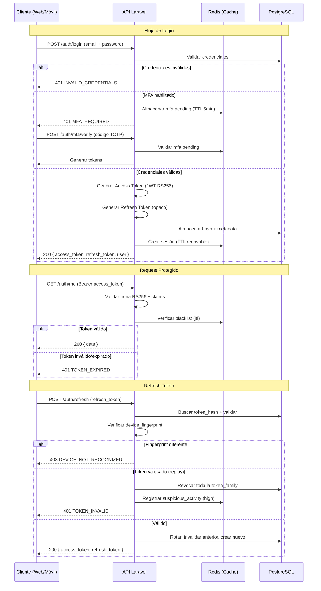

# Especificación Técnica: Implementación de Seguridad JWT para API REST

## Propósito del Documento

Este documento define los estándares, configuraciones y procedimientos de seguridad para la implementación de autenticación y autorización basada en JWT en el API REST del sistema de administración de propiedades horizontales. Su objetivo es garantizar la confidencialidad, integridad y disponibilidad de los datos.

---

## 1. Arquitectura de Seguridad JWT

### 1.1 Flujo de Autenticación



### 1.2 Estrategia de Doble Token (Access + Refresh)

| Aspecto | Access Token | Refresh Token |
|---------|-------------|---------------|
| **Tipo** | JWT firmado (JWS) | Token opaco (string aleatorio criptográfico) |
| **Duración** | 15 minutos | 7 días (web) / 30 días (móvil) |
| **Almacenamiento servidor** | No (stateless) | Sí (hash en PostgreSQL) |
| **Almacenamiento cliente** | Memoria (web) / Keychain (móvil) | Cookie httpOnly (web) / Keychain (móvil) |
| **Uso** | Cada request a API | Solo endpoint `/auth/refresh` |
| **Revocación** | Blacklist en Redis (TTL = tiempo restante) | Eliminación de registro en DB |
| **Rotación** | No | Sí, en cada uso |

---

## 2. Estructura de Base de Datos para Seguridad

> [!info]
> Para consultar el Modelo de base de datos -> [[API_DATABASE]]
---

## 3. Configuración Crítica de JWT

### 3.1 Algoritmo de Firma

**Obligatorio: RS256 (RSA con SHA-256)**

| Parámetro | Valor | Justificación |
|-----------|-------|---------------|
| Algoritmo | `RS256` | Asimétrico: permite verificar tokens sin exponer la clave privada |
| Longitud clave RSA | 4096 bits | Resistencia a factorización cuántica (NIST recomienda mínimo 2048, 4096 para datos financieros) |
| Formato clave | PKCS#8 (privada), PKCS#1/PKCS#8 (pública) | Estándar moderno |
| Rotación de claves | Cada 90 días | Política de rotación automática |
| Claves previas | Mantener 2 generaciones | Permite validar tokens emitidos recientemente durante rotación |

**Prohibido:** HS256 (HMAC simétrico) en producción. El secreto compartido expone la firma si cualquier servicio se ve comprometido.

### 3.2 Claims del Access Token (JWT Payload)

```json
{
  "jti": "uuid-v7-del-token",
  "sub": "uuid-v7-del-usuario",
  "iss": "https://api.urbania.com",
  "aud": ["api.urbania.com", "web.urbania.com", "app.urbania"],
  "iat": 1717776000,
  "nbf": 1717776000,
  "exp": 1717776900,
  "role": "admin",
  "mfa_verified": true,
  "session_id": "uuid-v7-de-la-sesion",
  "device_fp": "hash-del-fingerprint"
}
```

> [!note] Nota sobre autorización (MVP)
> - Los permisos se derivan del `role` (enum UserRole: `admin` o `user`), almacenado en `users.role` (ver [[API_DATABASE]] §2.1).
> - **NO** se implementa el claim `scope` de OAuth2 en el MVP — el token no incluye ese campo.
> - Para autorización granular en el futuro (ej: permisos de solo lectura sobre un recurso específico), se evaluará la necesidad de una tabla `permissions` post-MVP.

| Claim | Descripción | Validación Obligatoria |
|-------|-------------|----------------------|
| `jti` (JWT ID) | UUID v7 único por token | Verificar en blacklist de Redis antes de aceptar |
| `sub` (Subject) | UUID v7 del usuario | Coincidir con usuario activo en DB |
| `iss` (Issuer) | URL del emisor | Debe ser exactamente `https://api.urbania.com` |
| `aud` (Audience) | Array de audiencias permitidas | Debe contener el identificador del cliente solicitante |
| `iat` (Issued At) | Timestamp de emisión | No aceptar tokens con `iat` en el futuro (tolerancia: 30 segundos de drift) |
| `nbf` (Not Before) | Timestamp de inicio de validez | No procesar antes de este tiempo |
| `exp` (Expiration) | Timestamp de expiración | Rechazar si `exp < now()` |
| `role` | Rol del usuario (`admin`/`user`) | Usar para autorización de alto nivel |
| `mfa_verified` | Indica si MFA fue validado | Si `mfa_enabled=true` en usuario, este claim debe ser `true` |
| `session_id` | ID de la sesión | Vincular con refresh token family |
| `device_fp` | Fingerprint del dispositivo | Comparar con request actual (alertar si difiere significativamente) |

### 3.3 Parámetros Temporales

| Parámetro | Valor | Justificación |
|-----------|-------|---------------|
| **Access Token TTL** | 15 minutos (900 segundos) | Balance entre seguridad y UX. Datos financieros justifican ventanas cortas |
| **Refresh Token TTL (Web)** | 7 días (604800 segundos) | Identificado por User-Agent que contiene: `Mobile|Android|iPhone|iPad|iPod|Windows Phone` → móvil, de lo contrario web |
| **Refresh Token TTL (Móvil)** | 30 días (2592000 segundos) | UX mejorada para apps móviles, compensado con fingerprinting |
| **Clock Skew Tolerancia** | 30 segundos | Evitar rechazos por desincronización de relojes |
| **Max Refresh Token Chain** | 50 rotaciones | Detectar robo si un token se rota excesivamente |
| **Absolute Session Max** | 30 días | Límite absoluto de vida de una sesión, independiente de rotaciones |

> [!warning] Nota sobre Max Refresh Token Chain (50)
> Este es un límite de seguridad para detectar anomalías. Si una cadena de rotación excede 50 tokens, se considera sospechosa y se registra un evento `suspicious_activity` con severidad `medium`. No revoca automáticamente la sesión, pero alerta al equipo de seguridad para revisión.

> [!note] Detección Web vs Móvil
> El servidor identifica el tipo de cliente analizando
> el header `User-Agent`. Si contiene `Mobile|Android|iPhone|iPad|iPod|Windows Phone`, 
> se considera móvil (TTL 30 días). De lo contrario, web (TTL 7 días).
> 
> ```php
> $isMobile = preg_match('/Mobile|Android|iPhone|iPad|iPod|Windows Phone/i', $userAgent);
> $ttl = $isMobile ? 2592000 : 604800; // 30 días vs 7 días
> ```

### 3.4 Configuración de Redis

| Clave | Formato | TTL | Propósito |
|-------|---------|-----|-----------|
| `jwt:blacklist:{jti}` | `"1"` | Tiempo restante hasta exp del token | Revocación de access tokens |
| `session:{session_id}` | Hash: `user_id`, `device_fp`, `last_activity` | 15 min (renovado con cada request) | Seguimiento de sesiones activas |
| `rate:login:{ip}` | Contador | 15 min | Rate limiting de login por IP |
| `rate:login:{email}` | Contador | 15 min | Rate limiting de login por email |
| `mfa:pending:{user_id}` | Token temporal MFA | 5 min | Estado de MFA pendiente |

---

## 4. Mecanismos de Protección

### 4.1 Rate Limiting

| Endpoint | Límite | Ventana | Acción al exceder |
|----------|--------|---------|-------------------|
| `POST /auth/login` | 5 intentos | 15 minutos | Bloquear IP + email por 1 hora, registrar evento `suspicious_activity` |
| `POST /auth/refresh` | 10 intentos | 15 minutos | Revocar todos los refresh tokens de la familia sospechosa |
| `POST /auth/mfa/verify` | 3 intentos | 5 minutos | Invalidar flujo MFA, requerir re-login |
| `POST /auth/forgot-password` | 3 solicitudes | 1 hora | Bloquear email por 24 horas |
| API general (autenticado) | 1000 requests | 1 minuto | 429 Too Many Requests |

### 4.2 Detección de Reutilización de Refresh Token (Token Rotation Attack)

**Escenario de ataque:** Atacante roba un refresh token. Usuario legítimo lo usa normalmente, generando un nuevo par. Atacante intenta usar el token robado.

**Mitigación:**
1. Cada refresh token pertenece a una `token_family`.
2. Al usar un refresh token, se genera uno nuevo con el mismo `token_family`.
3. Se almacena el `previous_token_hash` para trazabilidad.
4. Si un refresh token ya usado (cuyo hash ya tiene un `previous_token_hash` registrado) se presenta nuevamente:
   - **Revocar toda la `token_family`** (todas las sesiones del usuario en esa familia).
   - **Notificar al usuario** (email: "Detectamos un inicio de sesión sospechoso").
   - **Registrar evento** `suspicious_activity` con severidad `high`.
   - **Requerir re-autenticación completa** (email + password + MFA).

### 4.3 Validación de Dispositivo

**Responsabilidad**: El servidor CALCULA el fingerprint a partir de los headers de la request.
**El cliente NO envía `X-Device-Fingerprint`** (ese header está deprecado). En su lugar, el servidor usa:

```php
device_fingerprint = hash('sha256', implode('|', [
    $request->userAgent(),
    $request->ip(),  // Se usa IP completa, no /24 para consistencia
    $request->header('Accept-Language', ''),
    $request->header('X-Device-Name', '')  // Opcional, para mostrar al usuario
]));
```

**Header X-Device-Fingerprint**: Este header ha sido DEPRECADO. El cliente NO debe enviarlo. El servidor lo calcula automáticamente.

**Reglas:**
- Si un refresh token se usa desde un `device_fingerprint` diferente al original, requerir re-autenticación completa.
- Permitir al usuario ver y revocar sesiones activas desde su perfil.
- Enviar notificación por email/SMS de nuevo dispositivo detectado.

> [!note] Estrategia para usuarios móviles
> Las IPs dinámicas (NAT, cambio de red)
> pueden causar falsos positivos. Se recomienda:
> - Permitir 1 cambio de IP cada 24h sin requerir re-autenticación
> - Usar subnet /24 como fallback si la IP completa cambia frecuentemente
> - Combinar con `Accept-Language` y `X-Device-Name` para reducir falsos positivos

### 4.4 Revocación de Tokens

**Causas de revocación inmediata:**

| Evento | Tokens afectados | Acción adicional |
|--------|-----------------|------------------|
| Cierre de sesión por usuario | Access (blacklist) + Refresh (DB) | Limpiar sesión de Redis |
| Cambio de contraseña | Todos los refresh tokens del usuario | Notificar por email |
| Cambio de email | Todos los tokens del usuario | Requerir verificación de nuevo email |
| Habilitar/deshabilitar MFA | Todos los tokens del usuario | Requerir re-login |
| Suspensión de cuenta | Todos los tokens del usuario | Registrar evento `account_locked` |
| Detección de rotación ilegítima | Toda la `token_family` | Forzar re-autenticación completa |
| Rol modificado por admin | Todos los tokens del usuario | Próximo request obtendrá error 403, re-login para nuevo token |

---

## 5. Headers HTTP de Seguridad

### 5.1 Headers Obligatorios en Respuestas API

| Header | Valor | Propósito |
|--------|-------|-----------|
| `Strict-Transport-Security` | `max-age=31536000; includeSubDomains; preload` | Forzar HTTPS |
| `X-Content-Type-Options` | `nosniff` | Prevenir MIME sniffing |
| `X-Frame-Options` | `DENY` | Prevenir clickjacking |
| `Content-Security-Policy` | `default-src 'none'; frame-ancestors 'none'` | CSP estricto para API |
| `Referrer-Policy` | `strict-origin-when-cross-origin` | Control de referrer |
| `Permissions-Policy` | `accelerometer=(), camera=(), geolocation=(), gyroscope=(), magnetometer=(), microphone=(), payment=(), usb=()` | Deshabilitar APIs del navegador |

### 5.2 Headers de Request (Validación)

| Header | Validación | Acción si falla |
|--------|-----------|-----------------|
| `Authorization` | Formato: `Bearer {jwt}` | 401 Unauthorized |
| `X-Request-ID` | UUID v7 generado por cliente | Usar para trazabilidad de logs |
| `User-Agent` | Longitud máxima 512 caracteres | Truncar, no rechazar |
| `Origin` | Debe coincidir con `aud` del token | 403 Forbidden si no coincide |

---

## 6. Almacenamiento Seguro en Clientes

### 6.1 Aplicación Web

| Token | Almacenamiento | Justificación |
|-------|---------------|---------------|
| Access Token | `sessionStorage` | Se elimina al cerrar pestaña. No persistente |
| Refresh Token | Cookie `httpOnly; Secure; SameSite=Strict` | Inaccesible para JavaScript. Solo se envía al endpoint de refresh |

**Configuración de cookie de refresh token:**
```
Set-Cookie: refresh_token={opaque_token}; 
  HttpOnly; 
  Secure; 
  SameSite=Strict; 
  Path=/auth/refresh; 
  Max-Age=604800;
  Partitioned;  // CHIPS para privacidad
```

### 6.2 Aplicación Móvil

| Token | Almacenamiento | Justificación |
|-------|---------------|---------------|
| Access Token | Keychain (iOS) / Keystore (Android) | Almacenamiento cifrado del SO |
| Refresh Token | Keychain (iOS) / Keystore (Android) | Con `kSecAttrAccessibleWhenUnlockedThisDeviceOnly` |

**Consideraciones móviles:**
- Implementar biometric auth (Face ID / Touch ID / fingerprint) antes de usar refresh token.
- Invalidar tokens al detectar jailbreak/root.
- Usar cert pinning para conexiones al API.

---

## 7. Multi-Factor Authentication (MFA)

### 7.1 Flujo MFA

```
1. Login con email + password
2. Si MFA habilitado:
   a. Generar código TOTP (6 dígitos, 30s ventana)
   b. Almacenar estado `mfa:pending:{user_id}` en Redis (TTL: 5 min)
   c. Retornar 401 Unauthorized con `error.code = "MFA_REQUIRED"`. Ver [[endpoints/AUTH]] §1.1
3. Cliente solicita `/auth/mfa/verify` con código
4. Validar código contra secreto TOTP del usuario
5. Si válido:
   a. Generar Access Token con `mfa_verified: true`
   b. Generar Refresh Token
   c. Limpiar estado pending de Redis
```

### 7.2 Códigos de Respaldo

- Generar 10 códigos de respaldo de uso único al habilitar MFA.
- Almacenar hash (Argon2id) de cada código en `users.mfa_backup_codes` (columna JSONB en PostgreSQL).

Estructura del JSONB:
```json
[
    {"hash": "$argon2id$v=19$...", "used_at": null},
    {"hash": "$argon2id$v=19$...", "used_at": null}
]
```
Ver [[API_DATABASE]] §2.1 para la definición exacta de la columna mfa_backup_codes.
- Mostrar al usuario solo una vez durante la configuración.
- Invalidar todos los códigos y regenerar al deshabilitar/habilitar MFA.


### 7.3 TOTP Configuración

| Parámetro | Valor | Nota |
|-----------|-------|------|
| Algoritmo | SHA-256 | Google Authenticator, Authy, y Microsoft Authenticator soportan SHA-256 desde 2020. SHA-1 está deprecado. |
| Dígitos | 6 | — |
| Período | 30 segundos | — |
| Ventana de validación | ±1 período (90 segundos totales) | — |
| Secreto | 160 bits (32 chars base32) | — |
| Encriptación en DB | AES-256-GCM con clave de aplicación | Columna `mfa_secret` en `users` |

> [!note] Librería recomendada
> `pragmarx/google2fa-laravel` (compatible con Google Authenticator, Authy, Microsoft Authenticator).
> Instalación: `composer require pragmarx/google2fa-laravel`
>
> **Configuración de algoritmo SHA-256**: El paquete usa SHA-1 por defecto. 
> Para usar SHA-256 como especificado en este documento, configurar explícitamente:
> ```php
> use PragmaRX\Google2FA\Support\Constants;
> $google2fa->setAlgorithm(Constants::SHA256);
> ```
> Ver [documentación oficial](https://github.com/antonioribeiro/google2fa#hmac-algorithms).

### 7.4 Endpoints MFA (API Contract)

| Endpoint | Método | Descripción |
|----------|--------|-------------|
| `/api/v1/auth/mfa/setup` | POST | Iniciar configuración MFA (generar secreto TOTP, retornar QR y backup codes) |
| `/api/v1/auth/mfa/enable` | POST | Confirmar y activar MFA con código TOTP (tras /mfa/setup) |
| `/api/v1/auth/mfa/verify` | POST | Verificar código TOTP durante login (tipo `login`) |
| `/api/v1/auth/mfa/verify-backup` | POST | Verificar código de respaldo durante login |
| `/api/v1/auth/mfa/disable` | POST | Deshabilitar MFA (requiere contraseña + código TOTP) |
| `/api/v1/auth/mfa/backup-codes` | POST | Regenerar códigos de respaldo |

> [!note] Nota
> Detalles de request/response en [[API_CONTRACT]] Sección 1 (Autenticación).

---

## 8. Auditoría y Logging

### 8.1 Eventos a Registrar (Obligatorios)

| Evento | Nivel | Datos a incluir |
|--------|-------|-----------------|
| Login exitoso | INFO | user_id, ip, user_agent, device_fp, mfa_used |
| Login fallido | WARNING | email_attempted, ip, user_agent, failure_reason |
| Logout | INFO | user_id, ip, session_id |
| Token refresh | INFO | user_id, session_id, device_fp |
| Token revocado | INFO | user_id, session_id, revocation_reason |
| Rotación ilegítima detectada | CRITICAL | user_id, ip, token_family, device_fp |
| Cambio de contraseña | INFO | user_id, ip |
| MFA habilitado/deshabilitado | INFO | user_id, ip |
| Cuenta bloqueada | WARNING | user_id, ip, reason |
| Acceso desde nuevo dispositivo | WARNING | user_id, ip, device_fp_old, device_fp_new |

### 8.2 Retención de Logs

| Tipo de dato | Retención | Destino final |
|-------------|-----------|---------------|
| Logs de aplicación | 90 días | S3 Glacier después de 90 días |
| `login_attempts` | 1 año | Archivar en almacenamiento frío |
| `security_events` | 2 años | Requerimiento regulatorio (datos financieros) |
| `refresh_tokens` (revocados/expirados) | 1 año | Anonimizar después de 1 año |

---

## 9. Checklist de Implementación

### Pre-despliegue

- [ ] Claves RSA generadas (4096 bits, permisos 600/644)
- [ ] Variables .env configuradas (JWT_ALGO=RS256, paths de claves)
- [ ] Redis configurado para blacklist y sesiones
- [ ] Rate limiting activado en todos los endpoints sensibles
- [ ] Headers de seguridad HTTP configurados
- [ ] Logs de auditoría habilitados y retención configurada
- [ ] MFA testeado con al menos 2 aplicaciones autenticadoras
- [ ] Penetration testing básico completado (login brute force, token replay)
- [ ] Todas las sesiones de seguridad del plan estan completadas (Sesion 3: JWT Service, Sesion 5: Endpoints basicos, Sesion 6: Seguridad avanzada)

### Post-despliegue (Monitoreo continuo)

- [ ] Alertas configuradas para rotación ilegítima de refresh tokens
- [ ] Revisión semanal de logs de seguridad (security_events)
- [ ] Rotación automática de claves RSA cada 90 días (cron)
- [ ] Monitoreo de rate limiting (detección de patrones de ataque)
- [ ] Revisión trimestral de scopes y permisos de usuarios
- [ ] Backup de claves RSA en HSM/vault seguro
- [ ] Actualizar [[API_SESSION_MANIFEST]] con eventos de seguridad detectados en monitoreo


---

## 10. Diagrama de Estados de Sesión

```
                    ┌─────────────┐
                    │   INICIO    │
                    │  (Login)    │
                    └──────┬──────┘
                           │
              ┌────────────┼────────────┐
              ▼            ▼            ▼
        ┌─────────┐  ┌─────────┐  ┌─────────┐
        │MFA Req. │  │  Error  │  │ Directo │
        │Pendiente│  │Credenciales│ (sin MFA)│
        └────┬────┘  └─────────┘  └────┬────┘
             │                          │
             ▼                          ▼
        ┌─────────┐               ┌─────────┐
        │MFA Válido│              │ ACTIVA  │
        └────┬────┘               │(Tokens  │
             │                    │válidos) │
             └────────────────────┘    │
                                        │
        ┌───────────────────────────────┼───────────────────────────────┐
        │                               │                               │
        ▼                               ▼                               ▼
   ┌─────────┐                    ┌─────────┐                    ┌─────────┐
   │ Refresh │                    │ Logout  │                    │ Expirada│
   │ Token   │                    │Usuario  │                    │(Absoluta│
   └────┬────┘                    └────┬────┘                    └────┬────┘
        │                              │                              │
        ▼                              ▼                              ▼
   ┌─────────┐                    ┌─────────┐                    ┌─────────┐
   │ ACTIVA  │                    │REVOCADA │                    │REVOCADA │
   │(Nuevo  │                    │(Tokens  │                    │(Tokens  │
   │par)    │                    │eliminados)│                  │eliminados)│
   └─────────┘                    └─────────┘                    └─────────┘
        │
        │ (Reutilización detectada)
        ▼
   ┌─────────┐
   │COMPROMETIDA│
   │(Familia   │
   │revocada)  │
   └─────────┘
```

---

## 11. Referencias

- RFC 7519 - JSON Web Token (JWT)
- RFC 7518 - JSON Web Algorithms (JWA)
- RFC 7517 - JSON Web Key (JWK)
- NIST SP 800-63B - Digital Identity Guidelines (Authentication and Lifecycle Management)
- OWASP Authentication Cheat Sheet
- OWASP JWT Security Cheat Sheet
- BCP 195 - Recommendations for Secure Use of TLS and DTLS