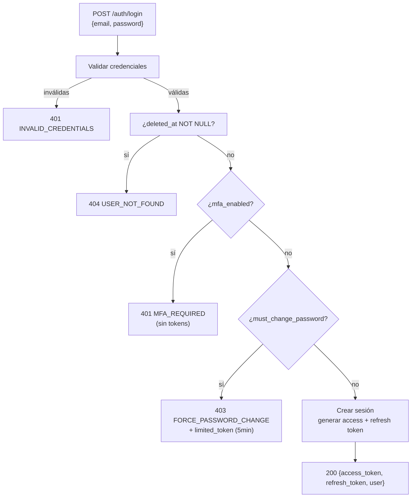
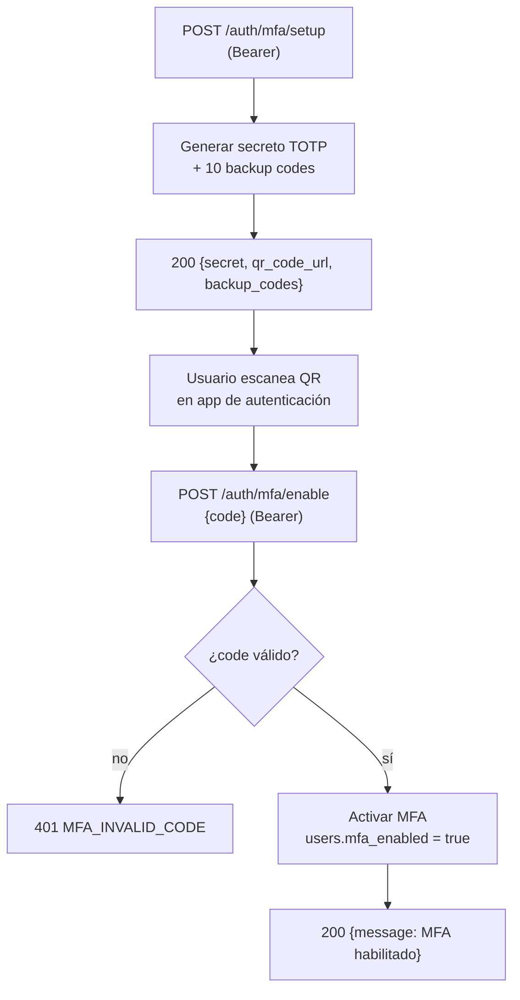

# Endpoints: Autenticación

> [!info] Consultar
> Documento de detalle de los endpoints del módulo Auth.
> Para el índice general de endpoints, ver [[API_CONTRACT]].
> Para convenciones globales (Base URL, headers, formato de respuesta, códigos de error), ver [[API_CONTRACT]] §Convenciones Generales.
> Para detalles de seguridad JWT (claims, rotación, blacklist, device fingerprint), ver [[API_JWT_IMPLEMENTATION]].

---

## Endpoints en este documento

| # | Método | Ruta | Auth | Estado |
|---|--------|------|------|--------|
| 1.1 | POST | /auth/login | No | Implementado |
| 1.2 | POST | /auth/register | No | Implementado |
| 1.3 | POST | /auth/logout | Sí | Implementado |
| 1.4 | POST | /auth/refresh | No (refresh_token en body) | Implementado |
| 1.5 | GET | /auth/me | Sí | Implementado |
| 1.6 | POST | /auth/forgot-password | No | Implementado |
| 1.7 | POST | /auth/reset-password | No | Implementado |
| 1.8 | GET | /auth/sessions | Sí | Implementado |
| 1.9 | DELETE | /auth/sessions | Sí | Implementado |
| 1.10 | DELETE | /auth/sessions/{session_id} | Sí | Implementado |
| 1.11 | POST | /auth/change-password | Sí | Implementado |
| 1.12 | POST | /auth/verify-email | No | Implementado |
| 1.13 | POST | /auth/resend-verification | Sí | Implementado |
| 1.14 | PATCH | /auth/me | Sí | Implementado |
| 1.15 | POST | /auth/mfa/setup | Sí | Implementado |
| 1.16 | POST | /auth/mfa/verify | No* | Implementado |
| 1.17 | POST | /auth/mfa/verify-backup | No* | Implementado |
| 1.18 | POST | /auth/mfa/enable | Sí | Implementado |
| 1.19 | POST | /auth/mfa/disable | Sí | Implementado |
| 1.20 | POST | /auth/mfa/backup-codes | Sí | Implementado |

> `*` `/auth/mfa/verify` y `/auth/mfa/verify-backup` se usan tanto durante login (sin token, tras credenciales válidas) como ya autenticado; ver §1.16-§1.17.

---

## §1.1 Login

```
POST /api/v1/auth/login
```

**Request:**
```json
{
  "email": "juan.perez@email.com",
  "password": "SecurePass123!"
}
```

**Response 200:**
```json
{
  "data": {
    "access_token": "eyJhbGciOiJSUzI1NiIs...",
    "refresh_token": "eyJhbGciOiJSUzI1NiIs...",
    "token_type": "bearer",
    "expires_in": 900,
    "user": {
      "id": "550e8400-e29b-41d4-a716-446655440000",
      "name": "Juan Perez",
      "email": "juan.perez@email.com",
      "phone": "3001234567",
      "unit": "Apto 101",
      "role": "user",
      "status": "active",
      "avatar_url": null
    }
  },
  "meta": {
    "trace_id": "550e8400-e29b-41d4-a716-446655440000"
  }
}
```

**Response 401:**
```json
{
  "error": {
    "code": "INVALID_CREDENTIALS",
    "message": "Las credenciales proporcionadas son incorrectas",
    "trace_id": "550e8400-e29b-41d4-a716-446655440000"
  }
}
```

**Response 403 (contraseña expirada / cambio forzado):**
```json
{
  "error": {
    "code": "FORCE_PASSWORD_CHANGE",
    "message": "Debes cambiar tu contraseña antes de continuar",
    "trace_id": "550e8400-e29b-41d4-a716-446655440000"
  },
  "data": {
    "limited_token": "eyJhbGciOiJSUzI1NiIs...",
    "token_type": "bearer",
    "expires_in": 300
  }
}
```

> [!note] `limited_token`
> Cuando `must_change_password = true`, el login retorna **403** (no 200) con un `limited_token` de vida corta (5 minutos).
> Este token **solo es válido** para `POST /auth/change-password` — cualquier otro endpoint rechazará el token con `403 FORBIDDEN`.
> El claim `scope` de este token es `["change-password"]` (excepción de implementación al MVP sin scope general).
> Tras cambiar la contraseña exitosamente, el `limited_token` queda revocado y el usuario debe hacer login normal para obtener un token completo.

### Diseño

- **Precondiciones:** email válido, password válido, usuario con `status = active`
- **Reglas de negocio:**
  - Si el usuario tiene `mfa_enabled = true` → retorna **401** con `error.code = "MFA_REQUIRED"` (sin tokens). El cliente debe completar el flujo MFA con §1.16 o §1.17
  - Si el usuario tiene `must_change_password = true` → retorna **403** con `FORCE_PASSWORD_CHANGE` + `limited_token` (5 min de vida, scope limitado a `change-password`)
  - Si el usuario autenticado tiene `deleted_at NOT NULL` → retorna **404** con `USER_NOT_FOUND`. Solo administradores pueden acceder a usuarios eliminados
- **Side effects:**
  - Crea una nueva sesión con device fingerprint (calculado automáticamente desde `User-Agent`, `IP`, `Accept-Language` y `X-Device-Name` opcional — ver [[API_JWT_IMPLEMENTATION]] §4.3)
  - Genera par access_token (15 min) + refresh_token (30 días)
  - Loggea evento de seguridad de login exitoso
- **Casos borde:**
  - Rate limiting: 5 intentos por 15 minutos por IP+email (ver [[API_CONTRACT]] §Rate Limiting)
  - El `X-Device-Fingerprint` header está **deprecado** — el servidor lo calcula automáticamente

### Flujo



---

## §1.2 Register

```
POST /api/v1/auth/register
```

**Request:**
```json
{
  "name": "Juan Perez",
  "email": "juan.perez@email.com",
  "password": "SecurePass123!",
  "password_confirmation": "SecurePass123!",
  "phone": "3001234567",
  "unit": "Apto 205"
}
```

> [!note]
> El registro solo requiere datos básicos del usuario. La asociación con una propiedad/unidad queda fuera del alcance de este módulo y de esta documentación.

**Response 201:**
```json
{
  "data": {
    "id": "550e8400-e29b-41d4-a716-446655440000",
    "name": "Juan Perez",
    "email": "juan.perez@email.com",
    "phone": "3001234567",
    "unit": "Apto 205",
    "role": "user",
    "status": "active",
    "message": "Registro exitoso. Bienvenido a Urbania."
  },
  "meta": {
    "trace_id": "550e8400-e29b-41d4-a716-446655440000"
  }
}
```

### Diseño

- **Precondiciones:** email no registrado previamente, password cumple políticas de seguridad
- **Reglas de negocio:**
  - El usuario se crea con `role = "user"` y `status = "active"` por defecto
  - No se generan tokens en el registro — el usuario debe hacer login después (ver [[API_CONTRACT]] §Flujos Comunes)
  - La asociación con propiedad/unidad queda fuera del alcance de este módulo
- **Side effects:**
  - Crea registro en tabla `users`
  - Genera token de verificación de email y envía correo de verificación
- **Casos borde:**
  - Rate limiting: 3 intentos por 1 hora por IP (ver [[API_CONTRACT]] §Rate Limiting)
  - Si el email ya existe → **409** `EMAIL_ALREADY_EXISTS`

---

## §1.3 Logout

```
POST /api/v1/auth/logout
```

**Headers:**
```
Authorization: Bearer <jwt_token>
```

**Response 204:** (No Content)

### Diseño

- **Precondiciones:** token válido (access_token en header)
- **Side effects:**
  - Revoca el `refresh_token` de la sesión actual (no todas las sesiones)
  - El `access_token` queda en blacklist hasta su expiración natural (15 min)
  - Loggea evento de logout

---

## §1.4 Refresh Token

```
POST /api/v1/auth/refresh
```

**Request:**
```json
{
  "refresh_token": "eyJhbGciOiJSUzI1NiIs..."
}
```

**Response 200:**
```json
{
  "data": {
    "access_token": "eyJhbGciOiJSUzI1NiIs...",
    "refresh_token": "eyJhbGciOiJSUzI1NiIs...",
    "token_type": "bearer",
    "expires_in": 900
  },
  "meta": {
    "trace_id": "550e8400-e29b-41d4-a716-446655440000"
  }
}
```

### Diseño

- **Precondiciones:** `refresh_token` válido y no revocado
- **Reglas de negocio:**
  - Rotación de refresh token: cada uso genera un nuevo refresh_token e invalida el anterior
  - Detección de reutilización: si se usa un refresh_token ya rotado, el servidor revoca **toda la cadena de sesiones** derivada de ese token (ver [[API_JWT_IMPLEMENTATION]] §5)
- **Side effects:**
  - Genera nuevo access_token (15 min) + nuevo refresh_token (30 días)
  - Invalida el refresh_token usado en la request
  - Actualiza `last_used_at` de la sesión

> [!warning] Importante para clientes
> El interceptor Axios de Web excluye este endpoint del flujo de silent refresh para evitar bucles infinitos. Ver [[WEB_AUTH_IMPLEMENTATION]] §3-§4.

---

## §1.5 Me (Perfil Actual)

```
GET /api/v1/auth/me
```

**Headers:**
```
Authorization: Bearer <jwt_token>
```

**Response 200:**
```json
{
  "data": {
    "id": "550e8400-e29b-41d4-a716-446655440000",
    "name": "Juan Perez",
    "email": "juan.perez@email.com",
    "phone": "3001234567",
    "unit": "Apto 101",
    "role": "user",
    "status": "active",
    "avatar_url": null
  },
  "meta": {
    "trace_id": "550e8400-e29b-41d4-a716-446655440000"
  }
}
```

### Diseño

- **Precondiciones:** token válido
- **Reglas de negocio:** retorna los datos del usuario autenticado según el claim `sub` del JWT
- **Side effects:** ninguno — lectura pura

---

## §1.6 Forgot Password

```
POST /api/v1/auth/forgot-password
```

**Request:**
```json
{
  "email": "juan.perez@email.com"
}
```

> [!note]
> Se requiere el email para enviar el enlace de recuperación.
> La tabla `password_reset_tokens` usa `email` como clave primaria.

**Response 200:**
```json
{
  "data": {
    "message": "Se ha enviado un enlace de recuperación a tu correo electrónico"
  },
  "meta": {
    "trace_id": "550e8400-e29b-41d4-a716-446655440000"
  }
}
```

### Diseño

- **Precondiciones:** ninguna — endpoint público
- **Reglas de negocio:**
  - Por seguridad, siempre retorna 200 incluso si el email no existe (no revelar si un email está registrado)
  - Genera token de recuperación y almacena en `password_reset_tokens` (email como PK)
  - Envía email con enlace de recuperación
- **Side effects:**
  - Crea/reemplaza registro en `password_reset_tokens`
  - Envía correo electrónico
- **Casos borde:**
  - Rate limiting: 3 intentos por 1 hora por IP+email (ver [[API_CONTRACT]] §Rate Limiting)

---

## §1.7 Reset Password

```
POST /api/v1/auth/reset-password
```

**Request:**
```json
{
  "email": "juan.perez@email.com",
  "token": "reset-token-from-email",
  "password": "NewPassword123!",
  "password_confirmation": "NewPassword123!"
}
```

**Response 200:**
```json
{
  "data": {
    "message": "Contraseña actualizada exitosamente"
  },
  "meta": {
    "trace_id": "550e8400-e29b-41d4-a716-446655440000"
  }
}
```

### Diseño

- **Precondiciones:** token válido y no expirado, email + token coinciden en `password_reset_tokens`
- **Side effects:**
  - Actualiza password del usuario (hash Argon2id)
  - Invalida el token de recuperación
  - Opcionalmente revoca sesiones activas (verificar implementación actual)

---

## §1.8 Listar Sesiones Activas

```
GET /api/v1/auth/sessions
```

**Headers:**
```
Authorization: Bearer <jwt_token>
```

**Response 200:**
```json
{
  "data": {
    "sessions": [
      {
        "session_id": "550e8400-e29b-41d4-a716-446655440000",
        "device_name": "Chrome 125 en Windows 10",
        "device_fingerprint": "a1b2c3d4...",
        "ip_address": "192.168.1.1",
        "last_used_at": "2026-06-07T12:00:00Z",
        "created_at": "2026-06-01T10:00:00Z",
        "is_current": true
      }
    ]
  },
  "meta": {
    "trace_id": "550e8400-e29b-41d4-a716-446655440000"
  }
}
```

### Diseño

- **Precondiciones:** token válido
- **Reglas de negocio:**
  - Marca `is_current = true` en la sesión correspondiente al token usado en la request
  - Solo muestra sesiones activas (no revocadas ni expiradas)
- **Side effects:** ninguno — lectura pura

> [!note] Estrategia de cache en Web
> `staleTime: 0` (siempre stale) — información de seguridad, siempre se revalida al entrar a `/settings/security`. Ver [[WEB_API_CLIENT]] §4.

---

## §1.9 Revocar Todas las Sesiones (excepto actual)

```
DELETE /api/v1/auth/sessions
```

**Headers:**
```
Authorization: Bearer <jwt_token>
```

**Response 204:** (No Content)

### Diseño

- **Precondiciones:** token válido
- **Side effects:**
  - Revoca todas las sesiones del usuario **excepto** la sesión actual
  - Los refresh_tokens de las sesiones revocadas quedan invalidados
  - Loggea evento de seguridad

---

## §1.10 Revocar Sesión Específica

```
DELETE /api/v1/auth/sessions/{session_id}
```

**Headers:**
```
Authorization: Bearer <jwt_token>
```

**Response 204:** (No Content)

**Response 404:**
```json
{
  "error": {
    "code": "SESSION_NOT_FOUND",
    "message": "Sesión no encontrada o ya revocada",
    "trace_id": "550e8400-e29b-41d4-a716-446655440000"
  }
}
```

### Diseño

- **Precondiciones:** token válido, `session_id` pertenece al usuario autenticado
- **Casos borde:**
  - Si la sesión no existe o ya está revocada → **404** `SESSION_NOT_FOUND`
  - No se puede revocar la sesión actual por este endpoint (usar logout §1.3)

---

## §1.11 Cambiar Contraseña (Autenticado)

```
POST /api/v1/auth/change-password
```

**Headers:**
```
Authorization: Bearer <jwt_token>
```

**Request:**
```json
{
  "current_password": "SecurePass123!",
  "new_password": "NewSecurePass456!",
  "new_password_confirmation": "NewSecurePass456!"
}
```

**Response 200:**
```json
{
  "data": {
    "message": "Contraseña actualizada exitosamente. Se han revocado todas las sesiones activas."
  },
  "meta": {
    "trace_id": "550e8400-e29b-41d4-a716-446655440000"
  }
}
```

**Response 400:**
```json
{
  "error": {
    "code": "PASSWORD_REUSED",
    "message": "La nueva contraseña no puede ser una de las 12 últimas utilizadas",
    "trace_id": "550e8400-e29b-41d4-a716-446655440000"
  }
}
```

### Diseño

- **Precondiciones:** `current_password` correcta, token válido
  - Excepción: el `limited_token` del flujo `FORCE_PASSWORD_CHANGE` (§1.1) también es válido aquí — es el único endpoint que acepta `limited_token`
- **Reglas de negocio:**
  - La nueva contraseña no puede ser una de las **12 últimas utilizadas** (historial de passwords)
  - Si se repite → **400** `PASSWORD_REUSED`
- **Side effects:**
  - Actualiza password del usuario (hash Argon2id)
  - **Revoca TODAS las sesiones activas, incluida la actual** — el usuario debe hacer login nuevamente
  - Si se usó `limited_token`, queda revocado tras el cambio exitoso
  - Loggea evento de seguridad

> [!warning] Comportamiento crítico para clientes
> Tras un cambio de contraseña exitoso, el cliente debe redirigir al usuario a `/login`. No intentar silent refresh porque todas las sesiones quedaron revocadas.

---

## §1.12 Verificar Email

```
POST /api/v1/auth/verify-email
```

**Request:**
```json
{
  "token": "verification-token-from-email"
}
```

**Response 200:**
```json
{
  "data": {
    "message": "Email verificado exitosamente"
  },
  "meta": {
    "trace_id": "550e8400-e29b-41d4-a716-446655440000"
  }
}
```

### Diseño

- **Precondiciones:** token de verificación válido y no expirado
- **Side effects:**
  - Marca `email_verified_at` en el registro del usuario
  - Invalida el token de verificación

---

## §1.13 Reenviar Verificación de Email

```
POST /api/v1/auth/resend-verification
```

**Headers:**
```
Authorization: Bearer <jwt_token>
```

**Response 200:**
```json
{
  "data": {
    "message": "Se ha enviado un nuevo enlace de verificación a tu correo"
  },
  "meta": {
    "trace_id": "550e8400-e29b-41d4-a716-446655440000"
  }
}
```

### Diseño

- **Precondiciones:** token válido, email no verificado aún
- **Side effects:** genera nuevo token y envía email de verificación

---

## §1.14 Actualizar Perfil

```
PATCH /api/v1/auth/me
```

**Headers:**
```
Authorization: Bearer <jwt_token>
```

**Request:**
```json
{
  "name": "Juan Perez Actualizado",
  "phone": "3009876543",
  "avatar": "base64-encoded-image"
}
```

> [!note] Avatar
> Máximo 2MB. Formatos: JPEG, PNG, WebP.

**Response 200:**
```json
{
  "data": {
    "id": "550e8400-e29b-41d4-a716-446655440000",
    "name": "Juan Perez Actualizado",
    "email": "juan.perez@email.com",
    "phone": "3009876543",
    "unit": "Apto 101",
    "role": "user",
    "status": "active",
    "avatar_url": "https://api.urbania.com/storage/avatars/550e8400-e29b-41d4-a716-446655440000.jpg"
  },
  "meta": {
    "trace_id": "550e8400-e29b-41d4-a716-446655440000"
  }
}
```

### Diseño

- **Precondiciones:** token válido
- **Reglas de negocio:**
  - Todos los campos son opcionales (PATCH parcial)
  - `email` no es modificable por este endpoint
  - `role` y `status` no son modificables por el usuario
  - Avatar: máximo 2MB, formatos JPEG/PNG/WebP
- **Side effects:**
  - Si se envía avatar: almacena la imagen y genera URL pública
  - Actualiza los campos proporcionados en la base de datos

---

## §1.15 MFA - Configurar (Setup)

```
POST /api/v1/auth/mfa/setup
```

**Headers:**
```
Authorization: Bearer <jwt_token>
```

**Response 200:**
```json
{
  "data": {
    "secret": "JBSWY3DPEHPK3PXP",
    "qr_code_url": "otpauth://totp/Urbania:juan.perez@email.com?secret=JBSWY3DPEHPK3PXP&issuer=Urbania",
    "backup_codes": ["12345678", "87654321", "11223344", "44332211", "55667788", "88776655", "99001122", "22110099", "33445566", "66554433"]
  },
  "meta": {
    "trace_id": "550e8400-e29b-41d4-a716-446655440000"
  }
}
```

> [!note]
> Los backup codes se muestran **SOLO** durante el setup. Almacenar hash (Argon2id) en DB.

### Diseño

- **Precondiciones:** token válido, MFA **no** habilitado aún
- **Reglas de negocio:**
  - Genera secreto TOTP único para el usuario
  - Genera 10 backup codes de un solo uso
  - **No activa MFA aún** — esto es el paso 1 de 2. MFA se activa con §1.18 (`mfa/enable`) tras verificar que el usuario escaneó el QR correctamente
- **Side effects:**
  - Almacena el secreto TOTP (cifrado) en la base de datos
  - Almacena hash Argon2id de cada backup code
  - Los backup codes se muestran **una sola vez** en esta respuesta — no se pueden recuperar después

### Flujo (Setup + Enable — dos pasos)



---

## §1.16 MFA - Verificar Código durante Login

```
POST /api/v1/auth/mfa/verify
```

> [!note] Propósito exclusivo: completar el flujo de login MFA
> Este endpoint **solo** se usa para completar un login cuando el servidor retorna `401 MFA_REQUIRED`.
> **No** se usa para verificar el código durante el setup — eso lo hace `POST /auth/mfa/enable` (§1.18).

**Request:**
```json
{
  "code": "123456"
}
```

**Response 200 (tokens de sesión completa):**
```json
{
  "data": {
    "access_token": "eyJhbGciOiJSUzI1NiIs...",
    "refresh_token": "eyJhbGciOiJSUzI1NiIs...",
    "token_type": "bearer",
    "expires_in": 900,
    "user": {
      "id": "550e8400-e29b-41d4-a716-446655440000",
      "name": "Juan Perez",
      "email": "juan.perez@email.com",
      "role": "user",
      "status": "active"
    }
  },
  "meta": {
    "trace_id": "550e8400-e29b-41d4-a716-446655440000"
  }
}
```

### Diseño

- **Precondiciones:** sesión de login pendiente con `MFA_REQUIRED` (el servidor mantiene estado temporal del login parcial)
- **Reglas de negocio:**
  - Verifica el código TOTP contra el secreto del usuario
  - Solo se usa para completar login — **no** para confirmar setup (usar §1.18 para eso)
- **Side effects:**
  - Crea sesión con tokens completos (access + refresh)
  - Loggea evento de login MFA exitoso
- **Casos borde:**
  - Rate limiting: 3 intentos por 5 minutos (ver [[API_CONTRACT]] §Rate Limiting)
  - Código incorrecto → **401** `MFA_INVALID_CODE`

---

## §1.17 MFA - Verificar Código de Respaldo durante Login

```
POST /api/v1/auth/mfa/verify-backup
```

> [!note] Propósito: alternativa a TOTP cuando el usuario no tiene acceso a su app de autenticación
> Se usa en el mismo punto del flujo que §1.16: después de recibir `401 MFA_REQUIRED`.
> Retorna los mismos tokens de sesión completa que §1.16.

**Request:**
```json
{
  "code": "12345678"
}
```

**Response 200 (tokens de sesión completa):**
```json
{
  "data": {
    "access_token": "eyJhbGciOiJSUzI1NiIs...",
    "refresh_token": "eyJhbGciOiJSUzI1NiIs...",
    "token_type": "bearer",
    "expires_in": 900,
    "user": {
      "id": "550e8400-e29b-41d4-a716-446655440000",
      "name": "Juan Perez",
      "email": "juan.perez@email.com",
      "role": "user",
      "status": "active"
    }
  },
  "meta": {
    "trace_id": "550e8400-e29b-41d4-a716-446655440000"
  }
}
```

**Response 401 (código ya usado):**
```json
{
  "error": {
    "code": "MFA_BACKUP_USED",
    "message": "Código de respaldo ya utilizado",
    "trace_id": "550e8400-e29b-41d4-a716-446655440000"
  }
}
```

> [!note]
> Los códigos de respaldo son de un solo uso. Al usarse, se invalidan permanentemente. Ver [[API_JWT_IMPLEMENTATION]] §7.2.

### Diseño

- **Precondiciones:** sesión de login pendiente con `MFA_REQUIRED`
- **Reglas de negocio:**
  - Backup codes son de **un solo uso** — al usarse se invalidan permanentemente
  - Comparación contra hash Argon2id almacenado
- **Side effects:**
  - Crea sesión con tokens completos (access + refresh)
  - Marca el backup code como usado (invalida permanentemente)
  - Loggea evento de login con backup code
- **Casos borde:**
  - Rate limiting: 3 intentos por 5 minutos (ver [[API_CONTRACT]] §Rate Limiting)
  - Código ya usado → **401** `MFA_BACKUP_USED`

---

## §1.18 MFA - Habilitar (confirmar activación)

```
POST /api/v1/auth/mfa/enable
```

> [!note] Propósito: confirmar y activar MFA en la cuenta del usuario
> Este endpoint es el **segundo paso** del flujo de activación: primero `POST /auth/mfa/setup` (§1.15) genera el secreto TOTP, luego este endpoint confirma que el usuario escaneó correctamente el QR verificando un código válido y activa MFA en `users.mfa_enabled = true`.

**Headers:**
```
Authorization: Bearer <jwt_token>
```

**Request:**
```json
{
  "code": "123456"
}
```

**Response 200:**
```json
{
  "data": {
    "message": "MFA habilitado exitosamente"
  },
  "meta": {
    "trace_id": "550e8400-e29b-41d4-a716-446655440000"
  }
}
```

### Diseño

- **Precondiciones:** setup previo completado (§1.15), secreto TOTP generado, MFA no habilitado aún
- **Reglas de negocio:**
  - Verifica el código TOTP contra el secreto generado en setup
  - Si es válido → activa MFA en `users.mfa_enabled = true`
- **Side effects:**
  - Actualiza `mfa_enabled = true` en la base de datos
  - Loggea evento de activación de MFA

---

## §1.19 MFA - Deshabilitar

```
POST /api/v1/auth/mfa/disable
```

**Headers:**
```
Authorization: Bearer <jwt_token>
```

**Request:**
```json
{
  "password": "Usuario2026!",
  "code": "123456"
}
```

**Response 200:**
```json
{
  "data": {
    "message": "MFA deshabilitado exitosamente"
  },
  "meta": {
    "trace_id": "550e8400-e29b-41d4-a716-446655440000"
  }
}
```

### Diseño

- **Precondiciones:** MFA habilitado, `password` correcta, `code` TOTP válido
- **Reglas de negocio:**
  - Doble verificación: password + código TOTP (no acepta backup code aquí)
  - Requiere reautenticación para desactivar MFA (medida de seguridad)
- **Side effects:**
  - Actualiza `mfa_enabled = false`
  - Invalida el secreto TOTP
  - Loggea evento de seguridad (desactivación de MFA es un evento sensible)

---

## §1.20 MFA - Regenerar Backup Codes

```
POST /api/v1/auth/mfa/backup-codes
```

**Headers:**
```
Authorization: Bearer <jwt_token>
```

**Response 200:**
```json
{
  "data": {
    "backup_codes": ["99887766", "66554433", "11223344", "44332211", "55667788", "88776655", "99001122", "22110099", "33445566", "12345678"]
  },
  "meta": {
    "trace_id": "550e8400-e29b-41d4-a716-446655440000"
  }
}
```

> [!note]
> Los códigos anteriores quedan invalidados. Almacenar hash (Argon2id) de cada código.

### Diseño

- **Precondiciones:** MFA habilitado
- **Side effects:**
  - Genera 10 nuevos backup codes
  - **Invalida todos los backup codes anteriores**
  - Almacena hash Argon2id de cada nuevo código
  - Los nuevos códigos se muestran **una sola vez** en esta respuesta

---

## Referencias

- Índice general: [[API_CONTRACT]]
- Seguridad JWT (claims, rotación, blacklist, device fingerprint): [[API_JWT_IMPLEMENTATION]]
- Esquema de base de datos (tablas `users`, `refresh_tokens`, `password_reset_tokens`): [[API_DATABASE]]
- Spec Web: [[02-web/features/AUTH]]
- Spec App: [[03-app/features/AUTH]]
- Panorama global: [[00-shared/features/AUTH]]
