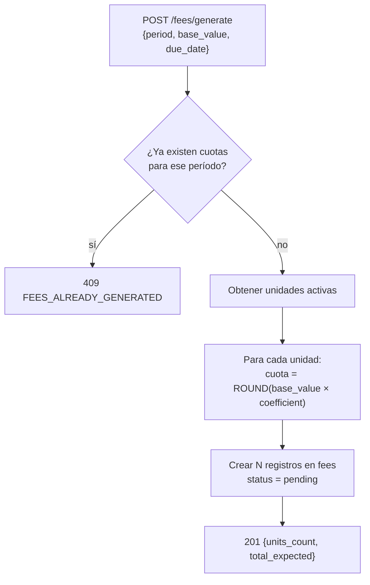

# Endpoints: Cuotas de Administración

> [!info] Consultar
> Documento de detalle de los endpoints del módulo Cuotas.
> Para el índice general de endpoints, ver [[API_CONTRACT]].
> Para convenciones globales, ver [[API_CONTRACT]] §Convenciones Generales.

---

## Endpoints en este documento

| # | Método | Ruta | Auth | Rol | Estado |
|---|--------|------|------|-----|--------|
| 4.1 | GET | `/fees` | Sí | admin | Diseñado |
| 4.2 | POST | `/fees/generate` | Sí | admin | Diseñado |
| 4.3 | GET | `/fees/unit/{unit_id}` | Sí | admin, user* | Diseñado |
| 4.4 | PATCH | `/fees/{id}/adjust` | Sí | admin | Diseñado |
| 4.5 | GET | `/fees/{id}/breakdown` | Sí | admin, user* | Diseñado |

> `*` Un residente puede ver las cuotas de su propia unidad.

---

## §4.1 Listar cuotas del período

```
GET /api/v1/fees
```

**Query params:**

| Parámetro | Tipo | Descripción |
|-----------|------|-------------|
| `period` | string | Período en formato `YYYY-MM` (obligatorio) |
| `status` | string | `pending`, `partial`, `paid`, `overdue`, `adjusted` |
| `page` | integer | Página (default: 1) |
| `per_page` | integer | Resultados por página (default: 50, max: 200) |

**Response `200`:**
```json
{
  "data": [
    {
      "id": "fee-001",
      "period": "2026-06",
      "unit": {
        "id": "550e8400-e29b-41d4-a716-446655440000",
        "number": "101",
        "tower": "A"
      },
      "base_value": 500000,
      "coefficient": 0.0245,
      "amount": 12250,
      "amount_paid": 0,
      "status": "pending",
      "due_date": "2026-06-15",
      "generated_at": "2026-06-01T08:00:00Z"
    }
  ],
  "meta": {
    "trace_id": "...",
    "summary": {
      "total_units": 120,
      "total_expected": 1500000,
      "total_collected": 850000,
      "collection_rate": 56.7
    },
    "pagination": {
      "page": 1,
      "per_page": 50,
      "total": 120,
      "total_pages": 3
    }
  }
}
```

### Diseño

- **Precondiciones:** token válido, `role = admin`, parámetro `period` obligatorio
- **Side effects:** ninguno — lectura pura

---

## §4.2 Generar cuotas del período

```
POST /api/v1/fees/generate
```

**Request:**
```json
{
  "period": "2026-07",
  "base_value": 500000,
  "due_date": "2026-07-15",
  "notes": "Cuotas julio 2026 - aprobado en asamblea junio"
}
```

**Response `201`:**
```json
{
  "data": {
    "period": "2026-07",
    "base_value": 500000,
    "due_date": "2026-07-15",
    "units_count": 120,
    "total_expected": 1524750,
    "fees_generated": 120,
    "generated_at": "2026-06-23T10:00:00Z"
  },
  "meta": { "trace_id": "..." }
}
```

**Response `409`:**
```json
{
  "error": {
    "code": "FEES_ALREADY_GENERATED",
    "message": "Las cuotas del período 2026-07 ya fueron generadas",
    "trace_id": "..."
  }
}
```

### Diseño

- **Precondiciones:** token válido, `role = admin`
- **Reglas de negocio:**
  - Solo se pueden generar cuotas una vez por período — el sistema rechaza duplicados con `409`
  - El sistema genera una cuota por cada unidad con `status != vacant` (las unidades vacías no pagan cuota, configurable)
  - Fórmula: `cuota_unitaria = ROUND(base_value × coefficient)`
  - Las unidades con ajuste previo activo no se sobreescriben — se respetan los valores ajustados
- **Side effects:**
  - Crea `N` registros en tabla `fees` (uno por unidad activa)
  - Loggea la generación con el admin responsable

### Flujo



---

## §4.3 Ver cuotas por unidad

```
GET /api/v1/fees/unit/{unit_id}
```

**Query params:**

| Parámetro | Tipo | Descripción |
|-----------|------|-------------|
| `from` | string | Fecha inicio `YYYY-MM` (default: hace 12 meses) |
| `to` | string | Fecha fin `YYYY-MM` (default: mes actual) |
| `status` | string | Filtrar por estado |

**Response `200`:**
```json
{
  "data": [
    {
      "id": "fee-001",
      "period": "2026-06",
      "amount": 12250,
      "amount_paid": 12250,
      "status": "paid",
      "due_date": "2026-06-15",
      "paid_at": "2026-06-10T09:30:00Z"
    },
    {
      "id": "fee-002",
      "period": "2026-07",
      "amount": 12250,
      "amount_paid": 0,
      "status": "pending",
      "due_date": "2026-07-15",
      "paid_at": null
    }
  ],
  "meta": {
    "trace_id": "...",
    "unit": {
      "id": "550e8400-e29b-41d4-a716-446655440000",
      "number": "101",
      "tower": "A"
    },
    "balance": {
      "total_pending": 12250,
      "total_overdue": 0
    }
  }
}
```

### Diseño

- **Precondiciones:** token válido
- **Reglas de negocio:**
  - `role = user`: solo puede consultar la unidad de su propia residencia; otro `unit_id` retorna `403`
  - `role = admin`: puede consultar cualquier unidad
- **Side effects:** ninguno — lectura pura

---

## §4.4 Ajustar cuota individual

```
PATCH /api/v1/fees/{id}/adjust
```

**Request:**
```json
{
  "new_amount": 10000,
  "reason": "Descuento por pronto pago aplicado en asamblea",
  "adjustment_type": "discount"
}
```

> [!note] Valores válidos de `adjustment_type`
> `discount` = reducción | `surcharge` = recargo | `waiver` = condonación total

**Response `200`:**
```json
{
  "data": {
    "id": "fee-001",
    "original_amount": 12250,
    "new_amount": 10000,
    "adjustment_type": "discount",
    "reason": "Descuento por pronto pago aplicado en asamblea",
    "adjusted_by": "admin-uuid",
    "adjusted_at": "2026-06-23T10:00:00Z",
    "status": "adjusted"
  },
  "meta": { "trace_id": "..." }
}
```

**Response `409`:**
```json
{
  "error": {
    "code": "FEE_ALREADY_PAID",
    "message": "No se puede ajustar una cuota ya pagada",
    "trace_id": "..."
  }
}
```

### Diseño

- **Precondiciones:** token válido, `role = admin`
- **Reglas de negocio:**
  - Una cuota con `status = paid` no puede ajustarse — requiere nota de crédito en el módulo de pagos
  - `adjustment_type = waiver` establece `new_amount = 0`
  - El ajuste queda auditado con usuario, fecha y motivo (obligatorio)
- **Side effects:**
  - Actualiza `amount` y `status = adjusted` en `fees`
  - Guarda registro en tabla de auditoría de ajustes

---

## §4.5 Ver desglose de cálculo

```
GET /api/v1/fees/{id}/breakdown
```

**Response `200`:**
```json
{
  "data": {
    "id": "fee-001",
    "period": "2026-06",
    "unit": {
      "number": "101",
      "tower": "A",
      "coefficient": 0.0245
    },
    "calculation": {
      "base_value": 500000,
      "coefficient": 0.0245,
      "raw_amount": 12250.0,
      "rounded_amount": 12250,
      "rounding_method": "ROUND_HALF_UP"
    },
    "adjustments": [
      {
        "type": "none"
      }
    ],
    "final_amount": 12250,
    "status": "pending"
  },
  "meta": { "trace_id": "..." }
}
```

### Diseño

- **Precondiciones:** token válido
- **Reglas de negocio:**
  - `role = user`: solo puede ver el desglose de cuotas de su unidad
  - `role = admin`: puede ver cualquier desglose
- **Side effects:** ninguno — lectura pura

---

## Referencias

- Índice general: [[API_CONTRACT]]
- Esquema de base de datos: [[API_DATABASE]]
- Módulo base: [[endpoints/PROPIEDADES]]
- Módulo relacionado: [[endpoints/PAGOS]], [[endpoints/MORA]]
- Spec Web: [[02-web/features/cuotas/CUOTAS_SPEC]]
- Spec App: [[03-app/features/cuotas/CUOTAS_SPEC]]
- Panorama global: [[00-shared/features/CUOTAS]]
