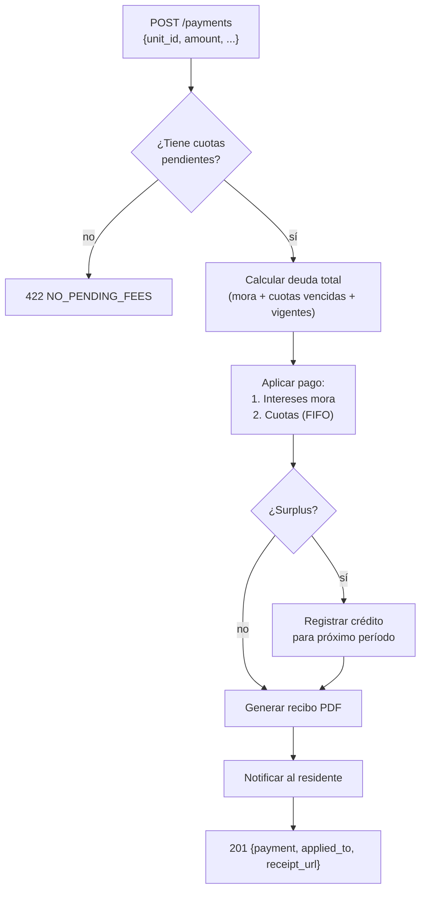

# Endpoints: Pagos

> [!info] Consultar
> Documento de detalle de los endpoints del módulo Pagos.
> Para el índice general de endpoints, ver [[API_CONTRACT]].
> Para convenciones globales, ver [[API_CONTRACT]] §Convenciones Generales.

---

## Endpoints en este documento

| # | Método | Ruta | Auth | Rol | Estado |
|---|--------|------|------|-----|--------|
| 5.1 | GET | `/payments` | Sí | admin, user* | Diseñado |
| 5.2 | POST | `/payments` | Sí | admin | Diseñado |
| 5.3 | GET | `/payments/{id}` | Sí | admin, user* | Diseñado |
| 5.4 | POST | `/payments/{id}/void` | Sí | admin | Diseñado |
| 5.5 | GET | `/payments/{id}/receipt` | Sí | admin, user* | Diseñado |

> `*` Un residente puede ver los pagos de su propia unidad.

---

## §5.1 Listar pagos

```
GET /api/v1/payments
```

**Query params:**

| Parámetro | Tipo | Descripción |
|-----------|------|-------------|
| `unit_id` | uuid | Filtrar por unidad |
| `status` | string | `registered`, `applied`, `voided` |
| `from` | date | Fecha inicio `YYYY-MM-DD` |
| `to` | date | Fecha fin `YYYY-MM-DD` |
| `method` | string | `cash`, `transfer`, `check`, `online` |
| `page` | integer | Página (default: 1) |
| `per_page` | integer | Resultados por página (default: 20, max: 100) |

**Response `200`:**
```json
{
  "data": [
    {
      "id": "pay-001",
      "unit": {
        "id": "550e8400-e29b-41d4-a716-446655440000",
        "number": "101",
        "tower": "A"
      },
      "amount": 12250,
      "method": "transfer",
      "reference": "TXN-2026-06-1234",
      "status": "applied",
      "payment_date": "2026-06-10",
      "registered_by": "admin-uuid",
      "registered_at": "2026-06-10T09:30:00Z"
    }
  ],
  "meta": {
    "trace_id": "...",
    "pagination": {
      "page": 1,
      "per_page": 20,
      "total": 98,
      "total_pages": 5
    }
  }
}
```

### Diseño

- **Precondiciones:** token válido
- **Reglas de negocio:**
  - `role = user`: solo ve pagos de su propia unidad; el filtro `unit_id` queda forzado a su unidad
  - `role = admin`: puede filtrar por cualquier unidad o ver todos
- **Side effects:** ninguno — lectura pura

---

## §5.2 Registrar pago

```
POST /api/v1/payments
```

**Request:**
```json
{
  "unit_id": "550e8400-e29b-41d4-a716-446655440000",
  "amount": 25000,
  "method": "transfer",
  "reference": "TXN-2026-07-5678",
  "payment_date": "2026-07-08",
  "notes": "Pago cuotas junio y julio",
  "voucher": "base64-encoded-image-or-pdf"
}
```

> [!note] Campo `voucher`
> Imagen (JPEG/PNG) o PDF del comprobante. Máximo 5MB. Obligatorio para métodos `transfer` y `check`.

**Response `201`:**
```json
{
  "data": {
    "id": "pay-099",
    "unit": {
      "id": "550e8400-e29b-41d4-a716-446655440000",
      "number": "101",
      "tower": "A"
    },
    "amount": 25000,
    "method": "transfer",
    "reference": "TXN-2026-07-5678",
    "status": "applied",
    "payment_date": "2026-07-08",
    "applied_to": [
      {
        "fee_id": "fee-june-001",
        "period": "2026-06",
        "amount_applied": 12250,
        "type": "mora_interest"
      },
      {
        "fee_id": "fee-july-001",
        "period": "2026-07",
        "amount_applied": 12750,
        "type": "fee"
      }
    ],
    "surplus": 0,
    "receipt_url": "https://api.urbania.com/storage/receipts/pay-099.pdf",
    "registered_at": "2026-07-09T10:00:00Z"
  },
  "meta": { "trace_id": "..." }
}
```

**Response `422`:**
```json
{
  "error": {
    "code": "NO_PENDING_FEES",
    "message": "La unidad no tiene cuotas pendientes de pago",
    "trace_id": "..."
  }
}
```

### Diseño

- **Precondiciones:** token válido, `role = admin`
- **Reglas de negocio:**
  - El pago se aplica en este orden: primero intereses de mora, luego cuotas cronológicamente (la más antigua primero)
  - Un pago puede cubrir múltiples cuotas si el monto es suficiente — `applied_to` lista cada aplicación
  - Si el monto supera la deuda total, el excedente se registra como `surplus` y se acredita para el próximo período
  - No se puede registrar pago si la unidad no tiene cuotas pendientes
  - El comprobante (`voucher`) es obligatorio para `method = transfer` o `method = check`
- **Side effects:**
  - Crea registro en `payments`
  - Actualiza `status` y `amount_paid` en las cuotas aplicadas
  - Actualiza saldo de mora si aplica
  - Genera recibo en PDF automáticamente
  - Emite notificación al residente de la unidad

### Flujo



---

## §5.3 Ver detalle de pago

```
GET /api/v1/payments/{id}
```

**Response `200`:**
```json
{
  "data": {
    "id": "pay-001",
    "unit": {
      "id": "550e8400-e29b-41d4-a716-446655440000",
      "number": "101",
      "tower": "A",
      "resident": "Juan Perez"
    },
    "amount": 12250,
    "method": "transfer",
    "reference": "TXN-2026-06-1234",
    "status": "applied",
    "payment_date": "2026-06-10",
    "applied_to": [
      {
        "fee_id": "fee-001",
        "period": "2026-06",
        "amount_applied": 12250,
        "type": "fee"
      }
    ],
    "surplus": 0,
    "voucher_url": "https://api.urbania.com/storage/vouchers/pay-001.pdf",
    "receipt_url": "https://api.urbania.com/storage/receipts/pay-001.pdf",
    "notes": null,
    "registered_by": "admin-uuid",
    "registered_at": "2026-06-10T09:30:00Z",
    "voided_at": null,
    "void_reason": null
  },
  "meta": { "trace_id": "..." }
}
```

### Diseño

- **Precondiciones:** token válido
- **Reglas de negocio:**
  - `role = user`: solo puede ver pagos de su propia unidad
  - `role = admin`: puede ver cualquier pago
- **Side effects:** ninguno — lectura pura

---

## §5.4 Anular pago

```
POST /api/v1/payments/{id}/void
```

**Request:**
```json
{
  "reason": "Comprobante fraudulento detectado en conciliación bancaria"
}
```

**Response `200`:**
```json
{
  "data": {
    "id": "pay-001",
    "status": "voided",
    "voided_by": "admin-uuid",
    "voided_at": "2026-06-23T11:00:00Z",
    "void_reason": "Comprobante fraudulento detectado en conciliación bancaria"
  },
  "meta": { "trace_id": "..." }
}
```

**Response `409`:**
```json
{
  "error": {
    "code": "PAYMENT_ALREADY_VOIDED",
    "message": "El pago ya fue anulado anteriormente",
    "trace_id": "..."
  }
}
```

### Diseño

- **Precondiciones:** token válido, `role = admin`
- **Reglas de negocio:**
  - `reason` es obligatorio — la anulación siempre requiere justificación
  - Un pago ya anulado no puede anularse de nuevo → **409**
  - Solo el admin puede anular pagos
- **Side effects:**
  - Actualiza `status = voided` en el pago
  - Revierte las cuotas asociadas a su estado anterior (`pending` o `overdue`)
  - Revierte el saldo de mora si aplica
  - Emite notificación al residente informando la anulación
  - Loggea la anulación con el admin responsable

---

## §5.5 Descargar recibo

```
GET /api/v1/payments/{id}/receipt
```

**Response `200`:**

Archivo PDF del recibo de pago.

```
Content-Type: application/pdf
Content-Disposition: attachment; filename="recibo-pay-001.pdf"
```

**Response `404`:**
```json
{
  "error": {
    "code": "RECEIPT_NOT_FOUND",
    "message": "El recibo de este pago aún no ha sido generado",
    "trace_id": "..."
  }
}
```

### Diseño

- **Precondiciones:** token válido, pago con `status = applied`
- **Reglas de negocio:**
  - `role = user`: solo puede descargar recibos de pagos de su unidad
  - Los pagos anulados no tienen recibo descargable
  - El recibo se genera en el momento del registro del pago (§5.2); este endpoint lo sirve desde almacenamiento
- **Side effects:** ninguno — descarga directa desde storage

---

## Referencias

- Índice general: [[API_CONTRACT]]
- Esquema de base de datos: [[API_DATABASE]]
- Módulos relacionados: [[endpoints/CUOTAS]], [[endpoints/MORA]]
- Spec Web: [[02-web/features/pagos/PAGOS_SPEC]]
- Spec App: [[03-app/features/pagos/PAGOS_SPEC]]
- Panorama global: [[00-shared/features/PAGOS]]
