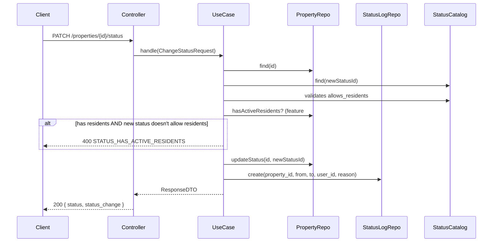

# Endpoints: Propiedades y Unidades

> [!info] Consultar
> Documento de detalle de los endpoints del módulo de Propiedades (unidades) y Documentos asociados.
> Para el índice general de endpoints, ver [[API_CONTRACT]].
> Para convenciones globales (Base URL, headers, formato de respuesta, códigos de error), ver [[API_CONTRACT]] §Convenciones Generales.
> Para el panorama global del feature, ver [[00-shared/features/PROPIEDADES]].

---

## Endpoints en este documento

| # | Método | Ruta | Auth | Estado |
|---|--------|------|------|--------|
| 2.1 | GET | /properties | Sí (admin) | Diseñado |
| 2.2 | POST | /properties | Sí (admin) | Diseñado |
| 2.3 | GET | /properties/{id} | Sí | Diseñado |
| 2.4 | PATCH | /properties/{id} | Sí (admin) | Diseñado |
| 2.5 | DELETE | /properties/{id} | Sí (admin) | Diseñado |
| 2.6 | PATCH | /properties/{id}/status | Sí (admin) | Diseñado |
| 2.7 | GET | /properties/{id}/status-log | Sí | Diseñado |
| 2.8 | GET | /properties/coefficient-validation | Sí (admin) | Diseñado |
| 2.9 | GET | /properties/{id}/documents | Sí | Diseñado |
| 2.10 | POST | /properties/{id}/documents | Sí (admin) | Diseñado |
| 2.11 | DELETE | /properties/{id}/documents/{docId} | Sí (admin) | Diseñado |

> `Sí` = Autenticado. `Sí (admin)` = Autenticado con rol `admin`.

---

## §2.1 Listar unidades

```
GET /api/v1/properties
```

**Headers:** Headers obligatorios estándar.

**Query params — Filtros:**

| Parámetro | Tipo | Req | Descripción |
|-----------|------|-----|-------------|
| `condominium_id` | UUID | no | Filtrar por condominio (obligatorio si multi-conjunto, default: el único activo) |
| `tower_id` | UUID | no | Filtrar por torre |
| `property_type_id` | UUID | no | Filtrar por tipo de unidad |
| `property_status_id` | UUID | no | Filtrar por estado |
| `floor` | integer | no | Filtrar por piso exacto |
| `floor_min` | integer | no | Piso mínimo (rango) |
| `floor_max` | integer | no | Piso máximo (rango) |
| `search` | string | no | Búsqueda por `unit_number` |
| `has_residents` | boolean | no | `true` = solo unidades con residentes, `false` = solo sin residentes |
| `is_active` | boolean | no | `true` (default) = excluir soft-deleted |
| `page` | integer | no | Número de página (default: 1) |
| `per_page` | integer | no | Resultados por página (default: 20, max: 100) |
| `sort_by` | string | no | `tower_name`, `floor`, `unit_number`, `type`, `status`, `area_m2` (default: `sort_order + floor + unit_number`) |
| `sort_order` | string | no | `asc` (default) o `desc` |

**Response 200:**
```json
{
  "data": [
    {
      "id": "0190a1b2-c3d4-5678-9abc-def012345601",
      "condominium_id": "0190a1b2-c3d4-5678-9abc-def012345001",
      "tower": {
        "id": "0190a1b2-c3d4-5678-9abc-def012345678",
        "name": "Torre 1",
        "code": "T1"
      },
      "type": {
        "id": "0190a1b2-c3d4-5678-9abc-def012345671",
        "code": "apartamento",
        "name": "Apartamento"
      },
      "status": {
        "id": "0190a1b2-c3d4-5678-9abc-def012345681",
        "code": "ocupada",
        "name": "Ocupada"
      },
      "floor": 3,
      "unit_number": "302",
      "full_designation": "T1 - 302",
      "area_m2": "65.50",
      "coefficient": "0.008333",
      "bedrooms": 3,
      "bathrooms": 2,
      "has_parking": true,
      "parking_lot": "P-12",
      "residents_count": 3,
      "created_at": "2026-06-27T12:00:00Z",
      "updated_at": "2026-06-27T12:00:00Z"
    }
  ],
  "meta": {
    "trace_id": "550e8400-e29b-41d4-a716-446655440000",
    "current_page": 1,
    "per_page": 20,
    "total": 120,
    "last_page": 6
  }
}
```

### Diseño

- **Precondiciones:** Usuario autenticado. Si es `admin`, ve todas las unidades del condominio. Si es `user` (residente), solo ve su propia unidad (scope futuro con feature #4 Directorio).
- **Reglas de negocio:**
  - `full_designation` es un campo calculado: `"{tower_code} - {unit_number}"` (ej: "T1 - 302"). Sirve para mostrar en tablas y búsquedas sin tener que renderizar torre + número por separado.
  - `residents_count` es un COUNT en tiempo real de residentes activos en la unidad. Para el MVP puede ser 0 y se implementa cuando exista el feature #4 Directorio.
  - Los resultados se ordenan por defecto por: torre (sort_order) → piso (asc) → número de unidad (asc).
- **Side effects:** Ninguno.
- **Casos borde:** Sin filtros retorna todas las unidades del condominio activo.

---

## §2.2 Crear unidad

```
POST /api/v1/properties
```

**Headers:** Headers obligatorios estándar.

**Request:**
```json
{
  "condominium_id": "0190a1b2-c3d4-5678-9abc-def012345001",
  "tower_id": "0190a1b2-c3d4-5678-9abc-def012345678",
  "property_type_id": "0190a1b2-c3d4-5678-9abc-def012345671",
  "property_status_id": "0190a1b2-c3d4-5678-9abc-def012345682",
  "floor": 5,
  "unit_number": "502",
  "area_m2": 72.00,
  "coefficient": 0.009000,
  "bedrooms": 3,
  "bathrooms": 2,
  "has_parking": true,
  "parking_lot": "P-15",
  "notes": "Unidad esquinera con vista a la montaña"
}
```

**Response 201:**
```json
{
  "data": {
    "id": "0190a1b2-c3d4-5678-9abc-def012345699",
    "condominium_id": "0190a1b2-c3d4-5678-9abc-def012345001",
    "tower": {
      "id": "0190a1b2-c3d4-5678-9abc-def012345678",
      "name": "Torre 1",
      "code": "T1"
    },
    "type": {
      "id": "0190a1b2-c3d4-5678-9abc-def012345671",
      "code": "apartamento",
      "name": "Apartamento"
    },
    "status": {
      "id": "0190a1b2-c3d4-5678-9abc-def012345682",
      "code": "vacia",
      "name": "Vacía"
    },
    "floor": 5,
    "unit_number": "502",
    "full_designation": "T1 - 502",
    "area_m2": "72.00",
    "coefficient": "0.009000",
    "bedrooms": 3,
    "bathrooms": 2,
    "has_parking": true,
    "parking_lot": "P-15",
    "notes": "Unidad esquinera con vista a la montaña",
    "residents_count": 0,
    "created_at": "2026-06-27T15:00:00Z",
    "updated_at": "2026-06-27T15:00:00Z"
  },
  "meta": {
    "trace_id": "550e8400-e29b-41d4-a716-446655440000"
  }
}
```

**Response 400:**
```json
{
  "error": {
    "code": "VALIDATION_ERROR",
    "message": "Error de validación",
    "trace_id": "550e8400-e29b-41d4-a716-446655440000",
    "errors": {
      "unit_number": ["El número de unidad 502 ya existe en el piso 5 de la Torre 1"],
      "coefficient": ["El coeficiente debe ser mayor a 0"],
      "area_m2": ["El área debe ser mayor a 0"]
    }
  }
}
```

**Response 404:**
```json
{
  "error": {
    "code": "TOWER_NOT_FOUND",
    "message": "La torre especificada no existe",
    "trace_id": "550e8400-e29b-41d4-a716-446655440000"
  }
}
```

### Diseño

- **Precondiciones:** Usuario autenticado con rol `admin`. `tower_id`, `property_type_id`, `property_status_id` deben existir y estar activos.
- **Reglas de negocio:**
  - `condominium_id` se verifica contra la torre (debe coincidir con `towers.condominium_id`). Si no coincide, se rechaza con `VALIDATION_ERROR`.
  - `unit_number` debe ser UNIQUE dentro de (`tower_id`, `floor`).
  - `floor` debe ser <= `towers.floor_count`. `floor` = 0 es sótano/subterráneo.
  - `coefficient` debe ser > 0. La suma de coeficientes del condominio se valida después de crear (no bloqueante en creación, pero se advierte vía §2.8).
  - `area_m2` debe ser > 0.
  - `property_status_id` inicial: por defecto el estado con código `vacia` si no se envía.
  - Se genera automáticamente un registro en `property_status_log` con `from_status_id = NULL` y `reason = "Creación de la unidad"`.
- **Side effects:**
  - Se crea registro en `property_status_log` (status actual asignado como primer estado).
  - Los `stats` del condominio y la torre se actualizan (+1 unidad).
- **Casos borde:** Crear un parqueadero con `bedrooms: 0, bathrooms: 0` es válido. Las validaciones de `bedrooms` y `bathrooms` deben permitir NULL.

---

## §2.3 Obtener detalle de unidad

```
GET /api/v1/properties/{id}
```

**Headers:** Headers obligatorios estándar.

**Response 200:**
```json
{
  "data": {
    "id": "0190a1b2-c3d4-5678-9abc-def012345601",
    "condominium_id": "0190a1b2-c3d4-5678-9abc-def012345001",
    "condominium_name": "Conjunto Residencial San Rafael",
    "tower": {
      "id": "0190a1b2-c3d4-5678-9abc-def012345678",
      "name": "Torre 1",
      "code": "T1",
      "floor_count": 15
    },
    "type": {
      "id": "0190a1b2-c3d4-5678-9abc-def012345671",
      "code": "apartamento",
      "name": "Apartamento"
    },
    "status": {
      "id": "0190a1b2-c3d4-5678-9abc-def012345681",
      "code": "ocupada",
      "name": "Ocupada"
    },
    "floor": 3,
    "unit_number": "302",
    "full_designation": "T1 - 302",
    "area_m2": "65.50",
    "coefficient": "0.008333",
    "bedrooms": 3,
    "bathrooms": 2,
    "has_parking": true,
    "parking_lot": "P-12",
    "notes": "Unidad con contrato de arriendo vigente",
    "status_history": [
      {
        "id": "log-uuid-001",
        "from_status": null,
        "to_status": { "code": "vacia", "name": "Vacía" },
        "changed_by": { "id": "user-uuid", "name": "Admin Sistema" },
        "reason": "Creación de la unidad",
        "created_at": "2026-06-27T12:00:00Z"
      },
      {
        "id": "log-uuid-002",
        "from_status": { "code": "vacia", "name": "Vacía" },
        "to_status": { "code": "ocupada", "name": "Ocupada" },
        "changed_by": { "id": "user-uuid", "name": "Admin Sistema" },
        "reason": "Asignación de residente: Juan Pérez",
        "created_at": "2026-06-27T14:00:00Z"
      }
    ],
    "residents_count": 3,
    "documents_count": 2,
    "created_at": "2026-06-27T12:00:00Z",
    "updated_at": "2026-06-27T14:00:00Z"
  },
  "meta": {
    "trace_id": "550e8400-e29b-41d4-a716-446655440000"
  }
}
```

**Response 404:**
```json
{
  "error": {
    "code": "PROPERTY_NOT_FOUND",
    "message": "La unidad solicitada no existe",
    "trace_id": "550e8400-e29b-41d4-a716-446655440000"
  }
}
```

### Diseño

- **Precondiciones:** Usuario autenticado. La unidad debe existir y no estar soft-deleted.
- **Reglas de negocio:**
  - `status_history` incluye los últimos 10 cambios (los más recientes primero). Para el historial completo, usar §2.7.
  - `residents_count` y `documents_count` son conteos en tiempo real.
  - Si el usuario es residente (no admin), solo puede acceder a su propia unidad (validación de asignación vía feature #4 Directorio).
- **Side effects:** Ninguno.

---

## §2.4 Actualizar unidad

```
PATCH /api/v1/properties/{id}
```

**Headers:** Headers obligatorios estándar.

**Request:**
```json
{
  "property_type_id": "0190a1b2-c3d4-5678-9abc-def012345671",
  "area_m2": 68.50,
  "notes": "Área actualizada tras medición profesional",
  "bedrooms": 3,
  "bathrooms": 2
}
```

> Todos los campos son opcionales. Solo se actualizan los enviados.

**Response 200:**
```json
{
  "data": {
    "id": "0190a1b2-c3d4-5678-9abc-def012345601",
    "floor": 3,
    "unit_number": "302",
    "area_m2": "68.50",
    "coefficient": "0.008333",
    "notes": "Área actualizada tras medición profesional",
    "updated_at": "2026-06-27T16:00:00Z"
  },
  "meta": {
    "trace_id": "550e8400-e29b-41d4-a716-446655440000"
  }
}
```

**Response 400:**
```json
{
  "error": {
    "code": "VALIDATION_ERROR",
    "message": "Error de validación",
    "trace_id": "550e8400-e29b-41d4-a716-446655440000",
    "errors": {
      "tower_id": ["No se puede cambiar la torre si la unidad tiene residentes asignados"]
    }
  }
}
```

### Diseño

- **Precondiciones:** Usuario autenticado con rol `admin`. La unidad debe existir.
- **Reglas de negocio:**
  - `tower_id`: si se cambia, se debe verificar que la nueva torre pertenezca al mismo condominio. Validar que no haya residentes activos (feature futuro).
  - `unit_number`: si se cambia, validar UNIQUE(`tower_id`, `floor`, `unit_number`).
  - `floor`: si se cambia, validar contra `towers.floor_count` de la torre asignada.
  - `coefficient`: si se cambia, el endpoint retorna una advertencia en meta: `{ "warning": "coefficient_changed", "message": "Se recomienda validar la suma total de coeficientes vía GET /properties/coefficient-validation" }`.
  - `property_status_id`: **NO se actualiza aquí.** Usar §2.6. Si se envía, se ignora silenciosamente.
  - `condominium_id`: no se puede cambiar. Se ignora silenciosamente.
- **Side effects:** Si cambia `coefficient`, la validación de suma total puede quedar inconsistente hasta que el admin la verifique.
- **Casos borde:** PATCH con body vacío o solo campos ignorables retorna 200 sin cambios.

---

## §2.5 Eliminar unidad

```
DELETE /api/v1/properties/{id}
```

**Headers:** Headers obligatorios estándar.

**Response 204:** Sin contenido (soft delete exitoso).

**Response 409:**
```json
{
  "error": {
    "code": "PROPERTY_HAS_DEPENDENCIES",
    "message": "No se puede eliminar la unidad porque tiene dependencias activas",
    "trace_id": "550e8400-e29b-41d4-a716-446655440000",
    "details": {
      "active_residents": 3,
      "pending_fees": 2,
      "active_visitors": 1,
      "hint": "Resuelva las dependencias antes de eliminar o use la opción de desactivación"
    }
  }
}
```

**Response 404:**
```json
{
  "error": {
    "code": "PROPERTY_NOT_FOUND",
    "message": "La unidad solicitada no existe",
    "trace_id": "550e8400-e29b-41d4-a716-446655440000"
  }
}
```

### Diseño

- **Precondiciones:** Usuario autenticado con rol `admin`. La unidad debe existir.
- **Reglas de negocio:**
  - **Soft delete**: se marca `deleted_at`. No se elimina físicamente.
  - **Protección**: se verifica que la unidad NO tenga:
    1. Residentes activos asignados (cuando exista feature #4)
    2. Deuda pendiente (cuando exista feature #7)
    3. Visitantes activos registrados (cuando exista feature #12)
  - Si alguna condición falla, se rechaza con 409 y `details` indicando qué dependencias existen.
  - El soft delete preserva el `unit_number` para integridad histórica de cobranza, pero el `unit_number` queda disponible para futuras unidades (no bloquea UNIQUE).
- **Side effects:**
  - Los `stats` del condominio y la torre se actualizan (-1 unidad).
- **Casos borde:** Eliminar una unidad y crear una nueva con el mismo `unit_number` en el mismo piso/torre debe ser posible.

---

## §2.6 Cambiar estado de unidad

```
PATCH /api/v1/properties/{id}/status
```

**Headers:** Headers obligatorios estándar.

**Request:**
```json
{
  "property_status_id": "0190a1b2-c3d4-5678-9abc-def012345682",
  "reason": "Cambio de inquilino — contrato finalizado. Unidad queda disponible."
}
```

**Response 200:**
```json
{
  "data": {
    "id": "0190a1b2-c3d4-5678-9abc-def012345601",
    "status": {
      "id": "0190a1b2-c3d4-5678-9abc-def012345682",
      "code": "vacia",
      "name": "Vacía"
    },
    "status_change": {
      "log_id": "0190a1b2-c3d4-5678-9abc-def012345700",
      "from_status": {
        "id": "0190a1b2-c3d4-5678-9abc-def012345681",
        "code": "ocupada",
        "name": "Ocupada"
      },
      "to_status": {
        "id": "0190a1b2-c3d4-5678-9abc-def012345682",
        "code": "vacia",
        "name": "Vacía"
      },
      "reason": "Cambio de inquilino — contrato finalizado. Unidad queda disponible.",
      "changed_at": "2026-06-27T17:00:00Z"
    },
    "updated_at": "2026-06-27T17:00:00Z"
  },
  "meta": {
    "trace_id": "550e8400-e29b-41d4-a716-446655440000"
  }
}
```

**Response 400:**
```json
{
  "error": {
    "code": "STATUS_HAS_ACTIVE_RESIDENTS",
    "message": "No se puede cambiar la unidad al estado 'Vacía' porque tiene 3 residentes activos asignados. Debe desocupar la unidad antes de cambiar el estado.",
    "trace_id": "550e8400-e29b-41d4-a716-446655440000"
  }
}
```

**Response 422:**
```json
{
  "error": {
    "code": "VALIDATION_ERROR",
    "message": "Error de validación",
    "trace_id": "550e8400-e29b-41d4-a716-446655440000",
    "errors": {
      "reason": ["El motivo del cambio es obligatorio"],
      "property_status_id": ["El nuevo estado es obligatorio"]
    }
  }
}
```

### Diseño

- **Precondiciones:** Usuario autenticado con rol `admin`. La unidad debe existir. El estado debe existir y estar activo.
- **Reglas de negocio:**
  1. `reason` es **obligatorio**. Sin motivo, el endpoint rechaza con 422.
  2. Si `property_status.allows_residents = false` y la unidad tiene residentes activos, se rechaza con `STATUS_HAS_ACTIVE_RESIDENTS`.
  3. Si el nuevo estado es el mismo que el actual, se rechaza con `SAME_STATUS` (400).
  4. Cualquier transición de estado es válida (no hay máquina de estados rígida), siempre que se cumplan las reglas 1-3.
  5. El cambio se registra automáticamente en `property_status_log`.
- **Side effects:**
  - Se crea registro en `property_status_log` con el `from_status`, `to_status`, `changed_by_user_id`, `reason` y timestamp.
  - Se actualiza `properties.property_status_id`.
  - Los `stats` del condominio y la torre se actualizan en tiempo real (ej: ocupadas--, vacías++).
- **Casos borde:**
  - Cambiar de `vacia` → `ocupada` no requiere verificar residentes (es el flujo normal).
  - Cambiar de `ocupada` → `en_venta`: permitido, la unidad puede estar en venta mientras está habitada.

### Flujo



---

## §2.7 Obtener historial de cambios de estado

```
GET /api/v1/properties/{id}/status-log
```

**Headers:** Headers obligatorios estándar.

**Query params:**

| Parámetro | Tipo | Req | Descripción |
|-----------|------|-----|-------------|
| `page` | integer | no | Número de página (default: 1) |
| `per_page` | integer | no | Resultados por página (default: 20, max: 100) |

**Response 200:**
```json
{
  "data": [
    {
      "id": "0190a1b2-c3d4-5678-9abc-def012345700",
      "from_status": {
        "id": "0190a1b2-c3d4-5678-9abc-def012345681",
        "code": "ocupada",
        "name": "Ocupada"
      },
      "to_status": {
        "id": "0190a1b2-c3d4-5678-9abc-def012345682",
        "code": "vacia",
        "name": "Vacía"
      },
      "changed_by": {
        "id": "user-uuid-001",
        "name": "Carlos Méndez (Admin)"
      },
      "reason": "Cambio de inquilino — contrato finalizado",
      "created_at": "2026-06-27T17:00:00Z"
    }
  ],
  "meta": {
    "trace_id": "550e8400-e29b-41d4-a716-446655440000",
    "current_page": 1,
    "per_page": 20,
    "total": 3,
    "last_page": 1
  }
}
```

**Response 404:**
```json
{
  "error": {
    "code": "PROPERTY_NOT_FOUND",
    "message": "La unidad solicitada no existe",
    "trace_id": "550e8400-e29b-41d4-a716-446655440000"
  }
}
```

### Diseño

- **Precondiciones:** Usuario autenticado. La unidad debe existir.
- **Reglas de negocio:** Los registros se retornan en orden descendente por `created_at` (más recientes primero). No hay límite de registros históricos.
- **Side effects:** Ninguno.

---

## §2.8 Validar coeficientes del condominio

```
GET /api/v1/properties/coefficient-validation
```

**Headers:** Headers obligatorios estándar.

**Query params:**

| Parámetro | Tipo | Req | Descripción |
|-----------|------|-----|-------------|
| `condominium_id` | UUID | no | Condominio a validar (default: único activo) |

**Response 200:**
```json
{
  "data": {
    "condominium_id": "0190a1b2-c3d4-5678-9abc-def012345001",
    "condominium_name": "Conjunto Residencial San Rafael",
    "total_coefficient_expected": "1.000000",
    "total_coefficient_sum": "0.999998",
    "difference": "-0.000002",
    "is_balanced": false,
    "total_units": 120,
    "units_with_coefficient_zero": 0,
    "warnings": [
      {
        "type": "IMBALANCE",
        "message": "La suma de coeficientes (0.999998) difiere del total esperado (1.000000) en -0.000002"
      }
    ],
    "checked_at": "2026-06-27T17:30:00Z"
  },
  "meta": {
    "trace_id": "550e8400-e29b-41d4-a716-446655440000"
  }
}
```

**Response 200 (balanceado):**
```json
{
  "data": {
    "condominium_id": "0190a1b2-c3d4-5678-9abc-def012345001",
    "total_coefficient_expected": "1.000000",
    "total_coefficient_sum": "1.000000",
    "difference": "0.000000",
    "is_balanced": true,
    "total_units": 120,
    "units_with_coefficient_zero": 0,
    "warnings": [],
    "checked_at": "2026-06-27T17:30:00Z"
  }
}
```

### Diseño

- **Precondiciones:** Usuario autenticado con rol `admin`.
- **Reglas de negocio:**
  - Calcula `SUM(coefficient)` de todas las unidades activas del condominio (excluyendo soft-deleted).
  - Compara con `condominiums.total_coefficient`.
  - `is_balanced = true` cuando `difference = 0` (considerando precisión NUMERIC(7,6)).
  - Si `total_units = 0`, retorna `is_balanced: true` con nota "Sin unidades registradas".
  - Si hay unidades con `coefficient = 0`, se listan en `warnings`.
- **Side effects:** Ninguno. Es endpoint de solo lectura.

---

## §2.9 Listar documentos de unidad

```
GET /api/v1/properties/{id}/documents
```

**Headers:** Headers obligatorios estándar.

**Response 200:**
```json
{
  "data": [
    {
      "id": "0190a1b2-c3d4-5678-9abc-def012345800",
      "document_type": "escritura",
      "name": "Escritura Pública 1234 - Unidad 302",
      "file_url": "https://storage.urbania.com/documents/escritura-302.pdf",
      "file_size_bytes": 2457600,
      "mime_type": "application/pdf",
      "notes": "Escritura registrada en la Notaría 10 de Bogotá",
      "uploaded_by": {
        "id": "user-uuid-001",
        "name": "Carlos Méndez"
      },
      "created_at": "2026-06-27T14:00:00Z"
    }
  ],
  "meta": {
    "trace_id": "550e8400-e29b-41d4-a716-446655440000"
  }
}
```

**Response 404:**
```json
{
  "error": {
    "code": "PROPERTY_NOT_FOUND",
    "message": "La unidad solicitada no existe",
    "trace_id": "550e8400-e29b-41d4-a716-446655440000"
  }
}
```

### Diseño

- **Precondiciones:** Usuario autenticado. La unidad debe existir.
- **Reglas de negocio:** Los documentos se retornan ordenados por `created_at` descendente. Los documentos soft-deleted no se incluyen.

---

## §2.10 Subir documento a unidad

```
POST /api/v1/properties/{id}/documents
```

**Headers:**

```
Content-Type: multipart/form-data
Accept: application/json
Authorization: Bearer <jwt_token>
```

**Request (multipart/form-data):**

| Campo | Tipo | Req | Descripción |
|-------|------|-----|-------------|
| `file` | file | sí | Archivo a subir (PDF, JPEG, PNG, max 20MB) |
| `document_type` | string | sí | Tipo: `escritura`, `plano`, `certificado_libertad`, `recibo_pago`, `contrato`, `otros` |
| `name` | string | sí | Nombre descriptivo del documento |
| `notes` | string | no | Notas opcionales |

**Response 201:**
```json
{
  "data": {
    "id": "0190a1b2-c3d4-5678-9abc-def012345801",
    "document_type": "plano",
    "name": "Plano Arquitectónico - Unidad 302",
    "file_url": "https://storage.urbania.com/documents/plano-302.pdf",
    "file_size_bytes": 1048576,
    "mime_type": "application/pdf",
    "notes": "Plano actualizado con remodelación 2026",
    "uploaded_by": {
      "id": "user-uuid-001",
      "name": "Carlos Méndez"
    },
    "created_at": "2026-06-27T18:00:00Z"
  },
  "meta": {
    "trace_id": "550e8400-e29b-41d4-a716-446655440000"
  }
}
```

**Response 400:**
```json
{
  "error": {
    "code": "VALIDATION_ERROR",
    "message": "Error de validación",
    "trace_id": "550e8400-e29b-41d4-a716-446655440000",
    "errors": {
      "file": ["El archivo excede el tamaño máximo de 20MB", "El tipo de archivo debe ser PDF, JPEG o PNG"],
      "document_type": ["El tipo de documento no es válido"]
    }
  }
}
```

### Diseño

- **Precondiciones:** Usuario autenticado con rol `admin`. La unidad debe existir.
- **Reglas de negocio:**
  - `document_type` debe ser uno de los valores predefinidos: `escritura`, `plano`, `certificado_libertad`, `recibo_pago`, `contrato`, `otros`.
  - El archivo se almacena en un sistema de archivos externo (S3 / DigitalOcean Spaces / MinIO). La URL se guarda en BD.
  - Tamaño máximo: 20 MB por archivo.
  - Formatos permitidos: PDF, JPEG, PNG.
  - El archivo original se renombra a `{property_id}/{uuid}-{original_filename}` para evitar colisiones en storage.
- **Side effects:** Se almacena el archivo en S3 o sistema de almacenamiento externo. Se crea el registro en BD.
- **Casos borde:** Subir archivo con el mismo nombre que uno existente: se permite (el nombre en BD es descriptivo, no es el filename del storage).

---

## §2.11 Eliminar documento de unidad

```
DELETE /api/v1/properties/{id}/documents/{docId}
```

**Headers:** Headers obligatorios estándar.

**Response 204:** Sin contenido (soft delete exitoso).

**Response 404:**
```json
{
  "error": {
    "code": "DOCUMENT_NOT_FOUND",
    "message": "El documento solicitado no existe o no pertenece a esta unidad",
    "trace_id": "550e8400-e29b-41d4-a716-446655440000"
  }
}
```

### Diseño

- **Precondiciones:** Usuario autenticado con rol `admin`. La unidad y el documento deben existir. El documento debe pertenecer a la unidad especificada.
- **Reglas de negocio:** Soft delete (`deleted_at`). El archivo en storage no se elimina (se conserva para integridad histórica).
- **Side effects:** Ninguno.

---

## Códigos de error específicos

| Código | HTTP | Descripción |
|--------|------|-------------|
| `PROPERTY_NOT_FOUND` | 404 | La unidad solicitada no existe |
| `PROPERTY_HAS_DEPENDENCIES` | 409 | La unidad tiene dependencias activas y no puede eliminarse |
| `PROPERTY_DUPLICATE_UNIT` | 400 | El número de unidad ya existe en el piso/torre especificado |
| `STATUS_HAS_ACTIVE_RESIDENTS` | 400 | No se puede cambiar a un estado que no admite residentes mientras haya residentes activos |
| `SAME_STATUS` | 400 | El estado seleccionado es el mismo que el estado actual |
| `INVALID_STATUS_TRANSITION` | 400 | Transición de estado no permitida por reglas de negocio |
| `STATUS_REASON_REQUIRED` | 422 | El motivo del cambio de estado es obligatorio |
| `COEFFICIENT_IMBALANCE` | 400 | El coeficiente causaría un desbalance en la suma total del condominio |
| `DOCUMENT_NOT_FOUND` | 404 | El documento solicitado no existe |
| `DOCUMENT_TOO_LARGE` | 400 | El archivo excede el tamaño máximo permitido |
| `DOCUMENT_INVALID_TYPE` | 400 | El tipo de archivo no está permitido |

---

## Referencias

- Índice general: [[API_CONTRACT]]
- Esquema de base de datos: [[API_DATABASE]]
- Panorama global: [[00-shared/features/PROPIEDADES]]
- Detalle de condominiums: [[endpoints/CONDOMINIUMS]]
- Detalle de torres: [[endpoints/TOWERS]]
- Detalle de catálogos: [[endpoints/PROPERTY_CATALOGS]]
