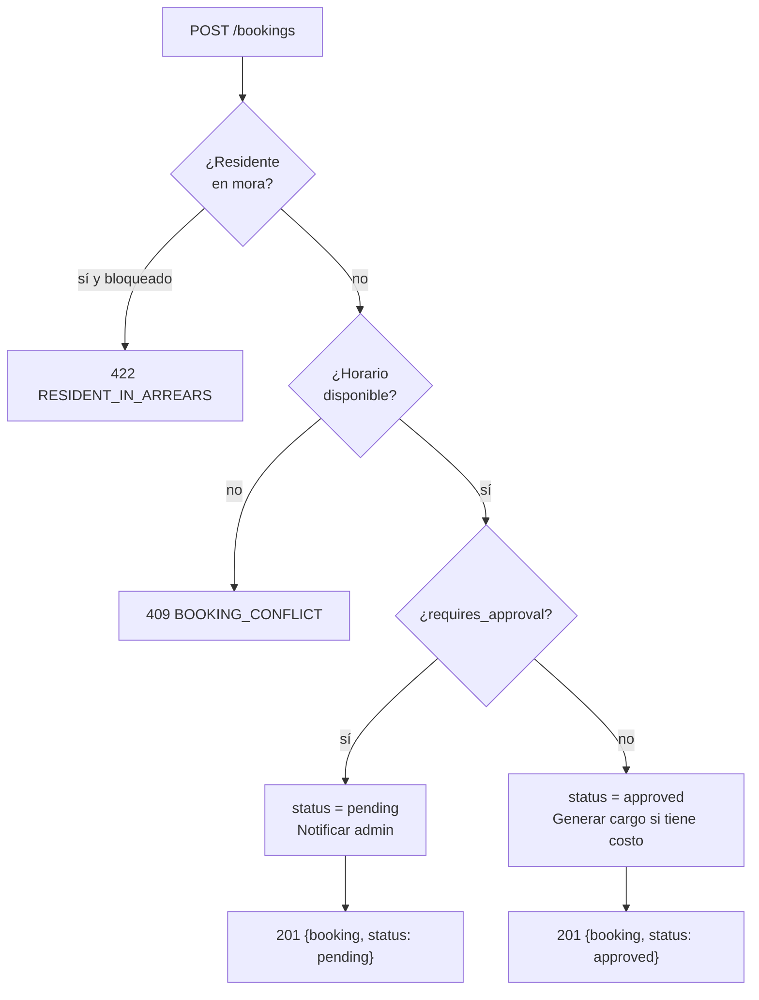

# Endpoints: Reservas de Áreas Comunes

> [!info] Consultar
> Documento de detalle de los endpoints del módulo Reservas.
> Cubre dos recursos: **amenities** (áreas comunes) y **bookings** (reservas).
> Para el índice general de endpoints, ver [[API_CONTRACT]].
> Para convenciones globales, ver [[API_CONTRACT]] §Convenciones Generales.

---

## Endpoints en este documento

| # | Método | Ruta | Auth | Rol | Estado |
|---|--------|------|------|-----|--------|
| 7.1 | GET | `/amenities` | Sí | admin, user | Diseñado |
| 7.2 | POST | `/amenities` | Sí | admin | Diseñado |
| 7.3 | PATCH | `/amenities/{id}` | Sí | admin | Diseñado |
| 7.4 | GET | `/bookings` | Sí | admin, user* | Diseñado |
| 7.5 | POST | `/bookings` | Sí | admin, user | Diseñado |
| 7.6 | GET | `/bookings/{id}` | Sí | admin, user* | Diseñado |
| 7.7 | POST | `/bookings/{id}/approve` | Sí | admin | Diseñado |
| 7.8 | POST | `/bookings/{id}/reject` | Sí | admin | Diseñado |
| 7.9 | POST | `/bookings/{id}/cancel` | Sí | admin, user* | Diseñado |

> `*` Un residente puede ver y cancelar sus propias reservas.

---

## §7.1 Listar áreas comunes

```
GET /api/v1/amenities
```

**Query params:**

| Parámetro | Tipo | Descripción |
|-----------|------|-------------|
| `active` | boolean | Filtrar por estado activo/inactivo (default: `true`) |

**Response `200`:**
```json
{
  "data": [
    {
      "id": "amen-001",
      "name": "Salón Comunal",
      "description": "Espacio para eventos y reuniones",
      "capacity": 80,
      "area_m2": 120.0,
      "price": 50000,
      "requires_approval": true,
      "max_advance_days": 30,
      "min_cancel_hours": 24,
      "active": true,
      "available_schedule": {
        "monday": { "open": "08:00", "close": "22:00" },
        "tuesday": { "open": "08:00", "close": "22:00" },
        "saturday": { "open": "08:00", "close": "23:00" },
        "sunday": { "open": "09:00", "close": "21:00" }
      },
      "images": [
        "https://api.urbania.com/storage/amenities/amen-001-1.jpg"
      ]
    }
  ],
  "meta": { "trace_id": "..." }
}
```

### Diseño

- **Precondiciones:** token válido
- **Side effects:** ninguno — lectura pura

---

## §7.2 Crear área común

```
POST /api/v1/amenities
```

**Request:**
```json
{
  "name": "BBQ",
  "description": "Zona de parrilla con mesas",
  "capacity": 20,
  "area_m2": 45.0,
  "price": 0,
  "requires_approval": false,
  "max_advance_days": 14,
  "min_cancel_hours": 12,
  "available_schedule": {
    "friday": { "open": "12:00", "close": "22:00" },
    "saturday": { "open": "10:00", "close": "23:00" },
    "sunday": { "open": "10:00", "close": "21:00" }
  }
}
```

**Response `201`:**
```json
{
  "data": {
    "id": "amen-002",
    "name": "BBQ",
    "active": true,
    "created_at": "2026-06-23T10:00:00Z"
  },
  "meta": { "trace_id": "..." }
}
```

### Diseño

- **Precondiciones:** token válido, `role = admin`
- **Reglas de negocio:**
  - Si `price = 0`: la reserva no genera cargo automático
  - Si `requires_approval = false`: las reservas pasan a `approved` automáticamente al crearse
  - `max_advance_days`: cuántos días de anticipación máxima puede reservarse
- **Side effects:** crea registro en `amenities`

---

## §7.3 Editar área común

```
PATCH /api/v1/amenities/{id}
```

**Request:** (todos los campos opcionales)
```json
{
  "price": 75000,
  "min_cancel_hours": 48,
  "active": false
}
```

**Response `200`:**
```json
{
  "data": {
    "id": "amen-001",
    "name": "Salón Comunal",
    "price": 75000,
    "min_cancel_hours": 48,
    "active": false,
    "updated_at": "2026-06-23T10:00:00Z"
  },
  "meta": { "trace_id": "..." }
}
```

### Diseño

- **Precondiciones:** token válido, `role = admin`
- **Reglas de negocio:**
  - Al desactivar (`active = false`): las reservas futuras ya aprobadas no se cancelan automáticamente, el admin debe cancelarlas manualmente
  - PATCH parcial — solo se actualizan los campos enviados
- **Side effects:** actualiza registro en `amenities`

---

## §7.4 Listar reservas

```
GET /api/v1/bookings
```

**Query params:**

| Parámetro | Tipo | Descripción |
|-----------|------|-------------|
| `amenity_id` | uuid | Filtrar por área |
| `status` | string | `pending`, `approved`, `rejected`, `cancelled`, `in_use`, `completed` |
| `date` | date | Filtrar por fecha `YYYY-MM-DD` |
| `from` | date | Rango inicio |
| `to` | date | Rango fin |
| `unit_id` | uuid | Filtrar por unidad (solo admin) |
| `page` | integer | Página (default: 1) |
| `per_page` | integer | Resultados por página (default: 20) |

**Response `200`:**
```json
{
  "data": [
    {
      "id": "book-001",
      "amenity": { "id": "amen-001", "name": "Salón Comunal" },
      "unit": { "id": "550e8400-...", "number": "101", "tower": "A" },
      "resident": { "id": "...", "name": "Juan Perez" },
      "date": "2026-07-05",
      "start_time": "15:00",
      "end_time": "21:00",
      "attendees": 40,
      "status": "approved",
      "cost": 50000,
      "created_at": "2026-06-20T10:00:00Z"
    }
  ],
  "meta": {
    "trace_id": "...",
    "pagination": { "page": 1, "per_page": 20, "total": 35, "total_pages": 2 }
  }
}
```

### Diseño

- **Precondiciones:** token válido
- **Reglas de negocio:**
  - `role = user`: solo ve sus propias reservas; el filtro `unit_id` queda forzado
  - `role = admin`: ve todas las reservas de todos los residentes
- **Side effects:** ninguno — lectura pura

---

## §7.5 Crear reserva

```
POST /api/v1/bookings
```

**Request:**
```json
{
  "amenity_id": "amen-001",
  "date": "2026-07-05",
  "start_time": "15:00",
  "end_time": "21:00",
  "attendees": 40,
  "notes": "Cumpleaños familiar"
}
```

**Response `201`:**
```json
{
  "data": {
    "id": "book-099",
    "amenity": { "id": "amen-001", "name": "Salón Comunal" },
    "date": "2026-07-05",
    "start_time": "15:00",
    "end_time": "21:00",
    "attendees": 40,
    "status": "pending",
    "cost": 50000,
    "requires_approval": true,
    "created_at": "2026-06-23T10:00:00Z"
  },
  "meta": { "trace_id": "..." }
}
```

**Response `409`:**
```json
{
  "error": {
    "code": "BOOKING_CONFLICT",
    "message": "El horario solicitado no está disponible",
    "trace_id": "..."
  }
}
```

**Response `422`:**
```json
{
  "error": {
    "code": "RESIDENT_IN_ARREARS",
    "message": "No puede reservar áreas comunes con mora pendiente",
    "trace_id": "..."
  }
}
```

### Diseño

- **Precondiciones:** token válido
- **Reglas de negocio:**
  - El horario no puede solaparse con otra reserva aprobada o pendiente del mismo área
  - Si el residente tiene mora activa y la configuración del conjunto lo bloquea → **422** `RESIDENT_IN_ARREARS`
  - El residente no puede superar el máximo de reservas activas simultáneas (configurable)
  - Si `amenity.requires_approval = false`: la reserva se crea directamente en `approved`
  - Si el área tiene costo y la reserva es aprobada: se genera cargo automático a la cuenta de la unidad
- **Side effects:**
  - Crea registro en `bookings`
  - Notifica al admin si la reserva requiere aprobación

### Flujo



---

## §7.6 Ver detalle de reserva

```
GET /api/v1/bookings/{id}
```

**Response `200`:**
```json
{
  "data": {
    "id": "book-001",
    "amenity": {
      "id": "amen-001",
      "name": "Salón Comunal",
      "capacity": 80
    },
    "unit": { "id": "...", "number": "101", "tower": "A" },
    "resident": { "id": "...", "name": "Juan Perez" },
    "date": "2026-07-05",
    "start_time": "15:00",
    "end_time": "21:00",
    "attendees": 40,
    "notes": "Cumpleaños familiar",
    "status": "approved",
    "cost": 50000,
    "admin_comment": null,
    "approved_by": "admin-uuid",
    "approved_at": "2026-06-21T14:00:00Z",
    "created_at": "2026-06-20T10:00:00Z"
  },
  "meta": { "trace_id": "..." }
}
```

### Diseño

- **Precondiciones:** token válido
- **Reglas de negocio:**
  - `role = user`: solo puede ver sus propias reservas → `403` si el booking no le pertenece
- **Side effects:** ninguno — lectura pura

---

## §7.7 Aprobar reserva

```
POST /api/v1/bookings/{id}/approve
```

**Request:**
```json
{
  "comment": "Aprobado. Recordar dejar el salón limpio."
}
```

**Response `200`:**
```json
{
  "data": {
    "id": "book-001",
    "status": "approved",
    "admin_comment": "Aprobado. Recordar dejar el salón limpio.",
    "approved_by": "admin-uuid",
    "approved_at": "2026-06-23T10:00:00Z"
  },
  "meta": { "trace_id": "..." }
}
```

### Diseño

- **Precondiciones:** token válido, `role = admin`, reserva en `status = pending`
- **Side effects:**
  - Actualiza estado a `approved`
  - Si el área tiene costo: genera cargo a la cuenta de la unidad
  - Notifica al residente (aprobación + comentario si existe)

---

## §7.8 Rechazar reserva

```
POST /api/v1/bookings/{id}/reject
```

**Request:**
```json
{
  "comment": "El salón ya tiene un evento programado por la administración para esa fecha."
}
```

**Response `200`:**
```json
{
  "data": {
    "id": "book-001",
    "status": "rejected",
    "admin_comment": "El salón ya tiene un evento programado por la administración para esa fecha.",
    "rejected_by": "admin-uuid",
    "rejected_at": "2026-06-23T10:00:00Z"
  },
  "meta": { "trace_id": "..." }
}
```

### Diseño

- **Precondiciones:** token válido, `role = admin`, reserva en `status = pending`
- **Reglas de negocio:**
  - `comment` es obligatorio en el rechazo
- **Side effects:**
  - Actualiza estado a `rejected`
  - Notifica al residente con el motivo del rechazo

---

## §7.9 Cancelar reserva

```
POST /api/v1/bookings/{id}/cancel
```

**Request:**
```json
{
  "reason": "Cambio de planes"
}
```

**Response `200`:**
```json
{
  "data": {
    "id": "book-001",
    "status": "cancelled",
    "cancelled_at": "2026-06-23T10:00:00Z"
  },
  "meta": { "trace_id": "..." }
}
```

**Response `422`:**
```json
{
  "error": {
    "code": "CANCELLATION_TOO_LATE",
    "message": "No se puede cancelar con menos de 24 horas de anticipación",
    "trace_id": "..."
  }
}
```

### Diseño

- **Precondiciones:** token válido, reserva en `status = pending` o `approved`
- **Reglas de negocio:**
  - `role = user`: solo puede cancelar sus propias reservas, y solo si se cumple el plazo mínimo (`amenity.min_cancel_hours`)
  - `role = admin`: puede cancelar cualquier reserva sin restricción de tiempo
  - Si el admin cancela una reserva ya aprobada con cargo: el cargo se revierte automáticamente
- **Side effects:**
  - Actualiza estado a `cancelled`
  - Si había cargo generado: lo revierte en la cuenta de la unidad
  - Notifica al residente si es el admin quien cancela

---

## Referencias

- Índice general: [[API_CONTRACT]]
- Esquema de base de datos: [[API_DATABASE]]
- Módulos relacionados: [[endpoints/NOTIFICACIONES]], [[endpoints/PAGOS]]
- Spec Web: [[02-web/features/reservas/RESERVAS_SPEC]]
- Spec App: [[03-app/features/reservas/RESERVAS_SPEC]]
- Panorama global: [[00-shared/features/RESERVAS]]
