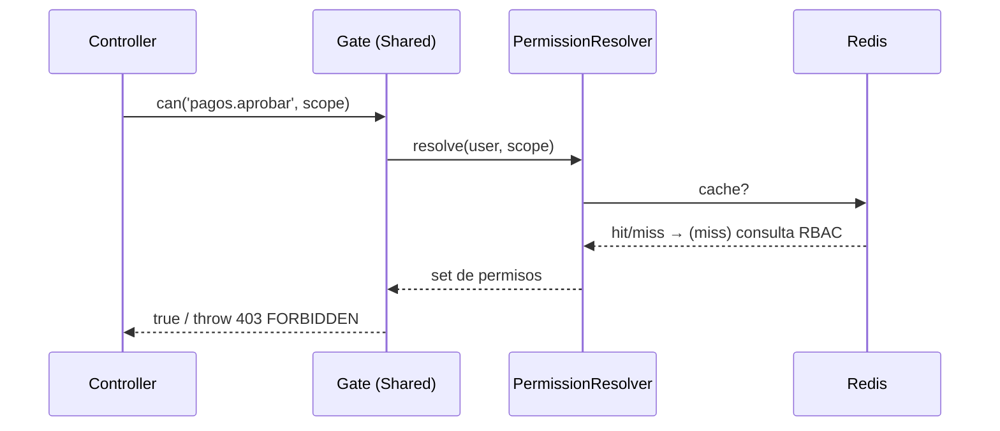

# Endpoints: Roles y Permisos (Authorization)

> Panorama: [[00-shared/features/ROLES_PERMISOS]] · Esquema: [[01-api/API_DATABASE]] · Índice: [[API_CONTRACT]]
> Módulo DDD `src/Authorization`. Todas las rutas requieren JWT con `org_id` y el permiso indicado. **WIP**.

---

## Endpoints en este documento

| # | Método | Ruta | Permiso | Estado |
|---|--------|------|---------|--------|
| 1 | GET | `/authorization/roles` | `roles.ver` | Diseñado |
| 2 | POST | `/authorization/roles` | `roles.crear` | Diseñado |
| 3 | PATCH | `/authorization/roles/:id` | `roles.editar` | Diseñado |
| 4 | PUT | `/authorization/roles/:id/permissions` | `roles.editar` | Diseñado |
| 5 | GET | `/authorization/permissions` | `roles.ver` | Diseñado |
| 6 | POST | `/authorization/assignments` | `roles.asignar` | Diseñado |
| 7 | DELETE | `/authorization/assignments/:id` | `roles.asignar` | Diseñado |
| 8 | POST | `/authorization/approval-rules` | `roles.configurar` | Diseñado |
| 9 | GET | `/authorization/audit` | `roles.ver` | Diseñado |

> Convenciones globales (Base URL `/api/v1`, headers, envoltura `data`/`meta.trace_id`, errores) en [[API_CONTRACT]].

---

## §1 Listar roles
```
GET /api/v1/authorization/roles
```
**Response 200:**
```json
{ "data": [ { "id": "...", "nombre": "Administrador", "es_sistema": true,
  "nivel_alcance": "conjunto", "usuarios_count": 3 } ], "meta": { "trace_id": "..." } }
```
- Scopea a `organization_id` del token (roles de sistema + los de la org).

## §2 Crear rol
```
POST /api/v1/authorization/roles
```
**Request:** `{ "nombre": "Contador", "descripcion": "...", "nivel_alcance": "conjunto", "base_role_id": "uuid?" }`
**Response 201:** rol creado.
### Diseño
- **Reglas:** `nombre` único por organización; `es_sistema=false` siempre en creación por API; si `base_role_id`, copia sus permisos.
- **Side effects:** `permission_audit_log`.

## §3 Editar rol
```
PATCH /api/v1/authorization/roles/:id
```
- 403 si el rol es `es_sistema=true` (no editable salvo por operador SaaS). Error `SYSTEM_ROLE_LOCKED`.

## §4 Definir matriz de permisos del rol
```
PUT /api/v1/authorization/roles/:id/permissions
```
**Request:** `{ "permissions": ["pagos.ver","pagos.aprobar","directorio.ver"] }`
**Response 200:** rol con permisos efectivos.
### Diseño
- **Reglas:** valida que cada clave exista en `permissions`; reemplaza el set (`role_permissions`).
- **Side effects:** invalida cache Redis de los usuarios con ese rol; `permission_audit_log`.

## §5 Catálogo de permisos
```
GET /api/v1/authorization/permissions
```
**Response 200:** lista agrupada por `recurso` con sus `accion`. Solo lectura (sembrado por el operador SaaS).

## §6 Asignar rol a usuario
```
POST /api/v1/authorization/assignments
```
**Request:**
```json
{ "user_id": "...", "role_id": "...", "scope_type": "condominium",
  "scope_id": "...", "vigencia_inicio": null, "vigencia_fin": null }
```
**Response 201:** asignación creada.
### Diseño
- **Reglas:** `scope_type`∈{organization,condominium,tower,unit}; `scope_id` debe existir y pertenecer a la org; si hay `vigencia_*`, la asignación nace "Programada" o "Activa".
- **Casos borde:** asignación duplicada (mismo user+role+scope) → 409 `ASSIGNMENT_EXISTS`.

## §7 Revocar asignación
```
DELETE /api/v1/authorization/assignments/:id
```
- Marca revocada; invalida cache; audita. 404 si no existe en la org.

## §8 Crear regla de aprobación (umbral)
```
POST /api/v1/authorization/approval-rules
```
**Request:** `{ "condominium_id":"...", "recurso":"pagos", "monto_umbral": 500000.00, "rol_aprobador_id":"..." }`
### Diseño
- **Reglas (segregación):** una acción `recurso` sobre un monto ≥ umbral exige que un usuario con `rol_aprobador` distinto del autor la apruebe.

## §9 Bitácora de auditoría
```
GET /api/v1/authorization/audit?from&to&actor
```
**Response 200:** eventos `permission_audit_log` paginados (quién, qué, cuándo, detalle).

---

## Flujo: chequeo de autorización (cross-cutting)


## Referencias
- Índice: [[API_CONTRACT]] · Esquema: [[API_DATABASE]] · JWT: [[API_JWT_IMPLEMENTATION]] (claim `org_id`, `role` deprecado)
- Spec Web: [[02-web/features/roles-permisos/ROLES_PERMISOS_SPEC]]
