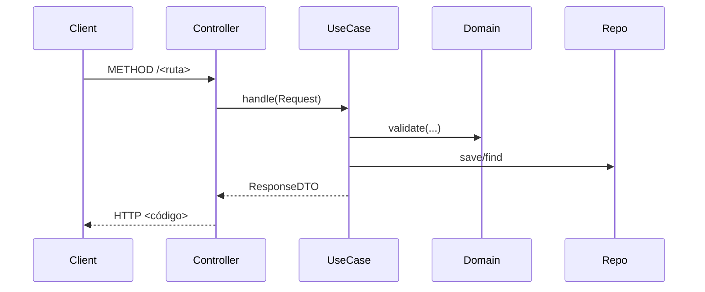

# Template: Documento de Endpoints por Feature

> [!info] Cómo usar esta plantilla
> 1. Copiar este archivo a `01-api/endpoints/<FEATURE>.md` (ej: `RESERVATIONS.md`).
> 2. Reemplazar `<Feature>` y `<feature>` según corresponda.
> 3. Agregar una fila en el índice de [[API_CONTRACT]] con el enlace a este documento.
> 4. No editar este template directamente.

---

# Endpoints: <Feature>

> [!info] Consultar
> Documento de detalle de los endpoints del módulo `<Feature>`.
> Para el índice general de endpoints, ver [[API_CONTRACT]].
> Para convenciones globales (Base URL, headers, formato de respuesta, códigos de error), ver [[API_CONTRACT]] §Convenciones Generales.

---

## Endpoints en este documento

| # | Método | Ruta | Auth | Estado |
|---|--------|------|------|--------|
| N.1 | METHOD | /<feature>/... | Sí/No | Diseñado/Implementado |

---

## §N.1 <Nombre corto>

```
METHOD /api/v1/<ruta>
```

**Headers:** (solo si difiere de los Headers Obligatorios globales)

**Request:**
```json
{ }
```

**Response `<código exitoso>`:**
```json
{
  "data": { },
  "meta": { "trace_id": "..." }
}
```

**Response `<código error>`:**
```json
{
  "error": {
    "code": "...",
    "message": "...",
    "trace_id": "..."
  }
}
```

### Diseño

> [!note] Cuándo incluir esta sección
> Siempre para endpoints con reglas de negocio. Para endpoints simples (GET de listado sin lógica especial), puede omitirse.

- **Precondiciones:** <qué debe cumplirse antes de ejecutar el endpoint>
- **Reglas de negocio:** <validaciones, restricciones, cálculos>
- **Side effects:** <eventos emitidos, notificaciones, cambios en otros recursos>
- **Casos borde:** <concurrencia, estados inesperados, errores específicos>

### Flujo

> [!note] Cuándo incluir esta sección
> Solo para endpoints complejos con múltiples pasos, orquestación de UseCases, o interacción con servicios externos. Para endpoints simples, omitir.



---

## §N.2 <Siguiente endpoint>
...

---

## Referencias

- Índice general: [[API_CONTRACT]]
- Esquema de base de datos: [[API_DATABASE]]
- Seguridad JWT: [[API_JWT_IMPLEMENTATION]]
- Spec Web (si existe): [[02-web/features/<FEATURE>]]
- Spec App (si existe): [[03-app/features/<FEATURE>]]
- Panorama global (si existe): [[00-shared/features/<FEATURE>]]
