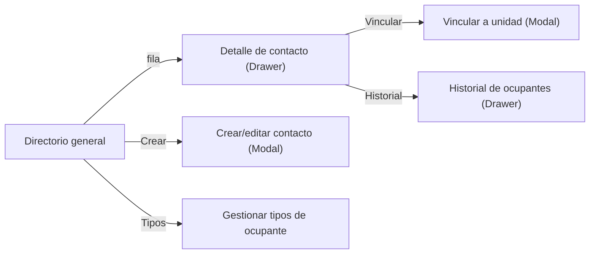

# Directorio general — Directorio (Web)

> Spec técnico: [[02-web/features/directorio/DIRECTORIO_SPEC]]
> Panorama: [[00-shared/features/DIRECTORIO]]

**Tipo:** Página
**Ruta:** `/directorio`
**Guard:** `AdminOnlyRoute` (requiere permiso `directorio.ver` — RBAC, ADR-001)

---

## Flujo de pantallas

## Qué muestra
Tabla de todos los contactos del conjunto activo (scopeada por `condominium_id`):

| Columna | Qué muestra | Notas |
|---|---|---|
| Nombre | `name` del contacto | con avatar/iniciales |
| Documento | `document_type` + `document_number` | — |
| Unidades | unidades vinculadas (chips) | vía `property_occupants` |
| Rol | tipo(s) de ocupante | badge |
| Usuario | ✓ si `contact.user_id` no es null | indica si tiene cuenta |
| Acciones | menú contextual | 48px |

## Acciones
| Elemento | Acción | Resultado |
|---|---|---|
| Botón "Nuevo contacto" | Click | Abre `DIRECTORIO_UI_crear-editar-contacto` |
| Fila | Click | Abre `DIRECTORIO_UI_detalle-contacto` |
| Botón "Tipos de ocupante" | Click | Navega a `DIRECTORIO_UI_gestionar-tipos-ocupante` |

## Estados de la vista
| Estado | Cómo se ve |
|---|---|
| Cargando | Skeleton de tabla (5 filas) |
| Vacío | Ilustración + "Aún no hay contactos" + CTA |
| Error | Mensaje + "Reintentar" |

## Filtros y búsqueda
| Filtro | Control | Comportamiento |
|---|---|---|
| Búsqueda | Text input | Por nombre/documento, server-side |
| Unidad | Select | Filtra por unidad |
| Tipo de ocupante | Select | propietario/residente/inquilino… |
