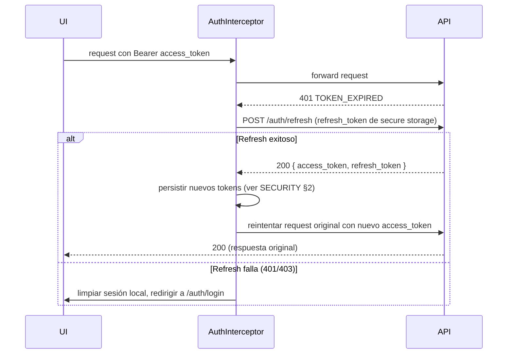

# 🔌 API_INTEGRATION
## Contrato de Integración entre la App Móvil y Urbania API

> [!info] Fuente única de endpoints
> Este documento **no redefine** los endpoints — la fuente única sigue siendo `API_CONTRACT.md` del backend. Aquí se documenta cómo el **cliente** los consume: configuración de Dio, headers, manejo de errores, flujos de UI, y gotchas de integración específicos de un cliente móvil.

---

## 1. Cliente HTTP (Dio)

```dart
Dio buildApiClient(Ref ref) {
  final dio = Dio(BaseOptions(
    baseUrl: ref.watch(envConfigProvider).apiBaseUrl, // ver ARCHITECTURE §9 (flavors)
    connectTimeout: const Duration(seconds: 10),
    receiveTimeout: const Duration(seconds: 15),
    headers: {
      'Content-Type': 'application/json',
      'Accept': 'application/json',
    },
  ));
  dio.interceptors.addAll([
    AuthInterceptor(ref),
    TraceIdInterceptor(),
    if (kDebugMode) PrettyDioLogger(requestBody: true, responseBody: true),
  ]);
  return dio;
}
```

### Headers que envía la app en cada request

| Header | Obligatorio | Valor |
|---|---|---|
| `Content-Type` | Sí | `application/json` |
| `Accept` | Sí | `application/json` |
| `Authorization` | Sí (excepto endpoints públicos) | `Bearer <access_token>` — inyectado por `AuthInterceptor`, nunca a mano |
| `X-Trace-Id` | Recomendado | UUID v7 generado por request — permite correlacionar logs cliente↔servidor. Ver §7 |
| `X-Device-Name` | Opcional | Nombre legible del dispositivo (ej. `"iPhone de Juan"`), usado por el backend para mostrar sesiones activas en `/auth/sessions` |
| `Accept-Language` | Sí | `es-CO` / `en-US` según locale activo — el backend lo usa como parte del cálculo de `device_fingerprint` |

> [!danger] `X-Device-Fingerprint` — NO enviar
> Ese header está deprecado en el backend ([[01-api/API_JWT_IMPLEMENTATION|JWT_IMPLEMENTATION]] §4.3). El servidor calcula el fingerprint a partir de `User-Agent` + IP + `Accept-Language` + `X-Device-Name`. La app **nunca** debe intentar enviarlo ni replicar el cálculo localmente.

---

## 2. ⚠️ Gotcha Crítico: User-Agent y la duración del Refresh Token

> [!danger] Requisito de implementación obligatorio
> El backend decide si un refresh token dura **7 días (web) o 30 días (móvil)** mirando si el header `User-Agent` matchea la expresión `Mobile|Android|iPhone|iPad|iPod|Windows Phone` ([[01-api/API_JWT_IMPLEMENTATION|JWT_IMPLEMENTATION]] §3.3). **Dio no envía un `User-Agent` de navegador por defecto** — sin configuración explícita, el backend puede clasificar a la app como "web" y darle sesiones de 7 días en vez de 30, degradando la experiencia silenciosamente.

**Mitigación obligatoria en `AuthInterceptor`/`buildApiClient`:**

```dart
final platformTag = Platform.isIOS ? 'iPhone' : 'Android';
dio.options.headers['User-Agent'] =
    'UrbaniaApp/${packageInfo.version} ($platformTag; ${Platform.operatingSystemVersion})';
```

- [ ] Verificar en `/auth/sessions` (tras login real) que el `device_name`/metadata reportado por el backend coincide con lo esperado, y que el refresh token efectivamente expira a 30 días y no a 7.
- [ ] **Reportar al equipo de backend** ([[01-api/API_AGENTS|AGENTS]] del API: "si encuentras una inconsistencia... debes informarlo") que detectar el tipo de cliente vía regex de `User-Agent` es fragil para clientes no-browser. Sugerencia: un header explícito `X-Client-Type: mobile|web` controlado por el backend (no por el cliente, para evitar spoofing) sería más robusto a futuro. Hasta que eso exista, este workaround es obligatorio.

---

## 3. Mapeo de Errores del API → UI

Todo error del API llega en el formato único `{ error: { code, message, trace_id } }` ([[01-api/API_CONTRACT|API_CONTRACT]] "Formato de Respuesta de Error"). La app **nunca** muestra `message` crudo del backend al usuario final salvo que ya esté pensado para UI — siempre se traduce por código:

| `error.code` | HTTP | Acción de la app |
|---|---|---|
| `INVALID_CREDENTIALS` | 401 | Mostrar error inline en el formulario de login |
| `MFA_REQUIRED` | 401 | Navegar a pantalla de verificación MFA, conservando email/password en memoria temporal (nunca persistidos) |
| `MFA_INVALID_CODE` | 401 | Error inline en pantalla MFA, mantener intento |
| `MFA_BACKUP_USED` | 401 | Forzar a usar otro código de respaldo o reenviar TOTP |
| `TOKEN_EXPIRED` | 401 | Disparar `POST /auth/refresh` automáticamente (silent refresh) y reintentar la request original — ver §4 |
| `TOKEN_INVALID` | 401 | Cerrar sesión local, navegar a login (no es recuperable con refresh) |
| `DEVICE_NOT_RECOGNIZED` | 403 | Forzar logout completo + mensaje "verifica tu identidad nuevamente" |
| `FORCE_PASSWORD_CHANGE` | 403 | Navegar a pantalla de cambio de contraseña obligatorio, bloquear el resto de la app |
| `PASSWORD_REUSED` | 400 | Error inline en formulario de cambio de contraseña |
| `EMAIL_ALREADY_EXISTS` | 409 | Error inline en formulario de registro |
| `RATE_LIMIT_EXCEEDED` | 429 | Banner "demasiados intentos, espera unos minutos" + deshabilitar botón con cooldown visual |
| `VALIDATION_ERROR` | 422 | Mapear `details` (si vienen) a errores por campo del formulario |
| `SESSION_NOT_FOUND` | 404 | Refrescar la lista de sesiones activas (ya fue revocada en otro dispositivo) |
| `DATABASE_ERROR` / `INTERNAL_ERROR` | 500 | Pantalla de error genérico + botón "reintentar", registrar `trace_id` en Crashlytics |
| (sin conexión) | — | `NetworkFailure` — ver [[APP_DATA_STRATEGY]] §2 (no es un error del API, es ausencia de red) |

> [!note] Por qué no mostrar `message` directo
> El `message` del backend está pensado para logs/soporte, no necesariamente para tono de marca o idioma del usuario (el backend responde en español fijo). Centralizar la traducción código→texto en la app permite tener copy consistente con el resto de la UI y soportar `en-US` sin depender del backend.

---

## 4. Flujo de Refresh Automático (Silent Refresh)



- El `AuthInterceptor` encola requests concurrentes mientras el refresh está en vuelo (evitar múltiples `POST /auth/refresh` simultáneos — el backend rota el refresh token en cada uso, así que una segunda llamada en paralelo con el token viejo dispararía la detección de reutilización y **revocaría toda la sesión**, ver [[01-api/API_JWT_IMPLEMENTATION|JWT_IMPLEMENTATION]] §4.2).
- Mutex/lock obligatorio alrededor del refresh: solo una llamada a `/auth/refresh` en vuelo por sesión, las demás esperan su resultado.

---

## 5. Flujo de Login con MFA

Sigue exactamente la tabla "Flujos Comunes" de `API_CONTRACT.md` §"Login con MFA". En la app:

1. `LoginScreen` envía `POST /auth/login`.
2. Si responde `401 MFA_REQUIRED`: navegar a `MfaVerificationScreen` sin tokens — el email/password ya fueron validados por el backend, no se reenvían.
3. `MfaVerificationScreen` envía `POST /auth/mfa/verify { code, type: "login" }`.
4. Éxito → recibe `access_token` + `refresh_token` + `user` → persistir en secure storage ([[APP_SECURITY]] §2) → navegar a Home.
5. Si el usuario no tiene acceso a su app TOTP: opción "usar código de respaldo" → `POST /auth/mfa/verify-backup`.

---

## 6. Manejo de Rate Limiting (429)

| Endpoint | Límite | UX recomendada |
|---|---|---|
| `POST /auth/login` | 5/15min | Tras el 3er intento fallido, mostrar advertencia preventiva ("2 intentos restantes") antes de que el backend bloquee |
| `POST /auth/register` | 3/hora | Deshabilitar botón de registro con cooldown visible tras 429 |
| `POST /auth/forgot-password` | 3/hora | Mensaje "ya enviamos un correo, revisa tu bandeja" en vez de error crudo (evita confundir al usuario que insiste) |
| `POST /auth/mfa/verify` | 3/5min | Mostrar contador y sugerir código de respaldo tras el 2do fallo |

> [!tip] Backoff exponencial para reintentos automáticos
> Para errores 5xx/timeouts (no para 4xx), implementar reintento automático con backoff exponencial (ej. 1s, 2s, 4s, máx 3 intentos) **solo en requests `GET` idempotentes**. Nunca reintentar automáticamente un `POST /auth/login` o `POST /auth/refresh` sin que el usuario lo solicite explícitamente.

---

## 7. Trazabilidad (`X-Trace-Id` / `trace_id`)

- La app genera un `X-Trace-Id` (UUID v7) por request salvo que ya exista uno en contexto (ej. reintentos de la misma operación lógica).
- Todo error reportado a Crashlytics/Sentry ([[APP_RELEASE_AND_OBSERVABILITY]] §3) debe incluir el `trace_id` de la respuesta como contexto adicional — permite a soporte/backend ubicar el log exacto en el servidor sin necesidad de timestamps aproximados.

---

## 8. Versionado de API

- Todas las rutas usan el prefijo `/api/v1` ([[01-api/API_CONTRACT|API_CONTRACT]]). La app **no** asume la versión por configuración suelta: vive en `EnvConfig.apiBaseUrl` (ver [[APP_ARCHITECTURE]] §9), de forma que un futuro `/api/v2` sea un cambio de configuración, no de código disperso.
- Si el backend introduce un endpoint nuevo, el flujo es: 1) actualizar este documento con el mapeo de UI, 2) crear el DTO correspondiente en `features/<feature>/data/dtos/`, 3) actualizar [[APP_FEATURE_SCOPE]] si afecta el alcance de producto.

---

## 9. Checklist al Integrar un Endpoint Nuevo

- [ ] Confirmar contrato exacto en `API_CONTRACT.md` del backend (request/response/errores)
- [ ] Crear DTOs (`freezed` + `json_serializable`) en `data/dtos/`
- [ ] Crear/actualizar método de `Repository` (interfaz en `domain/`, implementación en `data/`)
- [ ] Mapear todos los `error.code` posibles de ese endpoint en la tabla de §3 (si son nuevos)
- [ ] Verificar si el endpoint requiere `Authorization` y que el interceptor lo cubre
- [ ] Verificar rate limiting aplicable (§6) y diseñar la UX de espera
- [ ] Decidir si la respuesta se cachea localmente — ver [[APP_DATA_STRATEGY]]
- [ ] Test de integración con mock server (ver [[APP_TESTING]] §4)

---

## 10. Documentos Relacionados

| Documento | Propósito |
|---|---|
| [[APP_ARCHITECTURE]] | Estructura del cliente, capas, manejo de errores tipado |
| [[APP_SECURITY]] | Almacenamiento de tokens, biometría, certificate pinning |
| [[APP_DATA_STRATEGY]] | Qué se cachea localmente y bajo qué estrategia |
| [[APP_FEATURE_SCOPE]] | Alcance de producto y prioridad de cada flujo |
