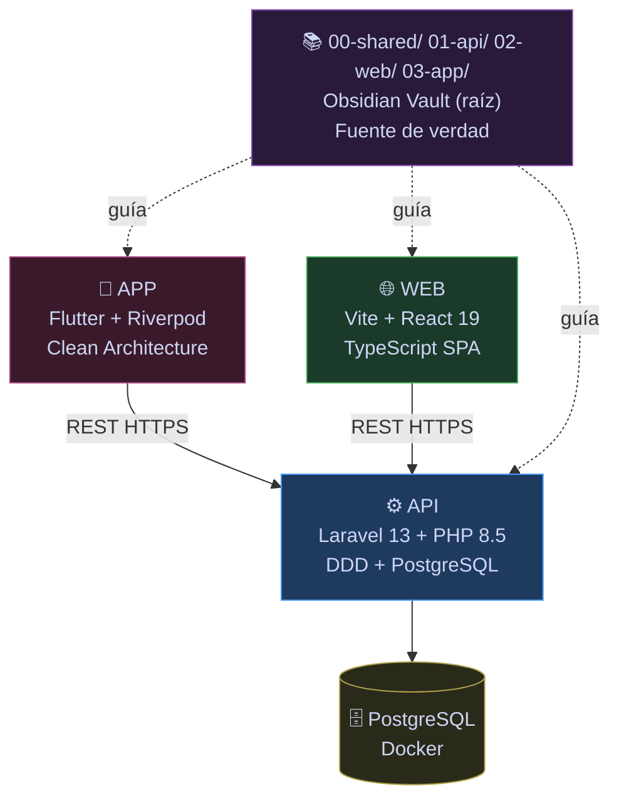
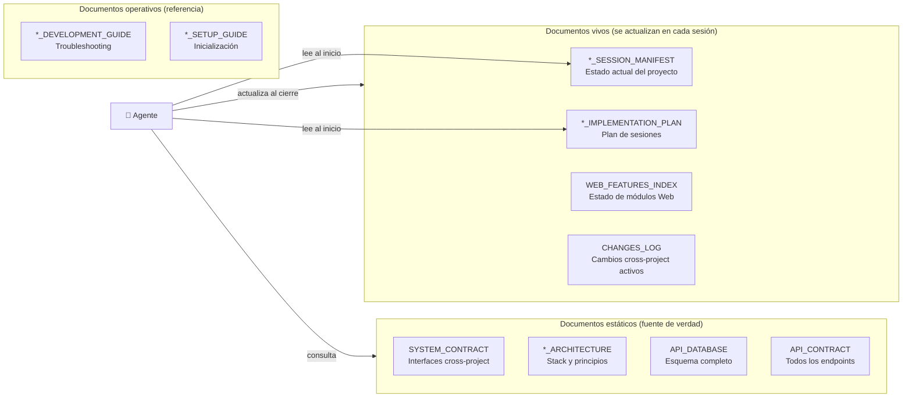
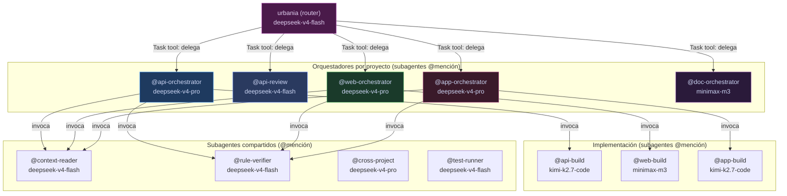
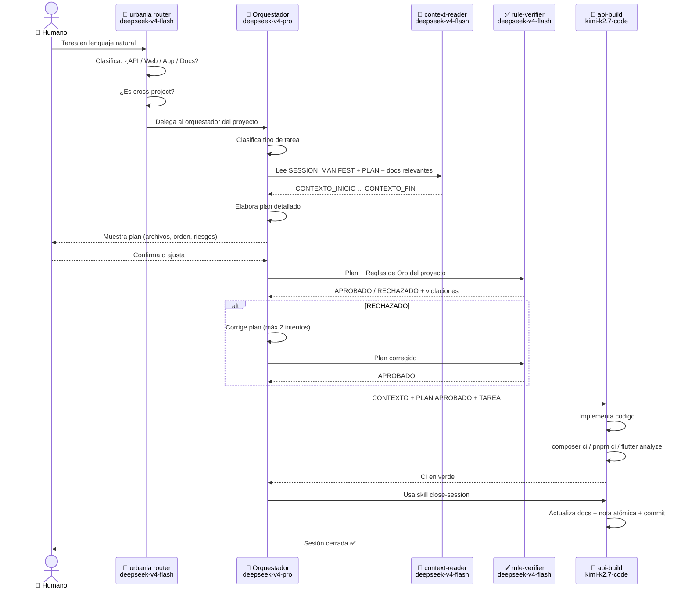
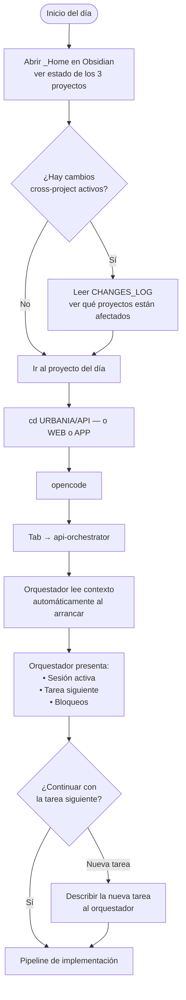
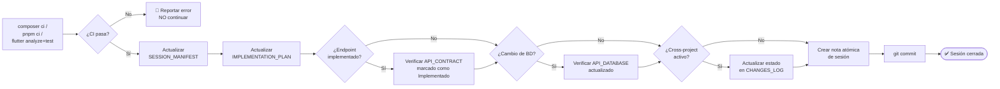
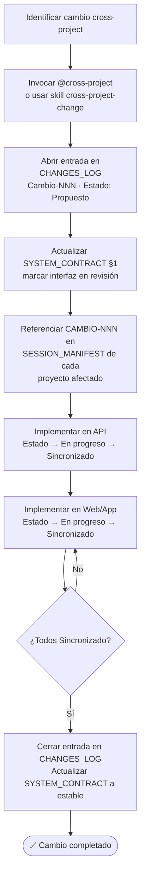

# 🧑‍💻 Guía de Desarrollo — Urbania

> **Para el líder técnico y nuevos miembros del equipo.** Este documento NO es lectura del agente — es la guía humana completa del flujo de trabajo con IA en el desarrollo del sistema Urbania.

---

## 0. Para quien acaba de unirse al equipo

Antes de tocar código, leer en este orden:

1. Este documento completo (30 min)
2. [[AGENTS]] — para entender cómo el agente navega el sistema
3. [[00-shared/SYSTEM_CONTRACT]] — las interfaces que conectan los 3 proyectos
4. El `*_IMPLEMENTATION_PLAN.md` del proyecto al que vas a contribuir

> [!tip] No necesitás entender todo el vault de entrada
> El vault es grande por diseño — cubre los 3 proyectos en detalle. Enfocate en el proyecto que te toca. El resto lo irás conociendo en contexto.

---

## 1. Arquitectura del sistema

Urbania es una plataforma de administración de propiedades horizontales con tres proyectos independientes que se comunican vía API REST.



**Stack por proyecto:**

| Proyecto | Carpeta | Stack |
|---|---|---|
| API | `D:\Programacion\URBANIA\API\` | Laravel 13, PHP 8.5, PostgreSQL (Docker en puerto 5433) |
| Web | `D:\Programacion\URBANIA\WEB\` | Vite 7, React 19, TypeScript strict, TanStack Query, Tailwind v4 |
| App | `D:\Programacion\URBANIA\APP\` | Flutter, Riverpod, Clean Architecture |
| Vault (raíz) | `D:\Programacion\URBANIA\` | Obsidian — documentación para IA y humanos |

---

## 2. Estructura de carpetas

```
D:\Programacion\URBANIA\            ← Raíz: vault de Obsidian + agentes + skills
│
├── .opencode\                      ← Configuración de OpenCode
│   ├── agents\                     ← TODOS los agentes (14 archivos)
│   │   ├── urbania.md              ← Router principal (deepseek-v4-flash) — único primario visible
│   │   ├── context-reader.md       ← Subagente lector (deepseek-v4-flash)
│   │   ├── rule-verifier.md        ← Subagente verificador (deepseek-v4-flash)
│   │   ├── cross-project.md        ← Subagente cross-project (deepseek-v4-pro)
│   │   ├── api-orchestrator.md     ← Subagente orquestador API (deepseek-v4-pro)
│   │   ├── api-build.md            ← Subagente implementador API (kimi-k2.7-code)
│   │   ├── api-review.md           ← Subagente revisor API (deepseek-v4-flash)
│   │   ├── web-orchestrator.md     ← Subagente orquestador Web (deepseek-v4-pro)
│   │   ├── web-build.md            ← Subagente implementador Web (minimax-m3)
│   │   ├── app-orchestrator.md     ← Subagente orquestador App (deepseek-v4-pro)
│   │   ├── app-build.md            ← Subagente implementador App (kimi-k2.7-code)
│   │   └── test-runner.md          ← Subagente QA (deepseek-v4-flash)
│   └── skills\                     ← TODAS las skills (9 directorios)
│       ├── adr\SKILL.md
│       ├── api-close-session\SKILL.md
│       ├── app-close-session\SKILL.md
│       ├── cross-project-change\SKILL.md
│       ├── db-migration\SKILL.md
│       ├── new-endpoint\SKILL.md
│       ├── new-feature-doc\SKILL.md
│       ├── vault-audit\SKILL.md
│       └── web-close-session\SKILL.md
│
├── API\                            ← Código Laravel (repo independiente)
├── WEB\                            ← Código Vite/React (repo independiente)
├── APP\                            ← Código Flutter (repo independiente)
│
├── AGENTS.md                       ← Punto de entrada del agente (global)
├── GUIA_DESARROLLO.md              ← Este documento
├── _Home.md                        ← Dashboard con Dataview + GLOBAL_STATUS
├── 00-shared\                      ← Contratos y procesos cross-project
├── 01-api\                         ← Documentación de la API
│   ├── _templates\                 ← Plantillas de notas atómicas
│   └── docs\                       ← Notas atómicas generadas
├── 02-web\                         ← Documentación del Web
│   └── _templates\
└── 03-app\                         ← Documentación de la App
    └── _templates\
```

---

## 3. Setup del entorno (primera vez)

### Obsidian

1. Abrir `D:\Programacion\URBANIA\` como vault en Obsidian
2. Activar plugins: **Configuración → Plugins de la comunidad → Activar**

| Plugin | Función |
|---|---|
| **Dataview** | Dashboard dinámico en [[_Home]] |
| **Templater** | Motor de plantillas para notas atómicas |
| **QuickAdd** | Comandos rápidos para crear notas desde plantillas |
| **Tasks** | Consulta de tareas pendientes |
| **Git** | Commits sin salir de Obsidian |
| **Kanban** | Tablero de sesiones (opcional) |
| **Excalidraw** | Diagramas libres (opcional) |

Los archivos de plugin ya están en `.obsidian/plugins/` — solo hay que activarlos.

### OpenCode

```bash
# Instalar OpenCode (si no está instalado)
npm install -g opencode

# Conectar OpenCode Go
# En la TUI: /connect → OpenCode Go → pegar API key de https://opencode.ai/auth
```

**MCPs instalados:**
- `context7` — documentación actualizada de librerías
- `postgresql` — inspección del schema real (requiere Docker corriendo)

### Para empezar a trabajar en un proyecto

```bash
cd D:\Programacion\URBANIA
opencode
```

OpenCode carga `opencode.json` desde la raíz y descubre todos los agentes en `.opencode/agents/`. Desde ahí trabajás en API, WEB o APP — los agentes tienen los paths correctos a cada proyecto.

---

## 4. El vault como fuente de verdad

El vault de Obsidian **no es solo documentación** — es el sistema de memoria del agente. Cada documento tiene un rol específico:



> [!warning] Regla fundamental
> **El código es la fuente de verdad sobre lo que está implementado.** La documentación debe reflejar el código — si hay discrepancia, el agente actualiza el documento, no al revés.

---

## 5. Categorías de documentos

### Estáticos — solo cambian cuando cambia el sistema

| Documento                          | Qué define                                     | Quién tiene prioridad si hay conflicto |
| ---------------------------------- | ---------------------------------------------- | -------------------------------------- |
| [[00-shared/SYSTEM_CONTRACT]]      | Interfaces entre los 3 proyectos               | Este documento                         |
| [[00-shared/GLOSSARY]]             | Vocabulario de dominio unificado               | Este documento                         |
| [[01-api/API_ARCHITECTURE]]        | Stack, DDD, principios, ADRs                   | Este documento                         |
| [[01-api/API_CONTRACT]]            | Todos los endpoints (request/response/errores) | Este documento                         |
| [[01-api/API_DATABASE]]            | Esquema completo de BD                         | Este documento                         |
| [[01-api/API_JWT_IMPLEMENTATION]]  | Seguridad JWT, MFA, headers                    | Este documento                         |
| [[02-web/WEB_ARCHITECTURE]]        | Stack, estructura de carpetas, ADRs            | Este documento                         |
| [[02-web/WEB_AUTH_IMPLEMENTATION]] | Auth JWT en el cliente                         | Este documento                         |
| [[02-web/WEB_VISUAL_STANDARDS]]    | Design system completo                         | Este documento                         |
| [[03-app/APP_ARCHITECTURE]]        | Stack Flutter, Clean Architecture              | Este documento                         |
| [[03-app/APP_SECURITY]]            | Tokens, biometría, certificate pinning         | Este documento                         |

### Vivos — se actualizan en cada sesión

| Documento | Cuándo se actualiza |
|---|---|
| [[01-api/API_SESSION_MANIFEST]] | Inicio y cierre de cada sesión API |
| [[01-api/API_IMPLEMENTATION_PLAN]] | Al planear o completar una sesión |
| [[02-web/WEB_SESSION_MANIFEST]] | Inicio y cierre de cada sesión Web |
| [[02-web/WEB_IMPLEMENTATION_PLAN]] | Al planear o completar una sesión |
| [[02-web/WEB_FEATURES_INDEX]] | Al agregar o completar un módulo |
| [[03-app/APP_SESSION_MANIFEST]] | Inicio y cierre de cada sesión App |
| [[03-app/APP_IMPLEMENTATION_PLAN]] | Al planear o completar una sesión |
| [[00-shared/CHANGES_LOG]] | Cuando un cambio cruza más de un proyecto |

### Operativos — referencia y troubleshooting

| Documento | Propósito |
|---|---|
| [[01-api/API_DEVELOPMENT_GUIDE]] | Comandos, troubleshooting, decisiones ad-hoc |
| [[02-web/WEB_DEVELOPMENT_GUIDE]] | DevOps, CI/CD Web |
| [[03-app/APP_DEVELOPMENT_GUIDE]] | Comandos Flutter, troubleshooting |
| [[01-api/API_SETUP_GUIDE]] | Setup inicial de la API |
| [[02-web/WEB_SETUP_GUIDE]] | Setup inicial del Web |
| [[03-app/APP_SETUP_GUIDE]] | Setup inicial de la App |

---

## 6. Flujo de trabajo con agentes — OpenCode

Esta es la parte más importante de la guía. El desarrollo de Urbania usa un **pipeline de agentes con modelos diferenciados** para optimizar costo y calidad.

### 6.1 Qué es un agente en OpenCode

Un agente en OpenCode es un archivo `.md` en `.opencode/agents/` con frontmatter YAML que define:

```yaml
---
name: nombre-del-agente
description: Descripción de cuándo usarlo
model: opencode-go/modelo-a-usar
temperature: 0.2
mode: primary   # o subagent
permission:
  edit: allow   # o deny, o ask
  bash:
    allow: [...]
    deny: [...]
---

Prompt del sistema del agente...
```

- **Agente primario**: aparece en la barra de Tab del TUI de OpenCode. Hoy solo hay uno: `urbania` (router).
- **Subagente**: no aparece en la barra. Se invoca desde otro agente con `@nombre` o directamente desde el chat escribiendo `@nombre` + la tarea.

### 6.2 Agentes disponibles



**Cómo usar el sistema de agentes (router first)**

| Situación | Qué hacer |
|---|---|
| No sabés por dónde empezar | Abrí OpenCode desde la raíz → el agente `urbania` clasifica y delega |
| Tarea de API (endpoints, migraciones, DDD) | El router `urbania` delega a `@api-orchestrator` |
| Tarea de Web (páginas, componentes, hooks) | El router `urbania` delega a `@web-orchestrator` |
| Tarea de App (pantallas, widgets, Flutter) | El router `urbania` delega a `@app-orchestrator` |
| Documentación (features, ADRs, FEATURES_INDEX) | El router `urbania` delega a `@doc-orchestrator` |
| Ya sabés exactamente el proyecto | Abrí OpenCode desde `01-api/`, `02-web/` o `03-app/` — el `opencode.json` local carga su orquestador directo |
| Revisar código o planificar sin cambiar nada | `@api-review` (desde cualquier chat) |
| Ejecutar tests en los 3 proyectos | `@test-runner` (desde cualquier chat) |
| Cambio que afecta más de un proyecto | El router detecta y redirige a `@cross-project` primero |

### 6.3 El pipeline orquestador

El orquestador implementa el patrón **Orchestrator-Workers**: un agente de razonamiento coordina subagentes especializados, asignando el modelo más económico a cada paso.

Antes de llegar al orquestador, el flujo típico pasa primero por el **router** `urbania`:

```
Humano → urbania (router) → @api-orchestrator → pipeline completo
```



### 6.4 Modelos y optimización de costos

La clave del sistema es que **no todos los pasos necesitan el mismo modelo**. El ahorro real viene de los pasos mecánicos (lectura + verificación de reglas) que ocurren múltiples veces por sesión.

| Paso | Modelo | Precio (1M tokens) | Por qué este modelo |
|---|---|---|---|
| Leer docs y resumir | `deepseek-v4-flash` | $0.14 / $0.28 | Lectura mecánica, sin razonamiento |
| Verificar reglas | `deepseek-v4-flash` | $0.14 / $0.28 | Match contra lista fija |
| Planear y orquestar | `deepseek-v4-pro` | $1.74 / $3.48 | Razonamiento sobre arquitectura |
| Escribir código (API, App) | `kimi-k2.7-code` | $0.95 / $4.00 | Especializado en coding |
| Escribir código (Web) | `minimax-m3` | $0.30 / $1.20 | Mid-tier: React/TS con razonamiento |
| Escribir documentación (docs) | `minimax-m3` | $0.30 / $1.20 | Razonamiento arquitectónico para features |
| Revisar sin modificar | `deepseek-v4-flash` | $0.14 / $0.28 | Análisis con 31K req/5h de margen |

> [!info] ¿Por qué Flash para lectura?
> Flash cuesta ~120x menos que los modelos de razonamiento. En una sesión típica, el `context-reader` se invoca 2-3 veces y el `rule-verifier` 1-2 veces. Usar Flash en esos pasos reduce el costo de la sesión en ~40-60% sin pérdida de calidad donde importa.

### 6.5 Skills disponibles

Las skills son guías de procedimiento que el agente carga bajo demanda. Se activan cuando la tarea coincide con su descripción, o puedes pedirlas explícitamente:

```
usa la skill new-endpoint para implementar el endpoint de listado de unidades
usa la skill api-close-session para cerrar esta sesión
```

| Skill | Proyecto | Cuándo se activa |
|---|---|---|
| `new-endpoint` | API | Al crear cualquier endpoint nuevo (guía el flujo DDD completo) |
| `db-migration` | API | Al crear o modificar tablas (convenciones PostgreSQL + checklist) |
| `api-close-session` | API | Al cerrar una sesión de trabajo en API |
| `web-close-session` | Web | Al cerrar una sesión de trabajo en Web |
| `app-close-session` | App | Al cerrar una sesión de trabajo en App |
| `cross-project-change` | Todos | Al registrar un cambio que afecta más de un proyecto |
| `adr` | Todos | Al crear un Architecture Decision Record |
| `new-feature-doc` | Todos | Al documentar una feature nueva desde cero |
| `vault-audit` | Todos | Al auditar la coherencia del vault completo |

---

## 7. Flujo de una sesión de desarrollo

### 7.1 Inicio de sesión



### 7.2 Durante la sesión

**Si se descubre un bloqueo:**
1. En Obsidian: QuickAdd → `Nuevo bloqueo` → completar la nota
2. Indicárselo al agente para que lo registre en SESSION_MANIFEST

**Si surge deuda técnica:**
1. QuickAdd → `Nueva deuda técnica` → completar la nota

**Si se toma una decisión técnica importante:**
1. QuickAdd → `Nueva decisión` → completar la nota

**Si el cambio afecta más de un proyecto:**
1. Antes de implementar: decirle al orquestador que invoque `@cross-project`
2. Abrir entrada en CHANGES_LOG antes de tocar código

### 7.3 Cierre de sesión

La skill `close-session` automatiza el cierre. Lo que ejecuta:



---

## 8. Notas atómicas — cuándo y cómo crearlas

Las notas atómicas son registros por evento. Se crean con **QuickAdd** desde Obsidian (`Ctrl+P` → QuickAdd).

| Tipo | Plantilla | Cuándo crear |
|---|---|---|
| **Sesión** | `nueva-sesion.md` | Al CERRAR cada sesión de trabajo |
| **ADR** | `nuevo-adr.md` | Al tomar una decisión de arquitectura ya implementada (no teórica) |
| **Decisión** | `nueva-decision.md` | Decisiones técnicas del día a día (menor alcance que ADR) |
| **Bloqueo** | `nuevo-bloqueo.md` | Cuando hay algo que impide continuar |
| **Deuda técnica** | `nueva-deuda.md` | Algo que funciona pero no está bien hecho |

> [!tip] Las notas atómicas se indexan solas
> El dashboard `_Home` las lista automáticamente vía Dataview. No es necesario mantener listas manuales.

**Diferencia entre ADR y Decisión:**
- **ADR** (Architecture Decision Record): decisión de arquitectura significativa, documentada formalmente con contexto, opciones consideradas y trade-offs. Ejemplos: elegir DDD, adoptar JWT con RS256, usar Flutter.
- **Decisión**: nota más ligera para decisiones técnicas cotidianas. Ejemplo: usar `jsonb` en lugar de columnas separadas para metadatos flexibles.

---

## 9. Features cross-project

Usar cuando un cambio impacta la API **y** al menos uno de los clientes (Web o App).

**Criterio rápido:** si después del cambio otro proyecto necesita actualizar su código o documentación para seguir funcionando → es cross-project. En duda, tratarlo como cross-project.



---

## 10. Agregar documentación a un proyecto

### Nuevo módulo de negocio (API)

1. Agregar endpoints en [[01-api/API_CONTRACT]] — usar plantilla `nuevo-endpoint.md`
2. Agregar tablas en [[01-api/API_DATABASE]]
3. Agregar la sesión de implementación en [[01-api/API_IMPLEMENTATION_PLAN]]
4. Si cruza proyectos → flujo cross-project (sección 9)

### Nueva feature Web

1. Agregar módulo en [[02-web/WEB_FEATURES_INDEX]] con estado "Planificado"
2. Agregar sesión en [[02-web/WEB_IMPLEMENTATION_PLAN]]
3. **Verificar que el contrato del endpoint ya existe en [[01-api/API_CONTRACT]] antes de implementar** — no implementar contra contratos "Propuesto"

### Nueva feature App

1. Verificar que el contrato backend existe en [[01-api/API_CONTRACT]]
2. Agregar sesión en [[03-app/APP_IMPLEMENTATION_PLAN]]
3. Si el endpoint no está implementado aún → implementar con mock del repositorio y documentar como bloqueo

---

## 11. Qué hacer cuando algo falla

### El agente reporta una inconsistencia entre vault y código

1. El código es la fuente de verdad sobre lo que está implementado
2. Actualizar el documento desactualizado
3. Si la inconsistencia es en [[00-shared/SYSTEM_CONTRACT]], actualizar también ese índice
4. Si afecta contrato cross-project → abrir entrada en CHANGES_LOG

### El CI falla al cerrar sesión

1. NO marcar el módulo como "Completado" ni hacer commit
2. Documentar el fallo específico en SESSION_MANIFEST § Bloqueos
3. Indicar estado como 🔴 Bloqueado en IMPLEMENTATION_PLAN
4. La próxima sesión arranca desde ese bloqueo

### El agente toma una decisión de arquitectura que no querés

Los agentes tienen permisos explícitos: `api-review` tiene `edit: deny` — no puede modificar código aunque quiera. Si un agente hace algo inesperado:
- Describe el problema y pedile que revierta
- Si el problema es de configuración → editar el archivo `.md` del agente en `.opencode/agents/`

### El PostgreSQL MCP no conecta

El MCP necesita que Docker esté corriendo con el contenedor de PostgreSQL levantado. Si no está corriendo, el MCP falla silenciosamente (el agente simplemente no tendrá acceso al schema en tiempo real). Esto es esperado y no rompe nada.

---

## 12. Dashboard diario

[[_Home]] agrega automáticamente vía Dataview:
- Estado de documentos núcleo (por campo `status` y `priority`)
- Tareas pendientes en todo el vault
- Bloqueos abiertos
- Cambios cross-project en curso

Además, [[_Home]] incluye una sección **GLOBAL_STATUS** en markdown plano (legible por humanos y agentes) que resume el estado de los 3 proyectos:

| Proyecto | Sesión | Estado | Siguiente tarea |
|---|---|---|---|
| API | 8 | ✅ Completada | Auth module terminado |
| Web | 1 | ✅ Completada | Setup + Auth |
| App | 0 | ⏸ No iniciada | Pendiente de kickoff |

> Este bloque se actualiza **automáticamente** al cerrar cada sesión mediante las skills `*-close-session`. El agente router `urbania` lo lee para conocer el estado global sin tener que abrir 3 SESSION_MANIFEST.

---

## 13. Glosario rápido

| Término | Qué es |
|---|---|
| `*_AGENTS.md` | Punto de entrada del agente para cada proyecto — el agente lo lee primero |
| `*_SESSION_MANIFEST.md` | Estado vivo del proyecto: qué está hecho, qué falta, bloqueos |
| `*_IMPLEMENTATION_PLAN.md` | Plan de sesiones ordenado por prioridad |
| ADR | Architecture Decision Record — decisión de arquitectura ya implementada |
| Nota atómica | Nota creada desde plantilla para un evento específico |
| Cross-project | Cambio que impacta más de un proyecto y requiere coordinación |
| Fuente única | Documento autoritativo — si otro doc dice algo distinto, este gana |
| Router | Agente `urbania` que recibe la tarea en lenguaje natural y delega al orquestador correcto |
| Orquestador | Agente que coordina el pipeline de un proyecto invocando subagentes |
| Subagente | Agente invocado con `@nombre`, no visible en la barra de Tab |
| Skill | Guía de procedimiento cargada bajo demanda por el agente |
| OpenCode Go | Suscripción $10/mes con acceso a 14 modelos open curados para coding |
| GLOBAL_STATUS | Sección en `_Home.md` que resume el estado de los 3 proyectos — el router la lee al iniciar |

---

## 14. Referencia rápida de comandos

### OpenCode

```bash
cd D:\Programacion\URBANIA
opencode
```

OpenCode siempre se abre desde la raíz `URBANIA/`. El agente `urbania` (router) es el único primario visible en la barra de Tab — escribí tu tarea en lenguaje natural y él delega al subagente correcto.

**Flujo recomendado:**
1. Abrí OpenCode desde la raíz → ves el agente `urbania` por defecto
2. Describí tu tarea en lenguaje natural: *"implementar el endpoint GET /units en la API"*
3. `urbania` clasifica y delega a `@api-orchestrator`, `@web-orchestrator`, etc.
4. Si ya sabés exactamente el proyecto, podés abrir OpenCode desde `01-api/`, `02-web/` o `03-app/` para saltarte el router

**En la TUI de OpenCode:**
- `Tab` — cambiar entre agentes primarios (hoy solo `urbania`)
- Escribí `@nombre-del-agente` + tarea para invocar un subagente directamente
- `/models` — ver modelos disponibles
- `/connect` — conectar proveedor (OpenCode Go)

### API

```bash
composer test        # Suite completa de tests
composer stan        # PHPStan análisis estático
composer lint        # Laravel Pint formatter
composer ci          # test + stan + lint (todo junto)
php artisan migrate:status
docker compose ps    # ver estado de PostgreSQL
```

### Web

```bash
pnpm type-check      # TypeScript strict
pnpm test            # Vitest unit + component
pnpm test:e2e        # Playwright e2e
pnpm lint            # ESLint
pnpm build           # Build de producción
pnpm ci              # type-check + lint + test + build
```

### App

```bash
flutter analyze      # Análisis estático Dart
flutter test         # Suite de tests
dart format .        # Formatter
flutter pub get      # Instalar dependencias
```

---

## 15. Sobre los plugins de Obsidian y elementos visuales

Los diagramas en este documento usan **Mermaid**, que es nativo en Obsidian — no requiere ningún plugin adicional.

Para elementos más interactivos (tabs expandibles, paneles colapsables, botones que ejecutan Dataview):

| Plugin | Qué agrega | ¿Vale la pena? |
|---|---|---|
| **Dataview** (ya instalado) | Tablas dinámicas, queries | Sí, ya está |
| **Buttons** | Botones que ejecutan comandos | Sí, si querés atajos en _Home |
| **Folder Notes** | Notas que actúan como portada de carpeta | Opcional |
| **Obsidian Tabs** | Tabs dentro de una nota | Útil para notas muy largas |

Si querés agregar el plugin **Buttons** para tener accesos rápidos en `_Home` (ej: botón "Nueva sesión API", "Nuevo bloqueo"), avisame y te configuro la nota del dashboard con eso.
