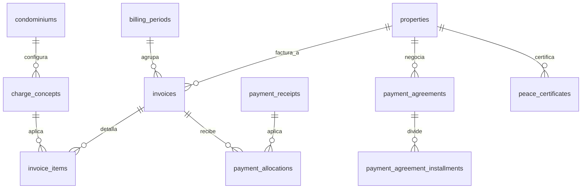
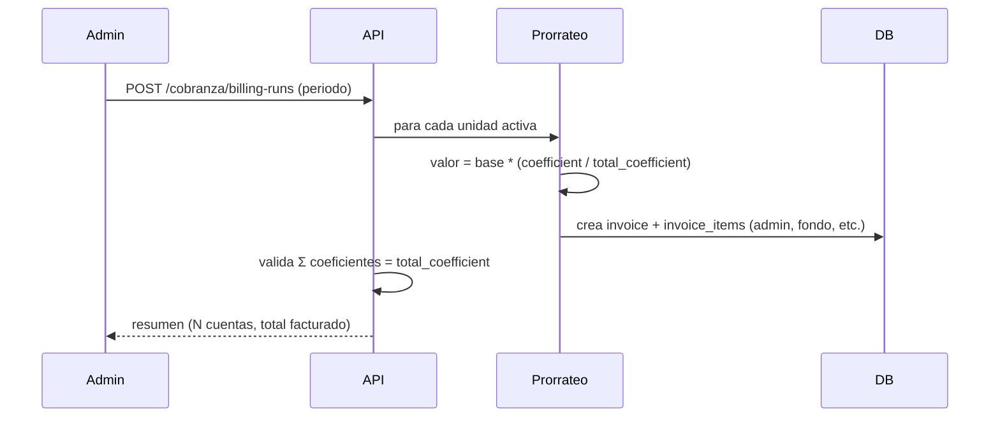
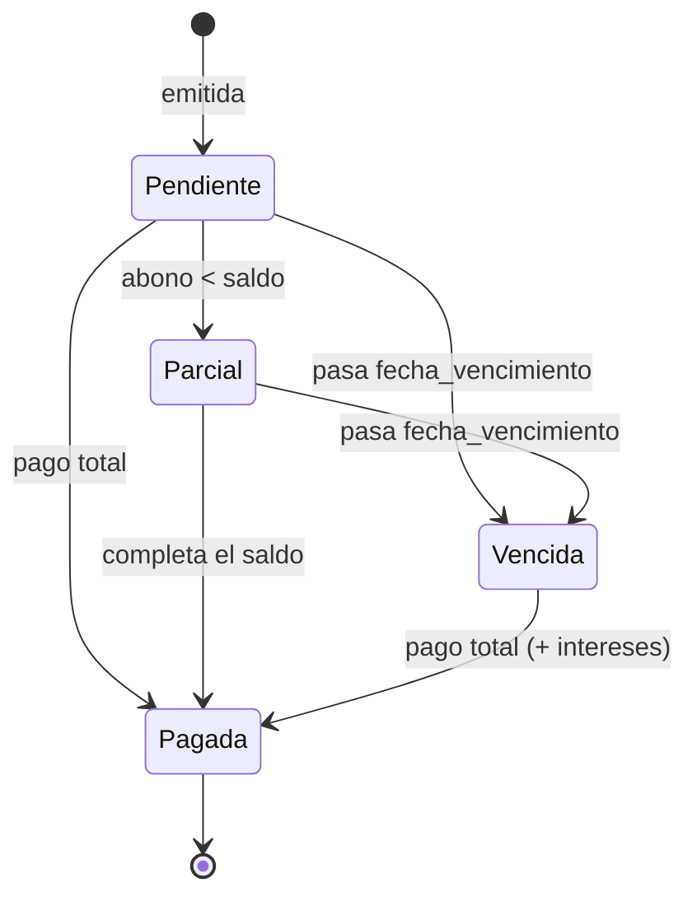

# Feature: Cobranza (Gastos Comunes)

> **WIP**. Pantallas en [[_RESEARCH_pantallas-mvp]] §4·7; modelo en [[_RESEARCH_modelo-datos]] §5. Núcleo normativo: **prorrateo por coeficiente**, **paz y salvo** y **fondo de imprevistos** son obligatorios (Ley 675 de 2001).

## 1. Resumen y motivación
Facturación periódica de expensas comunes por unidad y su recaudo. Genera cuentas de cobro prorrateadas por coeficiente de copropiedad, controla cartera/morosidad, intereses de mora, acuerdos de pago y emite el paz y salvo exigible ante notaría.

## 2. Capas afectadas
- [x] API — módulo `src/Cobranza`
- [x] Web
- [ ] App (consumo: "mi estado de cuenta", fuera del alcance API+Web de esta tanda)

## 3. Características principales
- Conceptos facturables configurables (administración, fondo de imprevistos, multas, intereses, extraordinarias).
- Facturación masiva del periodo con prorrateo por coeficiente.
- Cuentas de cobro por unidad con saldo, vencimiento e intereses de mora.
- Registro de pagos/abonos (manual y vía Pagos Online #8) con aplicación a cuentas.
- Acuerdos de pago para morosos.
- Paz y salvo por unidad al día.
- Reportes de cartera por edades de mora.

## 4. Relaciones con otras features
- Depende de: **Propiedades** (`properties.coefficient`, `condominiums.total_coefficient`), **Directorio** (responsable = `contact`), **RBAC** (`pagos.*`), **Tenancy**.
- Es consumido por: **Pagos Online** (#8, liquida cuentas), **Contabilidad** (#17, asientos), **Incidencias** (#14, multas → cuenta de cobro), **Reportes** (#16), **Comunicaciones** (#6, recordatorios y segmento "morosos").

## 5. Inventario de pantallas

### Web
| Pantalla | Tipo | Descripción |
|---|---|---|
| Panel de cartera | Página | Recaudo del mes, % morosidad, top deudores, fondo |
| Generar facturación del periodo | Asistente | Prorrateo por coeficiente + emisión masiva |
| Lista de cuentas de cobro | Página | Por unidad: periodo, valor, estado |
| Detalle de cuenta de cobro | Drawer | Conceptos, intereses, abonos, historial |
| Configurar conceptos y tarifas | Página | Administración, fondo, multas, intereses |
| Registrar pago / abono | Modal | Pago manual con soporte |
| Generar paz y salvo | Modal | Certificado para unidad al día |
| Acuerdos de pago | Modal | Plan de pago de morosos |
| Reporte de cartera por edades | Página | Mora 30/60/90+, recaudo vs presupuesto |

## 6. Modelo de datos

### 6.1 Entidades
| Entidad | Nueva/Existente | Descripción |
|---|---|---|
| `charge_concepts` | Nueva | Conceptos facturables |
| `billing_periods` | Nueva | Periodo (año/mes) |
| `billing_runs` | Nueva | Corrida de facturación |
| `invoices` | Nueva | Cuenta de cobro por unidad/periodo |
| `invoice_items` | Nueva | Renglón de la cuenta |
| `payment_receipts` | Nueva | Pago/abono registrado |
| `payment_allocations` | Nueva | Aplicación pago→cuenta(s) |
| `late_interest_config` | Nueva | Config de interés de mora |
| `payment_agreements` | Nueva | Acuerdo de pago |
| `payment_agreement_installments` | Nueva | Cuota del acuerdo |
| `peace_certificates` | Nueva | Paz y salvo |

### 6.2 Diccionario (campos clave · Valor/Referencia)
**`charge_concepts`** — `condominium_id` (Ref), `nombre` (Valor), `tipo` (Valor enum: administracion|fondo_imprevistos|multa|interes|extraordinaria), `metodo_calculo` (Valor enum: coeficiente|fijo|por_area|manual), `valor_base` (Valor NUMERIC(15,2)), `activo` (Valor).
**`billing_periods`** — `condominium_id` (Ref), `anio`/`mes` (Valor), `estado` (Valor enum: abierto|facturado|cerrado).
**`invoices`** — `condominium_id` (Ref), `unit_id` (Ref→properties), `billing_period_id` (Ref), `numero` (Valor), `fecha_emision`/`fecha_vencimiento` (Valor), `valor_total`/`saldo` (Valor NUMERIC(15,2)), `estado` (Valor enum: pendiente|parcial|pagada|vencida).
**`invoice_items`** — `invoice_id` (Ref), `charge_concept_id` (Ref), `descripcion` (Valor), `valor` (Valor), `base_calculo` (Valor: coeficiente aplicado).
**`payment_receipts`** — `condominium_id` (Ref), `unit_id` (Ref), `contact_id` (Ref, party), `valor` (Valor), `fecha` (Valor), `medio` (Valor enum: efectivo|banco|pse|tarjeta), `referencia` (Valor), `soporte_url` (Valor), `transaction_id` (Ref→payment_transactions, NULL si manual), `registrado_por_user_id` (Ref→users, actor).
**`payment_allocations`** — `payment_receipt_id` (Ref), `invoice_id` (Ref), `valor_aplicado` (Valor).
**`late_interest_config`** — `condominium_id` (Ref), `tasa_mensual` (Valor NUMERIC(7,4)), `dias_gracia` (Valor).
**`payment_agreements`** — `condominium_id` (Ref), `unit_id` (Ref), `valor_total` (Valor), `num_cuotas` (Valor), `estado` (Valor).
**`payment_agreement_installments`** — `agreement_id` (Ref), `numero` (Valor), `valor` (Valor), `vence_el` (Valor), `estado` (Valor).
**`peace_certificates`** — `condominium_id` (Ref), `unit_id` (Ref), `emitido_por_user_id` (Ref), `numero` (Valor), `fecha`/`vigente_hasta` (Valor), `pdf_url` (Valor).

### 6.3 Diagrama ER

### 6.4 Facturación del periodo (secuencia)

## 7. Mapeo de acciones a endpoints
| Acción | Pantalla | Verbo | Endpoint |
|---|---|---|---|
| Resumen de cartera | Panel | GET | `/cobranza/dashboard` |
| Correr facturación | Generar facturación | POST | `/cobranza/billing-runs` |
| Listar cuentas | Lista | GET | `/cobranza/invoices` |
| Detalle | Detalle | GET | `/cobranza/invoices/:id` |
| CRUD conceptos | Configurar | * | `/cobranza/charge-concepts` |
| Registrar pago | Registrar pago | POST | `/cobranza/payments` |
| Generar paz y salvo | Paz y salvo | POST | `/cobranza/peace-certificates` |
| Crear acuerdo | Acuerdos | POST | `/cobranza/payment-agreements` |
| Cartera por edades | Reporte | GET | `/cobranza/aging-report` |

## 8. Reglas de negocio globales
- **Prorrateo [Ley 675]:** `valor_concepto_unidad = valor_base * (properties.coefficient / condominiums.total_coefficient)` para `metodo_calculo=coeficiente`. La suma facturada debe cuadrar con la base del concepto.
- **Fondo de imprevistos [Ley 675]:** concepto `fondo_imprevistos` ≥ 1% del presupuesto; su recaudo va a cuenta bancaria separada (Contabilidad #17).
- **Intereses de mora:** se calculan sobre saldo vencido a `tasa_mensual` (≤ tasa máxima legal) tras `dias_gracia`.
- **Paz y salvo [Ley 675]:** solo se emite si `saldo = 0` en todas las cuentas de la unidad; queda registrado y descargable.
- **Aplicación de pagos:** un `payment_receipt` se distribuye en `payment_allocations` (orden: más antigua primero, intereses antes que capital — configurable).
- **Multas:** una sanción (#14) genera un `invoice_item`/cuenta con concepto `multa`.

## 9. Estados de una cuenta de cobro (`invoices`)

## 10. Endpoints
| Endpoint | Detalle |
|---|---|
| `/cobranza/*` | [[01-api/endpoints/COBRANZA]] |

## 11. Orden de implementación
API (tablas + motor de prorrateo + aplicación de pagos + paz y salvo) → Web. Requiere Propiedades (coeficiente), Directorio, Tenancy y RBAC en `main`. Pagos Online (#8) se integra después contra `payment_receipts`.

## 12. Especificaciones técnicas
| Proyecto | Spec | UI |
|---|---|---|
| Web | [[02-web/features/cobranza/COBRANZA_SPEC]] | `COBRANZA_UI_*` |
