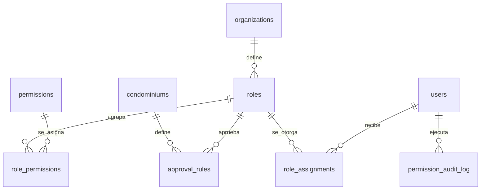
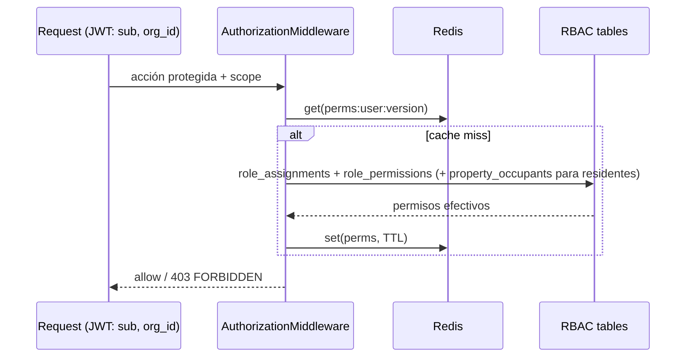
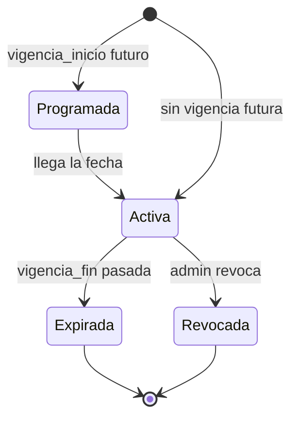

# Feature: Roles y Permisos (RBAC)

> **WIP** — borrador en `_WIP-diseño/`. Implementa la decisión de [[00-shared/docs/adr/ADR-001]] (capa de autorización sobre Auth). Diseño de pantallas en [[_RESEARCH_pantallas-mvp]] §5; modelo en [[_RESEARCH_modelo-datos]] §4.

## 1. Resumen y motivación
Sustituye el rol binario `users.role` (admin/user) por un RBAC configurable: el administrador controla **qué** puede hacer cada quién y **dónde** (alcance multi-conjunto). Habilita los ~14 roles del negocio (vigilante, contador, consejo, revisor fiscal…) y es prerrequisito de todos los clientes por rol.

## 2. Capas afectadas
- [x] API (origen del contrato) — nuevo módulo `src/Authorization`
- [x] Web (panel de administración)
- [ ] App (N/A en MVP — la app solo consume permisos)

## 3. Características principales
- Permisos como catálogo fijo `recurso.accion` (sembrado por el operador SaaS).
- Roles de sistema (plantillas) + roles personalizados por organización.
- Asignación `usuario × rol × alcance` con vigencia (delegación temporal).
- Reglas de aprobación / umbrales (segregación de funciones).
- Resolución de permisos server-side (cache Redis), **no** embebida en el JWT.
- Auditoría de todo cambio de rol/permiso.

## 4. Relaciones con otras features
- Depende de: **Tenancy** (organizations, ADR-001 C2) — el alcance usa `organization_id`/`condominium_id`.
- Es consumido por: **todas** las features (gate `can(recurso.accion, scope)`), en especial Cobranza (#7), Portería (#12) y los clientes especializados.

## 5. Inventario de pantallas

### Web
| Pantalla | Tipo | Descripción |
|---|---|---|
| Lista de roles | Página | Predefinidos + personalizados, con n.º de usuarios y alcance |
| Crear / editar rol | Modal | Nombre, descripción, plantilla base, alcance permitido |
| Matriz de permisos | Página | Grid `recurso × acción` (el corazón del control) |
| Reglas de aprobación / umbrales | Página | Quién aprueba qué y sobre qué monto |
| Usuarios del panel | Página | Staff con su rol, alcance y estado |
| Invitar / dar de alta usuario | Modal | Email + rol + alcance |
| Detalle de usuario | Drawer | Roles, alcance, sesiones, historial |
| Delegación temporal | Modal | Suplente con vigencia |
| Alertas de conflicto (segregación) | Inline | Avisa combinaciones en conflicto |
| Catálogo de recursos y acciones | Página | Define qué es permisable (operador) |
| Bitácora de auditoría de permisos | Página | Quién cambió qué y cuándo |

### App
> N/A en MVP. (Excepción futura: "Aprobaciones" del Consejo, ver feature Consejo.)

## 6. Modelo de datos

### 6.1 Entidades
| Entidad | Nueva/Existente | Descripción |
|---|---|---|
| `permissions` | Nueva | Catálogo `recurso.accion` |
| `roles` | Nueva | Rol (sistema o por organización) |
| `role_permissions` | Nueva | M:N rol↔permiso |
| `role_assignments` | Nueva | `usuario × rol × alcance` con vigencia |
| `approval_rules` | Nueva | Umbrales de aprobación por recurso/monto |
| `permission_audit_log` | Nueva | Auditoría de cambios |

### 6.2 Diccionario (campos clave · Valor/Referencia)
**`roles`** — `organization_id` (Ref→organizations, NULL=sistema), `nombre` (Valor), `descripcion` (Valor), `es_sistema` (Valor bool), `nivel_alcance` (Valor enum: organizacion|conjunto|torre|unidad).
**`permissions`** — `recurso` (Valor), `accion` (Valor enum: ver|crear|editar|eliminar|aprobar|exportar|configurar), `clave` (Valor, UNIQUE ej. `pagos.aprobar`).
**`role_permissions`** — `role_id` (Ref→roles), `permission_id` (Ref→permissions).
**`role_assignments`** — `user_id` (Ref→users), `role_id` (Ref→roles), `scope_type` (Valor enum), `scope_id` (Ref polimórfica), `vigencia_inicio/fin` (Valor).
**`approval_rules`** — `condominium_id` (Ref→condominiums), `recurso` (Valor), `monto_umbral` (Valor NUMERIC(15,2)), `rol_aprobador_id` (Ref→roles).
**`permission_audit_log`** — `actor_user_id` (Ref→users), `accion` (Valor), `target_tipo/target_id` (Valor), `detalle` (Valor JSONB).

### 6.3 Diagrama ER

### 6.4 Resolución de permisos (secuencia)

## 7. Mapeo de acciones a endpoints
| Acción del usuario | Pantalla | Verbo | Endpoint |
|---|---|---|---|
| Listar roles | Lista de roles | GET | `/authorization/roles` |
| Crear/editar rol | Crear/editar rol | POST/PATCH | `/authorization/roles[/:id]` |
| Editar matriz | Matriz de permisos | PUT | `/authorization/roles/:id/permissions` |
| Asignar rol a usuario | Invitar/Detalle | POST | `/authorization/assignments` |
| Revocar asignación | Detalle de usuario | DELETE | `/authorization/assignments/:id` |
| Definir umbral | Reglas de aprobación | POST | `/authorization/approval-rules` |
| Ver auditoría | Bitácora | GET | `/authorization/audit` |
| Listar catálogo | Catálogo de recursos | GET | `/authorization/permissions` |

## 8. Reglas de negocio globales
- Herencia restrictiva: un deny en nivel superior no se habilita abajo.
- Segregación de funciones: quien registra un pago no puede aprobarlo (validado vía `approval_rules`).
- `scope_id` polimórfico apunta a organization/condominium/tower/property según `scope_type`.
- Residentes: permisos derivados de `property_occupants` + set fijo "Residente" (no requiere asignación explícita).
- Todo cambio sensible escribe en `permission_audit_log`.

## 9. Estados de una asignación (`role_assignments`)

## 10. Endpoints
| Endpoint | Detalle |
|---|---|
| `/authorization/*` | [[01-api/endpoints/ROLES_PERMISOS]] |

## 11. Orden de implementación
API define el contrato (tablas + seeds de permisos/roles + resolver + gate) → Web implementa el panel. Requiere Tenancy (C2) ya en `main`.

## 12. Especificaciones técnicas
| Proyecto | Spec | UI |
|---|---|---|
| Web | [[02-web/features/roles-permisos/ROLES_PERMISOS_SPEC]] | `02-web/features/roles-permisos/ROLES_PERMISOS_UI_*` |
