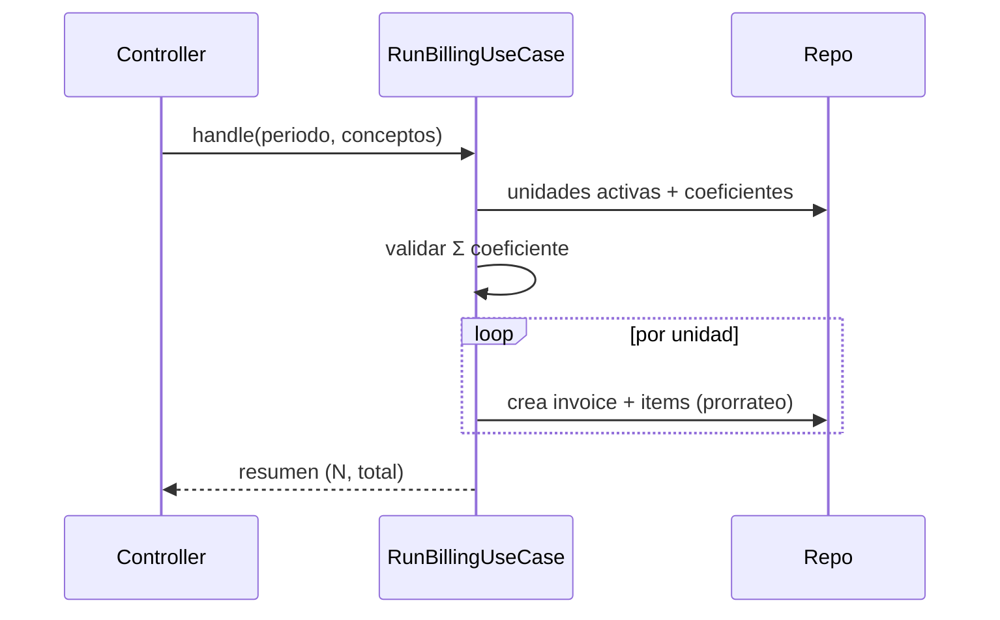

# Endpoints: Cobranza (Gastos Comunes)

> Panorama: [[00-shared/features/COBRANZA]] · Esquema: [[01-api/API_DATABASE]] · Índice: [[API_CONTRACT]]
> Módulo `src/Cobranza`. JWT + `org_id`; scopeado por `condominium_id`. Permisos `pagos.*`. **WIP**.

---

## Endpoints en este documento
| # | Método | Ruta | Permiso | Estado |
|---|--------|------|---------|--------|
| 1 | GET | `/cobranza/dashboard` | `pagos.ver` | Diseñado |
| 2 | GET/POST/PATCH | `/cobranza/charge-concepts` | `pagos.configurar` | Diseñado |
| 3 | POST | `/cobranza/billing-runs` | `pagos.crear` | Diseñado |
| 4 | GET | `/cobranza/invoices` | `pagos.ver` | Diseñado |
| 5 | GET | `/cobranza/invoices/:id` | `pagos.ver` | Diseñado |
| 6 | POST | `/cobranza/payments` | `pagos.crear` | Diseñado |
| 7 | POST | `/cobranza/peace-certificates` | `pagos.crear` | Diseñado |
| 8 | POST | `/cobranza/payment-agreements` | `pagos.crear` | Diseñado |
| 9 | GET | `/cobranza/aging-report` | `pagos.ver` | Diseñado |

---

## §1 Dashboard de cartera
```
GET /api/v1/cobranza/dashboard?period=2026-06
```
**Response 200:** `{ recaudo_mes, facturado_mes, pct_morosidad, top_deudores[], saldo_fondo_imprevistos }`.

## §2 Conceptos facturables (CRUD)
```
GET|POST|PATCH /api/v1/cobranza/charge-concepts[/:id]
```
**Request (POST):** `{ "nombre":"Administración", "tipo":"administracion", "metodo_calculo":"coeficiente", "valor_base": 80000000.00, "activo": true }`
- `fondo_imprevistos` exige `valor_base ≥ 1%` del presupuesto (Ley 675); validación de advertencia.

## §3 Correr facturación del periodo
```
POST /api/v1/cobranza/billing-runs
```
**Request:** `{ "anio":2026, "mes":7, "concept_ids":["..."], "fecha_vencimiento":"2026-07-15" }`
**Response 202:** `{ run_id, estado:"procesando", unidades: N }` (job asíncrono).
### Diseño
- **Precondiciones:** periodo `abierto`; suma de coeficientes de unidades activas = `condominiums.total_coefficient` (si no, 422 `COEFFICIENT_MISMATCH`).
- **Reglas:** por unidad y concepto `coeficiente`: `valor = valor_base * coefficient / total_coefficient`; crea `invoices` + `invoice_items`.
- **Side effects:** marca el periodo `facturado`; emite `BillingRunCompleted` (dispara recordatorios vía Comunicaciones #6, opcional).
- **Casos borde:** idempotencia — re-correr un periodo ya facturado → 409 `PERIOD_ALREADY_BILLED`.

### Flujo


## §4 Listar cuentas de cobro
```
GET /api/v1/cobranza/invoices?estado&period&unit_id&page
```
**Response 200:** lista `{ id, numero, unit, period, valor_total, saldo, estado, fecha_vencimiento }`.

## §5 Detalle de cuenta
```
GET /api/v1/cobranza/invoices/:id
```
**Response 200:** cabecera + `invoice_items` + `payment_allocations` + intereses calculados al día.

## §6 Registrar pago / abono
```
POST /api/v1/cobranza/payments
```
**Request:**
```json
{ "unit_id":"...", "valor": 95000000.00, "medio":"banco", "referencia":"...",
  "soporte_url":"...", "allocations":[{"invoice_id":"...","valor_aplicado":95000000.00}] }
```
### Diseño
- **Reglas:** `Σ allocations.valor_aplicado ≤ valor`; si no se especifican `allocations`, aplica automático (más antigua primero; intereses antes que capital).
- **Side effects:** actualiza `saldo`/`estado` de cada `invoice`; el actor es `registrado_por_user_id` (ADR-001); emite `PaymentRegistered` (Contabilidad #17).
- **Casos borde:** sobrepago → genera saldo a favor (nota).

## §7 Generar paz y salvo
```
POST /api/v1/cobranza/peace-certificates
```
**Request:** `{ "unit_id":"..." }`
**Response 201:** `{ numero, fecha, vigente_hasta, pdf_url }`.
### Diseño
- **Precondición [Ley 675]:** `saldo total de la unidad = 0`. Si hay saldo → 422 `UNIT_HAS_BALANCE`.
- **Side effects:** registra `peace_certificates`, genera PDF firmado.

## §8 Crear acuerdo de pago
```
POST /api/v1/cobranza/payment-agreements
```
**Request:** `{ "unit_id":"...", "valor_total": 600000000.00, "num_cuotas": 6, "primera_cuota":"2026-08-01" }`
- Genera `payment_agreement_installments`; el incumplimiento reactiva la mora.

## §9 Reporte de cartera por edades
```
GET /api/v1/cobranza/aging-report?as_of=2026-06-30
```
**Response 200:** buckets `corriente / 1-30 / 31-60 / 61-90 / 90+` con valor y n.º de unidades; recaudo vs presupuesto.

## Referencias
- Índice: [[API_CONTRACT]] · Esquema: [[API_DATABASE]] · Pagos Online: [[01-api/endpoints/PAGOS]] (futuro) · Spec Web: [[02-web/features/cobranza/COBRANZA_SPEC]]
